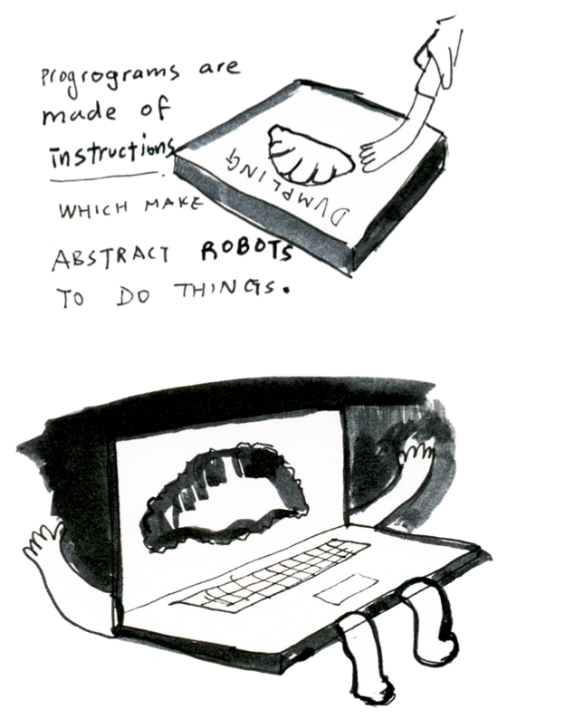

# writing, coding and thinking

---

## if programming is a cultural production, then programmers are artists

---

Proce55ing: 

teach design and art students how to program + give more technical students an easier way to work with graphics

---

what is computational thinking?

---

what is computational thinking?

1. hidden layers (source code)
2. algorithms (sequences & selection)
3. looping (Iteration & recursion)
4. data structures
5. networks
6. simulation
7. collaboration

---

acquire key programming skills to ponder how they are changing our world, then take action

---

colonial thinking

1. unequal power relations
2. unjust representation
3. invisible hierarchies
4. naming attributes
5. unequal access to resources
6. replicating all this in a computational dimension
7. aesthetics are beauty (not critique)

---

make abstract robots do things

---

Software art

artistic activity that **promotes reflection about computation** **within its own medium** or material. 

(strengthening Inke Arns statement)

---

sketching with code

---

## Demonstration Plot from show May 11 - June 6, 1971

>  I drew at the opening and every afternoon from 3-5pm with a Benson flatbed plotter demonstrating to the public how an automatic drawing machine works. I worked of course **offline** - the information was preregistered on a magnetic tape - because at that time the technology did not yet allow me to work **online**, since a computer had to operate in an air conditioned environment and could not be transported to the museum.