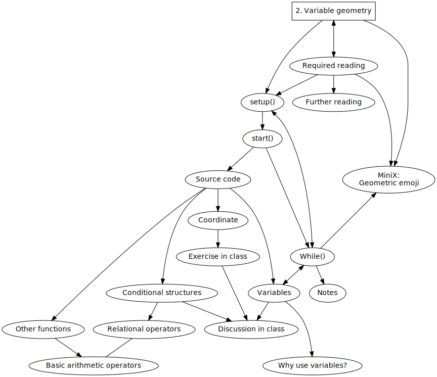
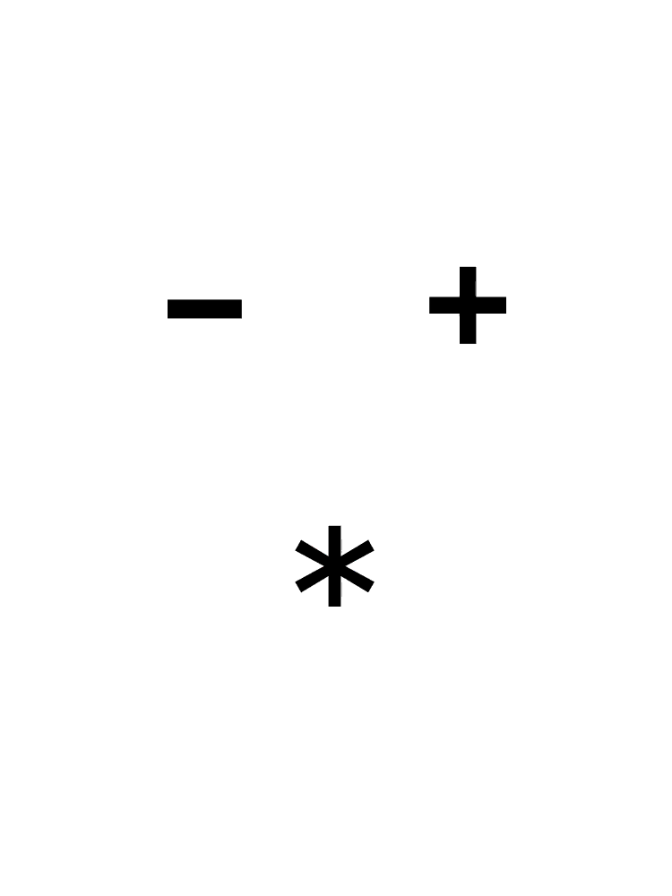
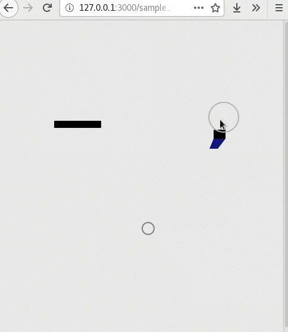
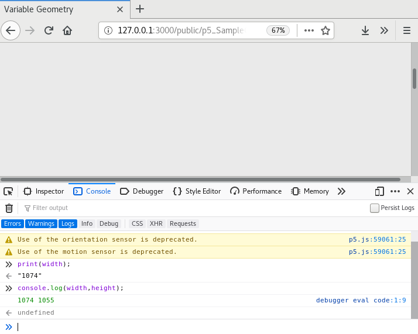

Title: 2. Variable geometry
Order: 2
page_order: 2
sketch: 
download_sketch_link: https://gitlab.com/aesthetic-programming/book/-/archive/master/_Book-master.zip?path=public/p5_SampleCode/ch2_VariableGeometry



[TOC]

## setup()

Aside from the difficulties of learning anything new and complex, learning to code can be enjoyable and rewarding (we hope!). That programming can be fun is demonstrated by the numerous titles that explicitly reference this, such as Linus Torvalds's book *Just for Fun: The Story of an Accidental Revolutionary*, written with David Diamond, part autobiography and part story of the development of Linux.[^Fun] Fun was, in this case, combined with the serious effort of making source code freely available and open to further modification. Like sharing a joke, or indeed recipe, programmming is a social activity and relies on collective understanding in order to "get it."

There are many more examples that reinforce the idea of fun, as if simply stating this would be enough to convince users to work through learning to program and not be too put off by its underlying difficulty. In what follows we encourage you to have fun with geometry, following on from drawing an ellipse in the previous chapter. The idea is to further explore various shapes, sizes, positions, space, and lengths, all which are regarded as geometry by mathematics and have multiple applications in everyday life including, but not limited to, typography, signage, graphic design, and architecture, as well as other organizational forms. More specifically, points, lines, and planes are regarded as the foundational elements of design as these elements are used to constitute objects, and the world is made up of various objects that have particular properties. Fun with geometry comes from manipulating these properties, and reconstituting them anew, creating alternative patterns of recognition and understanding.[^Fun2] As Olga Goriunova states in her edited book *Fun and Software*, fun with computers is considered to be a mode of thinking,[^Olga] and, furthermore, fun can be had with the paradoxes that arise in the process. By creating new computational objects, you will manipulate learnt procedural logics, and explore how these might be adapted and redrawn. Variable geometry in this sense is about shape-shifting: re-imagining all sorts of new shapes, compositional forms, and spatial relations, thereby challenging geometric conventions.[^Femke]

We take the example of emoticons — ideograms, typically smileys — as typographic shorthand for expressing facial emotional states such as happiness, ":D". These have become pervasive in communication, and are no longer simply typographic, but actual pictures which can be funny at times as emojis, but also come with underlying issues related to the politics of representation. More on this below, but for now, suffice to say, emojis make a good example as they consist of geometric shapes, using lines, points, planes, and colors. This chapter is about having fun with this (even if some of the underlying issues are not fun at all), exploring the affective dimension of emojis, and the varying representations that we encounter in everyday communications.

The relationship between emoji standardization and a politics of representation has been explored by many commentators. The essay "Modifying the Universal," written by Roel Roscam Abbing, Peggy Pierrot and Femke Snelting is a good example,[^Emojis] as it investigates the politics of emoji "universalism." Emojis emerged from the Unicode project, that has set the computing industry standard for the consistent encoding, representation, and handling of text for software internationalization in all major operating systems and writing applications since 1987. Interestingly, on a technical level, Unicode provides a unique code point (a number) to represent a character in an abstract way and leaves the visual rendering (size, font, shape, geometry) to other software, such as a web browser or word processor. It is the question of representation that interests us here.

Much like the utopian project of developing a universal language to be spoken and understood by the majority of the world's population (such as Esperanto) Unicode is clearly important to communicative operations across international/multilingual systems. By the time of the most recent version, Unicode 12.1's release in May 2019, there were 137,994 characters covering 150 scripts, as well as multiple symbol sets and emojis.[^Unicode] Yet, as the standard expanded from the underlying characters and glyphs to symbol sets and emojis, the universalism has become increasingly problematic. Criticism has unsurprisingly centered on the politics of representation, such as blatant gender stereotyping and racial discrimination: for example, female emojis were under-represented in certain professional roles,[^Telegraph] there were also limitations of skin tone applied to emojis and "universal modifiers" that were not displayed "universally" across all devices and operating systems.

Our point is that using emojis may be fun and expressive, but they also tend to oversimplify and universalize differences, thereby perpetuating normative ideologies within already "violent power structures,"[^ideology] such that only selected people, those with specific skin tones for instance, are represented while others are not. There is a distinct inequality as to how people are represented, and we need to question who sets the standards for these representations. That such operations can be characterized as fun is part of the problem and masks other processes that monitor our emotional states not least in the workplace (we will return to this issue in Chapter 4, "Data capture"). The project *AIMoji* by Process Studio highlights some of these issues with the use of deep learning techniques and training existing emoji data[^almoji] in order to mess up their reductive representational logic and produce noisy mutations that offer inbetween shapes, faces and emotions, thereby rejecting universalism. Above are some of the issues we want to explore in this chapter by introducing variable geometry and learning to be able to produce alternatives, more politically-correct ones perhaps. We will start with the work *Multi* by graphic designer David Reinfurt which will be used to demonstrate the basis of geometry and the variations of facial expression and composition that can be generated from simple typographic elements.

* * *

## start()
{: style="margin-bottom: -2em;" .no-border}
:   *Figure 2.1: Multi by David Reinfurt. Courtesy of the designer.*

*Multi* (<http://www.o-r-g.com/apps/multi>),[^multi] is inspired by another designer Enzo Mari who spent a whole year in 1957 exploring the essential form of an object (an apple). Reinfurt explains that, "He was not looking to draw AN apple, but rather THE [universal] apple — a perfect symbol designed for the serial logic of industrial reproduction." *Multi* develops a variation of this idea for informational reproduction in the form of a mobile app with 1,728 possible arrangements, or facial compositions, built from minimal punctuation glyphs. But instead of using preset typographic characters, which admittedly is the conceptual charm of *Multi*, for our purpose we will draw these from scratch with foundational elements of geometry.

## Source code
{: .medium}
:   *Figure 2.2: The screenshot of the remix of Multi*

RunMe, <https://aesthetic-programming.gitlab.io/book/p5_SampleCode/ch2_VariableGeometry/>.

<sketch
  src="p5_SampleCode/ch2_VariableGeometry/sketch.js"
  lang="javascript"
  data-executable
  data-download-link="https://gitlab.com/aesthetic-programming/book/-/archive/master/_Book-master.zip?path=public/p5_SampleCode/ch2_VariableGeometry" />

* * *

The above code draws various shapes and performs simple interactions:

* the background is filled with flashing grey-scale colors
* on the left is a horizontal rectangle in the color black  
* on the right is a rectangle in black and a polygon in blue
* on the bottom is an ellipse without any filled color but with grey stroke color
* when you move the mouse, an outlined ellipse in grey color follows the movement
* you can also click on the mouse to change the size of the grey ellipse

## Coordinates
In the previous chapter, we briefly discussed the x and y coordinates that constitute a fundamental concept for positioning and drawing objects with various measurements on a canvas. A line of code like `createCanvas(windowWidth,windowHeight)` refers to creating a canvas with its width and height in line with your window size. Unlike the previous chapter where the exact pixel dimension was set as in the example `createCanvas(640,480);`, this approach gives you a flexibility of no fixed canvas size. Therefore, the background color of the sample code fills the whole window screen, and the concept of canvas as spaces change variably in terms of geometry. It is good to remind ourselves that in mathematics the origin [0,0] is usually positioned in the center of a grid paper/screen, but in programming language like p5.js the origin is situated in the upper left corner (see Figure 1.11 in the previous chapter). This impacts on how objects are placed, and shifts our perception/understanding of space/canvas by having a frame of reference.

<div class="section exercise" markdown=1>

## Exercise in class

```javascript
function setup() {
  createCanvas(windowWidth, windowHeight);
  frameRate(15);
}

function draw() {
  background(random(230,240));
}
```

Remember the structure of a web page/application should include the HTML, a working JavaScript file (for example, sketch.js), as well as the associated p5.js libraries.  


- Type/copy the above source code in the working JavaScript file, then save the code. Run the program on Atom (with the live-atom-server) and, on screen, the background should flash.
- There are few new examples of syntax, or a slightly different use of syntax, here:
    - `frameRate()`: This sets the number of frames per second that the computer will use when running the program. The default is 60 and this sets it to 15 (see Line 3), so you can see the background color for each frame quite clearly (you can also compare the flash/frame rate to the sample code in the previous chapter).
    - `random(230,240)`: In the earlier sample code, the function `random()` only took a single parameter. This sample code gives you a different use of the function with two parameters. If you look at the reference guide (<https://p5js.org/reference/#/p5/random>),[^random] it explains that the random function returns a floating-point number, and this means that the number is not an integer, but a number with decimals. In this case, the program will return a floating-point number between 230.0 and up to, but not including, 240.0 (see Line 7). An example of such a returned value would be 231.34387.
- Next you need to remember how to use the web console (Under Tools > Web Developer > Web Console on Firefox).
  - Type `print(width);` and then press enter.
  - Type `console.log(width, height);` and then press enter.


:   *Figure 2.3: Simple exercise*

When you type the syntax `print(width);` the web console area (see Figure 2.3) displays the actual width in pixels. Additionally, if you use `console.log(width, height);`, which is the equivalent of the print function in JavaScript (not a p5.js function), the screen displays two numbers according to your screen size (you may adjust the screen and try again to get a different number). With just two lines in the web console area, you have asked the program to give you the values for the width and height of the canvas. The program understands the two names "width" and "height" as they are pre-set names in p5.js which you can use specifically for asking the dimensions of the canvas.
</div>

## Variables

In programming, both width and height are called "variables" — another important concept. Variables are used to store data and information in a computer program. You can think of variables as a kitchen container, in which you can put different types of things (like food, kitchen utensils, etc.) in a given container, replace them with other things, and store them for later retrieval. There are two main types of variables: "local variables" that are defined within a structure or a function, can only be used within that block of code; and "global variables" that can be used anywhere in the code. Global variables need to be defined before the setup of the program, usually in the first few lines of code.

In the previous exercise, the value in the sample code (line 2) behind `windowWidth` is the width of the window set as the canvas width. To continue the analogy, a container with the name "width" (as we have just typed in the web console) is labeled and stores the value. The program is able to retrieve the measurement of the canvas by using the variable `width` and this value can be changed according to your window width, and can be retrieved and displayed using the web console. (You can also use the variables `width` and `height` in other parts of your sketch, and for other purposes.)

It is important to note that you can also assign your own variable names (in other words, you can create your own type of container and store other values).

```javascript
let moving_size = 50;
let static_size = 20;
…
ellipse(255, 350, static_size, static_size);
…
ellipse(mouseX, mouseY, moving_size, moving_size);

if (mouseIsPressed) {
  static_size = floor(random(5, 20));
}
```

The above is the excerpt from the full code required to draw two different sized ellipses (As discussed in the previous chapter, the final two parameters of the ellipse function refer to width and height.) Instead of placing a number in the function as in Chapter 1, "Getting started," we will use variables as they hold values (see Lines 4 & 6), especially global ones that can be reused in different places of a program. Three steps are required to use variables:

1. **Declare:** Think of a name for the container you want to store the value in (it should make sense to you and others to read, but of course there is scope for a conceptual approach here). Declare with the syntax "let" in front.[^let] (See line 1-2 from the above)  
There are certain rules to follow in naming variables:
    * Names usually begin with a lowercase string and not with a number or symbols.
    * Names can contain a mix of uppercase and lower case strings, and numbers.
    * Names cannot contain symbols.

2. **Initialize/Assign:** What is it that you want to store? A number? By assigning a value, you will need to use the equal sign. There are four data types that are useful to know at this introductory level:
    * *number* for numbers of any kind: integer or floating-point.
    * *string* for strings. A string may have one or more characters and it has to be used with double or single quotation marks. For example: `let moving_size = "sixty";`
    * *boolean* for true/false. For example: `let moving_size = true;`
    * *color* for color values. This accepts Red, Green, Blue (RGB) or Hue, Saturation and Brightness (HSB) values. For example: `let moving_size = color(255,255,0);` see more from the "p5.js color reference" (<https://p5js.org/reference/#/p5/color>).[^color]

3. **(Re)Use:** How and when do you want to retrieve the stored data? If the variable changes over time, you may wish to reuse it many times.

In the above code excerpt, steps 1 and 2 are combined and the code is written as `let moving_size = 50;`. There are two variables: "moving_size" & "static_size" (see Lines 1 & 2,) but we can say that the variable "static_size" is more dynamic than the other. This is because the value changes according to mouse press as you can see in lines 8-10. (If you do not foresee values changing, you can also consider using `const`[^constant], a value that remains unchanged for the entire program.)

There are two more variables in the example: `mouseX` and `mouseY` (see Line 6.) These variables change and are subject to mouse movement for tracing the corresponding x and y coordinates. If you want to know the exact mouseX and mouseY coordinates, you can also use `print()` or `console.log()` to display the two values in the web console area. (A small exercise: How to write a line of code to display or print the mouseX value on the web console?)

Although it is commonplace to use the metaphor of a container to illustrate the variable as a concept, it is important to add that each container has an address (we might say that it is in a particular place on a shelf, and the computer needs to know where). A variable name can be customized in a way that is readable and meaningful for humans but how it operates at the level of execution does not take into the consideration of such meanings, in which programming oscillates between natural language expression as well as computer operation and execution (we will return to this double coding discussion in Chapter 7, "Vocable code").

Technically speaking, by declaring a variable, it also declares an address where the computer memory can hold the value. In short, each variable is stored in a block of computer memory which is located inside physical and concrete memory like RAM that reconfigure the space. Each block has an identifier called the memory address so that the computer knows where to store it and retrieve it while the program is running. Creating and declaring a variable is not only a programming issue, hardware is also involved in space allocation for data storage. As such, software and hardware are inseparable, and it's just that we aren't able to see the inner micro-workings of a computer whilst it is handling data.[^chun]

### Why use variables?
As you learn to program more complex software, you will discover that it is very common to use variables to store values and data. More importantly, the value of variables can be changed while a program is being run in real-time. The variables mentioned above: `mouseX` and `mouseY` illustrate this point because the mouse's coordinates change according to its movement. We will also discuss variables again in the next chapter when we introduce the concepts of array, loop, and repetition.

Another reason for using variables is that if you have longer lines of code, it is easier to have all the variables that you have declared for the program in an overview. If a variable is used in different parts of a complex program, you can simply change the value of the global variable instead of changing the multiple parts in the entire program, and this is useful for testing/refining the program without locating specific and multiple lines of code for modification. This leads to the reusability of variables. Variables can be used in different functions and more than once (and also as arguments passed to a function subroutine, something we will also discuss in the next chapter). A good example is the `static_size` variable in the sample code that is used to draw both the ellipse and the rectangle. As such, variables in the sample code deal with the changing and compositional shape-in-space.

Additionally, it is also easier for others to read your code with a well-chosen variable name, or at least the variable name can suggest certain behaviors or actions. As you progress, you might write code collaboratively, or write a larger program with more lines of code, at which point it is important to think of the readability of code.

## Other functions
This section briefly introduces some other new functions in the full source code. Drawing and designing an emoji requires different decisions, in terms of shapes, color, and spatial composition.

- `noStroke()`, `strokeWeight()`: These functions refer to the settings of a shape, where it has an outline, and the weight of the border.
- `stroke()`, `fill()` and `nofill()`: These set the color of objects such as border, shapes, or text. It takes RGB (as default) or HSB color. But if the function has a single parameter, then it refers to gray scale shade between 0-255 [^binarycolor]. If the function has three parameters like `fill(255, 255, 0)`, then it means the object/shape/text will be filled with a yellow color (the mix of red and green with no blue). There is an optional parameter called "alpha", which refers to the opacity of the color, e.g. `fill(255, 255, 0, 127)`.
- `rect()`: This is similar to drawing an ellipse, but is used to display a rectangle.
- `vertex()`, `beginShape()` and `endShape(CLOSE)`: These three functions are used for drawing more complex forms using various vertices. The `vertex()` function indicates its x and y coordinates, and all the vertices can be joined using the "CLOSE" argument in `endShape()`. The `beginShape()` is used to record the start of the vertex for a complex form like a polygon.
- `floor()`: Since the `random()` function returns a floating-point number, `floor()` is used to calculate the closest integer value.
- `if (mouseIsPressed) {}`: This is a conditional structure for a program, constantly referring to mouse press actions. This is discussed in more detail below.

## Conditional structures

Conditional structures are very useful as they allow you to set a different path by specifying conditions. Indeed, a conditional decision is not specific to programming. For example, in everyday life, you might say "If I am hungry, I should eat some food, if I am thirsty, I should drink some water, otherwise I will just take a nap."

```javascript
//example in human language
if (I am hungry) {
  eat some food;
} else if (thirsty) {
  drink some water;
} else{
  take a nap;
}
```

The above is an example of "pseudocode" to demonstrate what making an everyday decision might look like in programming. The keyword and syntax `if` is then followed by the condition and checks whether a certain condition holds. As such, the whole if statement is a "Boolean expression" — one of two possible values is possible, true or false, each of which leads to a different path and action. In computer science, the Boolean data type has two possible values intended to represent the two truth values of logic.

We have implemented a conditional logic in our sample code to constantly check if there is any mousepressed actions. This is why the size of the ellipse changes when a mouse is pressed.

```javascript
if (mouseIsPressed) {
  static_size = floor(random(5, 20));
}
```

### Relational operators
If you have to create your own conditional statement with the `if()` syntax, there are multiple combinations you can work with to create more complex expressions. For example, you can have many different cases using the syntax `else if`, or a combination of logical operators, such as the AND case here in another pseudocode example:

```javascript
if (I am hungry) && (I am in a good mood) {
  print("go out");
}
```

Here is a list of relational operators and logical symbols that can be used in conditional statements.

```
/*
Relational Operators:
  >   Greater than
  <   Less than
  >=  greater than or equal to
  <=  less than or equal to
  ==  equality
  === equality (include strict data type checking)
  !=  not equal to
  !== inequality with strict type checking
*/

/*
Logical Operators: boolean logic:
  &&  logical AND
  ||  logical OR
  !   logical NOT
*/

/*
Example:
  if () {
    //something here
  } else if() {
    //something here
  } else{
    //something here
  }
*/
```

Below is an example of a small sketch that uses a conditional structure and operators. Although all the conditional "if" or "else-if" statements are true, the web console will only print out "one." This is because the program will exit the structure when the first condition is met. In other words, sequence matters and the program will not run the other else-if statements after executing the first true statement.

```javascript
let x = 18;
if (x > 10 || x <= 20 ) {
  console.log("one");
} else if (x == 18) {
  console.log("two");
} else if (x === 18) {
  console.log("three");
} else {
  console.log("four");
}
```
## Basic arithmetic operators
You can also do arithmetic operations in programming, and this is commonly done in the arguments of a function. Here is a list of basic arithmetic operators:

- add(`+`): For addition and concatenation, which is applicable to both numbers and text/characters.
- subtract(`-`)
- multiply(`*`)
- divide(`/`)
- Special operators: increment (`++`), decrement (`--`)   

* * *

You can try the following in the web console area:

```
console.log(2*3);
```

> Output: <br>
"6"

```
console.log("hello" + "world");
```

> Output: <br>
"helloworld"

## Discussion in class

1. Examine existing geometric emojis (<https://gitlab.com/aesthetic-programming/book/-/blob/master/source/2-VariableGeometry/emojis.jpeg>) or those available on your mobile phone,
can you describe about the shape of an emoji? what constitutes a face? What essential geometric elements do you need for a particular facial expression? What has been lost in translation?
2. Reflect upon the complexity of human emotions, and their caricatures. What is your experience using emojis? What are the cultural and political implications of emojis (you might refer to the reading and introduction above)?
3. Beyond the face, take a look at more emojis (<https://www.pngfind.com/mpng/ohwmTJ_all-the-emojis-available-on-facebook-russian-revolution/>).[^emojis2] Is there anything you want to add?
4. Experiment with p5.js. How do you translate your thoughts into lines of code? You may want to print the coordinates of the mouse press in the web console area to get a more accurate position for your shapes.

## While()

The human face makes a good starting point as we recognize it easily, even in its simplest form, something *Multi* seems to verify with its minimal rendering of three typographic elements. The face clearly occupies a central position in everyday life and social interaction, and it almost goes without saying that its features are perceived to display our uniqueness and individuality. But this is a surface reading only. Emojis operate in this way and seem to occlude the face of experience and its ability to express complex feelings. It is tempting to think that emojis, despite their name, stop short of emotions altogether.

In *A Thousand Plateaus*, Gilles Deleuze and Félix Guattari conceive of the face as "overcoded," imposed upon us universally, resonating with some of the comments we made earlier in this chapter about Unicode. Their main point is that the face — what they called the "facial machine" — is tied to a specific Western history of ideas (e.g. the face of Jesus Christ). This, in turn, situates the origins of the face with white ethnicity (despite Jesus's birthplace) and what they call "facialization" (the imposition onto the subject of the face) has been spread by white Europeans, and thus provides a way to understand racial prejudice: "Racism operates by the determination of degrees of deviance to the White man’s face…".[^DG] The face is thus understood as an "imperial machine," subsuming language and other semiotic systems. The face is part of a surface that promotes sameness and ultimately rejects variations.

Facial recognition technologies that are capable of identifying or verifying a person from a digital image or a video frame, seem to operate on these (imperialist) terms too. When a person is identified in this way, the person's facial shape and textures are matched against a model based on a standardized dataset (we will return to this discussion in Chapter 4, "Data capture"). Moreover, the datasets are based on a disproportionate number of white faces. Facial recognition systems therefore notoriously struggle to identify black people. This has led to significant problems not least when it comes to the use of these technologies for policing.

Facial recognition systems also become unreliable when facial expressions vary, and even a big smile can falsify the results, so there is some irony that a smiley in real-life is likely to create difficulties in recognition (as if the social standard is unfriendliness). The iconic emoji smiley seems to further stress the point. The face may be able to escape overcoding under certain conditions, but emojis are quite literally "facial-machines" with prejudice built-in. Herein lies a challenge to having fun with programming: How to escape the overcoding and to develop alternative geometric shapes?

Something of this logic is evident in another article by Femke Snelting, "Other Geometries," which discusses how geometric shapes can help resist sovereign infrastructures.[^Snelting] Thinking of something as simple as a circle, and how it is associated with collective forms in terms of space and structure, Snelting writes.

> "A circle is a simple geometric shape. […] Circles are mathematically defined as the set of all points in a plane that are at the same distance from a shared center; its boundary or circumference is formed by tracing the curve of a point that keeps moving at a constant radius from the middle. […] Circles are omnipresent in practices and imaginaries of collectivity. [… and yet] Their flatness provides little in the way of vocabulary for more complex relational notions that attempt to include space, matter and time, let alone interspecies mingling and other uneasy alliances. The obligation to always stay at the same distance from the center promises a situation of equality but does so by conflating it with similarity. Circles divide spaces into an interior and an exterior, a binary separation that is never easy to overcome. We urgently need other axes to move along."[^Snelting2]

Snelting is looking for other geometries that can escape normative configurations of collectivity. She also refers to the works of Zach Blas, known for his artistic interventions with facial recognition systems (*Facial Weaponization Suite*, 2011-14), to point to the geometric spaces between nodes and edges, and to draw more attention to relations. Beyond network imaginaries of decentralized and distributed forms that have historically been part of rethinking centralized power structures, the idea is to "bend our infrastructural desires in other directions," making further reference to the work of Anna Tsing and "messy geometries" inspired by Mycelium, the branching, thread-like root structures of fungi.[^Tsing]

The challenge then is to rethink normative geometries, to turn them upside down and inside out. Herein lies the purpose of the chapter, to escape geometric overcoding and to develop alternatives. Having fun with programming in this sense is the ability to modify forms and to diverge from established rules. When it comes to programming, the rules can be applied differently, adapted or modified, and even transformed altogether.


<div class="section exercise" markdown=1>

## MiniX: Geometric emoji

**Objective:**

* To experiment with various geometric drawing methods and to explore alternatives, particularly with regard to shapes and drawing with colors.
* To reflect on the politics/aesthetics of emojis on the basis of the assigned texts.

**For additional inspiration:**

* *AIMoji* by Process Studio (2019), <https://process.studio/works/aimoji-ai-generated-emoji/>, and as part of "Uncanny Values," Vienna Biennale (2019), <https://process.studio/works/uncanny-values/>.

Some articles on emoji culture:

* Steve Witt, "Chinese Characters as Ancient 'Emoji'," *Glocal Notes* (2015), <https://publish.illinois.edu/iaslibrary/2015/10/21/chinese-characters/>.
* Michael Grothaus, "Women Finally Get a Menstruation Emoji," *Fastcompany* (2019), <https://www.fastcompany.com/90302946/women-finally-get-a-menstruation-emoji>.

**Tasks (RunMe):**

Explore shapes, geometries, and other related syntax (via p5.js references) and design two emojis, <https://p5js.org/reference/>.

**Questions to think about (ReadMe):**

  * **Describe** your program and what you have used and learnt.
  * **How** would you put your emoji into a wider social and cultural context that concerns a politics of representation, identity, race, colonialism, and so on? (Try to think through the assigned reading and your coding process, and then expand that to your own experience and thoughts - this is a difficult task, you may need to spend some time thinking about it).
</div>

## Required reading

* Roel Roscam Abbing, Peggy Pierrot and Femke Snelting, "Modifying the Universal," in Helen Pritchard, Eric Snodgrass & Magda Tyżlik-Carver, eds., *Executing Practices* (London: Open Humanities Press, 2018), 35-51, <http://www.data-browser.net/db06.html>.
* p5.js | Simple Shapes, <https://p5js.org/examples/hello-p5-simple-shapes.html>.
* Daniel Shiffman, "1.3,1.4,2.1,2.2: Code! Programming with p5.js," (2018) <https://www.youtube.com/watch?v=yPWkPOfnGsw&list=PLRqwX-V7Uu6Zy51Q-x9tMWIv9cueOFTFA&index=2>.
* Femke Snelting, "Other Geometries," *transmediale journal* 3, October 31 (2019), <https://transmediale.de/content/other-geometries>.

## Further reading

Crystal Abidin and Joel Gn, eds., "[Histories and Cultures of Emoji Vernaculars](https://firstmonday.org/ojs/index.php/fm/issue/view/607)," *First Monday* 23, no. 9, September (2018)

Christian Ulrik Andersen and Geoff Cox, eds., *[A Peer-Reviewed Journal About Machine Feeling](https://aprja.net//issue/view/8133)* 8, no. 1 (2019).

Derek Robinson, "[Variable](pdfs/Derek-Robinson_Variable.pdf)," in Matthew Fuller, ed., *Software Studies: A Lexicon* (Cambridge, MA: MIT Press, 2008).

## Notes

[^Fun]: Linus Torvalds and David Diamond, *Just for Fun: The Story of an Accidental Revolutionary* (Knutsford: Texere Publishing, 2001), see <http://en.wikipedia.org/wiki/Just_for_Fun>. Other examples include Jeremy Gibbons and Oege de Moor, *The Fun of Programming* (London: Palgrave Macmillan, 2003).

[^Fun2]: See the children's book: Vicky Owyang Chan, *Geometry Is Fun For Me* (Indianapolis, IL: Dog Ear Publishing, 2017).

[^Olga]: Olga Goriunova, *Fun and Software: Exploring Pleasure, Paradox and Pain in Computing* (New York, London: Bloomsbury, 2014), 4.

[^Femke]: Femke Snelting, "Other Geometries," *transmediale journal* 3 (October 31, 2019, <https://transmediale.de/content/other-geometries>.

[^Emojis]: Roel Roscam Abbing, Peggy Pierrot and Femke Snelting, "Modifying the Universal," *Executing Practices*, Helen Pritchard, Eric Snodgrass & Magda Tyżlik-Carver, eds. (London: Open Humanities Press, 2018), 35-51, <http://www.data-browser.net/db06.html>. Alternatively, Femke Snelting has a lecture video in 1 hr 15 mins on the similar topic, see <https://www.youtube.com/watch?v=ZP2bQ_4Q7DY>. Other references include: Crystal Abidin and Joel Gn, "Between Art and Application: Special Issue on Emoji Epistemology," *First Monday* 23, no. 9 (September 3, 2018); Luke Stark, "Facial recognition, emotion and race in animated social media," *First Monday* 23, no. 9 (September 2018), 3; Miriam E Sweeney and Kelsea Whaley, "Technically White: Emoji Skin-tone Modifiers as American Technoculture," *First Monday* 24, no. 7 (1 July 1, 2019).

[^Unicode]: See <https://en.wikipedia.org/wiki/Unicode#Origin_and_development>.

[^Telegraph]: See <https://www.telegraph.co.uk/technology/2016/07/15/new-gender-equality-emoji-to-show-women-at-work/>.

[^ideology]: Abbing, Pierrot and Snelting, *Modifying the Universal*, 210.

[^almoji]: The project employs a machine learning algorithm and use the dataset of 3145 existing emojis as the input data to generate various uncanny emoji patterns. See <https://process.studio/works/aimoji-ai-generated-emoji/>. The project featured as part of the exhibition "Uncanny Values," Vienna Biennale (2019), <https://process.studio/works/uncanny-values/>. We discuss machine learning in more detail in chapter 10.

[^multi]: See <http://www.o-r-g.com/apps/multi>. *Multi* also provides variations of book covers for the DATA browser series published by Open Humanities Press, <http://www.data-browser.net/>.

[^random]: See p5.js random reference at <https://p5js.org/reference/#/p5/random>.

[^let]: `let` is introduced in ES6 (ECMAScript- scripting language specification standardization) to declare a variable, although `var` is still commonly used. The difference between the two is that let is block scoped, while var is function scoped. When it comes to let; if the same variable is declared both globally and locally, the local value will be restricted to the specific block of code and won't be overridden. For more on the distinction, see <https://developer.mozilla.org/en-US/docs/Web/JavaScript/Reference/Statements/var> and <https://developer.mozilla.org/en-US/docs/Web/JavaScript/Reference/Statements/let>.

[^color]: See p5.js color reference, <https://p5js.org/reference/#/p5/color>.

[^constant]: See p5.js const reference, <https://p5js.org/reference/#/p5/const>.

[^chun]: Chun discusses symbolic programming languages that (as higher-level languages) hide the computational process. This both empowers users to create, but conversely mystifies the inner workings of machines. Here variables are some of the many examples that computer operations abstract. We will discuss this in Chapter 6, "Object Abstraction". See Wendy Hui Kyong Chun, “On Software, or the Persistence of Visual Knowledge,” *Grey Room* 18 (January 2005): 38, <https://doi.org/10.1162/1526381043320741>.

[^binarycolor]: Red, Green and Blue are the so-called primary colors that, when added together, produce a broad array of colors. RGB color values range from 0 to 255 with a total of 256 possible values for each primary color. The reason behind is that all the colors are in 24 bit format, the red (R) takes 8 bit, the green (G) takes 8 bit and the blue (B) takes the remaining 8 bits. 2 binary values are stored for each bit, therefore 2^8th power is 256 which is the exact possible range of each color. The RGB system is closely related to the nature of computation in a binary system.

[^emojis2]: See <https://www.pngfind.com/mpng/ohwmTJ_all-the-emojis-available-on-facebook-russian-revolution/>.

[^DG]: Gilles Deleuze and Félix Guattari, *A Thousand Plateaus: Capitalism and Schizophrenia* (Minneapolis: University of Minnesota Press, 1987), 178.

[^Snelting]: Snelting, "Other Geometries."

[^Snelting2]: Snelting, "Other Geometries."

[^Tsing]: Anna Lowenhaupt Tsing, *The Mushroom at the End of the World: On the Possibility of Life in Capitalist Ruins* (Princeton, NJ: Princeton University Press, 2017).

[^Blas]: The series of works *Facial Weaponization Suite* exposes some of the inequalities associated with biometric facial recognition by making collective masks, including *Fag Face Mask* a response to scientific studies that say they can determine sexual orientation through rapid facial recognition techniques, and another mask that explores the inability of biometric technologies to detect dark skin. See <http://www.zachblas.info/works/facial-weaponization-suite/>.

[^playground]: See the tool p5.playground developed by Yining Shi, <https://1023.io/p5-inspector/>.
