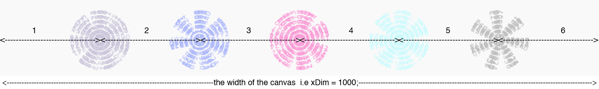

Title: 3. Infinite loops
page_order: 3


[TOC]

## setup()

{: .float}
:    *Figure 3.1: Early alchemical illustration of ouroboros accompanied by the text ἓν τὸ πᾶν ("The All is One") from the work of Cleopatra the Alchemist (10<sup>th</sup> Century). Image from Wikipedia*

Loops offer alternative imaginaries, as is the case of the ancient image of a serpent eating its own tail. *Ouroboros*, from the Greek, expresses the endless cycle of birth and death, and therefore stands for the ability of processes to infinitely renew themselves. Alongside evocative references to autocannibalism and alchemy, loops are related to control and automation tasks, as well as repetitive procedures in everyday situations such as those heard in repeating sections of sound material in music.[^Hofstadter] In programming, a loop allows the repeated execution of a fragment of source code that continues until a given condition is met, such as true or false. Indeed a loop becomes an infinite (or endless) if a condition never becomes false.

It was mathematician and author Augusta Ada Byron Lovelace who was one of the first to introduce and illustrate the concept of a programmatic loop in the early nineteenth century. She recognized that there were repeatable operations in the conceptual design of the first ever, automatic, general-purpose computing machine, Charles Babbage's Analytical Engine. A loop, which she called a "cycle," appears in her "Note G" on the Analytical Engine[^Ada] that describes the so-called Bernoulli numbers program, as in the diagram below. It utilizes two loops to indicate the repetition of a set of instructions with conditions,[^Kim] thereby minimizing efforts to write a repeatable operation in duplicate. As such, loops address repeatable and operational time.

{: .medium style="height: calc(13 * 16px)"}
:    *Figure 3.2: Diagram for the computation by the Engine of the Numbers of Bernoulli, from "Note G" by Ada Lovelace (1843). Image from Wikimedia Commons*

Loops in contemporary programming are highly influenced by these early insights into the handling of repeated machine operations expressed in diagramatic form. High-level programming languages such as p5.js include this loop concept, allowing a fragment of source code to be repeatedly executed, as in the example of the `draw()` function that will run continuously until the program is stopped or using the syntax `noLoop()`. Loops are some of the most basic and powerful of programming concepts.

The main example for this chapter is the graphical spinning wheel icon of a preloader, or so-called "throbber,"[^throbber] that indicates when a program is performing an action such as downloading or intensive calculations. We consider this an evocative symbol as it illuminates the discrepancy between what we think we know and what we don't know about the hidden machine labor, and the complexity of multiple temporalities that run during any given computational operation.[^screensaver] It is a good icon to illustrate how loops work, allowing us to contemplate the entanglement of perceptible streams and computational logics, as well as how we experience the historical present through digital media.[^soon] As we shift from static objects to moving ones, the animated throbber will guide the programming tasks related to thinking about transformation (such as rotation and translation), but will also act as a suitable analytical object for us to think through the idea of loops, the related temporal elements, and time-related syntaxes more conceptually.

## start()
We usually encounter the ubiquitous spinning icon while loading or streaming. It shows that a certain operation is in progress, but what exactly is happening, and how long this will take, is not at all clear. There is no indication of progress or status as is the case with a progress bar, for instance. We see the icon spinning, but it explains little about what goes on in the background or about timespan. Learning to program a throbber, and, subsequently examining *Asterisk Painting* by John P. Bell — that creates a series of asterisks by repeatedly printing the number of milliseconds that have passed since the painting started — will help you gain insight into the way programming employs transformational movement and loop structures, and, at the same time, an insight into the temporal operations of computational processes.  

* * *

<div class="section exercise" markdown=1>

## Exercise in class (Decode)
As mentioned above, this chapter shifts from programming static objects to a mixture of both static and moving objects. Our example is circular and spins, as if it were eating its own tail.

{: .medium}
:    *Figure 3.3: The runme of sample code - sketch 3_1*

RunMe, <https://aesthetic-programming.gitlab.io/book/p5_SampleCode/ch3_InfiniteLoops/sketch3_1/>

Can you describe the various elements and how they operate computationally in your own words?

* * *

**1. Speculation**

Based on what you see/experience on the screen, describe:

  * What are the elements? Come up with a list of features.
  * What is moving and what isn't?
  * How many ellipses are there in the middle?
  * Try to resize the window and see what happens.

Further questions:

  * How do you set the background color?
  * How does the ellipse rotate?
  * How can you make the ellipse fade out and rotate to the next position?
  * How can you position the static yellow lines, as well as the moving ellipses in a single sketch?

**2. Experimentation**

* Tinker with the source code
* Try to change some of the parameters, e.g. `background()`, `framerate()`, the variables inside `drawElements()`
* There are some new functions you can check in the `p5.js` reference (e.g. `push()`, `pop()`, `translate()`, `rotate()`)

**3. Mapping**

* Map some of the findings/features from the speculation you have done to the source code. Which block of code relates to your findings?  
* Can you identify the part/block of code that responds to the elements that you have speculated on?

**4. Technical questions/issues**

* `let cir = 360/num*(frameCount%num);` (see Line 21) <br> with the "modulo operator"[^modulo] that computes the remainder after division, explain what this line means and does?

**5. Other conceptual questions**

* Where do you often see this icon and what's your experience?
* If this icon is something related to waiting (or wasting) time, how much do you know about the time(s) in relation to machines?
* One of the important aspects of machine times is about synchronization, can you describe your experience in relation to synchronization processes?
</div>

## Source code
<sketch
  src="p5_SampleCode/ch3_InfiniteLoops/sketch3_1/sketch.js"
  lang="javascript"
  data-executable
  data-max-run-time="-1"
  data-download-link="https://gitlab.com/aesthetic-programming/book/-/archive/master/Book-master.zip?path=public/p5_SampleCode/ch3_InfiniteLoops/sketch3_1"
/>

## Function

A function in p5.js starts with the syntax `function() {}`, containing "a self-contained section of code"[^Robinson] to perform a certain task. The most basic built-in functions in p5.js are `setup()` and `draw()` that specify the contained code in relation to a particular purpose such as setting up the environment in which to run the program, as well as doing things over time. Other built-in functions in the sample code provided, such as `windowResized()`, serve to read just the canvas size if there is any window resizing event. The canvas size is not set at fixed dimensions, but is subject to the window size that you have adjusted as illustrated in the code. This was also discussed in the preceding chapter: `createCanvas(windowWidth, windowHeight);`. The function `windowResized()` suggests that an "event listener" — a procedure or function in a computer program that monitors for an event to occur — initiates at the code level to not only run once, but "constantly."  It is "listening" to events of window resizing specifically, and similar to other listening events such as `mouseIsPressed()` that was introduced in the previous chapter. The `windowResized()` function is considered asynchronous, which means some other events occur concurrently with the main flow of the program such as, for instance, drawing shapes.
{: style="    letter-spacing: -0.1px; "}

Alongside built-in functions, the sample code contains the custom function `function drawElements();` which is invoked in Line 13: `drawElements();` within the `draw()` function. Defining a function is relatively simple in JavaScript. Type the keyword "function" then follow it with the name that you want to give your function. The function name "drawElements" gives you a sense of what this function does, which is draw ellipses, lines of a particular size, position, and color, as well as drawing ellipses and lines to rotate clockwise or statically remain in place. There are many ways of drawing the same result, but as we are still in the early stages of learning to program, we will therefore work on an example that can do the same, but aligns better with our learning progress. With this in mind, some of the code is intentionally written in a way that is less efficient, but serves the purpose of illuminating key concepts.

Programmers like to split large tasks into smaller operations and procedures, so they are easier to structure, manage, debug, read, and are easier to collaborate on with multiple programmers. In `function drawElements();`, the sample code is simply separated from the function `draw()`, clearly indicating that this particular part of the code relates to drawing the various on-screen elements. Of course you could also separate the drawing of ellipses and lines, and it is a subjective and situated decision to decide how best to separate the different tasks.  
{: style="    letter-spacing: -0.1px;    word-spacing: -0.4px;"}

There is another type of function where you can specify tasks with arguments that are passed to the function and receive a return value. See the example below:

```javascript
let x = sum(4, 3, 2);   
print(x);
//passing values four as a, three as b, two as c to the function sum
function sum(a, b, c) {
  return a + b + c; //return statement
}
```

* * *
> Output: <br>
"9"

<div class="section exercise" markdown=1>

## Exercise in class
You can also try to type/copy the above code into your own sketch, where it will return the number 9 as the output in the web console because this is the result of the sum of the values 4, 3 and 2. These values are called "arguments" that are passed to the function (i.e. `sum()`). In the example, the parameters as variables a, b and c equals to the actual values 4, 3 and 2 as arguments, but the value of the variables can be changed. The function "sum" can be reused if you pass on other arguments/values to it, as for instance another line of code `let y = sum(5,6,7);` and the return value of y would be 18. You can try to come up with your own functions and arguments.
</div>

## Transform
In general, the transform-related functions[^ref2] apply a two-dimensional or three-dimensional transformation to an element or object. In the sample code provided with the throbber, two specific transformational functions were used to move the canvas and create an illusion of object transformation. (It is important to know that the transformation is done at canvas background level, not at the individual shape/object level.)

{: .medium}
:    *Figure 3.4: Moving the coordinate system at canvas level. Image from processing.org*

1. `translate()`: This function displaces/moves objects within the display window. For example, moving the canvas to the center will position the whole sketch at the center too (`translate(width/2, height/2);`). The ellipse is drawn as `ellipse(35, 0, 22, 22)` which takes (35, 0) as the x and y coordinates, and "22" as the size. If we don't have the `translate()` function upfront, the ellipse will be placed at the top left corner instead (because the x coordinate value "35" is the distance of the rotating ellipses from the center position). By moving the coordinate origin to the middle using the `translate()` function, the ellipses is placed in the middle of the canvas, because the coordinate orign (0,0) has moved to the center of the screen. Building upon the previous chapter on the spatial dimension of a coordinate system, "translate" adds another layer to think about moving and positioning objects using canvas.
2. `rotate()`: In this sample code with the throbber, the use of the function `rotate()` makes the ellipse rotate through a particular number of degrees. The default unit for rotation is radians. As such, the code is written as `rotate(radians(cir));`. The function `rotate()` takes radians in its default mode, but if you want to change to degrees all you have to do is add the code `angleMode(DEGREES)`.

In order to continue expanding on spatial relationships, the entanglement of time and space is made apparent in this example by using the `rotate()` function that operates alongside other time-related syntax in `draw()`. There are a total of 9 ellipses (indicated as `let num=9;`), and each is separated from the next by 40 degrees (i.e 0.968 rad) which is derived from "360/9." A circle has 360 degrees and to rotate the ellipse over time, it requires the time element to calculate when, how, and where to move. This is how the function `frameCount()` works as it counts the number of frames displayed since the program started.[^ref] The Line 21 `let cir = 360/num*(frameCount%num);` illustrates the use of a "modulo" operation to find the remainder or the number that's left after it is divided by another value. As such, the value of the variable `cir` is limited to multiples of 40: "0, 40, 80, 120, 160, 240, 280 and 320." On the basis of the `cir` value, the program follows such a sequence over time to rotate one after the other, based on the original position, then repeats continuously.

### push() and pop()
Functions of `push()` and `pop()` are commonly used to save the current style and restore settings respectively. Style as in color and setting as in rotate and translate. In the sample code, rotation is only applied to the centered ellipses when four lines at each side are fixed. The following excerpt of code will help to explain:

* * *

```javascript
function drawElements() {
  let num = 9;
  push();
  //move things to the center
  …
  pop();
  stroke(255, 255, 0,18);
  //static lines
  line(60, 0, 60, height);
  line(width-60, 0, width-60, height);
  line(0, 60, width, 60);
  line(0, height-60, width, height-60);
}
```

The last four lines describe the drawing of the four static yellow lines. Logically speaking, the translate and rotate functions should also apply to these lines, but because the `pop()` function is placed right after drawing all the ellipses it does not impact the lines (see Figure 3.5). But if you move the line `pop()` to the end, then the lines will also rotate and translate (see Figure 3.6). This illustrates how `push()` and `pop()` can be used to save and restore styles, and how their placement matters.[^ref3]

<div class="columns" markdown=1>
{: style="height: 240px; "}
:   *Figure 3.5: Different placement of the pop() function - Four static yellow lines*

{: style="height: 240px; "}
:   *Figure 3.6: Different placement of the pop() function - Four rotating yellow lines*
</div>

* * *

<div class="section exercise" markdown=1>

## Exercises in class
1.Change the arguments/values, as well as the position/sequence of the sample code to understand the functions and syntax such as the variable `num`, the transformational functions `translate()` and `rotate()`, as well as saving and restoring current style and transformations such as `push()` and `pop()`.

2.We have explained how to use `rotate()` to display the ellipses at various degrees of rotation, but how about the fading in and out of each ellipse in the sketch? (Hint: as this is repeatedly faded in and out, the `background()` syntax under the function `draw()` is key to producing such effects.)

3.This exercise is about structuring code. How would you restructure the sample code so that it is easier for others to understand, but still maintains the same visual outcome? There are no right or wrong answers, but some pointers below might facilitate discussion:
  - You may rename the function and/or add new functions
  - Instead of having `drawElements()`, you might have something like `drawThrobber()` and `drawLines()`?
</div>

## Asterisk Painting

The following section will move from repetition and regularity, to repetition and difference. Artist and software developer John P. Bell made an artwork called *Asterisk Painting*,[^Bell] that consists of a number of throbber-like spinning patterns, however each throbber (or what he calls "asterisk") spins differently, varying in color and texture. Many of the syntaxes Bell used are related to temporality, for example the setting up of a timer, the calculation in milliseconds, the speed of rotation, the time to wait before starting a new cycle, and so on, in which programming enables the re-negotiation of time to "develop alternative time practices and experiences" through manipulating time-related functions.[^Lammerant] Also, on a closer inspection, the asterisks are not geometric shapes, but are constituted by a series of numbers which refer to the milliseconds counter that line up to form a straight line.

{: .medium}
:    <em style="word-spacing: -3.2px;">Figure 3.7 : Asterisk Painting (2014) by John P. Bell. Courtesy of the artist</em>

According to Bell,
>  "Asterisk Painting is programmed to create a series of asterisks by repeatedly printing the number of milliseconds that have passed since the painting started. If left to run by itself it will do so; however, when started on a real system, delays external to my artwork may make the asterisks look more like spots […]"

### Source code
The original piece was written in Processing and has been modified, and ported to p5.js. It is a much more complex program than the first one, but we still wanted to include this as an addition to this chapter as it helps to demonstrate the potential for further developing a looping sketch and reflect more deeply on infinite loops, and the use of time-related syntaxes.
{: style="    letter-spacing: -0.1px;  "}

<sketch
  src="p5_SampleCode/ch3_InfiniteLoops/sketch.js"
  lang="javascript"
  data-executable
  data-max-run-time="-1"
  data-requirements="p5_SampleCode/libraries/p5.play.js, p5_SampleCode/libraries/p5.sound.js"
  data-download-link="https://gitlab.com/aesthetic-programming/book/-/archive/master/Book-master.zip?path=public/p5_SampleCode/ch3_InfiniteLoops"
  download_requirements_link="https://gitlab.com/aesthetic-programming/book/-/archive/master/Book-master.zip?path=public/p5_SampleCode/libraries"
/>

<div class="section exercise" markdown=1>

## Exercise in class

RunMe, <https://aesthetic-programming.gitlab.io/book/p5_SampleCode/ch3_InfiniteLoops/>

1.Read the source code above. A reminder of the code comments:

- `//` indicates a single line comment
- `/* … */` indicates multiple lines comments

2.Use the decoding method that we introduced previously in this chapter, try to speculate, experiment, and map your thoughts to the source code.  

  - **Speculation**: Describe what you see/experience on screen.
    - What are the elements on screen?
    - How many asterisks are there on screen and how are they arranged?
    - What is moving and how does it move?
    - What makes each asterisk spin/rotate and when does it stop to create a new one?
    - Can you locate the time-related syntax in this sketch?
  - **Experimentation**: Change some of the code's arguments
    - Try to change some of the values, e.g. the values of the global variables
    - Which new syntax and functions didn't you know? (Check them out in the p5.js reference.)
  - **Mapping**: Map the elements from the speculation to the source code
</div>

## Arrays

To be able to get a deeper understanding of the source code, you only need a few more fundamental concepts of programming. The first one is "Array," which is commonly understood as a list of data and is related to previous concepts such as variable and data types. If we need to work with a chunk of data, such as a collection of words, you can use arrays instead of making separate variables. For example:

```javascript
//example
let words = [] //array -> start with 0
words[0] = "what";
words[1] = "are";
words[2] = "arrays";
console.log(words[2]); //output: arrays
console.log(words.length); //output: 3
```

We can follow a similar structure to our previous approach using variables:

1. **Declare:** Think of a name you want to use to store the list of values. The symbol [] in `let words = []` indicates "words" is structured as an array, but how many words is unknown and hasn't been specified with just this line of code.
2. **Initialize/Assign:** Given the example above, there are three text values to store in quotations (this indicates they are "String" data types): "what," "are," and "arrays." Since an array is a list of values and it is needed to be identified individually, "an array index" within a square bracket is used to represent the position of each piece of data in an array. It starts with [0] as the first item, then [1] as the second, and so forth. Therefore `words[0] ="what"` means that the first index item of the array words is a string data type and with the value "what."  
3. **Re(use):** The `console.log()` function is an example that indicates how you can retrieve and use the data, how you can print it in the web console area, or how you can draw on a canvas.

The syntax `arrayname.length` is used to ask how many items there are in an array.

Let's look at the sample below from *Asterisk Painting*:

```javascript
let xPos = [1, 2, 3, 4, 5];
let yPos = [1, 2, 3, 4];
```

This is a slightly different way of declaring an array. It combines both the declaration and initialization/assignment into a single line to both declare the array names as `xPos` and `yPos` with the term `let`, and then assigns the numeric values into the array index, which refers to the number of columns and rows respectively. Think about it like this: the program needs to know how many asterisks should be drawn on the screen before moving on to the next row as well as when to restart (the asterisks fill the entire canvas in terms of reaching the maximum number of rows and columns.)

As the array index starts with `[0]`, therefore each index has mapped the value in this way:  

`let xPos = [1,2,3,4,5];`
:   → The `xPos.length` is 5 and that indicates 5 values are being stored in this array: xPos[0] = 1, xPos[1] = 2, xPos[2] = 3, xPos[3] = 4, xPos[4] = 5.

`let yPos = [1,2,3,4];`
:   → The `yPos.length` is 4 and that indicates 4 values are being stored in this array: ypos[0] = 1, yPos[1] = 2, yPos[2] = 3, yPos[3] = 4.

The above two arrays store each asterisk's center position in the form of x and y coordinates.

There are also methods of adding or removing an array index:

`array.push(value)`[^push]
:   → To add a value to the end of the array. Example: `xPos.push(6)` will extend the index to `xPos[5] = 6`.

`array.splice()`[^splice]
:   → This will remove a range from an array index, or remove the existing index, and replace it with new indexes with other values.

* * *

## Conditional statements
The discussion of conditional statements in the previous chapter will make it easier to follow *Asterisk Painting*'s code. We follow the conditional structure (if-then) built into the program in order to know when to move from one asterisk to the next.

```javascript
if(sentences >= maxSentences){  //reach the max for each asterisk
  //move to the next one and continues;
}
```

The value of the variable `maxSentences` is 77 (refer to Line 5 from the source code), therefore each asterisk contains 77 sentences (in the form of a line that contains numbers). The other variable `sentences` counts each line and the program checks whether the current sentences count has reached its maximum. "If" the asterisk reaches 77 sentences "then" it will move to the next one and the `sentences` counter will be reset to zero (Line 84) and start counting again. The logic repeats across all the asterisks within the `draw()` function.

## Loops
The core concept of a loop is that it enables you to execute a block of code many times. For example, if you have to draw one hundred lines that are placed vertically one after the other, you can of course write one hundred lines of code using the syntax: `line()`.

A "for-loop" allows code to be executed repeatedly, and so provides an efficient way to draw the line one hundred times by setting up a conditional structure, counting the number of lines that have been drawn and counting the maximum number of lines. Similarly, in this sketch, there are some elements needed to run repeatedly, but there is an end, such as calculating the center point using the exact x and y coordinates for each asterisk which are based on the width and height of the canvas. Knowing how many columns and rows make up a canvas allows us to know the values of the center point for drawing each asterisk.

To structure a for-loop, you need to ask yourself:

* What are the things/actions that you want to repeat in a sequence or pattern?
* More specifically, what is the conditional structure and when do you want to exit the loop?
* What do you want to do when this condition is, or is not, met?

* * *

The following is an excerpt from *Asterisk Painting* (Lines 20-29):

```javascript
/*calculate the x-position of each asterisk as
an array (xPos[]) that starts with an array index[0]*/
for(let i = 0; i < xPos.length; i++) {
  xPos[i] = xPos[i] * (xDim / (xPos.length+1));
}
/*calculate the y-position of each asterisk as
an array (ypos[]) that starts with an array index[0]*/
for(let i = 0; i < yPos.length; i++) {
  yPos[i] = yPos[i] * (yDim / (yPos.length+1));
}
```

See the structure of a for-loop:

{: .medium}
:    *Figure 3.8 A for-loop*

Figure 3.8 shows you what a for-loop consists of:

1. **A variable declaration and initialization**: Usually starts with 0
2. **A specificed condition**: The criteria to meet the condition
3. **Action**: What you want to happen when the condition is met
4. **Loop for next**: For the next iteration (usually incremental/decremental).

This block of code from the above example describes the position of each asterisk in terms of its x and y coordinates (the center point [x, y] of each asterisk). Since there are 5 columns (xPos) and 4 rows (yPos) which have been defined in global variables, the program needs to know the coordinates precisely. The overall formula to locate the position, for example xPos, is to divide the width of the canvas by the number of asterisks horizontally, and add one (see Figure 3.9). As such, the code can be understood as follows: calculate the `xPos[i]` for each iteration with the starting point 0. Additionally, each iteration will increase the count by 1 until it reaches the maximum number of asterisks in a row (`i < xPos.length`).


:    *Figure 3.9 The xPos of each asterisk*

In our teaching, we describe another example of the use of a for-loop to further clarify its use and to demonstrate the repeated drawing of objects. This example (see Figure 3.10) draws 20 ellipses and each with a distance of 20 pixels.


:    *Figure 3.10 Drawing 20 ellipses on a canvas using a for-loop*

```javascript
let x = 20;

function setup() {
  createCanvas(420, 100);
  background(200);
  for (let i = 0; i < 20; i++) {
    ellipse(x, 45, 15, 15);
    x += 20;
  }
}
```

In this simple ellipse drawing, the key is the local variable `i` (see Linr 6 above, which is used to set the start of the counting of the ellipses: `let i = 0;`, as well as setting the condition of how many ellipses should be drawn: `i < 20`, and counting the ellipses for each iteration: `i++`). The global variable `x` is used to determine the position (in terms of x axis or what could be described as the distance) of each ellipse and to make sure the program will increment 20 pixels for each iteration: `x+=20`. In this way we use a for-loop to draw multiple ellipses, instead of having 20 lines with fixed x and y coordinates.

The "while loop" is another type of loop for executing iterations. The statement is executed until the condition is true and stops as soon as it is false.

For example, `while(millis() < wait){}` in Line 76 of the work *Asterisk Painting* tells the computer to do nothing if the value of `millis()`[^millis] is less than the value of the `wait` variable. `millis()` is a time-related syntax and returns the number of milliseconds since the program started which makes it similar to `frameCount()`. Once the condition is false (i.e. `millis()` is no longer less than `wait`), the loop will end, and the program can proceed to the next line. This example is located towards the end of the program when all the asterisks have been drawn, but the program needs to wait a certain amount of time before resetting (clearing) the canvas and starting again. This while-loop therefore serves as a pause, freezing the program from running because there is literally nothing between the opening and closing brackets.  

## While()

As we have established, loops execute a block of code as long as a specified condition is true. In this closing section to the chapter it seems appropriate to emphasize that while-loops and for-loops allow code to be executed repeatedly based on a given condition. The loop can be thought of as a repeating "if" statement and offers a good way of challenging conventional structures of linear time, and demonstrating how computers utilize time differently. Programming challenges many of our preconceptions about time including how it is organized, how the present is rendered using various time-specific parameters and conditions, as in the case of a throbber. We hope it is already clear that machine-time operates at a different register from human-time, further complicated by global network infrastructures, and notions of real-time computation.

What it means to begin and end a given process becomes a philosophical problem. In "The Computer as Time-Critical Medium,"[^Chrono] Wolfgang Ernst clarifies the ontological importance of time to the computer to operate and perform tasks. He points to key issues of programmability, feedback, and recursion at programming-language level in ways that we hope resonate with the examples we have provided in this chapter.[^Chrono2] Precise technical detail is crucially important for the discussion, and his example is how "time counts" differently in the computer, as for example with the clock signal. Ernst's concept of "micro-temporality" is useful as it draws attention to the issue of temporality in programming in ways that many of the discussions of software overlook, and furthermore how — in a philosophy of time — the technical or mathematical layer is often dismissed as deterministic.[^Bergson]
{: style="letter-spacing: -0.1px;"}

Loops offer alternative imaginaries of time. In his conference paper "… Else Loop Forever," Ernst develops this discussion in relation to "untimeliness."[^Ernst] He draws on the infamous "halting problem" that underpins Turing computation and refers to the problem of whether a computer program, given all possible inputs, will finish running or continue to run forever. In his 1936/37 essay "On Computable Numbers, with an Application to the Entscheidundsproblem," it was Turing’s assertion that a general algorithm to solve the halting problem was not possible which led to the mathematical definition of a Turing machine.[^Turing] This "problem of decision," or "ending" as Ernst puts it, underscores broader notions of algorithmic time and the way the computer forever anticipates its own "never-ending" in an endless loop. Perhaps the throbber icon is a good metaphor for this, in terms of the impossibility of predicting the quality of transmission conditions, and, in this way, the animated graphics depict a sense of uncertainty that underlies deep processual micro-temporality.[^soon2]
{: style="letter-spacing: -0.1px;"}

Contrary to any traditional narrative — with its beginning, middle and end – Ernst points out that a computational recording can be re-enacted endlessly: "with no internal sense of ending," as a "time-critical condition."[^Ernst2] That there can be "no happy ending" allows Ernst to elaborate on new temporal structures that are no longer aligned to traditional narrative structures or the terminal logic of the "end of history."[^End] Our first example of the throbber alludes to this blurring of the beginning and the end. Temporal complexity is further developed by referring back to Turing's speculation on artificial intelligence, whether a finite-state machine can be aware of its "conscious" state at a given time and whether a sense of ending is necessary in order to be functional. It is clear that finite-state machines are procedural, in the sense that they operate linear sequences of discrete events in time like clockwork, but as Ernst reminds us: "There is no automatic procedure which can decide for any program, if it contains an endless loop or not."[^Ernst3]

Referencing Martin Heidegger’s "being-in-time,"[^Heidegger] and human beings' knowledge of the end of their lives which inscribes a temporal sense of what it means to be a human, Ernst says: "Humans live with the implicit awareness that their death is already future in the past."[^Ernst4] This looped deferral of ending is ontologically exacerbated with computation, unfolding the ending of being as a time-critical condition for both humans and machines alike. Leaving aside a deeper discussion of Heidegger's philosophy, the importance of this for the discussion of loops seems to mirror the complexity of lived time. Programming manages to provide insight here, and creative opportunities as is the case with live coding during which programmers interact with a running system that is not stopped while waiting for new program statements.[^livecoding] We can even begin to speculate on how software is not only synchronized with lived time, but actually produces it, and we hope the two examples in the chapter help us to think through the intersection of endlessness, loops, conditions, and temporalities in both conceptual and technical ways. We might go as far as to say that programming allows for a time-critical understanding of how technologies play a crucial role in our experience of time, not only how we model it, but how we can forge new beginnings and endings.
{: style="letter-spacing: -0.1px;"}


<div class="section exercise" markdown=1>

## MiniX: Designing a throbber

**Objective:**

* To reflect upon temporality in digital culture by designing a throbber icon.
* To experiment with various computational syntaxes and the effects of animation, and transformation.

**For additional inspiration:**

Check out other works that refer to the throbber and how other people contextualize their thinking.  

* *Tanabata(七夕)* by Yurika Sayo (n.d.), with source code, <https://www.openprocessing.org/sketch/926326>.
* *LOADING (THE BEAST 6:66/20:09)* by Gordan Savičić (2009), <https://www.yugo.at/processing/archive/index.php?what=loading>.
* *The Best is Yet to Come* by Silvio Lorusso (2012), preloaders follow one another randomly and endlessly, <https://silviolorusso.com/work/the-best-is-yet-to-come/>.
* *DVD guy* by Constant Dullaart (2009), <https://www.youtube.com/playlist?list=PLCUGKK4FUkbMdnNii8qoRy9_tMvqE8XHB>, with the contextualization by Panke Gallery in Berlin, <http://www.upstreamgallery.nl/news/545/constant-dullaart-solo-show-nein-gag-at-panke-gallery-berlin>.
* *Throb* by Winnie Soon (2018-19), <http://siusoon.net/throb/>.

**Task (RunMe):**

Use loops and any one of the transformational functions to redesign and program an "animated" throbber.

**Questions to think about (ReadMe):**

 **Describe** your throbber design, both conceptually and technically.

* What do you want to explore and/or express?
* What are the time-related syntaxes/functions that you have used in your program, and why have you used them in this way? How is time being constructed in computation (refer to both the reading materials and your coding)?
* Think about a throbber that you have encounted in digital culture, e.g. for streaming video on YouTube or loading the latest feeds on Facebook, or waiting for a payment transaction, and consider what a throbber communicates, and/or hides? How might we characterize this icon differently?
</div>

## Required reading

* Hans Lammerant, "How humans and machines negotiate experience of time," in *The Techno-Galactic Guide to Software Observation*, 88-98, (2018), <https://www.books.constantvzw.org/nl/home/tgso>.
* Daniel Shiffman, Courses 3.1, 3.2, 3.3, 3.4, 4.1, 4.2, 5.1, 5.2, 5.3, 7.1, 7.2, *Code! Programming with p5.js*, <https://www.youtube.com/watch?v=1Osb_iGDdjk> (2018). (Includes practical usage on conditional statements, loops, functions, and arrays.)
* Wolfgang Ernst, “‘… Else Loop Forever’: The Untimeliness of Media,” (2009), https://www.medienwissenschaft.hu-berlin.de/de/medienwissenschaft/medientheorien/downloads/publikationen/ernst-else-loop-forever.pdf.

## Further reading

* Wolfgang Ernst, *Chronopoetics: The Temporal Being and Operativity of Technological Media* (London: Rowman & Littlefield International, 2016), 63-95.
* Winnie Soon, “Throbber: Executing Micro-temporal Streams,” *Computational Culture* 7, October 21 (2019), http://computationalculture.net/throbber-executing-micro-temporal-streams/.
*	Wilfried Hou Je Bek, "Loop," in Fuller, ed., *Software Studies*.
* Derek Robinson, "Function," in Fuller, ed., *Software Studies*.

## Notes

[^Hofstadter]: The logic behind loops can be demonstrated by the following paradoxical word play: "The next sentence is true. The previous is false." Further examples of paradox, recursion, and strange loops can be found in Douglas R. Hofstadter's' *Gödel, Escher, Bach: An Eternal Golden Braid* (New York: Basic Books, 1999).

[^Ada]: For an account of "Note G," see Joasia Krysa's *Ada Lovelace* 100 Notes-100 Thoughts Documenta 13 (Berlin: Hatje Cantz Verlag, 2011).

[^Kim]: Eugene Eric Kim and Betty Alexandra Toole, "Ada and the First Computer," *Scientific American* 280, no. 5 (1999), 78.

[^throbber]: It is also interesting to note that the term "throbber" is a derogatory term derived from erect penis, not unlike git which was described in the opening chapter.

[^screensaver]: There is much we could add here also about screensavers as cultural form in the broader context of productive labor-time, and the attention economy. Alexandra Anikina's PhD *Procedural Films* (Goldsmiths, University of London, 2020) contains a chapter on the aesthetic form of screensavers in relation to the discussion of idle time/sleep, and cognitive labor; her lecture-performance *Chronic Film* from 2017 can be seen at <http://en.mieff.com/2017/alexandra_anikina>. See also Rafaël Rozendaal's installation *Sleep Mode: The Art of the Screensaver* at Het Nieuwe Instituut (2017), <https://hetnieuweinstituut.nl/en/press-releases/sleep-mode-art-screensaver>.

[^soon]: Winnie Soon, "Throbber: Executing Micro-temporal Streams," *Computational Culture* 7 (October 21, 2019), <http://computationalculture.net/throbber-executing-micro-temporal-streams/>.

[^modulo]: Artist Golan Levin has given an online tutorial on modulo operator as part of The Coding Train series, see: <https://www.youtube.com/watch?v=r5Iy3v1co0A>.

[^Robinson]: Derek Robinson, "Function," in Matthew Fuller, ed. *Software Studies*, 101.

[^ref2]: To stick with the provided examples, we only offer two syntaxes related to transformation. Beyond `translate()` and `rotate()`, there are also other transform-related functions such as `scale()`, `shearX()`, `shearY()`. See <https://p5js.org/reference/#group-Transform>.

[^ref]: <https://p5js.org/reference/#/p5/frameCount>.

[^ref3]: <https://p5js.org/reference/#/p5/push>.

[^Bell]: <http://www.johnpbell.com/asterisk-painting/>.>.

[^Lammerant]: Hans Lammerant, "How humans and machines negotiate experience of time," in *The Techno-Galactic Guide to Software Observation* (Brussels: Constant, 2018), 88-98.

[^push]: <https://developer.mozilla.org/en-US/docs/Web/JavaScript/Reference/Global_Objects/Array/push>

[^splice]: <https://developer.mozilla.org/en-US/docs/Web/JavaScript/Reference/Global_Objects/Array/splice>

[^millis]: `millis()` is a p5.js syntax, returning the number of milliseconds since starting the program, similar to `frameCount` but counted in milliseconds, see <https://p5js.org/reference/#/p5/millis>.

[^Chrono]: Wolfgang Ernst, *Chronopoetics: The Temporal Being and Operativity of Technological Media* (London: Rowman & Littlefield International, 2016), 63-95.

[^Chrono2]: Ernst, *Chronopoetics*, 63.

[^Bergson]: For example, the philosopher Henri Bergson makes a qualitative distinction between lived "durational" time, and vulgar, or clock time, which flattens and deadens the experience of time. See Henri Bergson, *Matter and Memory* [1896] (New York: Zone Books, 1990).

[^Ernst]: Wolfgang Ernst, “‘… Else Loop Forever’. The Untimeliness of Media” (2009). Available at <https://www.medienwissenschaft.hu-berlin.de/de/medienwissenschaft/medientheorien/downloads/publikationen/ernst-else-loop-forever.pdf>.

[^Turing]: Alan M. Turing, "On Computable Numbers, with an Application to the Entscheidungs problem," *Proceedings of the London Mathematical Society* 42 (1936/1937): 230–265.

[^soon2]: Soon, "Throbber."

[^Ernst2]: Ernst, "‘… Else Loop Forever’."

[^End]: "The end of history" is a reference to Francis Fukuyama's *The End of History and the Last Man* (New York: Free Press, 1992), which proposes the ascendancy of Western liberal democracy after the dissolution of the Soviet Union, post-1989.

[^Ernst3]: Ernst, "‘… Else Loop Forever’."

[^Heidegger]: <span markdown=1 style="letter-spacing: 0px;">Martin Heidegger, *Being in Time* (1927). For a useful summary, see <https://plato.stanford.edu/entries/heidegger/#BeiTim>.</span>


[^Ernst4]: Ernst, "‘… Else Loop Forever’."

[^livecoding]: See forthcoming Alan Blackwell, Emma Cocker, Geoff Cox, Thor Magnussen, Alex McLean, *Live Coding: A User's Manual* (publisher and date unknown).
