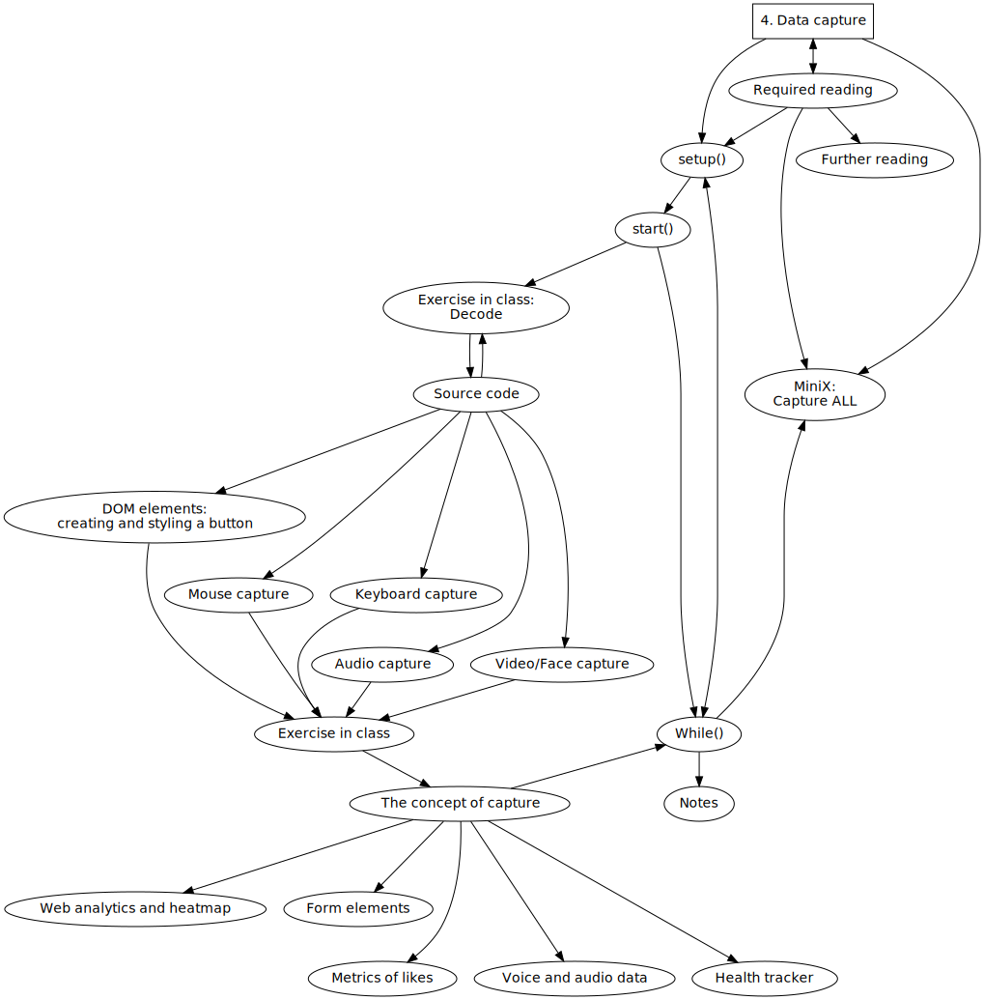
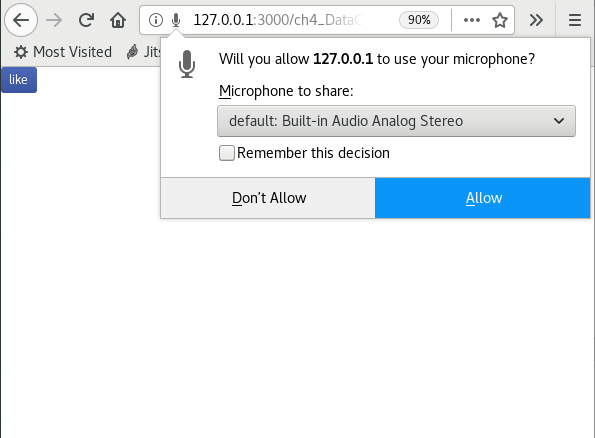
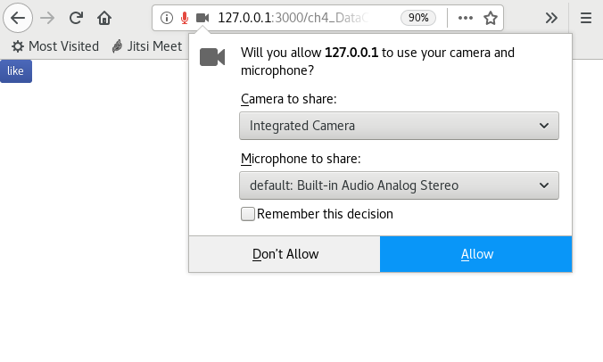
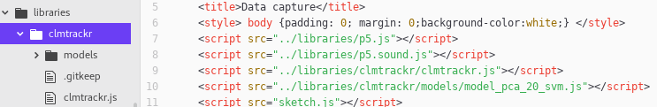
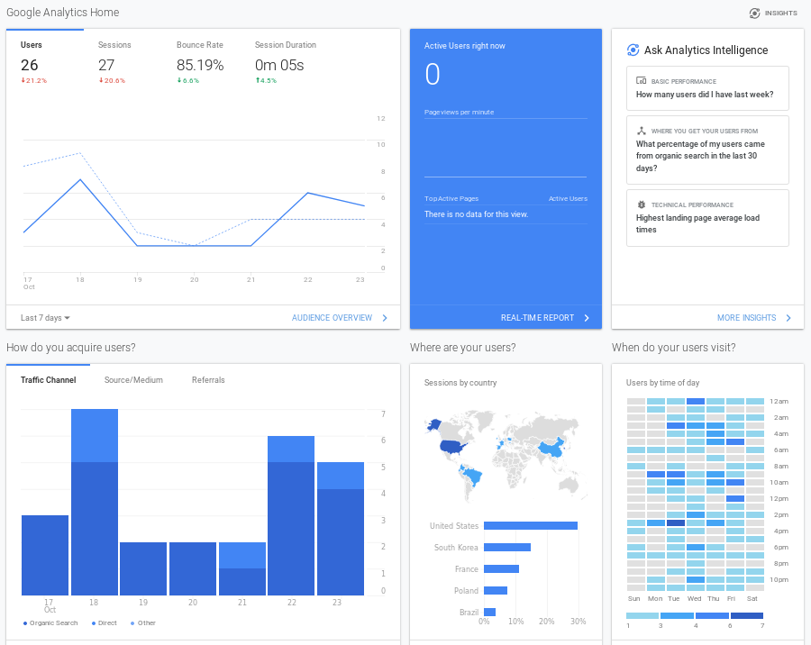
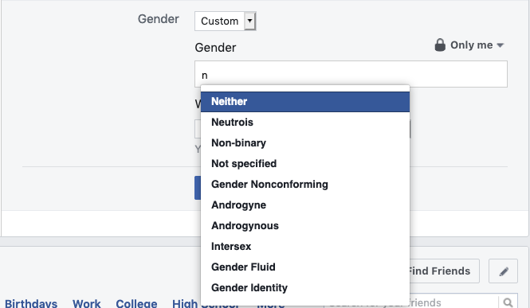
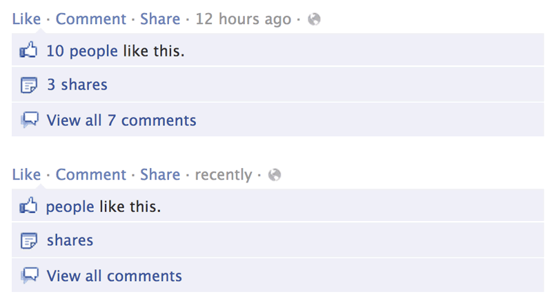
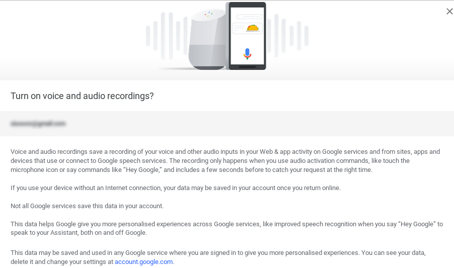
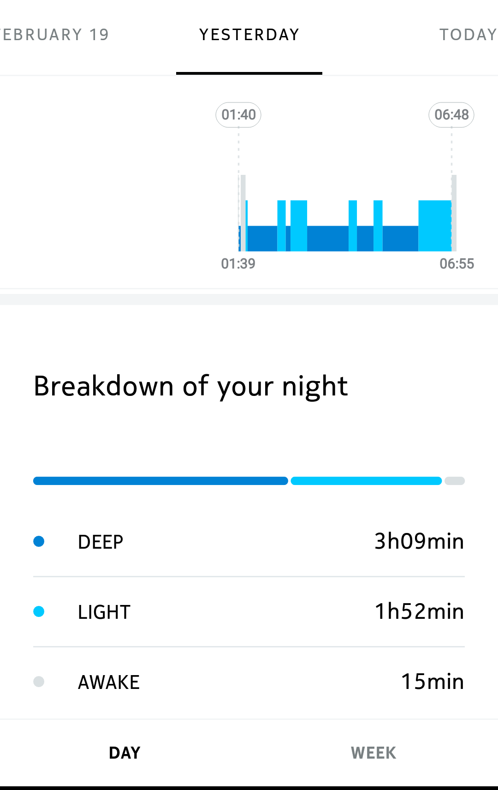

Title: 4. Data capture
page_order: 4



[TOC]

## setup()
This chapter focuses on how a program captures and processes input data. We have already introduced interactivity with physical devices with the functions `mouseX` and `mouseY` (see Chapter 2, "Variable geometry"), as well as the idea of listening events via the functions `mouseIsPressed()` and `windowResized()` (see Chapter 3, "Infinite loops"). In this chapter we expand on these ideas and present different types of data capture, including mouse movement, keyboard press, audio volume, and video/face tracking with a web camera.

Framing this chapter under "Data capture" allows us to move from immediate interactions to questioning which kinds of data is being captured and how it is being processed,[^Tufte] as well as the consequences of this broader cultural tendency that is often called "datafication."[^datafication] This term — a contraction of data and commodification — refers to the ways in which all aspects of our life seem to be turned into data which is subsequently transferred into information which is then monetized (as described by Kenneth Cukier and Victor Mayer-Schöenberger in their article "The Rise of Big Data").[^Bigdata] Our data, "the patterns of human behaviors," is extracted and circulated within the logic of what Shoshana Zuboff calls "surveillance capitalism,"[^zuboff] demonstrating the need for large quantities of all manner of data to be harvested for computational purposes, such as predictive analytics (e.g. you like this book so we think you might like these books too).  

We will return to some of these issues in Chapter 10, "Machine unlearning," but suffice to say, for now, that in the era of big data, there appears to be a need to capture data on everything, even from the most mundane actions like button pressing. This chapter begins with a relatively simple action like switching a device on or off — light, a kitchen appliance, and so on. Moreover a button is "seductive,"[^Pold] with its immediate feedback and instantaneous gratification. It compels you to press it. Similarly in software and online platforms like Facebook, a button calls for interaction, inviting the user to click, and interact with it in binary states: like or not-like, accept or cancel. The functionality is simple — on or off — and gives the impression of meaningful interaction despite the very limited choices on an offer (like most interactive systems). Indeed this binary option might be considered to be more "interpassive" than interactive, like accepting the terms of conditions of a social media platform like Facebook without bothering to read the details, or "liking" something as a way of registering your engagement however superficial or fleeting. Permission for capture data is provided, and as such our friendships, thoughts, and experiences all become "datafied." Even our emotional states are monitored when it comes to the use of emoticons (discussed in Chapter 2, "Variable geometry").

With these ideas in mind, the next section will introduce the sample code for a customizable "Like" button in order to demonstrate the potential of simple interactions such as pressing a button. How the specificities and affordances of buttons can be considered, as well as how the like button becomes a "social button," thus creating economic values in what Carolin Gerlitz and Anne Helmond call "the like economy." [^helmond] As in previous chapters we will work through the various types of capture using buttons as a starting point. Subsequently, we will reflect on the wider implications.

## start()
{: .medium}
:   *Figure 4.1: The web interface and interaction of the sample code*

RunMe, <https://aesthetic-programming.gitlab.io/book/p5_SampleCode/ch4_DataCapture/>    

Starting with this sample code, the sketch incorporates four data inputs for a customizable "like" button:

1. The button can be clicked using the mouse and then the button's color is changed.
2. The button's color is resumed when the mouse is moved away from the button area.
3. The button will rotate 180 degrees when you click the keyboard's spacebar.
4. The button will change its size according to the volume of the audio/mic input.
5. The button will move in line with input from the facial recognition software, following the movement of what it considers to be the mouth.

The button has been customized using Cascading Style Sheets (CSS), which describe the style and visual elements of an object in a format that consists of a selector and a declaration block.[^fb] These identify which elements you want to customize and how to do it precisely. CSS works with HTML and we can create HTML's DOM objects like a button with the p5.js library (which will be explained in further detail in the following section).

* * *

<div class="section exercise" markdown=1>

## Exercise in class (Decode)
By looking at the like button closely in the RunMe, can you come up with a list of stylistic customizations that have been introduced in the sample code?

Then look at the source code in the next section (Lines 23-49) and describe some of the button's styling in your own words.

</div>

## Source code

<sketch
  src="p5_SampleCode/ch4_DataCapture/sketch.js"
  lang="javascript"
  data-executable
  data-requirements="p5_SampleCode/libraries/p5.sound.js, p5_SampleCode/libraries/clmtrackr/clmtrackr.js, p5_SampleCode/libraries/clmtrackr/models/model_pca_20_svm.js"
  data-download-link="https://gitlab.com/aesthetic-programming/book/-/archive/master/Book-master.zip?path=public/p5_SampleCode/ch4_DataCapture"
/>

## DOM elements: creating and styling a button

"DOM" stands for Document Object Model, a document like HTML with a tree structure that allows programs to dynamically access and update content, structure, and style. Rather than focusing on the various tree structures, we will focus on elements from forms that are part of the DOM. These form elements include buttons, radio buttons, checkboxes, text input, etc., and these are usually encountered when filling in forms online. The basic structure for creating form elements is relatively simple. The p5.js reference guide, under the DOM,[^DOM] lists various examples of form creation syntax, e.g. `createCheckbox()`, `createSlider()`, `createRadio()`, `createSelect()`, `createFileInput()`, and so on. The one that we need to create a button is called `createButton()`.

First you need to assign an object name to the button, and if you use multiple buttons, you will need to come up with multiple different names so you can set the properties[^Element] for each one.

* `let button;`: First step is to declare the object by assigning a name.
* `button = createButton('like');`: Create a button and consider the text is to be displayed.
* `button.style("xxx","xxxx");`: This is the CSS standard, where the first parameter is a selection/selector and the second is a declaration block/attributes. For example, if you want to set the font color, then you can put in "color" and "#fff" respectively.[^Style] For this sample code, all the styling was copied directly from the 2015 Facebook interface by looking at their CSS source code. Styling includes `display`, `color`, `padding`, `text-decoration`, `font-size`, `font-weight`, `border-radius`, `border`, `text-shadow`, `background` and `filter`, with the addition of `transform`.  
* `button.size();`: This sets the button's width and height.
* `button.position();`: This sets the button's position.
* `button.mousePressed(change);`: This changes the button's color, and gives users control over starting audio with the customized function `change()` when the mouse is pressed (more to follow in the section of "Audio capture").
* `button.mouseOut(revertStyle);`: This reverts the original button's color with the cutomized function `revertStyle()` when the mouse moves off the button element.   

## Mouse capture
In the previous chapter, the program listened for mouse movement and captured the corresponding x and y coordinates using the built-in syntaxes `mouseX` and `mouseY`. This sample code incorporates specific mouse listening events, such as `mouseOut()` and `mousePressed()` functions which are called every time the user presses a mouse button. See the excerpt from the code below:

```javascript
//mouse capture
button.mouseOut(revertStyle);
button.mousePressed(change);

function change() {
  button.style("background", "#2d3f74");
  userStartAudio();
}
function revertStyle(){
  button.style("background", "#4c69ba");
}
```
The functions `mousePressed()` and `mouseOut()` are linked to the button you want to trigger actions. There are other mouse-related mouseEvents,[^event] such as `mouseClicked()`, `mouseReleased()`, `doubleClicked()`, `mouseMoved()`, and so on.

* * *

## Keyboard capture
```javascript
function keyPressed() {
  //spacebar - check here: http://keycode.info/
  if (keyCode === 32) {
    button.style("transform", "rotate(180deg)");
  } else { //for other keycode
    button.style("transform", "rotate(0deg)");
  }
}
```

The use of the `keyPressed()` function is for listening any keyboard pressing events. If you want to specify any `keyCode` (that is the actual key on the keyboard), the sample code shows how a conditional statement can be implemented within the `keyPressed()` function.

The "conditional structure" is something similar to what you have learnt in the previous chapter, but it is also something different with the "if-else" statement. It explains as: if the spacebar on the keyboard is pressed, then the button rotates 180 degrees, and if any other keys of the keyboard are pressed, then the button reverts back to the original state of 0 degrees. The "if-else" structure therefore allows you to setup a further condition with the listening event: if a `keyCode` is detected other than the spacebar, the program will do something else.

`keyCode` takes in numbers or special keys like BACKSPACE, DELETE, ENTER, RETURN, TAB, ESCAPE, SHIFT, CONTROL, OPTION, ALT, UP_ARROW, DOWN_ARROW, LEFT_ARROW, RIGHT_ARROW. In the above example, the `keyCode` for a spacebar is 32 (see Line 3).

There is no difference in `keyCode` between capital and lower case letters, i.e. "A" and "a" are both 65.

Similar to `mouseEvents`, there are also many other `keyboardEvents`,[^Key] such as `keyReleased()`, `keyTyped()`, `keyIsDown()`.

* * *

## Audio capture

```javascript
let mic;

function setup() {
  button.mousePressed(change);
  // Audio capture
  mic = new p5.AudioIn();
  mic.start();
}

function draw() {
  //getting the audio data i.e the overall volume (between 0 and 1.0)
  let vol = mic.getLevel();
  /*map the mic vol to the size of button,
  check map function: https://p5js.org/reference/#/p5/map */
  button.size(floor(map(vol, 0, 1, 40, 450)));
}

function change() {
  userStartAudio();
}
```

The basic web audio p5.sound library is used in the sample code. It includes features like audio input, sound file playback, audio analysis, and synthesis.[^Audio]

The library should be included in the HTML file (as demonstrated in Chapter 1, "Getting started") so we can use the corresponding functions such as `p5.AudioIn()` and `getLevel()`.

Like a button, you first declare the object, e.g. `let mic;` (see Line 1,) and then set up the input source (usualy a computer microphone) and start to listen to the audio input (see Lines 6-7 within `setup()`). When the entire sample code is executed, a popup screen from the browser will ask for permission to access the audio source. This audio capture only works if access is granted.

<div class="columns" markdown=1>

:   *Figure 4.2: Permission for audio access*


:   *Figure 4.3: Permission for camera access*
</div>

The sample code refers to methods under `p5.AudioIn()` in the p5.sound library, which reads the amplitude (volume level) of the input source returning values between 0.0 to 1.0 using the `getLevel()` method.

A new function `map()` (in Line 15) will be introduced to map a number across a range. Since the values for volume returned are on a range of 0.0 to 1.0, the corresponding value will not make a significant difference in terms of the size of the button. As such, the range of the audio input will then map to the size range of the button dynamically.

The function `userStartAudio()` (see Line 19) will enable the program to capture the mic input on a user interaction event, and in this case it is the `mousePressed()` event. This is a practice enforced by many web browsers, including Chrome, in which users aware of the audio events happen in the background and to avoid auto play or auto capture features from a web browser.

## Video<span style="font-family: HersheyNoailles; font-style: italic; font-weight:bold; vertical-align: -6px; line-height: 0;">/</span>Face capture
```javascript
let ctracker;
let capture;

function setup() {
  createCanvas(640, 480);
  //web cam capture
  capture = createCapture(VIDEO);
  capture.size(640, 480);
  capture.hide();
  //setup face tracker
  ctracker = new clm.tracker();
  ctracker.init(pModel);
  ctracker.start(capture.elt);
}

function draw() {
  //draw the captured video on a screen with the image filter
  image(capture, 0,0, 640, 480);
  filter(INVERT);

  let positions = ctracker.getCurrentPosition();

  //check the availability of web cam tracking
  if (positions.length) {
    //point 60 is the mouth area
    button.position(positions[60][0]-20, positions[60][1]);

    /*loop through all major points of a face
    (see: https://www.auduno.com/clmtrackr/docs/reference.html)*/
    for (let i = 0; i < positions.length; i++) {
      noStroke();
      //color with alpha value
      fill(map(positions[i][0], 0, width, 100, 255), 0, 0, 120);
      //draw ellipse at each position point
      ellipse(positions[i][0], positions[i][1], 5, 5);
    }
  }
}
```
For the specific video/face capture, the sample code uses clmtrackr which is a JavaScript library developed by data scientist Audun M. Øygard in 2014 for aligning a facial model with faces in images or video.[^Face] Based on facial algorithms designed by Jason Saragih and Simon Lucey,[^Algo] the library analyses a face in real-time marking it into 71 points based on a pre-trained machine vision model of facial images for classification. (See Figure 4.5) Since it is a JavaScript library, you need to put the library in the working directory, and link the library, and the face model in the HTML file. (see Figure 4.4)


:   *Figure 4.4: The HTML file structure to import the new library and models*

{: .medium .no-border}
:   *Figure 4.5: The tracker points on a face. Courtesy of the clmtrackr's creator, Audun M. Øygard*

The program uses the webcam via video capture to do facial recognition and details as follow:

1. `let ctracker;` & `let capture;`: Initialize the two variables that are used for face tracking and video capture.

2. `createCapture(VIDEO)` in Line 7: This is a HTML5 `<video>` element (part of the DOM) that captures the feed from a webcam. In relation to this function you can define the size of the screen capture (which depends on the resolution of the webcam) and position on screen, e.g. `capture.size(640, 480);` We also uses `capture.hide();` to hide the video feed so that the button and the colored tracker points will not crash the video object.

2. Lines 11-13 are related to ctracker: `ctracker = new clm.tracker()`, `ctracker.init(pModel);` and `ctracker.start(capture.elt);`: Similar to audio and camera use, you first need to initialize the ctracker library, select the classified model (to be discussed in Chapter 10, "Machine unlearning"), and start tracking from the video source.

3. In order to display the captured video in the INVERT mode, the program uses `image(capture, 0,0, 640, 480);` to draw the video feed in an image format, and apply the filter accordingly: `filter(INVERT);` (See Line 18-19)

4. `ctracker.getPosition()` in Line 21: While we get the tracker points into an array `position`, a for-loop (in line 30-36) is used to loop through all 71 tracker points (as it starts with 0 and ends with 70) and return the position in terms of x and y coordinates as a two-dimensional array in the form of `position[][]`. The first dimension ([]) of the position array indicates the tracker points from 0 to 70. The second dimension ([][]) retrieves the x and y coordinates of the tracker points.

5. Getting all the data on the tracker points allows ellipses to be drawn to cover the face. Since the position of the like button follows that of the mouth, which postions at the point 60 (but since the button requires to position at the mid point of the mouth, therefore it needs to move the button to the left for around 20 pixels), the program will then return the position as an array (see line 26): `positions[60][0]-20` and `positions[60][1]`. The second array's dimensions of [0] and [1] refer to the x and y coordinates.

<div class="section exercise" markdown=1>

## Exercise in class

To familiar yourself with the various modes of capture, try the following:

1. Explore the various capture modes by tinkering with various parameters such as `keyCode`, as well as other keyboard, and mouse events.

2. Study the tracker points and try to change the position of the like button.

3. Try to test the boundaries of facial recognition (using lighting, facial expressions, and the facial composition). To what extend can a face be recognized as such, and to what extent is this impossible?

4. Do you know how the face is being modeled? How has facial recognition technology been applied in society at large, and what are some of the issues that arise from this?

It would be worth checking back to Chapter 2, "Variable geometry," for a reminder of how facial recognition identifies a person's face from its geometry — such as the distance between a person's eyes or size of their mouth — to establish a facial signature that can be compared to a standardized database. One of the main problems is that these databases are skewed by how data was prepared, its selection, collection, categorization, classification, and cleaning (further discussed in Chapter 10, "Machine unlearning"). To what extent does your face meet the standard?   

</div>

## The concept of capture
This next section discusses various examples of different inputs for data capture. The intention is to showcase some other possibilities of its application, and more importantly how this relates to datafication, commodification, surveillance and personalization. In other words, this is an opportunity to discuss data politics more broadly: to question how our personal data is captured, quantified, archived, and used, and for what purpose? What are the implications, and who has the right to access the captured data, and derive profit from it? Few people know exactly which data is captured or how it is used?[^GDPR] However, despite the use of the term "capture," we should also point out that this is not total incarceration, and there are escape routes. More on this later.  

### Web analytics and heatmap
At the moment, the most widely used web analytics service is provided by Google and contains tremendous amounts of data on website traffic and browsing behavior, including the number of unique visits, average time spent on sites, browser and operating system information, traffic sources and users' geographic locations, and so on. This data can then be further utilized to analyze customers' profiles and user behaviors.

{: .medium}
:   *Figure 4.6: Google Analytics screenshot*

Heatmap is one of the visualization tools and provides a graphical representation of data to visualize user behavior. It is commonly used in industries for the purpose of data analytics. For example, it is easy to track the cursor's position and compute the duration of its stay in different areas of a web page, providing an indication as to which content is "hotter" than the rest. This is useful for marketing purposes, not least to understand which content is more or less attractive to users, and for companies or political parties to analyze where to best place their ads and other propaganda. The Facebook–Cambridge Analytica data scandal makes a pertinent case study. In early 2018, it was revealed that the personal data of millions of peoples' Facebook profiles had been harvested without their consent, and used for political advertising purposes.[^Analytica]
Major corporations such as Facebook,[^Facebook] constantly explore new data capture methods to optimize screen presentation.

{: .medium}
:   *Figure 4.7: An example of a heatmap for analyzing a web page*


### Form elements {: style="margin-top: -16px;"}
As we argued with regard to interaction, the choices are limited, and yet each form element like a dropdown menu or a button indicates different affordances.[^gibson] Researcher Rena Bivens has made a thorough analysis of Facebook's registration page in relation to the gender options available.[^Bivens] When Facebook was first launched in 2004 there was no gender field, but things changed in 2008 when a drop-down list was introduced that consisted solely of the options Male or Female, further changed with the use of radio buttons to emphasize the binary choice. A breakthrough occurred in 2014 when Facebook allowed users to customize the gender field and you can now select from a list of more than 50 gender options. According to Facebook, they wanted to enhance "personalized experiences" with "authentic identity,"[^Facebook2] however it remains arguable that this personalization (both at Facebook and in society in general) is well-intended as it also serves the purpose of market segmentation (in dividing users into ever more sub-groups).

{: .medium style="height: calc(10 * var(--line-height))"}
:   *Figure 4.8: Facebook's custom gender field as of February 2020*

### Metrics of likes {: style="margin-top: -16px;"}
The use of a single Like button provides a good example of how our feelings are captured. The aptly named company "Happy or Not" who produce push button technology and analytics software — the kind found in supermarkets for instance, with happy or sad faces — also provide feedback technologies for the workplace, as indicated by their strapline: "Creating happiness in every business, worldwide."[^Leslie] The six emoticons Facebook launched in 2016, including "Like," "Love," "Haha," "Wow," "Sad" and "Angry," mark our standardized experience of work and play more precisely. All clicks are "categorized" into emotional metrics, displayed publicly on the web, and used for algorithmic calculation to prioritize feeds to users. It is fairly clear how the clicks serve the interests of platform owners foremost, and, as if to prove the point, Facebook, and Instagram have tested the idea of hiding the metrics on posts in order to shift attention to what they prefer to call "connecting people"[^Hide] — as if to prove their interests to be altruistic.

This practice of quantification is something the artist Benjamin Grosser has parodied in his *Demetricator* series,[^Grosser] first published in 2012, which makes all the numbers associated with the metadata disappear. The associated "value" of numbers associated with notifications, replies, favorites, and feeds, have all been nullified. Or rather, it becomes clear that the clicking produces value and the proof of this is conspicuous by its absence.

{: .medium}
:   *Figure 4.9: Benjamin Grosser's Facebook Demetricator, demetricating Likes, Shares, Comments, and Timestamps. Original (top), Demetricated (bottom). Courtesy of the artist*

Tracking is clearly big business and comes with its own invisibility cloak. In 2013, Facebook conducted a research project about last-minute self-censorship,[^Facebook3] revealing their capability of being able to track even unposted status updates/posts/comments, including erased texts, or images. This "residual data," which might be considered "waste material," "digital exhaust," or data exhaust," and yet this data is rich in predictive values.[^zuboff2] The implication is that Facebook is not only interested in capturing what you have posted, but also capturing your thought processes from residual data. It is sobering to think that data capture extends to the realm of imagination.

### Voice and audio data
Smart devices like our computers, phones, and other gadgets are commonly equipped with voice recognition — such as Siri, Google Assistant or Alexa — which turns audio input into commands for software, and feedback with more personalized experiences to assist in the execution of everyday tasks. You can find these voice assistants in just about everything now including, everyday objects like microwaves, and they become more and more conversational and "smart," one might say "intelligent," as machine learning develops. These "voice assistants," as they are known, carry out simple tasks very well, and become smarter, and at the same time capture voices for machine learning applications in general. Placing these tangible voice assistants in our homes allows the capturing of your choices and tastes when not facing a screen. In the internet of things, the device serves you, and you serve the device. Indeed we become "devices" that generate value for others.[^Leslie2]    

{: .medium}
:   *Figure 4.10: Screenshot of Voice & Audio activity*

In the Figure 4.10, the text reads as:

> "Voice and audio recordings save a recording of your voice and other audio inputs in your Web & app activity on Google services and from sites, apps and devices that use or connect to Google speech services. [...] This data helps Google give you more personalised experiences across Google services, like improved speech recognitionn when you say "Hey Google" to speak to your Assistant, both on and off Google. This data may be saved and used in any Google service where you are signed in to give you more personalised experiences."

* * *

### Health tracker
{: .float}
:   *Figure 4.11: Screenshot of sleep tracker*

Fitness and well-being becomes datafied too, and with the setting of personal targets, also "gamified." As the welfare state is dismantled, personal well-being becomes more and more individualized and there is a growing trend for "self-tracking" apps to provide a spurious sense of autonomy. Movement, steps, heart rate, and even sleep patterns can be tracked and analyzed using wearable devices such as the Fitbit, or the Apple Watch. These practices of the "quantified self," sometimes referred to as "body hacking" or "self-surveillance," overlap with other trends that incorporate capture and acquisition into all aspects of daily life.


## While()

Under late capitalism, temporality itself seems to have been captured, and "there is a relentless incursion of the non-time of 24/7 into every aspect of social or personal life. There are, for example, almost no circumstances now that cannot be recorded or archived as digital imagery or information."[^Crary] We quote from Jonathan Crary's book *24/7: Late Capitalism and the Ends of Sleep* which describes the collapse of the distinction between day and night, meaning we are destined to produce data at all times. If sleep was once thought to be the last refuge from capitalism where no value could be extracted,[^Crary2] then this no longer seems to be the case.

That even sleep has become datafied seems to point to the extent to which our subjectivities have also been captured. We produce, share, collect, use and misuse, knowingly, or not, massive amounts of data, but what does its capture do to us? What are the inter-subjective relations between data-commodity and its human subjects? As discussed in this chapter, our personal and professional lives seem to be fully enmeshed in various processes of "datafication," but does this mean that we are trapped in a prison-house of data, unwittingly producing value for others? In this last section we try to unpack these ideas a little more, and in particular the idea of value in the context of the data flow (that we call big data), and examine our position within these datafied structures which is not entirely without agency.

In 2015, transmediale, an annual art and digital culture festival in Berlin, posted an open call addressing the pervasive logic of *Capture All* and the quantification of life, work and play. The call included some questions worth repeating here: "Are there still modes of being that resist the imperative of digital capitalism to CAPTURE ALL or is there no option but to play along? If so, are there artistic strategies and speculative approaches that do not play this game of quantification by the numbers? What are the […] gaps of relentless quantification and gamification that can be exploited in order to carve out new ways of living?"[^transmediale] Hopefully the practical tasks and examples of this chapter go some way to pointing out some alternatives.

Marxist theory can help us make sense of this on a more conceptual level. The various techniques we have described can be understood as means of production, what Marx would refer to as "fixed capital," which is then turned into "exchange value," or in other words monetary value. Yet to see this process as one in which the labor-value of users is simply captured and the associated value stolen misses the point, as Tiziana Terranova states.[^Terranova] Rather than individual users needing compensation for their willing supply of data, it is the bigger social aspect that is more significant, particularly in the context of big data, we might add. She explains: "Contrary to some variants of Marxism which tend to identify technology completely with "dead labor," "fixed capital" or "instrumental rationality," and hence with control and capture, it seems important to remember how, for Marx, the evolution of machinery also indexes a level of development of productive powers that are unleashed but never totally contained by the capitalist economy."[^Terranova2]

We can find some evidence of this in the social energies of the free and open source movement, for instance, where compensation operates at the level of social exchange. This claim then serves to shift attention from the efforts of the individual to social relations. The politics of this is especially important if we are to develop a position different from the logic of "capture all" and look to more positive, and hopeful interpretations. Referring to button pressing, Terranova describes social relations as an asymmetrical relations between two poles — one active, the other receptive. To her, actions such as "liking and being liked, writing and reading, looking and being looked at, tagging and being tagged," are examples of the transition from individual to collective forms. She considers how "these actions become discrete technical objects (like buttons, comment boxes, tags, etc.) which are then linked to underlying data structures," and, in turn, how these actions express the possibility of being able to experiment with processes of "individuation" and "transindividuation," i.e. the possibility of social transformation itself.

This line of argument makes reference to the philosophy of Gilbert Simondon, to the transformational process by which individuation — how a person or thing is identified as distinguished from other persons or things — is caught up with other individuations. There is no space (or need, we think) to go into this in detail in this publication, but for now it suffices to say that transindividuation describes the shift between the individual "I" and the collective "We" and how they are transformed through one another.[^Stiegler] We hope something of this happens to this book project, which is already collective by design, but also opens up further possibilities for the production of new versions and social relations in its reworking. Of course this involves tinkering with the underlying codes and values associated with data capture, and our ability to reinvent the latter's main purpose. This is an open invitation to not only capture data, but to also unleash its other potentials.  

<div class="section exercise" markdown=1>
## MiniX: Capture All

**Objective:**

* To experiment with various data capture inputs, including audio, mouse, keyboard, webcam, and more.
* To critically reflect upon the process of data capture and datafication.

**For additional inspiration:**

* *LAUREN* by Lauren McCarthy (2017), <http://lauren-mccarthy.com/LAUREN>.
* *nonsense* by Winnie Soon (2015), <http://siusoon.net/nonsense/>. (Read the comment in the source code for this project's intentions.)
* *Facebook Demetricator* by Benjamin Grosser (2012-present), <https://bengrosser.com/projects/facebook-demetricator/>, and subsequent *Instagram Demetricator*, <https://bengrosser.com/projects/instagram-demetricator/> or *Twitter Demetricator*, <https://bengrosser.com/projects/twitter-demetricator/>.

**Tasks (RunMe):**

1. Experiment with various data capture input and interactive devices, such as audio, mouse, keyboard, webcam/video, etc.
2. Develop a sketch that responds loosely to the transmediale open call "Capture All," <https://transmediale.de/content/call-for-works-2015>. (Imagine you want to submit a sketch/artwork/critical or speculative design work to transmediale as part of an exhibition.)

**Questions to think about (ReadMe):**

* **Provide** a title for and a short description of your work (1000 characters or less) as if you were going to submit it to the festival.
* **Describe** your program and what you have used and learnt.
* **Articulate** how your program and thinking address the theme of "capture all."
* What are the cultural implications of data capture?
</div>

## Required reading

* Shoshana Zuboff, "Shoshana Zuboff on Surveillance Capitalism | VPRO Documentary," <https://youtu.be/hIXhnWUmMvw>.
* "p5.js examples - Interactivity 1," <https://p5js.org/examples/hello-p5-interactivity-1.html>.
* "p5.js examples - Interactivity 2," <https://p5js.org/examples/hello-p5-interactivity-2.html>.
* "p5 DOM reference," <https://p5js.org/reference/#group-DOM>.
* Ulises A. Mejias and Nick Couldry, "Datafication," *Internet Policy Review* 8.4 (2019), <https://policyreview.info/concepts/datafication>. 

## Further reading

*	Søren Pold, "Button," in Fuller, ed., *Software Studies*.
* Carolin Gerlitz and Anne Helmond, "The Like Economy: Social Buttons and the Data-Intensive Web," *New Media & Society* 15, no. 8, December 1 (2013): 1348–65.
*	Christian Ulrik Andersen and Geoff Cox, eds., *A Peer-Reviewed Journal About Datafied Research* 4, no. 1 (2015), <https://aprja.net//issue/view/8402>.
* Audun M. Øygard, "clmtrackr - Face tracking JavaScript library," <https://github.com/auduno/clmtrackr>.
*	Daniel Shiffman, *HTML / CSS/DOM - p5.js Tutorial* (2017), <https://www.youtube.com/playlist?list=PLRqwX-V7Uu6bI1SlcCRfLH79HZrFAtBvX>.
*	Tiziana Terranova, "Red Stack Attack! Algorithms, Capital and the Automation of the Common," *EuroNomade* (2014), <http://www.euronomade.info/?p=2268>.

## Notes

[^Tufte]: This resonates with the field of data visualization, and Edward Tufte’s belief that data should be allowed to "speak for itself" rather than be lost in the ornamentation of visualization. This makes the mistake in thinking that data is raw and unmediated. Data begins relatively raw and uninterpreted, but in practice is already selected, targeted, preprocessed and cleaned, mined, and so on, not least to make it human readable. There is always some additional information about its composition, usually derived from the means by which it was gathered in the first place. See Edward R. Tufte, *The Visual Display of Quantitative Information* [1983] (Cheshire, CT: Graphics Press, 2001).

[^datafication]: Christian Ulrik Andersen and Geoff Cox, eds., [A Peer-Reviewed Journal About Datafied Research](https://tidsskrift.dk/APRJA/issue/view/8402), *APRJA* 4, no.1 (2015).

[^Bigdata]: Kenneth Cukier and Victor Mayer-Schöenberger, "The Rise of Big Data," *Foreign Affairs* (May/June 2013): 28–40.

[^zuboff]: Shoshana Zuboff, "Shoshana Zuboff on Surveillance Capitalism | VPRO Documentry," vpro documentary. Accessed April 26 (2020). <https://youtu.be/hIXhnWUmMvw>. See her book,	*The Age of Surveillance Capitalism: The Fight for a Human Future at the New Frontier of Power* (New York: PublicAffairs, 2019).

[^Pold]: Søren Pold, "Button," in Matthew Fuller ed., *Software Studies* (Cambridge, Mass.: MIT Press, 2008), 34. Users are seduced by the wording of the button not least, and Pold suggests that a button is developed with distinct functionality and signification (Ibid., 31).

[^helmond]: Carolin Gerlitz and Anne Helmond, "The Like Economy: Social Buttons and the Data-Intensive Web," *New Media & Society* 15, no.8, December 1 (2013): 1348–65.

[^fb]: The styling of the button is exactly the same as Facebook's like button styling in 2015.

[^DOM]: <https://p5js.org/reference/#group-DOM>.

[^Element]: See the `p5.Element` method list here, <https://p5js.org/reference/#/p5.Element>.

[^Style]: Styling a button follows the syntax of CSS, and that controls how a DOM element like a button should be displayed. The provided example shows how CSS is incorporated into the JavaScript file by using the syntax `button.style('xxx:xxxx');`. Another way of doing this is to follow the convention of having a CSS file that lists the `.class` selector. In this way, you need to have the syntax in the JavaScript file to mark the class name: `button.class('class_name');`, and then list out the CSS elements and class attributes in the CSS file. More examples can be found here: <https://www.w3schools.com/csS/css3_buttons.asp,> and see Daniel Shiffman's video on the basic of CSS, <https://www.youtube.com/watch?v=zGL8q8iQSQw>.

[^event]: The related function in the reference page, which is under Events > Mouse>, see <https://p5js.org/reference/>.

[^Key]: The related function in the reference page, which is under Events > Keyboard>, see <https://p5js.org/reference/>.

[^Audio]: See the sound library's various features: <https://p5js.org/reference/#/libraries/p5.sound>.

[^Face]: See <https://www.auduno.com/2014/01/05/fitting-faces/>.

[^Algo]: Jason M. Saragih, Simon Lucey and Jeffrey F. Cohn, "Face Alignment Through Subspace Constrained Mean-shifts," *2009 IEEE 12th International Conference on Computer Vision, Kyoto* (2009): 1034-1041. doi: 10.1109/ICCV.2009.5459377.

[^GDPR]: The introduction of legislation such as the GDPR (General Data Protection Regulation) is a response to this lack of transparency. GDPR is a regulation in EU law (2016) on data protection and privacy that applies to all the citizens of the European Union and the European Economic Area. It also addresses the transfer of personal data outside the EU and EEA areas. See <https://gdpr-info.eu/>.

[^Analytica]: *The Guardian's* coverage of this, "The Cambridge Analytica Files," can be found at <https://www.theguardian.com/news/series/cambridge-analytica-files>. Facebook was ultimately forced to pay a hefty fine, see Alex Hern, "Facebook agrees to pay fine over Cambridge Analytica scandal," *The Guardian*, October 30 (2019), <https://www.theguardian.com/technology/2019/oct/30/facebook-agrees-to-pay-fine-over-cambridge-analytica-scandal>

[^Facebook]: Will Conley, "Facebook investigates tracking users’ cursors and screen behavior," *Slashgear*, October 30 (2013). Available at: <https://www.slashgear.com/facebook-investigates-tracking-users-cursors-and-screen-behavior-30303663/>.

[^gibson]: Affordance provides cues which give a hint how users may interact with something. See James J. Gibson, The Theory of Affordances," in Robert Shaw and John Bransford, eds. *Perceiving, Acting, and Knowing* (Hillsdale, NJ: Lawrence Erlbaum Associates, 1977), 127–143.

[^Bivens]: Rena Bivens, "The Gender Binary will not be Deprogrammed: Ten Years of Coding Gender on Facebook," *New Media & Society* 19, no.6, (2017): 880–898. doi.org/10.1177/1461444815621527.

[^Facebook2]: Facebook, Form S-1 registration statement (2012). Available at: <https://infodocket.files.wordpress.com/2012/02/facebook_s1-copy.pdf>.

[^Leslie]: Esther Leslie, "The Other Atmosphere: Against Human Resources, Emoji, and Devices," *Journal of Visual Culture* 18 no.1, April (2019).

[^Hide]: Laurie Clarke, "Why hiding likes won’t make Instagram a happier place to be," *Wired*, July 19 (2019), <https://www.wired.co.uk/article/instagram-hides-likes>.  

[^Grosser]: See Ben Grosser's *Demetricator* series of artworks: *Facebook Demetricator*, <https://bengrosser.com/projects/facebook-demetricator/>; *Instagram Demetricator*, <https://bengrosser.com/projects/instagram-demetricator/>; *Twitter Demetricator*, <https://bengrosser.com/projects/twitter-demetricator/>.

[^Facebook3]: Sauvik Das and Adam D. I. Kramer, "Self-censorship on Facebook," *AAAI Conference on Weblogs and Social Media (ICWSM)*, July 2 (2013), <https://research.fb.com/publications/self-censorship-on-facebook/>.

[^zuboff2]: Zuboff, *Shoshana Zuboff on Surveillance Capitalism | VPRO Documentry*.

[^Leslie2]: Paraphrasing the final lines of Leslie's essay "The Other Atmosphere: Against Human Resources, Emoji, and Devices": "The workers become their own devices. They becomes devices of communicative capitalism […]."    

[^Crary]: Jonathan Crary, *24/7: Late Capitalism and the Ends of Sleep* (London: Verso, 2013), 30–31.

[^Crary2]: Crary, *24/7*, 10-11.

[^transmediale]: transmediale, *Capture All*, <https://transmediale.de/content/call-for-works-2015>.

[^Terranova]: Tiziana Terranova, "Red Stack Attack! Algorithms, Capital and the Automation of the Common," *EuroNomade* (2014). Available at <http://www.euronomade.info/?p=2268>

[^Terranova2]: Terranova, "Red Stack Attack!"

[^Stiegler]: To Bernard Stiegler, explains Irit Rogoff, "The concept of 'transindividuation' is one that does not rest with the individuated 'I' or with the interindividuated 'We'," but "is the process of co-individuation within a preindividuated milieu and in which both the 'I' and the 'We' are transformed through one another." See Bernard Stiegler and Irit Rogoff, "Transindividuation," *e-flux* 14, March (2010), <https://www.e-flux.com/journal/14/61314/transindividuation/>.

[^Terranova3]: Terranova, "Red Stack Attack!"
