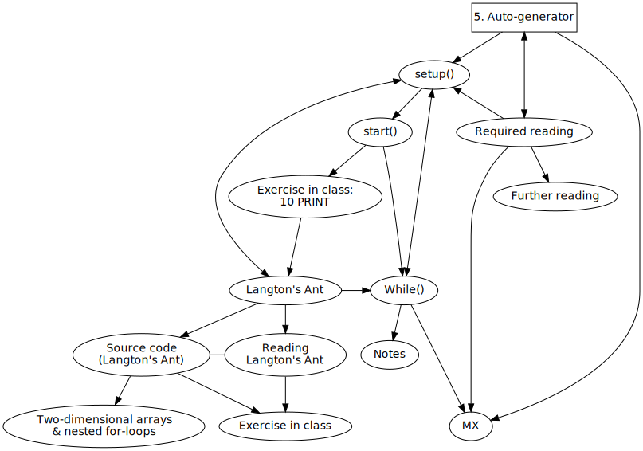
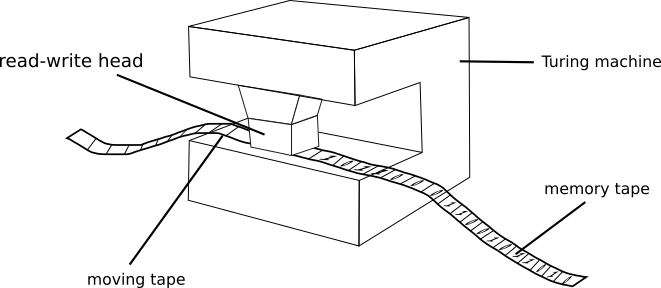
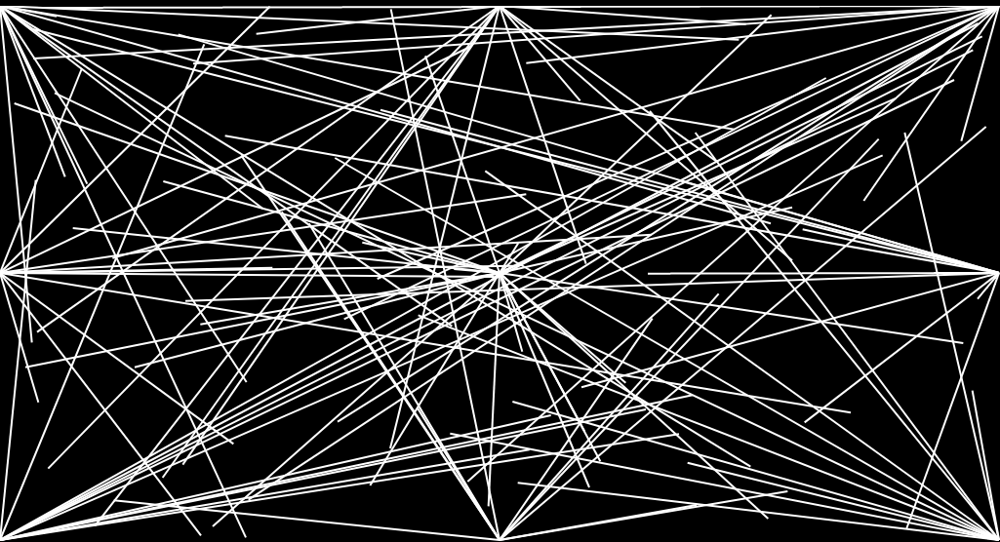
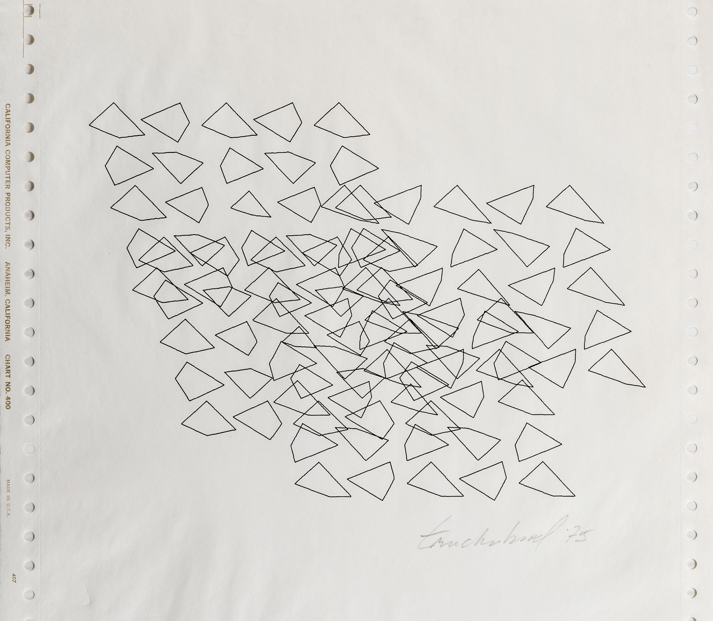
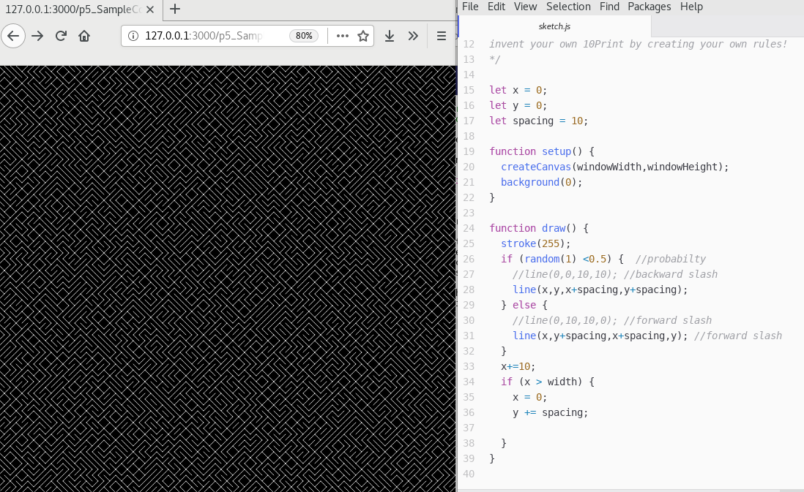
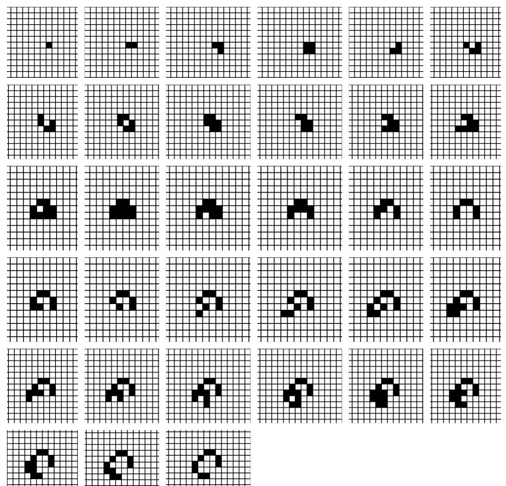
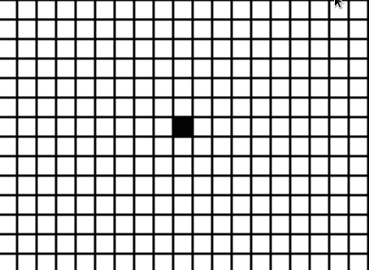
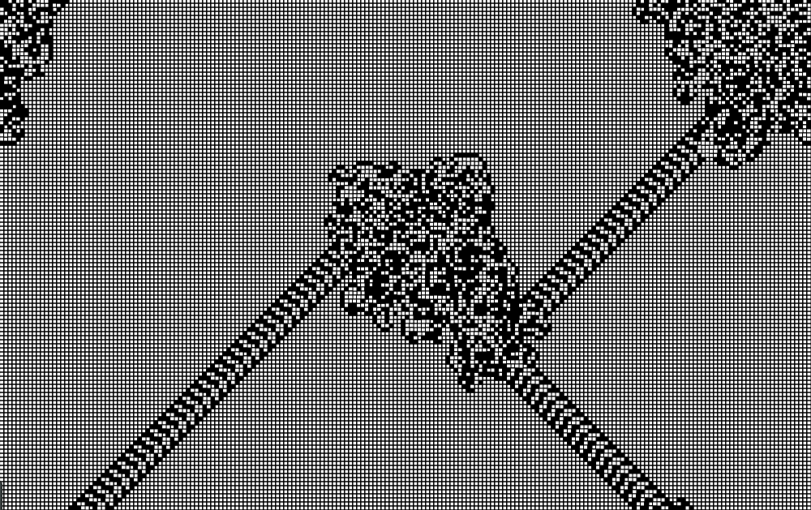
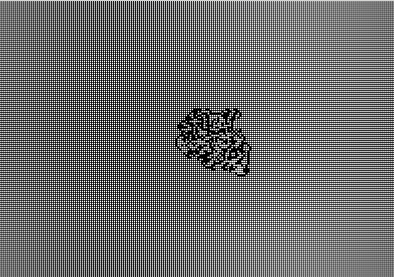
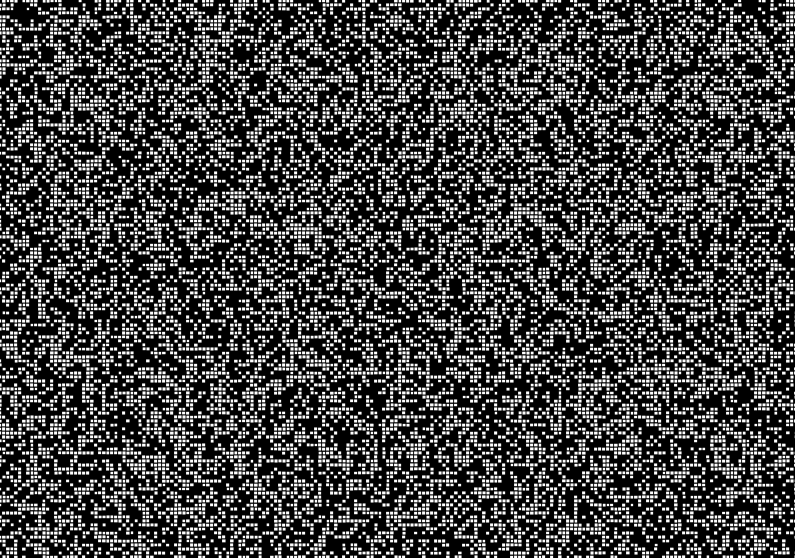

Title: 5. Auto-generator
page_order: 5




[TOC]

## setup()

While the previous chapter discussed the data capture underlying the interaction with input devices, this chapter follows the concepts of input and output to introduce the idea of the abstract machine. This refers to the creation of rules by a self-operating machine, widely known as an abstract machine or Turing machine. It was mathematician and computer scientist Alan Turing who first described this machine in his famous article "On Computable Numbers, with an Application to the Entscheidungsproblem," published in 1936.[^Turing] He used the term "universal computing machine" to theorize a model that describes how a machine "can be used to compute any computable sequence,"[^Turing1] i.e. how a machine operates, and follows a predetermined sequence of instructions that process input and produce output.

More specifically, the Turing machine is capable of six types of fundamental operations (at the time there wasn't a thing called a computer) including read, write, move left, move right, change state and halt/stop. Turing suggested these operations could be performed by running an endless tape (that worked like memory does in a modern computer) with instructions on what symbols to read and write, as well as how to move. These instructions constitute the fundamental principles of the Turing machine,[^visualization] but also modern computing, with the capability to compute numeric tasks and automate various processes. These instructions from a base level of computing seem to underwrite the wider processes of production, consumption and distribution of contemporary (informational) capitalism as we partly covered in the last chapter.    

{: .medium style="padding: 1.5em;" }
:   *Figure 5.1: An illustration of the Turing Machine[^TuringGraph]*

This chapter will explore how instructions are fundamental elements of adaptive systems, focusing on how rules are performed, and how they might produce unexpected and/or complex results.

Focusing on rules and instructions is not something only programmers do, but also something you do when following a knitting/weaving pattern[^laczko] or recipe (as we will see with the preparation of tofu in the next chapter). Artists have also produced instruction-based works of art, as is the case of the Fluxus and Conceptual Art movements of the 1960s and 1970s that set out to challenge art's object-ness, and encourage its "dematerialization."[^Lippard] There are many examples of commentators making the connection between these instruction-based works and computational art.[^Cox] For instance, the survey exhibition "Programmed: Rules, Codes, and Choreographies in Art, 1965-2018,"[^exhibition] organized by Christiane Paul at the Whitney Museum of American Art (2018-19), explored how instruction-based practices have both responded to, and been shaped by technologies. The work of conceptual artist Sol Le Witt is one of the obvious examples here and demonstrates how even when based on a set of instructions, the outcome might be different depending on how the instructions are interpreted by others. For example, the work *Wall Drawing #289* consists of three simple instructions, but does not specify the angles and length of the lines:

1. Twenty-four lines from the center.
2. Twelve lines from the midpoint of each of the sides.
3. Twelve lines from each corner.

{: .medium}
:   *Figure 5.2: This image is the software version of the work Wall drawing #289 (1976) by Sol LeWitt, and is further coded by Chuck Grimmett[^289]*

"The idea becomes a machine that makes the art," as LeWitt explains.[^LeWitt] Using the programming language Processing,[^processing] this is taken as an invitation by Casey Reas to render LeWitt's wall drawings on the basis of their instructions, thereby exploring the parallels of interpretation and process for each of them.[^Reas] In his accompanying text, Reas makes the important distinction that LeWitt's programs are to be carried out by people rather than machines. Nevertheless it is the close connection and overlap that interests him, and underlies the development of Processing as a "software sketchbook" as Reas wanted programming to be as immediate and fluid as drawing.

This is not without precedence. Algorithmic drawing has been explored by artists including Joan Truckenbrod, for example in her series *Coded Algorithmic Drawings* that dates back to the 1970s and 80s.[^joan0] *Entropic Tangle* (see Figure 5.3) was coded in the Fortran programming language in 1975, using a mainframe computer with keypunch machine, and magnetic storage media. The work presents a number of polygons that vary in size, and angles of rotation that simulate invisible natural forces and incorporate continuity, and fluctuations by using variables and mathematical modulation. Truckenbrod is interested in how "natural" forces get re-interpreted by symbols and numbers that further demonstrate the nature of ambiguity and spontaneity in systems.[^joan1] Recursive fractal geometry[^tree] and flocking behaviors[^flock] are examples that demonstrate "entropic" qualities (lack of order or predictability) based on the self-organization of computation and autonomous agents[^agent] that evolve over time.

{: .medium}
:   *Figure 5.3: Joan Truckenbrod, Entropic Tangle (1975). Courtesy of the artist*

This kind of approach is important, not only because it offers a different way of drawing and authoring works by machines based on mathematical logic, but also to provide a sense of machine creativity that — as in the previous chapter —  negates intentionality[^Arns] and questions the centrality of human (more often than not, masculinist) agency. In this chapter we aim to explore more complex combinations (or inter-species relations[^Haraway]) of humans and machines, nonhumans or animals (namely, ants).

If we were to draw an ellipse in white color at the x and y coordinate 100 and 120, the outcome of the instruction is predictable. But this needs not be the case as certain kinds of instructions or combinations of instructions can generate unruly results. As described in the book *10 PRINT CHR$(205.5+RND(1)); : GOTO 10*, the *10 Print* program utilizes randomness to generate unpredictable processes and outcomes that seem random to humans. This "generative" capacity questions the extent of control over the creative process, as the following definition of generative art reveals:

>"Generative art refers to any art practice where [sic] artists use a system, such as a set of natural languages, rules, a computer program, a machine, or other procedural invention, which is set into motion with some degree of autonomy contributing to or resulting in a completed work of art."[^galanter]

Significantly this definition does not limit itself to the use of computers and this is important to bear in mind as we proceed to focus on our sample code. The following two examples[^shiffman] explore rule-based programs that address some of these issues of auto-generation, but as in previous examples we are interested in the wider implications that include hidden labor, and other issues concerning autonomy.

## start()

The first program is called *10 PRINT* referring to one line of program code `10 PRINT CHR$(205.5+RND(1));: GOTO 10`, written in the BASIC programming language and executed on a Commodore 64 (a popular home computer during the 1980s). The program generates an endless pattern on the screen. The line of code was printed in the 1982 *Commodore 64 User's Guide* and was later published online, and has become an important example in the field of software studies for demonstrating the history and culture of creative computing.[^10print] *10 PRINT* in p5.js below is used to help familiarize us with the rules and its creative potential as it demonstrates some degree of autonomy within a system.  

The second program is entitled *Langton's Ant* (1986). It is a two-dimensional universal Turing machine invented in 1986 by the computer scientist Christopher Langton who is considered to be one of the founders of the artificial life field.[^Langton] The core difference with *10 PRINT* is the way in which it generates complex, emergent behavior using only a simple set of rules.

* * *
<div class="section exercise" markdown=1>

## Exercise in class (10 PRINT)


:   *Figure 5.4: 10 PRINT in p5.js*

<sketch
  src="p5_SampleCode/ch5_AutoGenerator/sketch.js"
  lang="javascript"
  data-executable
  download-sketch-link="https://gitlab.com/aesthetic-programming/book/-/archive/masterBook-master.zip?path=public/p5_SampleCode/ch5_AutoGenerator"
/>

RunMe
:   <https://aesthetic-programming.gitlab.io/book/p5_SampleCode/ch5_AutoGenerator/>

1.**Read** the source code of *10 PRINT* above, then copy it, and run it on your own computer.

2.**Discuss** the following *10 PRINT* rules and map them to the related lines/blocks of code[^code]:

* Throw a dice and print a backslash half the time
* Print a forward slash the other half of the time

3.Drawing on the text "Randomness":

* **How** is control being implemented in *10 PRINT*?
* **What** might the (un)predictability of regularity be?
* **What** is randomness to a computer?[^Haahr]
* **Discuss** the use and the role of randomness in *10 PRINT*, and more generally in the arts, including literature, and games?

4.Try to **modify** the existing rules, for example:

* Can we change the size, color, and spacing of the slashes?
* Can we have outputs other than just the backward and forward slashes?

5.*10 PRINT* has been appropriated by many artists, designers and students. Take a look at some of the different options it provides [*10 PRINT*](https://twitter.com/search?q=%2310print&src=typd) that are documented on Twitter with the hastag "#10print." Your task in class is to create a sketch with a clear set of rules that operates like a modified version of *10 PRINT*.

</div>

## Langton's Ant

While *10 Print* focuses both on instructions and randomness as generative processes, we want to look at the concept of "emergence" in the context of automated and generative programs in which complex patterns/outcomes are generated by simple rules. *Langton's Ant* is a classic mathematical game that simulates the molecular logic of an ant. The simulation of the cell's state is inspired by the classic Turing machine that can be instructed to perform computational tasks by reading symbols fed to it on a strip of tape that were drawn up according to a set of rules.

The next section provides the sample code that simulates the cell states, presented as a two-dimensional grid system in either black or white. Based on simple rules (as described below), an ant is considered to be the sensor that processes the cell's data as input, then the cell will change its color and the ant will move in four possible directions. Gradually, the ant will turn the grid into a more complex system that exhibits emergent behavior.

{: .print-only}
:   *Figure 5.5: Langton's Ant - initial steps*

{: .medium .web-only}
:   *Figure 5.5: Langton's Ant - initial steps*

With the ant initially facing up, Figure 5.5 shows the first thirty-three steps of *Langton’s Ant* when it follows the two general rules below:

1. If the ant is at a white cell, it turns right 90 degrees and changes to black, then moves forward one cell as a unit.
2. If the ant is at a black cell, it turns left 90 degrees and changes to white, then moves forward one cell as a unit.

In the beginning, the canvas only displays a grid system and all the individual cells are set to white. The ant has four possible directions it can move in — UP, RIGHT, DOWN, and LEFT — turning 90 degrees either left or right subject to the color of the cell it is on. The ant, located in the center of the white grid has its head pointing UP at the start. It then follows Rule 1 above to rotate the head direction from UP to RIGHT, thereby changing the white cell to black, and moving forward one unit. The second step is to follow Rule 1 again, because the new cell is still white. The ant's head direction will turn right 90 degrees and point from RIGHT to DOWN, and then it changes the white cell to black and the ant moves forward one unit. The third and forth steps are similar to the previous ones, until the ant encounters a black cell. At this point, the ant will follow Rule 2 and change the cell's color back to white, and then turn left 90 degrees instead of right. The complexity increases.

{: .medium .print-only}
:   *Figure 5.6: Langton's Ant - process*

{: .medium .web-only}
:   *Figure 5.6: Langton's Ant - process*

Figure 5.6 shows how the ant starts building the emergent "highway" pattern after the first few hundred moves with simple symmetrical patterns. Then the symmetry breaks down and the ants seems to move randomly at the center. After several thousand iterations, the ant then starts building a highway pattern, and repeats indefinately until most of the cells are reconfigured, leading to something that is similar to Figure 5.7, while the ant continues to move and change the color of cells.[^Moreira]

{: .medium}
:   *Figure 5.7: Langton's Ant - snapshot of emergence*

RunMe
:   <https://aesthetic-programming.gitlab.io/book/p5_SampleCode/ch5_AutoGenerator/sketch5_1/>

### Source code (Langton's Ant)
<sketch
  src="p5_SampleCode/ch5_AutoGenerator/sketch5_1/sketch.js"
  lang="javascript"
  data-executable
  download-sketch-link="https://gitlab.com/aesthetic-programming/book/-/archive/masterBook-master.zip?path=public/p5_SampleCode/ch5_AutoGenerator/sketch5_1"
/>

### Reading Langton's Ant

There are three areas that can help you to zoom in on the program to slow down and adjust the size.

1. `let grid_space = 5;` in Line 24: If you change the value to 10, everything will be enlarged.      
2. `frameRate(20);` in Line 48: Lower the frame rate value to help slow down the program.
3. `draw()` in Line 50: This function contains a for-loop where *n* is the ant's number of steps. If so desired you can reduce the `n < 100` to `n < 1` (in Line 31), i.e `for (let n = 0; n < 100; n++) {` this instructs the program to only process *n* steps per frame.

Instead of going through the code line by line, the following shows what each function does.

* `function setup()` in Line 39: To setup the canvas size, initiate the ant's head direction, frame rate, color, and to prepare drawing the background grid structure.
* `function drawGrid()` in Line 78: To divide the canvas into a grid.
* `function draw()`: This main function checks the two rules that apply for *Langton's Ant* and change the color of cells.
* `function nextMove()` in Line 96: The four directions are structured in a number format so that the variable `dir++` can be used to change the ant's direction by implementing the increment and decrement of the ant's direction in programming terms (i.e `dir++` or `dir--`). Each different direction (UP, RIGHT, DOWN, LEFT) corresponds to moving forward along either the horizontal (xPos) or the vertical (yPos) axis on the canvas.
* `function checkEdges()` in Line 108: This function checks whether the ant moves out of frame. When it does, the program is written in such a way that it appears on the opposite side and continues.

Technically speaking, there is no new syntax here as the two-dimensional arrays have already been covered briefly in the previous chapter. However, there is a new use of two-dimensional arrays and nested for-loops in the sample code.

## Two-dimensional arrays & nested for-loops

Daniel Shiffman has created a tutorial (written[^shiffman1] and video[^shiffman2]) to discuss how a two-dimensional array is essentially an array of other arrays. He also suggests that it is useful to think of two-dimensional arrays using a grid structure which aligns nicely with the background of *Langton's Ant* which is designed as a grid in two dimensions with both columns and rows. Since we need to identify the state of each cell, we need to know the exact x and y position of each cell.

Let's examine the source code again for the grid background drawing:

```javascript
function drawGrid() {
 cols = width/grid_space;
 rows = height/grid_space;
 let arr = new Array(cols);
 for (let i = 0; i < cols; i++) { //no of cols
  arr[i] = new Array(rows); //2D array
  for (let j = 0; j < rows; j++){ //no of rows
    let x = i * grid_space; //actual x coordinate
    let y = j * grid_space; //actual y coordinate
    stroke(0);
    strokeWeight(1);
    noFill();
    rect(x, y, grid_space, grid_space);
    arr[i][j] = 0;  // assign each cell with the off state + color
   }
 }
 return arr; //a function with a return value of cell's status
}
```

To create an array, we use the syntax `let arr = new Array(cols);` (in Line 4) and this line indicates the grid in columns and the length of the array is the same as the number of columns. Since we also need to indicate the number of rows, we create another array out of each existing array in the column using the line `arr[i] = new Array(rows);` (see Line 6). This syntax is put under a for-loop to loop through each of the columns, but then with the addition of number of rows (which is derived from the canvas height). Two-dimensional arrays are structured in this way: `arr[][]`.

To know the exact x and y coordinates of each cell within a grid, we use the formula `x = i * grid_space;` and `y= j * grid_space;` respectively. By using two nested for-loops (see Lines 5 & 7), the program loops through each column and each row until the program reaches the last column. We are able to get the x and y coordinates with the syntax `array[i][j]`, which is applied to columns (with the variable `i`) and rows (with the variable `j`).

Therefore, each cell from the grid is represented in the structure of a two-dimensional array. As demonstrated above, you can zoom in or enlarge the cell size by changing the variable `grid_space`, and the number of columns and rows depends on the canvas width and height as derived from `cols = width/grid_space;` and `rows = height/grid_space;`. Each cell, in the form of `array[i][j]`, is a unit represents a possibility that an ant can move within the grid (via the changing values of `i` and `j`).

The customized function `drawGrid()` is slightly different from what we have discussed in Chapter 3, "Infinite loops." This function comes with returned values (in Line 17): `return arr;`. This means that the function will return the values `arr` (in the form of two-dimensional arrays) when it has completed. In this *Langton's Ant* example, this function is used to draw the grid background, and to mark the initial status (off state) of each cell unit for later use when the ant is started to move.

<div class="section exercise" markdown=1>
## Exercise in class

1. Give yourself sometime to read and tinker with the code, as well as to observe the different stages of *Langton's Ant*.
2. The *Langton's Ant* program represents the world of an ant through abstraction, and sets limits on cell color, movement and direction. Rethink the rules that have been implemented. Try changing the existing rules or adding new rules so that the ant behaves differently? (Recall what you have changed in the previous exercise with *10 PRINT*.)
3. In simulating living systems — such as the complex behavior of insects — there seems to be a focus on process over outcome. Let's discuss the following questions:
  * Can you think of, and describe, other systems and processes that exhibit emergent behavior?
  * How would you understand autonomy in this context?[^Watz] To what extent do you consider the machine to be an active agent in generative systems? What are the implications for wider culture?
</div>

## While()

We already have discussed the idea of unleashing potential for changes in the previous chapter, and it would seem that generative systems promise something similar as a way to envisage existing systems as changeable or adaptive to conditions. The parallel to living systems is made clear in *Game of Life* — developed by the mathematician Jon Conway in 1970[^Conway] — another example of a Turing machine and how an evolutionary process is determined by its initial state, requires no further input, and produces emergent forms.[^game_eg] Like *Langton's Ant*, it is similarly based on principles of "cellular automata," i.e. a regular grid of cells, each in one of a finite number of states, such as on or off, or alive or dead, in this case. These are powerful metaphors with real-world applications.

Each cell interacts with other, directly adjacent, cells, and the following transitions occur:

 * Any live cell with fewer than two live neighbors dies, as if by underpopulation.
 * Any live cell with two or three live neighbors lives on to the next generation.
 * Any live cell with more than three live neighbors dies, as if by overpopulation.
 * Any dead cell with exactly three live neighbors becomes a live cell, as if by reproduction.

If the evolutionary neo-Darwinian logic of this — where the fittest survive — were not worrying enough, *Game of Life* is further troubling for its "necropolitical" dimension[^necro]: articulating life and death in terms of populations and neighborhoods, as if part of a social cleansing program (or dystopian smart city[^smart] project). Is this simply an example of poor abstraction?

That said, there is an alternative political potential here in the way an adaptive complex organism can assemble itself "bottom-up," without a central "top-down" command and control mechanism.[^emergence] This demonstrates "revolutionary" potential when it becomes impossible to predict the direction change will take, and whether it will fall into a higher level of order or disintegrate into chaos. Returning to ants, the study of ant colonies reveal there is no discernible hierarchy at work, and although humans have named the ants in provocative terms, the "queen" is not an authority figure at all but an egg-laying functionary, and the ant-workers operate cooperatively rather than feudally (incidentally, the worker ants are all female, however the sexual politics of ants are outside our scope, and we are also aware of the inferred racial dimension with the shift of cell color in the *Langton's Ant* example).

To be more precise, and according to complexity theory, all systems contain subsystems that continually fluctuate. One or more fluctuations, resulting from feedback, could change the preexisting organization, and as such the multiple interacting elements of a system cannot be governed, and the collective behavior cannot be predicted. As Ilya Prigogine and Isabelle Stengers explain in *Order Out of Chaos*:

>"A society defined entirely in terms of a functional model would correspond to the Aristotelian idea of natural hierarchy and order. Each official would perform the duties for which he [sic] has been appointed. These duties would translate at each level the different aspects of the organization of the society as a whole. The king gives orders to the architect, the architect to the contractor, the contractor to the worker. On the contrary, termites and other social insects seem to approach the 'statistical' model. As we have seen, there seems to be no mastermind behind the construction of the termites' nest, when interactions among individuals produce certain types of collective behavior in some circumstances, but none of these interactions refer to any global task, being all purely local."[^chaos]

To help understand emergent behavior, we might turn to Turing's article of 1952 "The Chemical Basis of Morphogenesis" for its description of the way in which natural patterns naturally arise from homogeneous, uniform states.[^morpho] This idea of "morphogenesis" is something that political theorist and activist Franco "Bifo" Berardi has utilized to describe social and political mutation, or when new form emerges and takes shape. Processes of automation have not only replaced physical acts of production with information technology, but automation has transformed cognitive activity itself. To Berardi, this "implies the reduction of cognitive activity to algorithmic procedures, and the insertion of "automatisms into the social existence of the general intellect."[^eflux] One of the consequences of this is that automation is taking the place of political decision-making — "Yes or no […] no nuances, no ambiguity" — and to Berardi this implies the end of democracy, and the establishment of an automatic chain of logical procedures intended to replace conscious voluntary choices, and decision-making. Not only have machines captured the human capacity for thinking, according to Berardi, but also our capacity to feel.[^Bifo] Part of the problem he identifies is that we have been learning words from machines, not from other humans,[^mother] the consequence of which is that our capacity for love, tenderness, and compassion are lessened. We might add "care" to this list, thereby invoking feminist technoscience, such as Maria Puig de la Bellacasa's work. For Bellacasa, care is important as it draws attention to how things are held together, to their relationalities, "transforming things into matters of care is a way of relating to them, of inevitably becoming affected by them, and of modifying their potential to affect others."[^bellacasa]

Along these lines, and drawing upon feminist technoscience, Helen Pritchard and Winnie Soon's artwork *Recurrent Queer Imaginaries* is a motto assistant that endlessly generates mottos as a form of rethinking, reinterpreting and dreaming urban life. In light of the rich history of struggles for racial, sexual and class injustice, the motto assistant uses manifestos and zines for queer and intersectional life as source text for machine learning and generative processes.[^pritchard] A further example of this approach to care in action is the syllabus *Digital Love Languages* at the School for Poetic Computation[^sfpc], where the instructor Melanie Hoff explores how code can be cultivated as a "love language" that is more gentle, healing, and intimate than corporate systems of surveillance and exploitation.[^hoff] The course covers the building blocks of programming and natural language processing as well as explores the history of the love letter as a poetic form.

This discussion of more love and care in programming brings us to our last example, the generative "love-letters" that appeared on the Manchester University Computer Department’s noticeboard in 1953. These computer-generated declarations of love were produced by a program written by Christopher Strachey using the built-in random generator function of the M. U. C. (Manchester University Computer, the Ferranti Mark I), the earliest programmable computer. Regarded by some as the first example of digital art,[^Noah] and by Jacob Gaboury as a critique of hetero-normative love, not least because Strachey like Turing was queer.[^Gaboury] Moreover these letters are arguably more than a longing for same sex love, but human-machine love.

Artist David Link built a functional replica of both the hardware and the original program, following meticulous research into the functional aspects.[^loveletters] The main program is relatively simple, and uses loops and a random variable to follow the sentence structure: "You are my — Adjective — Substantive," and "My — [Adjective] — Substantive — [Adverb] — Verb — Your — [Adjective] — Substantive." Some words are fixed and some are optional, as indicated by the square brackets. The program selects from a list of options — adjectives, adverbs, and verbs — and loops are configured to avoid repetition. The software can generate over 318 billion variations. In terms of effect, the dialogue structure is important in setting up an exchange between "Me" (the program writer) and "You" (human reader), so you feel personally addressed. The resulting love letters provide a surprising tenderness of expression that runs contrary to what we consider the standard functional outcomes of computational procedures. This is far from a reductionist view of love, and perhaps the challenge for those making programs is to generate queer recombinant forms in which neither sender or receiver are predetermined by specifying gender, species, or forms. We end this chapter with a sample output:

> DEAR DARLING

> YOU ARE MY BEAUTIFUL RAPTURE. MY INFATUATION BEAUTIFULLY CLINGS TO YOUR ADORABLE LUST. MY INFATUATION LUSTS FOR YOUR WISH. MY AMBITION CURIOUSLY LIKES YOUR LOVE. YOU ARE MY DEAR EAGERNESS.

> YOURS WISTFULLY

> M. U. C.

<div class="section exercise" markdown=1>
## MiniX: A generative program

**Objectives:**

* To implement a rule-based, generative program from scratch.
* To strengthen the computational use of loops and conditional statements.
* To conceptually and practically reflect upon the idea of auto-generator.

**For additional inspiration:**

* *{Software} Structure #003 A* by Casey Reas (2004), <https://whitney.org/exhibitions/programmed?section=1&subsection=6#exhibition-artworks>.
* *[Daily Art](https://sasj.nl/portfolio/daily/)* by Saskia Freeke (2018).
* *[Generative Artistry](https://generativeartistry.com/tutorials/)* by Ruth John and Tim Holman (n.d.).
* *[Generative Design - sketches](http://www.generative-gestaltung.de/2/)* (n.d.), and source code, <https://github.com/generative-design/Code-Package-p5.js>.
* *GenArt* by Joseph Fiola (2016), with source code, <https://github.com/JosephFiola/GenArt>.
* *Game of Life* by John Conway (1970): <https://web.archive.org/web/20181007111016/http://web.stanford.edu/~cdebs/GameOfLife>.
* *Generative Tarot* by Melanie Hoff (2019), <https://www.melaniehoff.com/generativetarot>, source code <https://github.com/melaniehoff/generative-tarot-p5js>.
* *[The Recode Project](http://recodeproject.com/)* (featuring projects from 1976-78), and *[Memory Slam](http://nickm.com/memslam/)* by Nick Montfort (2014).
* *Solving Sol* by Brad Bouse (n.d.), an open project to implement Sol LeWitt's instructions in JavaScript  <https://github.com/wholepixel/solving-sol>.

**Tasks (RunMe):**

1. Start with a blank sheet of paper. Think of at least two simple rules that you want to implement in a generative program.
2. Based on the rules that you set in Step 1, design a generative program that utilizes **at least one for-loop/while-loop and one conditional statement**, but without any direct interactivity. Just let the program run. You can also consider using `noise()` and `random()` syntax if that helps.

**Questions to think about (ReadMe):**

* What are the rules in your generative program? Describe how your program performs over time? How do the rules produce emergent behavior?
* What role do rules and processes have in your work?
* Draw upon the assigned reading, how does this MiniX help you to understand the idea of "auto-generator" (e.g. levels of control, autonomy, love and care via rules)? Do you have any further thoughts on the theme of this chapter?
</div>

## Required reading

* Nick Montfort et al. "Randomness," *10 PRINT CHR$(205.5+RND(1)); : GOTO 10*, <https://10print.org/> (Cambridge, MA: MIT Press, 2012), 119-146.
* Daniel Shiffman, "p5.js - 2D Arrays in Javascript," *Youtube*, <https://www.youtube.com/watch?v=OTNpiLUSiB4>.
* Jon, McCormack et al. “Ten Questions Concerning Generative Computer Art.” *Leonardo* 47, no. 2, 2014: 135–141.

## Further reading

* Philip Galanter, "Generative Art Theory," in Christiane Paul, ed., *A Companion to Digital Art* (Oxford: Blackwell, 2016), <http://cmuems.com/2016/60212/resources/galanter_generative.pdf>.
* "How to Draw with Code | Casey Reas," *Youtube* video, 6:07, posted by Creators, June 25 (2012), <https://www.youtube.com/watch?v=_8DMEHxOLQE>.
* Daniel Shiffman, "p5.js Coding Challenge #14: Fractal Trees - Recursive," <https://www.youtube.com/watch?v=0jjeOYMjmDU>.
* Daniel Shiffman, "p5.js Coding Challenge #76: Recursion," <https://www.youtube.com/watch?v=jPsZwrV9ld0>.
* Daniel Shiffman, "noise() vs random() - Perlin Noise and p5.js Tutorial," <https://www.youtube.com/watch?v=YcdldZ1E9gU>.

## Notes

[^Turing]: Alan Mathison Turing, "On Computable Numbers, with an Application to the Entscheidungsproblem," *Proceedings of the London Mathematical Society* 2, no.1 (1937): 230-265.

[^Turing1]: Turing, "On Computable Numbers," 241.

[^visualization]: A visualization of the Turing Machine can be found here: <https://turingmachine.io/>.

[^TuringGraph]: This is a modified version of the image found online, see <http://storyofmathematics.lukemastin.com/20th_turing.html>.

[^laczko]: The previously mentioned artwork webmachines by Juli Laczko in Chapter 1, "Getting started," shows the relation between weaving and coding technologies. See <https://digital-power.siggraph.org/piece/webmachine/>.  

[^Lippard]: Reference to Lucy Lippard, ed. *Six Years: The Dematerialization of the Art Object from 1966 to 1972* (London: University of California Press, 1997).

[^Cox]: One example of many, and also connected to an exhibition, is Geoff Cox's "Generator: The Value of Software Art," in Judith Rugg and Michèle Sedgwick, eds., *Issues in Curating Contemporary Art and Performance* (Bristol: Intellect, 2007), 147-162, available at <https://monoskop.org/images/5/53/Cox_Geoff_2007_Generator_The_Value_of_Software_Art.pdf>. This includes a description of Adrian Ward's *Auto-Illustrator*, released as a boxed version for the "Generator" exhibition (2002-3) with an accompanying "User’s  Manual" that contained both technical detail and critical essays. In many ways this sets a precedent for the publication you are reading. For more on the aesthetic dimension of the parallels between scores, scripts, and programs, see Geoff Cox, Alex McLean, and Adrian Ward, "The Aesthetics of Generative Code," *Generative Art 00*, international conference, Politecnico di Milano (2001), <https://www.academia.edu/10519146/The_Aesthetics_of_Generative_Code>.  

[^exhibition]: The exhibition "Programmed: Rules, Codes, and Choreographies in Art, 1965–2018" was held at the Whitney Museum of American Art, New York (28 Sep 2018 – 14 Apr 2019), and organized by Christiane Paul and Carol Mancusi-Ungaro, with Clémence White. See <https://whitney.org/exhibitions/programmed>. A well-cited, prior example would be the 1970 exhibition “Software — Information Technology: Its New Meaning for Art,” at the Jewish Museum in New York, curated by Jack Burnham. For Burnham, the exhibition "Software" encouraged an understanding of the underlying structures in art and information systems, and by drawing together practices in computer technology with conceptual art, software was to be seen as a metaphor for information exchange.

[^289]: This is a version programmed with JavaScript, using D3, and jquery libraries, see <https://github.com/wholepixel/solving-sol/blob/master/289/cagrimmett/index.html>.

[^LeWitt]: Sol LeWitt cited in Lippard, ed. *Six Years: The Dematerialization of the Art Object from 1966 to 1972*.

[^processing]: Processing is a flexible software sketchbook and programming language, initiated by Casey Reas and Ben Fry in 2001, for users to learn how to code within the context of the visual arts. See <https://processing.org/>.

[^Reas]: For an explanation of this work, and the assoicated documentation, see Casey Reas, "{Software} Structures,"  <https://artport.whitney.org/commissions/softwarestructures/text.html>.

[^joan0]: See the *Coded Algorithmic Drawings* series here: <https://joantruckenbrod.com/gallery/#(grid|filter)=.coded>.

[^joan1]: See Joan Truckenbrod's interview *Motion Through Series*, <https://vimeo.com/286993496>.

[^tree]: The patterns of fractal geometry are commonly seen in the tradition of Islamic and African art, design and architecture, with the self-similar characteristic that is generated by repeatable and infinite processes. Fractal designs in European and Asian culture tend to mimick nature, but Ron Eglash observes that the African designs are more influenced by their own social structure in which fractals are regarded as part of a shared culture. See Ron Eglash, *African Fractals: Modern Computing and Indigenous Design* (New Brunswick, New Jersey, and London: Rutgers University Press, 1999); also Laura U. Marks, *Enfoldment and Infinity: An Islamic Genealogy of New Media Art* (Cambridge, MA: The MIT Press: 2010). See also a coding example of the use of recursivity in sketching a fractal tree in p5.js by Martin Žilák, <https://editor.p5js.org/marynotari/sketches/BJVsL5ylz>.

[^flock]: See Craig Reynold's flocking behavior with the p5.js source code, <https://p5js.org/examples/simulate-flocking.html>.

[^agent]: Agent-based model describes the mathematical modeling of data as individual autonomous agent that follow rules within an environment or a system, resulting in emergent outcomes of actions and interactions over time.

[^Arns]: Inke Arns, "Read_me, run_me, execute_me: Code as Executable Text: Software Art and its Focus on Program Code as Performative Text," trans. Donald Kiraly, *MediaArtNet* (2004), see: <http://www.mediaartnet.org/themes/generative-tools/read_me/1/>.

[^Haraway]: Clearly much more could be said about this, but we refer, our example, to Donna Haraway's *When Species Meet* (Minneapolis: Uiversity of Minnesota Press, 2007).

[^galanter]: Philip Galanter, "What is Generative Art? Complexity Theory as a Context for Art Theory," in *GA2003* - 6th Generative Art Conference, Milan (2003).

[^shiffman]: The two code examples in this chapter are adapted from Daniel Shiffman's *Coding Train* series with the addition of more comments to explain the logic, as well as extra features such as adjusting the grid size in the *Langton's Ant* example.

[^10print]: Nick Montfort, et al, *10 PRINT CHR $(205.5+ RND (1));: GOTO 10* (Cambridge, MA: MIT Press, 2012).

[^Langton]: Christopher G. Langton, "Studying Artificial Life with Cellular Automata," *Physica D: Nonlinear Phenomena* 22, no.1–3 (October 1986): 120–49, <https://doi.org/10.1016/0167-2789(86)90237-X>.

[^code]: More comment lines are introduced in the repository, see: <https://gitlab.com/siusoon/Aesthetic_Programming_Book/-/blob/master/public/p5_SampleCode/ch5_AutoGenerator/sketch.js>.

[^Haahr]: See Mads Haahr, "Introduction to Randomness and Random Numbers," <https://www.random.org/randomness/>; and Montfortet al, "Randomness," 119-146.

[^Moreira]: Andrés Moreira, Anahí Gajardo and Eric Goles, "Dynamical Behavior and Complexity of Langton’s Ant," *Complexity* 6, no.4 (March 2001): 46–52, <https://doi.org/10.1002/cplx.1042>.

[^shiffman1]: See "Two-dimensional Arrays" written for the Processing Community, <https://processing.org/tutorials/2darray/>.

[^shiffman2]: See the video instruction on 2D Arrays in p5.js at <https://www.youtube.com/watch?v=OTNpiLUSiB4>.

[^Watz]: For instance, generative artist Marius Watz would suggest that "autonomy is the ultimate goal", from his talk "Beautiful Rules: Generative Models of Creativity," in *The Olhares de Outono* (2007), <https://vimeo.com/26594644>.

[^Conway]: More information on Conway's *Game of Life* and related cellular automata can be found at <https://www.conwaylife.com/>.

[^game_eg]: For further discussion and the source code for Conway's *The Game of Life*, see: <https://web.archive.org/web/20181007111016/> & <http://web.stanford.edu/~cdebs/GameOfLife/>.

[^necro]: Continuing from *biopolitics*, a term coined by Michel Foucault to indicate the use of power to control people's lives, *necropolitics* is the use of social and political power to dictate how some people may live and others must die. See Achille Mbembe, "Necropolitics," *Public Culture* 15, no.1 (2003): 11–40.

[^smart]: See the artwork *WUOUS* by Anders Visti and Tobias Stenberg which uses an implementation of *Langton's Ant* to question the procedural logic of so-called *smart cities*: <https://andersvisti.dk/work/wuos-2019>.

[^emergence]: For more on emergent behaviour, see Steven Johnson, *Emergence: The Connected Lives of Ants, Brains, Cities and Software* (London: Penguin, 2001), 20.

[^chaos]: Ilya Prigogine and Isabelle Stengers, *Order Out of Chaos: Man’s New Dialogue With Nature* (London: Fontana, 1985), 205.

[^morpho]: Alan Mathison Turing, "The Chemical Basis of Morphogenesis," *Philosophical Transactions of the Royal Society of London B,* 237, no.641 (1952): 37–72, doi:10.1098/rstb.1952.0012. JSTOR 92463.

[^eflux]: Franco "Bifo" Berardi, "The Neuroplastic Dilemma: Consciousness and Evolution," in *e-flux* journal #60 (December 2014), <https://www.e-flux.com/journal/60/61034/the-neuroplastic-dilemma-consciousness-and-evolution/>. "General Intellect" is a key concept taken from Marx's *Grundrisse,* in the passage "Fragment on Machines," and is used to indicate the coming together of technological expertise and social intellect. Terranova also draws on this concept when she argues that the evolution of machinery also unleashes productive powers, as referenced in Chapter 4, "Data Capture".

[^Bifo]: Franco "Bifo" Berardi, *Precarious Rhapsody: Semiocapitalism and the Pathologies of the Post-Alpha Generation* (London: Minor Compositions, 2009), 9. For more on the politics of decision-making, see Luciana Parisi's "Reprogramming Decisionism," *e-flux* #85 (October 2017), <https://www.e-flux.com/journal/85/155472/reprogramming-decisionism/>.

[^mother]: In N. Katherine Hayles' *My Mother Was a Computer*, she charts how, during the 1930s and 1940s, mainly women were employed to do calculations who were referred to as computers. N. Katherine Hayles, *My Mother Was a Computer* (Chicago: University of Chicago Press, 2005). Hayles takes her title from a chapter in the book *Technologies of the Gendered Body* by Anne Balsamo, whose mother was one of these computers.

[^bellacasa]: Maria Puig de la Bellacasa, "Matters of Care in Technoscience: Assembling Neglected Things," in *Social Studies of Science* 41, no.1 (2010), 99.

[^pritchard]: Based on rule-based diastic techniques, each motto assistant writes automatically according to a sequence of characters in a word to form sentences. All the words and sentences are based on the seed text "Not for Self, but for All" that was found in the heart of the new development of King's Cross in London, an area in which many queer spaces have been closed down with the replacement of tech companies and start-ups. In summary, *Recurrent Queer Imaginaries* "is a call to reclaim queer spaces from corporate neocolonial imaginations, operational injustices and reimagine them differently for all, as a commitment to queer liberation." See an example of a generated motto from *Recurrent Queer Imaginaries*, in video documentation: <https://digital-power.siggraph.org/piece/recurrent-queer-imaginaries/>.

[^sfpc]: The School for Poetic Computation, an artist-run school in New York that was founded in 2013, explores the intersections of code, design, hardware and theory — focusing especially on artistic intervention, see: <https://sfpc.io/>.

[^hoff]: See *Digital Love Languages ♡ Codes of Affirmation*, <http://lovelanguages.melaniehoff.com/syllabus/>.

[^Noah]: Noah Wardrip-Fruin, "Christopher Strachey: The First Digital Artist?," *Grand Text Auto*, School of Engineering, University of California Santa Cruz (August 1, 2005).

[^Gaboury]: Jacob Gaboury, "A Queer History of Computing," *Rhizome* (April 9, 2013). We return to the issue of Turing's sexuality in Chapter 7, "Vocable Code".

[^loveletters]: David Link's *LoveLetters_1.0: MUC=Resurrection* was first exhibited in 2009, and was part of dOCUMENTA(13), Kassel, in 2012. Detailed description and documentation can be found at <http://www.alpha60.de/art/love_letters/>. Also see Geoff Cox, "Introduction" to David Link, *Das Herz der Maschine*, dOCUMENTA (13): 100 Notes - 100 Thoughts, 100 Notizen - 100 Gedanken # 037 (Berlin: Hatje Cantz, 2012).  

[^suchman]: Lucy Suchman, *Human-Machine Reconfigurations: Plans and Situated Actions* (Cambridge: Cambridge University Press, 2007), 217-220.

[^Steps]: See the web-based step by step running of the Langton's Ant implemented by Barend Köbben in 2014, <https://kartoweb.itc.nl/kobben/D3tests/LangstonsAnt/>.
