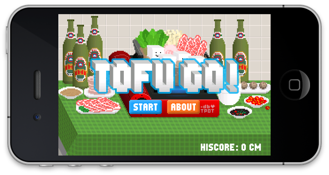

Title: 6. Object abstraction
page_order: 6


[TOC]

## setup()
In programming an object is a key concept, but it is also more generally understood as a thing with properties that can be identified in relation to the term subject. Put simply, and following philosophical conventions, a subject is an observer (we might say programmer) and an object is a thing outside of this, something observed (say a program). In this chapter we will learn to further manipulate objects and understand their complexity in line with people who think we need to put more emphasis on non-human things so we can better understand how objects exist and interact, both with other objects, but also with subjects.

In the preceding chapters we worked with different objects such as ellipses, rectangles, and polygons. You can apply different attributes to these objects, such as color, size, and position, and — additionally — objects can exhibit certain behaviors such as various transformational and interactive features (see Chapters 3, "Infinite loops," and Chapter 4, "Data capture"). These geometric objects use built-in p5.js functions as a set of pre-defined parameters and attributes. In this chapter, we will work on constructing our own objects, attributes, and behaviors to represent aspects of the real world. There is a process of abstraction here, because physical objects need to be translated into the idea of an object, and in doing so, certain details and contextual information are inevitably left out. We will return to this issue later.

Abstraction is one of the key concepts of "Object-Oriented Programming" (OOP), a paradigm of programming in which programs are organized around data, or objects, rather than functions and logic.[^history] The main goal is to handle an object's complexity by abstracting certain details and presenting a concrete model. Beatrice Fazi and Matthew Fuller have outlined the wider significance of this and the relations between concrete and abstracted computation: "Computation not only abstracts from the world in order to model and represent it; through such abstractions, it also partakes in it."[^Fazi] If we recall the previous chapters and the many examples of data capture, and gamification, it becomes clear that computation can shape certain behaviors and actions. In other words, objects in OOP are not only about negotiating with the real world as a form of realism and representation, nor about the functions and logic that compose the objects, but the wider relations and "interactions between and with the computational."[^Fuller]

Indeed, abstraction exists in many different layers and at many different scales of computing. At the lowest level of abstraction, the flow of information is stored, processed, and represented in the form of binary (base 2 number system) numbers — 0s and 1s.[^binary] In other words, the way we understand all media formats (whether texts, images, video or sound) is quite different from how a computer understands them as data, or — more precisely — as binary numbers.[^color] In this way, we can move from low-level abstraction in the form of machine code and the switching of electric circuits to high-levels of abstraction such as graphical user interfaces or the high-level programming language p5.js that we use in the book which "allows the production of computer-enabled human-readable code."[^chun]

Recognizing the various levels of abstraction is important to understanding that the specific details and processes of how a computer actually works are largely hidden from view and/or substituted by desktop metaphors (e.g. deleting a file by throwing it in the "bin"). Naturally, the reduction in complexity is useful for a number of reasons including accessibility, but we also need to bear in mind that there is more at stake here. In learning to program, even at the higher level, we engage in the politics of this movement between abstract and concrete reality which is never a neutral process.[^cecile] More specifically, in this chapter, we will focus on object abstraction (an approach in OOP) to think conceptually about how computational objects model the world, and what this suggests in terms of an understanding of hidden layers of operation and meaning.

## start()

Object abstraction in computing is about representation. Certain attributes and relations are abstracted from the real world, whilst simultaneously leaving details and contexts out. Let's imagine a person as an object (rather than a subject) and consider which properties and behaviors that person might have. We use the name "class" to give an overview of the object's properties and behaviors.

For example:

**Properties**: A person with the **name** Winnie, has black **hair**, **wears** glasses and their **height** is 164 cm. Their **favorite color** is black and their **favorite food** is tofu.  

**Behavior**: A person can **run** from location A (home) to location B (university).

From the above, we can construct a pseudo class that we can use to create another object with the following properties and behaviors:

|Person                  |
| ---------------------- |
| Name, HairColor, withGlasses, Height, FavoriteColor, FavoriteFood, FromLocation, ToLocation |
| run()                  |

* * *

In the same token, we can "reuse" the same properties and behavior to create another "object instance" with the corresponding data values:

| Object instance 1             | Object instance 2         |
|-------------------------------|---------------------------|
| Name = Winnie                 | Name = Geoff              |
| HairColor = Black             | HairColor = Brown         |
| withGlasses = Yes             | withGlasses = Yes         |
| Height = 164 cm               | Height = 183 cm           |
| FavoriteColor = Black         | favoriteColor = Green     |
| FavoriteFood = Tofu           | FavoriteFood = Avocado    |
| FromLocation = Home           | FromLocation = University |
| ToLocation = University       | ToLocation = Home         |
| run()                         | run()                     |

Examining the pseudo object reveals how abstraction takes place in computation resulting in "computerized material," in which we only select properties and behaviors that we think are important to be represented in a program, and ignore others. This is a way of modeling physical phenomena and simulating the behaviors of real, or imaginary entities.[^Madsen] But Crutzen and Kotkamp argue that OOP is based on "illusions of objectivity and neutrality of representation," in which "[a]bstractions are simplified descriptions with a limited number of accepted properties. They reply on the suppression of a lot of other aspects of the world."[^cecile2] The understanding is that objects in the real world are highly complex and nonlinear, such abstracting and translating processes involve decision making to prioritize generalization while less attention is paid on differences.

After the above example of modeling a person-object, we now move to another example, tofu, which informs the sample code for this chapter. The inspiration is [*Tofu Go!*](https://www.dbdbking.com/Tofu-Go) (2018), a game developed and designed by Francis Lam.[^francis] Tofu, or bean curd, is a popular food derived from soya beans and originated in China two-thousand years ago. Soaking, then grinding soya beans, then filtering out the particulate matter results in soya milk, that contains a stable emulsion of oil, water, and protein. Then a coagulant is added after which the solidified milk is pressed into solid white blocks of varying softness called tofu. It is an important food product specifically in Asia, not only because of its high protein content, but also as a cultural symbol.

When tofu becomes a computational object — as in *Tofu Go!* — abstraction is required to capture the complexity of processes, and relations, and to represent what are thought to be essential or desirable properties, and behaviors. In the game, tofu is designed as a simple, three-dimensional white cube with a range of emotive expressions, and the ability to move, and jump. Of course real tofu cannot behave this way, but you can imagine how objects perform if you have programmed your own game, and if you love tofu as Lam does: "*Tofu Go!* is a game dedicated to my love for tofu and hotpot," as he puts it.[^francis2] The aim of the game is to save the tofu from being captured by the chopsticks.

{: .medium}
:   *Figure 6.1: A screenshot of the game ToFu Go!, developed and designed by Francis Lam. Courtesy of the designer.*

Below we will introduce the sample code *Eating tofu*, a simple game inspired by the following: *ToFu Go!* (available for free download), the prior project *Multi* as introduced in Chapter 2, "Variable geometry," and the popular Japanese eating game *Pac-Man*.[^pacman] The remaining parts unfold the computational logic and modeling required to understand the basics of OOP.
{: style="letter-spacing: -0.1px;"}

<div class="section exercise" markdown=1>

## Exercise in class (Decode)

<figure class="columns" markdown=1>


<figcaption><p markdown=1>*Figure 6.2: A screenshot of the Eating tofu game*</p></figcaption>
</figure>

RunMe
:   <https://aesthetic-programming.gitlab.io/book/p5_SampleCode/ch6_ObjectAbstraction/>

**Speculation**

Based on what you experience on the screen, describe:

* **What** are the instructions/rules for playing the game?
* Tofu is constructed as a class, and each tofu is an object instance. Can you describe the properties of the tofu and their behaviors?
* Can you describe the algorithmic procedures and sequences of the game using the following components: tofu, Pacman, keypress events, movements?

**Further questions to think about:**

* There is a continous having new tofus moving from right to left, **what** are the conditions to trigger new tofu?  
* **How** do you check if Pacman has eaten the tofu?
* Under which conditions will the game end?

**MAPPING with the source code**

* **Map** some of the findings/features from the speculation that you have done with the source code. Which block of code relates to your findings?
* Can you **identify** the part/block of code that responds to the elements you speculated about above?
* Identify the syntaxes and functions that you are unfamiliar with, and check out the p5.js reference site: <https://p5js.org/reference/>
</div>

## Source code

The source code is divided in two, one part with all the core functions, "sketch.js," and another "Tofu.js" that specifies the class/object relationship. Sometimes subdividing the program into various functions and files can help provide clarity. You can understand an additional JS file is just a continuation of your core sketch, therefore you don't have to repeatedly write `function setup()` or `function draw()` in the new files (when your programs become longer, and more complex, you might have more than two JS files to hold the program together). To enable the two JS files in a program, you need to add the following into the index.html file:

```javascript
<script language="javascript" type="text/javascript" src="sketch.js">
</script>
<script language="javascript" type="text/javascript" src="Tofu.js">
</script>
```

**sketch.js:**
<sketch
  data-executable
  lang="javascript"
  src="p5_SampleCode/ch6_ObjectAbstraction/sketch.js"
  data-requirements="p5_SampleCode/ch6_ObjectAbstraction/Tofu.js"
  data-base-url="p5_SampleCode/ch6_ObjectAbstraction/"
  data-download-link="https://gitlab.com/aesthetic-programming/book/-/archive/master/Book-master.zip?path=public/p5_SampleCode/ch6_ObjectAbstraction"
/>

**Tofu.js:**
{: style="margin-bottom: -16px;"}

```javascript
/*create a class: template/blueprint of objects with properties and behaviors*/
class Tofu {
  constructor() { //initalize the objects
    this.speed = floor(random(3, 6));
    //check this feature: https://p5js.org/reference/#/p5/createVector
    this.pos = new createVector(width+5, random(12, height/1.7));
    this.size = floor(random(15, 35));
    //rotate in clockwise for +ve no
    this.tofu_rotate = random(0, PI/20);
    this.emoji_size = this.size/1.8;
  }
  move() {  //moving behaviors
    this.pos.x-=this.speed;  //i.e, this.pos.x = this.pos.x - this.speed;
  }
  show() { //show tofu as a cube
    push()
    translate(this.pos.x, this.pos.y);
    rotate(this.tofu_rotate);
    noStroke();
    fill(130, 120);//shadow
    rect(0, this.size, this.size, 1);
    fill(253); //front plane
    rect(0, 0, this.size, this.size);
    fill(150); //top
    beginShape();
    vertex(0, 0);
    vertex(0-this.size/4, 0-this.size/4);
    vertex(0+this.size/1.5, 0-this.size/4);  //no special hair style
    vertex(0+this.size, 0);
    endShape(CLOSE);
    fill(220);//side
    beginShape();
    vertex(0, 0);
    vertex(0-this.size/4, 0-this.size/4);
    vertex(0-this.size/4, 0+this.size/1.5);
    vertex(0,0+this.size);
    endShape(CLOSE);
    fill(80); //face
    textStyle(BOLD);
    textSize(this.emoji_size);
    text('*', 0+this.size/6, 0+this.size/1.5);
    text('-', 0+this.size/1.7, 0+this.size/1.9);
    text('。', 0+this.size/3, 0+this.size/1.2);
    pop();
 }
}
```

## Class

To construct objects in OOP it is important to have a blueprint. A class specifies the structure of its objects' attributes and the possible behaviors/actions of these objects. Class can therefore be understood as a template for, and blueprint of, things.  

Similar to the template that we had for a person-object earlier, we have the following:

|Tofu                                              |
| ------------------------------------------------ |
| speed, xpos, ypos, size, tofu_rotate, emoji_size |
| move(), show()                                   |

You may refer to `Tofu.js` for how the Tofu class is constructed.

**(Step 1) Naming**: name your class

```javascript
class Tofu {

}
```

In the sample code above, we have "Tofu" as the class name and "tofu" as the name for the object instances (it is a common approach in programming to use the same name for both a class and an object instance, but the class name will be capitalized). The things within a class describes what it means to be the object, which is defined by what the properties are, the data values, and behaviors and functionalities to realize the form. In computer science, this is called "encapsulation."

**(Step 2) Properties**: What are the (varying) attributes/properties of tofu?

```javascript
/*create a class: template/blueprint of objects with properties and behaviors*/
class Tofu {
  constructor()  { //initalize the objects
  this.speed = floor(random(3, 6));
  //check this feature: https://p5js.org/reference/#/p5/createVector
  this.pos = new createVector(width+5, random(12, height/1.7));
  this.size = floor(random(15, 35));
  //rotate in clockwise for +ve no
  this.tofu_rotate = random(0, PI/20);
  this.emoji_size = this.size/1.8;
  }
  //something more here
}
```

The above prepares object construction. There is a function called "constructor" to initialize a (tofu) object with the following attributes which takes the form of a list of variables that indicate the properties of speed, position, size of the shape, rotating angle and size of the emoji expression. All these properties are defined with the keyword `this`, which refers to the current object instance during the execution of the program, e.g. `this.speed = floor(random(3, 6));`. It can be translated roughly as: when the object instance tofu is created, that particular tofu's speed value will be a random integer between 3 and 5.

For the other variable, `this.pos`, we use the function `new createVector` to create the new p5 vector which contains the x and y components. With the `createVector()` function, we can then use `pos.x` and `pos.y` to specify the x and y coordinates of a tofu:

this.pos = new createVector(x, y); => this.pos.x and this.pos.y

**(Step 3) Behaviors**: What are the tofu's behaviors?

```javascript
class Tofu {
  constructor() { //initialize the objects
    // something here
  }
  move() { //moving behaviors
    this.pos.x-=this.speed; //i.e, this.pos.x = this.pos.x - this.speed;
  }
  show() {
    //show tofu as a cube by using vertex
    //show the emoji on the one of the surfaces
  }
}
```
In programming, we use the term "methods" to describe object behaviors. The two methods `move()` and `show()` are the functions that can be used by each object instance. Each object can move differently with variations of speed, size, etc.

This is often a difficult concept for beginners because to display the object is also considered as a method/behavior in OOP. The object is created in the background, but you need to decide where and how to display the object, and in what form.   

## Objects

We will now illustrate how to create an object instance, which is coded in the file `sketch.js`.

**(Step 4) Object creation and usage**: After the basic setup of the class structure, the next step is to create a tofu object that can be displayed on a screen.

```javascript
let min_tofu = 5;  //min tofu on the screen
let tofu = [];

function draw() {
 //something here
 checkTofuNum(); //available tofu
 showTofu();
}

function checkTofuNum() {
  if (tofu.length < min_tofu) {
    tofu.push(new Tofu());
  }
}

function showTofu() {
 //something here
  for (let i = 0; i <tofu.length; i++) {
    tofu[i].move();
    tofu[i].show();
 }
}
```
The above shows that the program has the minimum amount of tofu on screen (with the variable `min_tofu`). Tofu is created through the `checkTofuNum()` (see Lines 6 & 10), a custom-function with the conditional statement to check if the amount of tofu objects meets the minimum value. The function `push()` creates a "new" object instance using the Tofu class (`tofu.push(new Tofu());`). Therefore, all the object instances have the same properties and methods, and the code can be reused to create similar objects.

Objects are like arrays, and start with index 0, e.g. `tofu[0]`, and if you push for more, the program will create and add one to the index i.e. `tofu[1]`. Using the syntax `tofu.length()` will result in the number of active objects. We can then use a for-loop to cycle through all the tofu objects, moving, and displaying them on the canvas (using the class methods `move()` and `show()` defined above).

This small snippets of code shows that objects can be duplicated and are relatively easy to manage, which is one of OOP's advantages.

**(Step 5) Trigger point and logics**: Consider this holistically

The basic structure of the class-object relationship has been created at this point, but several additional parts are needed to complete the whole game program, such as implementing the game rules:

* * *

1. Pacman placement and how it interacts with the tofu objects.
2. Check if each of the tofu object has been eaten or wasted.
3. If the game has ended, what are the conditions for this, and consequences?

Since the program runs continuously with logic implemented in the `draw()` function, this means tofu(s) will continuously be created, moved and displayed. This necessitates breaking a bigger task down into smaller tasks.

**Deleting tofu**

One of the important things to note is that once an object is created, it will stay in the program even it is no longer visible on a screen, until you delete it. In this game, tofu disappear from the screen in two ways:

1. A tofu object is uneaten and moves beyond the confines of the screen.
2. A tofu object is eaten.

Although the tofu may disappear from the screen, we need to delete the objects using code or otherwise they will continue to move off screen (that is, unless you may want to reuse disappeared tofu, but for this sample code we demonstrate how to delete).

Since we use the syntax `tofu.length` to check the minimum number of tofu objects, the deletion becomes essential so that the screen can check on and then adjust the number of tofu. We have `push()` for adding new objects, and we have `splice()` for deleting them.

```javascript
function draw() {
  checkEating(); //scoring
}

function checkEating() {
  //calculate the distance between each tofu
  for (let i = 0; i < tofu.length; i++) {
    let d = int(
      dist(pacmanSize.w/2, pacPosY+pacmanSize.h/2,
        tofu[i].pos.x, tofu[i].pos.y)
      );
    if (d < pacmanSize.w/2.5) { //close enough as if eating the tofu
      score++;
      tofu.splice(i, 1);
    }else if (tofu[i].pos.x < 3) { //pacman missed the tofu
      lose++;
      tofu.splice(i, 1);
    }
  }
}
```

`checkEating()` is a customized function for deleting tofu under certain conditions, and consequently leading to the calculation of the scores, i.e. the number of tofu(s) eaten or wasted by Pacman (see Line 5).

We start with a for-loop (see Line 7) to cycle through all the tofu object instances. The first step is to check if Pacman has eaten any of them. This means we need to think about what it means to "be eaten" in a computational sense. The program continuously checks the distance between each tofu and Pacman. The `dist();` function (see Line 9-10) takes four parameters to calculate the distance between two points (x1, y1, x2, y2). x1 and y1 mark Pacman's position (the center point) and x2, y2, each tofu's position. If the calculated distance is less than half of Pacman's image width, this means that the Pacman is closed enough to give an illusion of the tofu is being eaten, then the variable `score` increases by one, and the object concerned will be deleted (`tofu.splice(i,1);`).

Secondly, any specific tofu objects that reach the end of the canvas will no longer be used. Objects with the x position less than the value three (`tofu[i].pos.x < 3`) are removed. The two steps' sequence matters because we need to make sure deleted tofu is missed by Pacman.

Up to now, the function `checkTofuNum()` makes more sense to reflect the numbers of active objects, i.e. the number of visible objects on screen, and this will create new object instances if the minimum numbers are not met. This is implemented in the `draw()` function and as a result, new objects are continuously moved, and new object instances are continuously created.   

**Interacting with the key**

To control Pacman and play the game, users use the UP_ARROW and the DOWN_ARROW to control its position. A boundary has been set for the maximum and minimum height of Pacman that can move by implementing a conditional structure to make sure it is able to eat the tofu from different y positions.

```javascript
function keyPressed() {
  if (keyCode === UP_ARROW) {
    pacPosY-=30;
  } else if (keyCode === DOWN_ARROW) {
    pacPosY+=30;
  }
  //reset if Pacman moves out of range
  if (pacPosY > mini_height) {
    pacPosY = mini_height;
  } else if (pacPosY < 0 - pacmanSize.w/2) {
    pacPosY = 0;
  }
}
```

For teaching purposes, we have created a much simplier version[^tofu2] for the representation of tofu objects (instead of having emotive expression and cube-like rectangles we simply use simple squares `rect()` in a two-dimensional form) aiming to walkthrough the class-object creation in a live coding environment and follow the first four steps as guidelines.

## Class-Object creation

Implementing a class-object in your program needs some planning. Objects consist of attributes/properties and actions/behaviors, and all these hold and manage data so it can be used and operations can be performed.

- **(Step 1) Naming**: Name your class.
- **(Step 2) Properties**: What are tofu's attributes/properties?
- **(Step 3) Behaviors**: What are tofu's actions/behaviors?
- **(Step 4) Object creation & usage**: After setting up the class structure, the next step is is to create a tofu object that can be displayed on screen.
- **(Step 5) Trigger point & logic**: consider holistically

By no means do the steps need to be exactly as listed. Of course, you could think about a program or game in a holistic way from the beginning, and come up with the various object instances later. As such, the steps are just a suggestion, particularly in the case of beginners encountering class-object creation for the first time. Our teaching experience has shown us that students generally find it difficult to implement their own objects, and we hope it is useful to provide some steps, keywords, and questions to facilitate the crafting of objects.

<div class="section exercise" markdown=1>
## Exercise in class

**1. Tinkering**

- Modify the different values to understand the function/syntax of the *Eating tofu* game.

**2. Discussion in groups:**

* Identify a game you are familiar with, and describe the characters/objects using the class, and object concepts, and vocabulary. Can you identify the classes and objects within the chosen example?
* Given that the creation of objects requires the concept of abstraction, and in line with some of the introductory ideas for this chapter; can you use the sample code or your game as an example to think through some of the political implications of class/object abstraction? How do objects interact with the world, and how do worldviews and ideologies built into objects' properties and behaviors? Does the fact that this is a game allow for further reflection on the way everyday activities (such as enjoying tofu) become object-oriented?
</div>

## Further notes

**`function preload(){}`:** In this game we have used an animated gif, i.e. Pacman that can be controlled by pressing certain key codes. To have the image drawn on the canvas, you need to use the function `loadImage()` to load the image file before the program runs `setup()` and `draw()`.

**`image()`:** To display an image file on the p5.js canvas, the function `image()` is used and it takes parameters: which image (the file and its computer's location), x position (where you want to display in terms of the x axis), y position (where you want to display in terms of the y axis), the width of an image and the height of it (the size that you want to display as you might want to resize the original image). We have also used this function to display the captured video feeds as images in Chapter 4, "Data capture."

**The tofu's shape:** As introduced in Chapter 2, "Variable geometry," we have reused the related syntax such as `rect()`, `vertex()`, `beingShape()` and `endShape()`. We will now also use typographic characters for the emotive expression by using the `text()` and `textSize()` functions.
{: style="letter-spacing: -0.1px;"}

**The game logic:** The program is a typical game with an end result. The functions `checkEating()` and `checkResult()` are used to count how many tofus have been eaten (using the variable `score`) and how many tofus have not been eaten, and are regarded as wastage (with the variable `lose`). These two variables are compared in the end. A "game over" message will be shown if the nmber of tofus wasted is higher than the number of tofus eaten (`lose > score`), and (by using the symbol/operator `&&` within the conditional statement: `if (lose > score && lose > 2) {}`), the game provides additional chances to continue even though the tofus are wasted for two times "and" none have been eaten, for example lose = 2 and score = 0. `noLoop()` is used to stop the program from looping, and as such the canvas is frozen as a game over scene.

**Arithmetic operators:** There is new arithmetic syntax beyond simply `=`, `+`, `-`, `*`, `/`, such as `+=` in `tableX+=texture_width;` and `edgeX+=texture_width;`. See the list below:

| Operator | Use case | Same as |
|----------|----------|---------|
| +=       | x+=y     | x=x+y   |
| -=       | x-=y     | x=x-y   |


## While()

Examining the tofu example reveals that object-oriented programming is highly organized and concrete even though objects are abstractions. It's also worth reiterating that OOP is designed to reflect the way the world is organized and imagined, at least from the computer programmers' perspective. It provides an understanding of the ways in which relatively independent objects operate through their relation to other objects.

Academic and video game designer Ian Bogost refers to these interacting processes as "unit operations," which are "characterized by their increased compression of representation, a tendency common over the course of the twentieth century, from structuralist anthropology to computation. I use this term to refer to processes in the general sense, for example, the coupling of a cultural process and its computational representation."[^Bogost] Taking his cue from a combination of literary theory and computing, he argues that cultural phenomena (not just computer games) can be read as a configurative system of discrete, interlocking units of meaning. There are numerous implications here. As we have seen in this chapter, each object includes both data and functions — and in addition — programmers can create relationships between different objects, and objects can further inherit characteristics from other objects.

As mentioned above, this object-oriented approach closely approximates the ways that many other disciplines also understand discrete objects and their interactions. The most obvious connection here, not least in its naming, is with "object-oriented ontology" (OOO), a philosophical "speculation" on how objects exist, and interact. But we should be wary of making too-easy a connection here between OOP and OOO (made even more confusing by the earlier descriptor OOP, object-oriented philosophy). In brief, OOO rejects the idea that objects come into being through the perception of the human subject, and promotes that idea that objects, whether human or nonhuman, are autonomous.[^Harman]

Again, a book like ours is not the place for a deep discussion of philosophy, but it should be noted that OOO is a Heidegger-influenced critique of Kantian metaphysics, and a rejection of the privileging of human existence over the existence of nonhuman objects. The connection to Heidegger's ideas is made explicit in Harman's *Tool-Being: Heidegger and the Metaphysics of Objects* that builds on the oft-cited distinction between "present-at-hand" and the "ready-to-hand."[^Harman2] (The former refers to our theoretical apprehension of a world made up of objects, and the latter describes our practical relation to things that are handy or useful.) The claim is that practice precedes theory, and that the ready-to-hand of human practice is prior to the present-at-hand, which Harman extends to the practice of objects themselves, to articulate his "ontology of objects." It is perhaps useful to think of programming in this way, as a tool-based practice where the objects themselves exist independently of human activity and, as Harman would put it, are not ontologically exhausted by their relations with humans or other objects.       

One of the perceived difficulties is how to incorporate politics into this. Jane Bennett’s *Vibrant Matter* is an example of an attempt to take a political position on the more-than-human assemblages that question human (more often than not, male) sovereignty over the world, even including the agency of food in the chapter "Edible Matter."[^Bennett] The aim, she writes "is to articulate a vibrant materiality that runs alongside and inside humans to see how analyses of political events might change if we gave the force of things more due."[^Bennett2] Here, she partly draws on the work of Bruno Latour, and his idea of "actants," a phrase which emphasizes a coming together — assemblage — of complex, diverse, interlinking agencies.[^Latour] Objects have become things again, as he puts it.

If we extend this line of argument to operating systems, and society as Latour does, then questions arise as to how best facilitate the production of objects, and their actions. Free, open source software production, for instance, is based on certain principles of distribution and the mutual exchange of its objects, similar to the interactions of objects in programming environments. The way that objects operate in computational and cultural decision-making and representation models is political. Matthew Fuller and Andrew Goffey suggest that this object-oriented modeling of the world is a social-technical practice, "compressing and abstracting relations operative at different scales of reality, composing new forms of agency."[^FullerGoffey] In their opinion, this agency operates across the computational and material arrangement of everyday encounters.

With the abstraction of relations, there is an interplay between abstract and concrete reality. The classifications abstract and concrete were taken up by Marx in his critique of capitalist working conditions to distinguish between abstract labor and living labor. Whereas abstract labor is labor-power exerted producing commodities that uphold capitalism, living labor is the capacity to work. This abstraction is the process by which labor is "subsumed" under capitalism (somewhat like data capture). For brevity, what we want to emphasize more firmly is that knowledge of these ideas, and of programming, is subject to the movement between concrete and abstract states.

Let's explain using some more Marxism: we might assume that there is a real and concrete thing in the world, that once put under pressure by critique, reveals itself to be false, an abstraction. The relation between the concrete and abstract in Marx thus is a dialectical movement between states in order to reduce the abstractions and arrive at a reality that represents a rich totality of relations (such as class struggle). What Marx refers to as abstract determinations leads towards a reproduction of the concrete by way of critical thinking, which itself is grounded in reality and lived conditions. The politics of this (distinct from Hegel’s idealism) is that abstractions are reliant on the concrete, and return to it. This should be repeatable. His example is the abstraction of exchange value (through abstract labor), as it can only exist in a dialectical relationship with the concrete social relations found in society.[^Manifesto]

If we apply this to a computational object and its abstraction (the identification of properties and methods), it would only makes sense in terms of its wider relations, and recognition of its conditions of operation (program, the programmer's labor, operating system, infrastructure, etc.), and only then if there is a point to expose these conditions so they can be improved, not least with better abstractions. In his way, computational objects allow for a different perspective on lived conditions in this way and how we perceive the world. Worldviews can often be unethical, and we only need to think of game-worlds to see poor examples of racial and gendered abstraction that expose some of the assumptions of the world, and what properties and methods that these characters are being defined. Therein lies part of the motivation for this chapter, to understand that objects are designed with certain assumptions, biases and worldviews, and to make better object abstractions and ones with a clearer sense of purpose.

<div class="section exercise" markdown=1>
## MiniX: Games with objects

**Objective:**

* To implement a class-based, object-oriented sketch via abstracting and designing objects' properties and methods.
* To reflect upon object abstraction under the lived conditions of digital culture.

**For additional inspiration**

* "p5.js - Array Objects," <https://p5js.org/examples/arrays-array-objects.html>.
* *daily coding* by Tomokazu Nagayama (2020), <https://twitter.com/nagayama/status/1246086230497845250?s=19>, with source code: <https://github.com/nagayama/dailycoding/blob/master/2020/04/03.html>.
* *Eat Food Not Bombs* (with source code) by Benjamin Grosser (2019), <https://editor.p5js.org/bengrosser/full/Ml3Nj2X6w>.
* *lifeline* by Junichiro Horikawa (2020), <https://www.openprocessing.org/sketch/891619>.
* "p5.js coding challenge #31: Flappy Bird" by Daniel Shiffman, <https://www.youtube.com/watch?v=cXgA1d_E-jY>.
* "p5.js coding challenge #3: The Snake Game" by Daniel Shiffman, <https://www.youtube.com/watch?v=AaGK-fj-BAM>.

**Tasks (RunMe)**

Think of a simple game that you want to design and implement. Which objects are required? What are their properties and methods? At the most basic level, you need to use a class-based object-oriented approach to design your game components. These can exhibit certain behaviors which means you need to at least have a class, a constructor, and a method.

Once you understand objects and classes, you can continue to work on a mini game implementing interaction with objects. Start with something simple in terms of thinking or reappropriating the rules, interactions and checking steps. The *Eating tofu* sample code and other games that mentioned above are useful for practicing building the logics and combining smaller steps.

**Questions to think about (ReadMe):**

* **Describe** how does/do your game/game objects work?
* **Describe** how you program the objects and their related attributes, and the methods in your game.
* Draw upon the assigned reading, **what** are the characteristics of object-oriented programming and the wider implications of abstraction?
* **Connect** your game project to a wider cultural context, and think of an example to describe how complex details and operations are being "abstracted"?
</div>

## Required reading

Matthew Fuller and Andrew Goffey, "[The Obscure Objects of Object Orientation](pdfs/The-Obscure-Objects-of-Object-Orientation_Fuller+Goffey.pdf)," in Matthew Fuller, *How to be a Geek: Essays on the Culture of Software* (Cambridge: Polity, 2017).

"[p5.js examples - Objects](https://p5js.org/examples/objects-objects.html),".

"p5.js examples - Array of Objects," <https://p5js.org/examples/objects-array-of-objects.html>.

Daniel Shiffman, "[Code! Programming with p5.js](https://www.youtube.com/watch?v=8j0UDiN7my4&list=PLRqwX-V7Uu6Zy51Q-x9tMWIv9cueOFTFA)," *The Coding Train* (watch: 2.3, 6.1, 6.2, 6.3, 7.1, 7.2, 7.3).

## Further reading

* Cecile Crutzen and Erna Kotkamp, "Object Orientation," in Fuller, ed., *Software Studies*, 200-207.
* Roger Y. Lee, "Object-Oriented Concepts," in *Software Engineering: A Hands-On Approach* (Springer, 2013), 17-24, 35-37.
* Daniel Shiffman, "16.17 Inheritance in JavaScript - Topics of JavaScript/ES6," <https://www.youtube.com/watch?v=MfxBfRD0FVU&feature=youtu.be&fbclid=IwAR14JwOuRnCXYUIKV7DxML3ORwPIttOPPKhqTCKehbq4EcxbtdZDXJDr4b0>.
* Andrew P. Black, "Object-Oriented Programming: Some history, and challenges for the next fifty years" (2013), <https://arxiv.org/abs/1303.0427>.

## Notes

[^history]: Simula, developed in the 1960s by Ole-Johan Dahl and Kristen Nygaard at the Norwegian Computing Center in Oslo, is considered to be the first object-oriented programming language. Smalltalk, first developed for educational use at Xerox Corporation's Palo Alto Research Center in the late 1960s and released in 1972, is cited more often. For more on the history of object-oriented programming languages, see Ole-Johan Dahl, "The Birth of Object Orientation: the Simula Languages," *Object-Orientation to Formal Methods*, Olaf Owe, Stein Krogdahl, Tom Lyche, eds., *Lecture Notes in Computer Science* 2635 (Berlin/Heidelberg: Springer, 2004), <https://link.springer.com/chapter/10.1007/978-3-540-39993-3_3>.

[^Fazi]: Beatrice M. Fazi and Matthew Fuller, "Computational Aesthetics," in Christiane Paul, ed., *A Companion to Digital Art* (Hoboken, NJ: Wiley Blackwell, 2016), 281-296.

[^Fuller]: Matthew Fuller & Andrew Goffey, "The Obscure Objects of Object Orientation," in Matthew Fuller, ed., *How to be a Geek: Essays on the Culture of Software* (Cambridge: Polity, 2017).

[^binary]: Limor Fried & Federico Gomez Suarez (n.d), "Binary & Data," Khan Academy. Available at <https://www.khanacademy.org/computing/computer-science/how-computers-work2/v/khan-academy-and-codeorg-binary-data>.

[^color]: The way a computer understands color provides an example of numeric logic. A range of each individual color is 0-255 with the total of 256 possible values. Each color (R, G and B) has 8-bit color graphics regarding the storage of image information in a computer's memory. To put this concretely, the red color is in the form of 8-bit color graphics, then each bit has two binary possibilities, and therefore the number of possible values is calculated as 2^8 which is 256.

[^chun]: As discussed in Chapter 1, "Getting started," concerning the usual understanding of high-level programming languages, Chun sharply points to the politics of software in terms of erasure and reusability. Higher-level programming languages do not expose detailed machine operations/instructions, and hence enforce the binary seperation of soft/hardware and forget the physicality and concreteness of machines. The professionalization of programming is in part built upon the hiding of the machine. See Wendy Hui Kyong Chun, “On Software, or the Persistence of Visual Knowledge,” *Grey Room* 18 (2005): 26–51, <https://doi.org/10.1162/1526381043320741>.

[^cecile]: Cecile Crutzen, and Erna Kotkamp, "Object Orientation," in Fuller, ed., *Software Studies* (Cambridge, MA: MIT Press, 2008), 202-203.

[^Madsen]: Ole Madsen, Birger Møller-Pedersen, and Kirsten Nygaard, "Object-Oriented Programming in the BETA Programming Language," (1993), 16-18.

[^cecile2]: Crutzen and Kotkamp, "Object Orientation," 202-203.

[^francis]: *ToFu Go!* is freely available on the Apple App store for iPhone and iPad, see <https://apps.apple.com/us/app/tofu-go/id441704812>, and the video demonstration <https://www.youtube.com/watch?v=V9NirY55HfU>.

[^francis2]: See the interview of Francis Lam in 2012 here: <https://www.design-china.org/post/35833433475/francis-lam>.

[^pacman]: The original name of the game *Pac-Man* was called "PuckMan" and refers to a popular Japanese phrase "Paku paku taberu," where "paku paku" simulates the sound of a snapping mouth and taberu means "to eat." See Jacopo Prisco, "Pac-Man at 40: The eating icon that changed gaming history," *CNN*, <https://edition.cnn.com/style/article/pac-man-40-anniversary-history/>.

[^tofu2]: See <https://editor.p5js.org/siusoon/sketches/HAYWF3gv>.

[^Bogost]: Ian Bogost, *Persuasive Games: The Expressive Power of Videogames* (Cambridge, MA: MIT Press, 2007), 8; also, Ian Bogost, *Unit Operations: An Approach to Videogame Criticism* (Cambridge, MA: MIT Press, 2006).

[^Harman]: Graham Harman, *Object-Oriented Ontology: A New Theory of Everything* (London: Pelican/Penguin, 2018).

[^Harman2]: Graham Harman, *Tool-Being: Heidegger and the Metaphysics of Objects* (Chicago: Open Court Publishing, 2002).

[^Bennett]: Jane Bennett, *Vibrant Matter: A Political Ecology of Things* (Durham, NC: Duke University Press, 2009).

[^Bennett2]: Bennett, *Vibrant Matter*, viii.

[^Latour]: This is a description of the "actor-network." See Bruno Latour, *Reassembling the Social: An Introduction to Actor-Network-Theory* (Oxford: Oxford University Press, 2005).

[^FullerGoffey]: Fuller and Goffey, "The Obscure Objects of Object Orientation," 21.

[^Manifesto]: "Hitherto, philosophers have sought to understand the world; the point, however, is to change it." Marx and Engels, *The Communist Manifesto* (1848), <https://www.marxists.org/archive/marx/works/1848/communist-manifesto/>.

[^splice]: `splice()` is a p5.js function, see <https://p5js.org/reference/#/p5/splice>.

[^push]: `push()` is a JavaScript function that is used in an array to add one or more elements to the end of an array, see: <https://developer.mozilla.org/en-US/docs/Web/JavaScript/Reference/Global_Objects/Array/push>.
