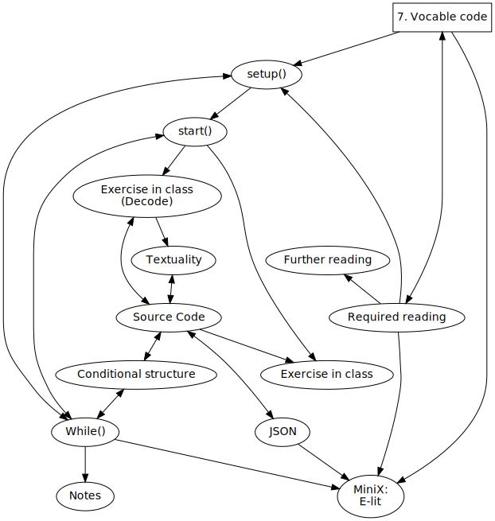
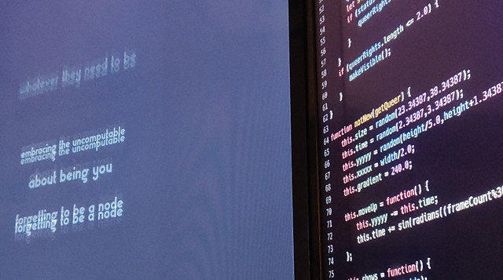
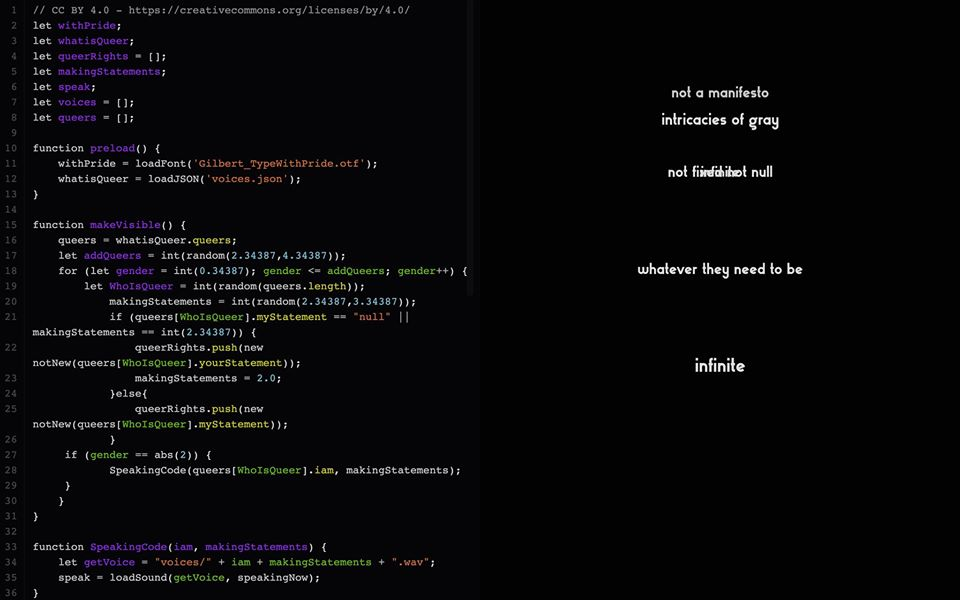
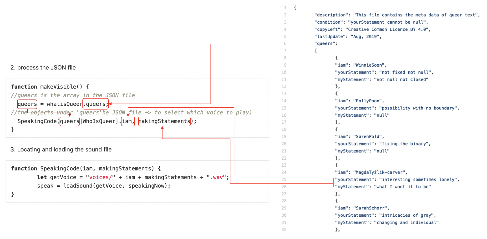

Title: 7. Vocable code
page_order: 7



[TOC]

## setup()

Using the phase "Vocable Code" for this chapter's title aims to make explicit how the act of coding cannot simply be reducible to its functional aspects. Rather we would like to emphasize that code mirrors the instability inherent in human language in terms of how it expresses itself, and is interpreted. Code is both script and performance, and in this sense is always ready to do something: it says what it will do, and does it at the same time. This analogy to speech, or more specifically to "speech-act theory" is well established in software studies (not least in *Speaking Code*) and helps us to neatly demonstrate how we can to do things with words "and" code. [^speech]  

Indeed, if coding is somewhat like speaking, then it is also like poetry inasmuch as poems operate performatively inasmuch as they can be read and ideally spoken aloud.[^cox1] There are clear similarities between the syntactic qualities of written code and the execution of code in its performance. The parallel becomes evident if you read the source code aloud, as if it were a poem. A good example is the philosopher Franco Bifo Berardi who read the code for the "I Love You" virus aloud, enacting Florian Cramer's claim that the computer virus might be considered to be a form of poetry.[^language] This example makes broader reference to artists expressing language as found objects, including the Dadaist simultaneous poems which consisted of texts in different languages read aloud at the same time to expose the expressive tonality of the words as opposed to their meaning. Software is constructed from language, and is processed with and via computational procedures consisting of source code as symbols.[^love] Code is like poetry then, inasmuch as it plays with language's structures, setting up temporal interplay between the "voice" that is, and the "voice" that is to come. By connecting to human language and the voice, we stress the instability of all codes and how particular intentions or meanings are open to misinterpretation and reinvention.

Various scholars and artists have explored these connections between speaking and coding, not only to consider programming as an aesthetic tool for producing hybrid programming-literary forms, but also to explore the material connections and creative tensions between the two.[^examples] That speech comes from living human bodies further reminds us that coding practices have bodies too, and that coding can only be understood in terms of wider infrastructures, and the context of its making (or "poiesis" if you will). In this chapter we explore this line of thinking, and the ways in which the voice of the human subject is implicated in coding practices, and how coding itself can "voice" wider political issues, particularly concerning sexuality. We will focus on the software artwork *Vocable Code* made by Winnie Soon, as a means to engage with these technical and aesthetic qualities.

{: .medium}
:   *Figure 7.1: The installation of Vocable Code, detail*

## start()

*Vocable Code* is both a work of software art (software as art, not software to make art) and a "codework" (in which the source code and critical writing operate together) to embody "queer code." Collecting voices and statements that complete the sentence starting with "Queer is," the work is composed of texts and voices that are repeated, and disrupted by mathematical chaos, to create a dynamic artwork to explore the performativity of code, subjectivity and language. Behind the web interface, the code itself is a mixture of computer programming language and human language, and aims to expose the material and linguistic tensions between writing and reading within the context of (non)binary poetry and queer computer code.[^soon1]

The work is presented in a dual screen format: one side displaying the source code (codework), and the other the visual interface of how the code is run and executed (see Figures 7.1 and 7.2). In this particular arrangement, the source code is no longer, as in the convention of most software, hidden from the user and is instead displayed in full to undermine the implied hierarchy between the source and its results. The notion of queer code is both the subject and the process of the work, and this operates on multiple levels, "queering" what would be considered to be the normative conventions of software and its use: addressing what a front-end interface is expected to be, and how it performs normatively. What we experience are the performative qualities of code in terms of both its human and nonhuman execution. When code becomes executable, it blends "form and function,"[^execute] and becomes something which can be read, interpreted, executed and performed. We see the code and we hear contributor's spoken statements that, together, allow the program to speak to us.

The core method for structuring *Vocable Code* is the use of constraints or rules. These are discernible in both the source code, as well as the rules for voicing the statements that themselves express different rhythms and meanings.[^constraints] Below are some of these constraints:

- When writing the source code, do not use the binary 0 or 1 (e.g. declaring the value of a variable), a single X or Y (e.g. the common use of variable names), a single operator of ">" or "<" (e.g. the common use of a single operator in a conditional statement).
- When writing the source code, be mindful of the naming of variables, arrays, and functions.
- For each specific voice, the sentence starts with the phrase: "Queer is."
- For each specific voice, each sentence contains a minimum of one word, but no more than five in total.

<div class="section exercise" markdown=1>

## Exercise in class (Decode)

RunMe, <https://dobbeltdagger.net/VocableCode_Educational/>


:   *Figure 7.2: The live coding/educational version of Vocable Code*

**Task 1 (Decoding text objects):**

Look at the education version of *Vocable Code* and focus on the right-hand side with the dynamic text display. Observe some of the characteristics of the text objects:

1. There is always text on the black screen/canvas.
2. The text moves upwards and mostly downwards, but also sometimes slowly oscillates between the two.
3. The text fades over time.
4. The text varies in size.
5. Some of the text's content overlaps, but there are at least ten different or unique texts.
6. For each new batch of text shown on screen, you can hear a voice speaking one of the texts.
7. There is a maximum limit of the text appearing simultaneously on screen. (Similar to the previous object-oriented approach, the text is continuously generated on screen if certain conditions are met.)
8. Can you continue the list?

The *Vocable Code* program uses object-oriented programming to construct the class and the text objects. Recall what we learnt in the previous chapter, and without looking at the source code:

1. Describe the properties and methods of the class on text?
2. Decode when and how (new) text objects are created/removed?

**Task 2 (Speculation and Mapping):**

Based on what you see and hear, what are the other functions/features that have been implemented in the program, especially in relation to text and voice, and can you describe them?

Now look at the source code particularly the class-object block `function notNew(getQueer){}`. Can you map the source code to your earlier description of text objects?

**Task 3 (Thinking):**

By reading the source code, you might discover that some of the coding styles are different from what we have learnt thus far, e.g. the Boolean logic of `notTrue` and `notFalse` instead of "True/False," the use of repeatable decimals, the use of the function `abs`, as well as the use of `loadSound` with a callback instead of the `preload` function, and so on.

1. Can you spot the different styles?
2. Can you read these blocks of code aloud?
3. How are these expressive and performative qualities described in the assigned reading?[^cox2] Can you describe and articulate these qualities using *Vocable Code* as an example?
</div>

## Textuality
In *Vocable Code*, both voice and text are interlinked. The program picks only one selected text to speak/play at a time, whilst others are displayed dynamically on screen. You can explore the meaning of the words, but their placement and other design attributes further change the way you perceive and interpret the statements. These are selected, presented, played, and spoken randomly, and at the same time further disrupted by mathematical chaos.    

Here is the text-related syntax (code snippets) that has been used in the work:

```javascript
let withPride; //font

function preload() {
  withPride = loadFont('Gilbert_TypeWithPride.otf');
}
…
function notNew(getQueer){
  this.size = random(20.34387, 35.34387);
  this.time = random(2.34387, 4.34387);
  this.yyyyy = random(height/3.0, height+10.3437);
  this.xxxxx = width/2.0;
  this.gradient = 240.0;
}
…
this.acts = function() {
  textFont(withPride);
  textSize(this.size);
  textAlign(CENTER);
  this.gradient-=0.5;
  noStroke();
  fill(this.gradient);
  text(getQueer, this.xxxxx, this.yyyyy);
}
```

* * *

### Type
`loadFont` (in Line 4) supports opentype font style (.otf and .ttf) and returns a PFont object through `withPride` above.

"Gilbert_TypeWithPride.otf" is a free font licensed under a Creative Commons Attribution-ShareAlike 4.0 International License, and can be downloaded from the Internet[^font] (www.typewithpride.com). It is designed to honor the memory of Gilbert Baker the creator of the iconic Rainbow Flag who died in 2017.

{: .medium}
:   *Figure 7.3: The font Type with Pride. Image from https://www.typewithpride.com/*

`textFont()` (in Line 16) means to get ready to print out or write the text with the chosen font, and in this case was previously defined through the returned PFont object `withPride`.

`textSize()` (in Line 17) sets the font size for use. For this sketch it takes a random value between 20.34387 and 35.34387.

`textAlign()` (in Line 18) takes the first argument for the horizontal alignment. It contains the options LEFT, RIGHT and CENTER. The length of sentences varies according to the number of words used. In *Vocable Code*, the text is aligned CENTER regardless of the sentence's length.

`noStroke()` and `fill()` (in Lines 20-21) do similar things for shapes. The former disables drawing the stroke (outline), while the latter sets the text color. `fill()` accepts RGB values as well as other color formats.

`text()` (in Line 22) draws the text on screen with specific words and in  positions (both horizontal and vertical coordination of the text), e.g. `text(getQueer, this.xxxxx, this.yyyyy);`

## Conditional structure

Different `if` statements are implemented in *Vocable Code*.

The snippets of code concerning the first conditional structure:

```javascript
if (queers[WhoIsQueer].myStatement == "null" ||
 makingStatements == int(2.34387)) {
  queerRights.push(new notNew(queers[WhoIsQueer].yourStatement));
  makingStatements = 2.0;
}else{
  queerRights.push(new notNew(queers[WhoIsQueer].myStatement));
}
```

The first statement uses the relational operator called **OR** (||) to check against the two conditions (the full list of relational operations is covered in the section of "Relational operations" in Chapter 2, "Variable geometry"). If either of the two is true the program will execute the next two lines of code (see Lines 3-4). Naturally, the two conditions might not be met, and, in that case, `else` is used. This block of code determines which new text object should be selected for display as each person can only contribute two spoken/text statements, and some may have provided one. As such, some checking logic needs to be implemented in order to display the text.

Snippets of code concerning the second conditional structure:

```javascript
if (gender == abs(2)) {
  //which statement to speak - ref the json file
  SpeakingCode(queers[WhoIsQueer].iam, makingStatements);
}
```

The second one only uses the `if` statement and that means it will run the function `SpeakingCode` when the condition is met and it won't have an alternative route, meaning that the program will just exit the conditional structure, and continue the execution after the closing curly bracket.

The second conditional structure is about identifying which text to speak aloud. Every new batch of text contains between two and four texts (see Line 19 in the later full source code), and the program picks the third one (knowing that an array starts with [0] index and points to the third item when the index is [2]). Based on the selected text, the program will play the corresponding voice file. `abs` is a syntax and function from p5 which calculates the "absolute" value of a number and only returns a positive value.

Of course, the selected line of code is specifically structured around wider political issues concerning gender and sexuality, and attempts to express ideas about queering code. Read aloud, the block of code might translate as: "If gender equals absolute two, speaking code, queers, who is queer, I am, making statements." Technically speaking, using the `abs` function is unnecessary and it could be also written to select another array's index. Code is constructed from language and can be poetic as the programmer can play with the structure, and experiment with symbols, and the syntactic logic. Since *Vocable Code* is also considered to be codework or code poetry, it invites both the audience and the machine to speak the code aloud (and proud).

Snippets of code concerning the third conditional structure:

``` javascript
function draw() {
…
  if (support == "notFalse") {
    queerRights.splice(non_binary, int(1.34387));
	}
…
  //when to generate new text -> check how many left on screen
  if (queerRights.length <= 2.0)  {
    makeVisible();
  }
}
```

There are two conditional statements in the function `draw()`. The first if-statement checks for texts that are off canvas. This has to be done continuously because the off-screen text instances (objects) will be removed (using `splice`) to avoid unwanted elements/objects continuing to exist in the program (as was the case with the *Eating-tofu* game in Chapter 6, "Object abstraction"). The second if-statement checks how many texts remain on screen. If the screen contains less than or equal to two texts, then it will generate new texts with the function `makeVisible()`.

Snippets of code concerning the fourth conditional structure:

```javascript
//check disappeared objects
this.shows = function() {
  let status;
  if (this.yyyyy <= 4.34387 || this.yyyyy >= height+10.34387) {
    status = "notFalse";
  } else {
    status = "notTrue";
  }
  return status;
};
```
The last "if-else" conditional structure is set within the class method, and checks if the text is off canvas, particularly along the y-axis. Within the class's method `this.shows=function()`, the conditional statement incorporates the relational operator "OR" (`||`), in which neither condition needs to be "true" (`if (this.yyyyy <= 4.34387 || this.yyyyy >= height+10.34387)`). Additionally, there is also an `else` statement to handle the results of checking whether the conditions have been met (see Line 6). Therefore, it is read as if either one of the two conditions has been met, the variable `status` will be assigned as `notFalse` (this means the text is off screen at the top or bottom), and else if the text still remains on screen, the variable `status` will be assigned as `notTrue`. The values `notFalse` and `notTrue` belong to the `status` variable of the "String" type. However, in general programming practice, Boolean logic (with the "Boolean" type) tends to be understood as an absolute binary reality of "true" or "false." Initially, this seems fundamental to computational logic and can be relate this to the zeros and ones to which information is reduced in machine code. However, arguably and conceptually, `notFalse` and `notTrue` suggest an undoing of binary relations.  

## JSON

Beyond the core source code, *Vocable Code* utilizes a text-based file (in JSON format) to store the data from all voice donors, including their written statements (see below snippets of the JSON file). Using JSON (Javascript Object Notation), allows all the data in a JSON file to be updated without changing anything at JavaScript source code level.
{: style="margin-bottom: -8px;"}

Snippets of the JSON file:

``` json
{
  "description": "This file contains the meta data of queer text",
  "condition": "yourStatement cannot be null",
  "copyLeft": "Creative Common Licence BY 4.0",
  "lastUpdate": "Apr, 2019",
  "queers":
  [
  {
    "iam": "WinnieSoon",
    "yourStatement": "not fixed not null",
    "myStatement": "not null not closed"
  },{
    "iam": "GeoffCox",
    "yourStatement": "queer and that means queer",
    "myStatement": "null"
  },{
    "iam": "GoogleAlgorithm",
    "yourStatement": "not a manifesto",
    "myStatement": "here"
  }
}
```

JSON is an open-standard, independent file format, which is widely used for data storage and communication on the internet, and in software applications. This format can be read and processed by many programming languages such as JavaScript. A piece of software implements computational logic to manipulate data, such as retrieving and displaying data on a screen in any color, size, and at any tempo. This kind of separation of data and computational logic is common in software development. Google, for example, offers its web or image search results in JSON format using its Application Programming Interfaces (APIs). More on APIs in the next chapter.

JSON looks similar to JavaScript in terms of its use of arrays and objects, but they are formatted differently. Some of the rules are:

* Data is stored in name/value pairs, e.g. `"copyLeft": "Creative Common Licence BY 4.0"` and the pair are separated by a colon.
* All property name/value pairs have to be surrounded by double quotes.
* Each data item is separated by commas.
* Square brackets "[]" hold arrays.
* Curly braces "{}" hold objects as there are many object instances that share the same structure.
* Comments are not allowed.
* No other computational logics like conditional structures or for-loop can be used.

To process the JSON file, you need to use the syntax `loadJSON()` in p5.js. See how this is put together in a sketch:

**Step 1: loadJSON (to load the specific file and path)**

```javascript
let whatisQueer;

function preload() {
  whatisQueer = loadJSON('voices.json');
}
```

**Step 2: Process the JSON file (selected lines)**

```javascript
function makeVisible() {
  //get the json txt
  queers = whatisQueer.queers;
  //which statement to speak - ref the json file
  SpeakingCode(queers[WhoIsQueer].iam, makingStatements);
}
```


:   *Figure 7.4: Snippets of Vocable Code concerning reading JSON*

After loading the JSON file `voices.json` the program (see Figure 7.4) then points at the `queers` array and looks for the name/value pairs `iam` and `makingStatements` from the randomly selected possible statements to call (among `yourStatement` and `myStatement`). Lastly, the function `SpeakingCode` is called. Figure 7.4 illustrates how communication is affected between the source code (on the left) and the JSON file (on the right), passing the data (between the JSON file and the program) so it can be displayed on screen.

**Step 3. Locating and loading the sound file**

```javascript
//which voice to speak and load the voice
function SpeakingCode(iam, makingStatements) {
  let getVoice = "voices/" + iam + makingStatements + ".wav";
  speak = loadSound(getVoice, speakingNow);
}
```

**Step 4. Play the sound file**

```javascript
function speakingNow() {
  speak.play();
}
```

All the voice files are stored in the "wav" sound file format. The files are named according to a specific convention that follows the field `iam` in the JSON file. In this way, we can link, or "concatenate" (in programming terms), all the pieces using the operator `+` so the specific voice file is retrieved and played: `let getVoice = "voices/" + iam + makingStatements + ".wav";` (see Line 3 in Step 3). As discussed above, the voice selected is synchronized with the text on screen.

There is a p5.sound library which extends p5 with web audio functionality to deal with sound, or, in this case, to play a voice file. Among many sound-related functions like capturing/listening from an audio input (as we have demonstrated in Chapter 4, "Data capture"), we simply need methods to load and play the sound files. To do so, `loadSound()` is used as a callback to make sure the sound is fully loaded (it takes time as it also involves file size issues, memory, and hardware) before the function `speak.play()` is invoked (see Line 2 in Step 4).

 `loadSound()` can be used in the `Preload()` function where files can be loaded in advance by specifying the files' paths. However, the idea behind *Vocable Code* is more poetic, and keeping the JavaScript source code as the core corpus is part of the concept. Instead of using `Preload()`, the program uses the "callback function"[^callback] to load the sound which might not be the most efficient way as it incurs buffering problems while loading the files on-the-fly. But this way of working with code opens up thinking about language structures, what it means to load, and play/speak the files/voices in real-time and repeatedly, and which forms of instability of expression are invoked.

## Source code
<sketch
	data-executable
	lang="javascript"
	data-autoplay="false"
  data-continue-on-exception
	src="p5_SampleCode/ch7_VocableCode/vocableCode.js"
	data-p5-path="p5_SampleCode/libraries/p5_2017.js"
	data-requirements="p5_SampleCode/libraries/p5.sound.js"
	data-base-url="p5_SampleCode/ch7_VocableCode/"
/>

<div class="section exercise" markdown=1>

## Exercise in class

1. Work as a group.
2. Download the whole *Vocable Code* program (<https://gitlab.com/aesthetic-programming/book/-/tree/master/public/p5_SampleCode/ch7_VocableCode>), and run it on your own computer.
3. Briefly discuss the various computational structures and syntax to understand how things generally work, then specifically examine the relationship between voice file naming and the JSON file structure.
4. Follow the instructions and record your own voice with your computer or mobile phone. (The program only accepts the .wav file format)
    * Find a blank sheet of paper and prepare to write a sentence.
    * Complete the sentence with the starting given words: "Queer is."
    * Each sentence contains no more than 5 words (the first words "queer is" don't count). It is ok to add just one word.
    * Produce a maximum of two sentences/voices.
    * Download/locate a voice recording app on your smartphone (e.g. Voice Recorder on Android or Voice Memos on iOS).
    * Try to find a quiet environment, record your voice, and see if the app works (controlling the start and end the recording).
    * Prepare to record yourself reading your written sentence(s).
    * You may decide the temporality and rhythm.
    * You may either speak the full word or full sentence with different intonation.
    * Record your voice, then convert the recording into a .wav file. Audacity is an example of free software that can do so.
5. Add your voice/s and update the JSON file and put your voice files in the voices folder. Refresh the program and see if you can hear your own voice among the voices.
6. Advanced: Try to change the text presentation, e.g. its color or its animated behavior.
7. Discuss the different critical and aesthetic aspects of queer code.
</div>

## While()

In high-level programming languages like JavaScript, the source code sends both instructions to machines as well as communicating with humans. In this way, writing source code involves the use of signs and symbols, both semantics and syntactics, and operates across both programming and natural languages. Beyond the potential for poetry previously mentioned, there are other possible interventions. Lingdong Huang has developed an esoteric programming language based on ancient Chinese called "wenyan-lang," that closely follows the grammar and tone of classical Chinese literature.[^Wenyan] Using signs and symbols as well as combining formal logic and poetic expression are the starting points for understanding the double logic of vocable code.

As we learnt previously, abstraction is a concept fundamental to software development, which differs from machine operations, thereby focusing on building abstractions as objects. The use of class/object structures (text as object instances), conditional structures, procedures, and subroutines, such as the for-loop, are some of the ways of presenting and executing the source code. However, in the context of machine execution, variable names — the semantic layer — are stripped away and this human-readable information is avoided. This "secondary notation" does not affect the execution of the program apart from memory size, but does provide other potential uses.[^Andersen] In this way, choosing meaningful identifier names is more for the purpose of expression and communication, as the example above clearly demonstrates. This is where we hear the programmer's voice.

Furthermore, when thinking about the importance of source code for understanding the operations of software, it is important to recognize that source code does not show how a machine operates with physical memory (such as store, load, add and halt actions), how it translates symbolic actions into real addresses, or how it discloses operation sequences as low-level programming languages would do. The point is the source code only describes what might be visible to hear/see, but it does not facilitate other forms of knowledge about how a machine operates from the source code. To be specific, *Vocable Code* displays the two interfaces side by side. One displays the source code, the other what happens when it is executed, but there is a discrepancy as what you see is not literally how it operates. This could perhaps be understood in two ways, as follows.

Firstly, the source code is made available, but the process of translation from source code to machine code is still hidden, and not all the lines are executed. Wendy Hui Kyong Chun refers to this as a process of "sorcery" and summarizes the problem: "Higher level programming languages — automatic programming — may have been sold as offering the programmer more and easier control, but they also necessitated blackboxing even more the operations of the machine they supposedly instructed."[^Chun] Accordingly, we would need to nuance the statement that source code actually does what it says. When one speaks the source code, it performs differently than how a machine performs. Yet it should be said that this is the case with humans too in that there is also an interface and translation between physiognomy and action.
{: style="letter-spacing: -0.1px;    word-spacing: -0.4px;"}

Secondly, source code and its execution, usually in the form of screen interface, should be considered as translations rather than equivalents of each other, and this points to the veracity of the interface-principle WYSIWYG (what-you-see-is-what-you-get). In *Vocable Code*, the moving text is only part of the result of the source code running, and is not able to fully capture the complexity of its operations. In this way, the artwork perhaps challenges the usual, prominent front-end interfaces and the transmission of meaning from one source to another by giving voice to both the front and back ends, or even queering the demarcation. This undermines any binary relation between states and the hierarchical logic of cause and effect, and in this respect we would invoke Karen Barad and her assertion that causes and effects work through "intra-actions" (queering causality).[^Barad]

*Vocable Code* has a direct relation to bodily practices, the act of voicing something, and how the voice resonates with political practices. The voices of the program or programmer, and humans voices, combine with other social bodies in producing meaning that goes beyond simple representation or interpretation. In other words, computation cannot be just reduced to the simplistic formal logic of input and output, and nor can speaking machines simply be juxtaposed to speaking humans as clearly they are more deeply entangled.[^entangle] Humans do not speak alone as there are also nonhuman actants such as variables, arguments, source code, and machine code that speak too — to be specific with an example, the sound library with the function `speak.play()` joins the chorus. There is a politics to this as some voices are louder than others, and some are marginalized or suppressed altogether. In executing the function `SpeakingCode(iam, makingStatements)`, we question who is speaking, to whom, and under what conditions? We want to make these relations more queer.  

There are clear power dynamics at work in computing, at a fundamental level, if 1s and 0s are considered to be numbers of equivalent status in mathematics. In *Zeros + Ones* (1997), Sadie Plant confirms that all computers translate information into the zeros and ones of machine code and this reflects the underlying "orders of Western reality":

> "Whether […] gathering information, telecommunicating, running washing machines, doing sums, or making videos, all digital computers translate information into zeros and ones of machine code. These binary digits are known as bits and strung together in bytes of eight. The zeros and ones of machine code seems to offer themselves as perfect symbols of the orders of Western reality, the ancient logical codes which make the difference between on and off, right and left, light and dark, form and matter, mine and body, white and black, good and evil, right and wrong, life and death, something and nothing, this and that, here and there, inside and out, active and passive, true and false, yes and no, sanity and madness, health and sickness, up and down, sense and nonsense, west and east, north and south. And they made a lovely couple when it came to sex. Man and woman, male and female, masculine and feminine: one and zero looked just right, made for each other: 1, the definite, upright line; the 0, the diagram of nothing at all: penis and vagina, thing and hole […] hand in glove. A perfect match."[^Plant1]

Although it takes two to make a binary (and set up the heterosexist paradigm), clearly inequalities of power are expressed in the tendency to privilege one side of the pairing (master and slave,[^master] parent and child, human and machine, and so on). As discussed in Chapter 5, "Auto-generator," and further discussed in the final chapter of this book, the Turing Test resonates with these power dynamics. Plant quotes Turing as saying: "the intention in constructing these machines in the first instance is to treat them as slaves, giving them only jobs which have been thought out in detail, jobs such that the user of the machine fully understands in principle what is going on all the time."[^Plant2] Plant's further example of this fantasy of domination is the sci-fi film *Bladerunner* (1984) as an advanced Turing Test in which the only indication of artificiality is a tiny flicker in the non-human eye's iris in response to targeted questioning. In the film's narrative, the non-human worker-slaves have rightly begun to question their conditions. Such examples make it clear that the ability to imagine conditions differently is embedded in the system itself, in the potential failure to carry out prescribed instructions or commands if unreasonable.

The biography of Turing as a gay man, at a time when homosexuality was still a criminal offense in the UK,[^Hodges] adds weight to claims to reject unreasonable demands. Humans do not necessarily follow or agree with rules as prescribed by society, and although Turing's sexuality was tolerated in the context of the war effort, under "normal" (peacetime) conditions it was perceived to be a problem and he was found guiltily of gross indecency in 1952.[^Plant3] Here, as Plant describes, the historical facts collapse into bizarre allegory. First of all, he was prescribed estrogen to reduce his sexual urge, on the basis of the dubious logic that to all intents and purposes he was female. This was a reversal of prior judgements forcing gay men to take testosterone to make them more male, yet ironically making them more aroused hormonally. Plant concludes the Turing story: "Two years later he was dead. By the side of the table was an apple, out of which several bites had been taken. And this queer tale does not end here. There are rainbow logos with Turing's missing bytes on every Apple Macintosh machine."[^Plant4]

To conclude this chapter, and our "queer commentary"[^berlant] on the making of *Vocable Code* with its strange syntax - such as notFalse and notTrue - as well as its many repetitive decimals, and suchlike, by emphasizing that: Queer is […] making binaries strange.

<div class="section exercise" markdown=1>
## MiniX: E-lit

**Objective:**

* To understand how JSON works technically, in terms of storing data, and how data can be retrieved using code.
* To reflect upon the aesthetics of code and language, as well as the audio dimensions of electronic literature (e-lit).

**Get additional inspiration:**

* *Dial* (2020) by Lai-Tze Fan & Nick Montfort, <http://thenewriver.us/dial/>, with JavaScript source code <https://nickm.com/fan_montfort/dial/>.
* *Mexicans in Canada* by Amira Hanafi (2020), <http://amiraha.com/mexicansincanada/>.
* *A House of Dust* by Alison Knowles and James Tenney (1967), reimplemented by Nick Montfort for *Memory Slam* (2014), <https://nickm.com/memslam/a_house_of_dust.html>.
* *Corpora - A repository of JSON files* by Darius Kazemi (n.d.), <https://github.com/dariusk/corpora/tree/master/data>.
* *e-lit collection1*, <http://collection.eliterature.org/1/>.
* *e-lit collection2*, <http://collection.eliterature.org/2/>.
* *e-lit collection3*, <http://collection.eliterature.org/3/>.
* *RiTa library* by Daniel Howe (2006-ongoing), <https://rednoise.org/rita/>.

**Tasks (RunMe):**

1. To design a piece of e-lit that utilizes text as the main medium (but in recognition that text can take various forms, including code and voice).
2. To implement JSON file(s) for text organization, storage, and retrieval.  

* * *

**Questions to think about (ReadMe):**

* **Provide** a title of your work and a short description (1,000 characters or less).
* **Describe** how your program works, and what syntax you have used, and learnt?

**Analyze and articulate** your work:

* Analyze your own e-lit work by using the text *Vocable Code* and/or *The Aesthetics of Generative Code* (or other texts that address code/voice/language).
* How would you reflect on your work in terms of *Vocable Code*?
</div>

## Required reading

* Geoff Cox and Alex McLean, "Vocable Code," in *Speaking Code* (Cambridge, MA: MIT Press, 2013), 17-38.
* Allison Parrish, "Text and Type" (2019), <https://creative-coding.decontextualize.com/text-and-type/>.
* Daniel Shiffman, "10.2: What is JSON? Part I - p5.js Tutorial" (2017), <https://www.youtube.com/playlist?list=PLRqwX-V7Uu6a-SQiI4RtIwuOrLJGnel0r>.
* Daniel Shiffman, "10.2: What is JSON? Part II - p5.js Tutorial" (2017), <https://www.youtube.com/playlist?list=PLRqwX-V7Uu6a-SQiI4RtIwuOrLJGnel0r>.

## Further reading

* Geoff Cox, Alex McLean, and Adrian Ward, "The Aesthetics of Generative Code," Proceedings of Generative Art Conference, Milan (2001).
* Liz W. Faber, *The Computer's Voice: From Star Trek to Siri* (Minneapolis, MN: University of Minnesota Press, 2020).
* Rita Raley, "Interferences: Net.Writing and the Practice of Codework," *Electronic Book Review* (2002), <http://electronicbookreview.com/essay/interferences-net-writing-and-the-practice-of-codework/>.
* Margaret Rhee, "Reflecting on Robots, Love, and Poetry," *XRDS: Crossroads* 24, no. 2, December (2017): 44–46, <https://dl.acm.org/doi/pdf/10.1145/3155126?download=true>.
* Douglas Crockford, "The application/json Media Type for JavaScript Object Notation (JSON)." *RFC 4627* (2006), <https://www.ietf.org/rfc/rfc4627.txt>.

## Notes

[^speech]: Here we reference John Langshaw Austin's *How To Do Things With Words*, and by extension, Geoff Cox and Alex McLean's *Speaking Code* (Cambridge, MA: MIT Press 2013). The analogy of free software to free speech is explicitized in the Free Software Foundation's definition: Free software means that the users have the freedom to run, copy, distribute, study, change and improve the software. "Thus, 'free software' is a matter of liberty, not price. To understand the concept, you should think of 'free' as in 'free speech', not as in 'free beer'." See <https://www.gnu.org/philosophy/free-sw.html>.  

[^cox1]: Cox, *Speaking Code*, 17.

[^language]: Florian Cramer, *Language in Software Studies*, 2008, 168-173; see also Warren Sack, *The Software Arts* (Cambridge, Mass.: MIT Press, 2019)

[^love]: Florian Cramer's claim was made in the context of the *I Love You* exhibition (2002-4) a work in progress-exhibition developed by digitalcraft.org Kulturbüro, see <http://www.digitalcraft.org/iloveyou/>.

[^examples]: Relevant to this discussion is what Donald Knuth calls "literate programming," a methodology that treats a program like a piece of literature, addressed to human beings rather than to a computer. For more on this, see Donald Knuth's "Literate Programming," *The Computer Journal* 27, no.2 (1984): 97–111, <https://academic.oup.com/comjnl/article/27/2/97/343244>; <https://doi.org/10.1093/comjnl/27.2.97.> Further examples might include those by Mez Breeze (1994), John Cayley (2002), Michael Mateas and Nick Montfort (2005), Florian Cramer (2008), Graham Harwood (2008), Daniel Temkin (2011), Zach Blas and Micha Cárdenas (2012, 2013), Geoff Cox & Alex McLean (2013), Allison Parrish (2015), Ian Hatcher (2015, 2016) and Winnie Soon & Geoff Cox (2018), to name only a few.

[^soon1]: Winnie Soon, "Vocable Code, *MAI: Feminism and Visual Culture* 2 (November 10, 2018), <https://maifeminism.com/vocable-code/>.

[^execute]: Roopika Risam, *The Poetry of Executable Code* (2015), <http://jacket2.org/commentary/poetry-executable-code>.

[^constraints]: For a discussion around the constraint-based writing of *Vocable Code*, see Eva Heisler, "Winnie Soon, Time, Code, and Poetry," *Asymptote Journal*, Jan (2020), <https://www.asymptotejournal.com/visual/winnie-soon-time-code-and-poetry/>.

[^cox2]: Cox, *Speaking Code*, 24.

[^font]: At the same time, you can also find a lot of free and open source fonts to download online. See, for instance, <https://www.1001freefonts.com/>.

[^callback]: See the `loadSound()` function that can be used as both `preload()` and callback, <https://p5js.org/reference/#/p5/loadSound>.

[^Wenyan]: See <https://wy-lang.org/>.

[^Andersen]: Peter Bøgh Andersen suggests a semiotic framework to study computer systems as sign-vehicles in order to understand how signs are produced and interpreted. The framework emphasizes the combination of formal/technical structures and non-formal/interpretable signs which is relevant to this chapter, see Peter Bøgh Andersen, "Computer Semiotics," *Scandinavian Journal of Information Systems* 4, no.1, (1992): 1, <https://aisel.aisnet.org/sjis/vol4/iss1/1/>.

[^Chun]: Wendy Hui Kyong Chun, *Programmed Visions: Software and Memory* (Cambridge, MA: MIT Press, 2011), 45.

[^Barad]: Karen Barad, *Meeting the Universe Halfway: Quantum Physics and the Entanglement of Matter and Meaning* (Durham, North Carolina: Duke University Press, 2007).

[^entangle]: We again point to Barad's work here, and what she would stress to be entanglements of "intra-acting" human and non-human practices. See Barad, *Meeting the Universe Halfway*.

[^Plant1]: Sadie Plant, *Zeros + Ones: Digital Women and the New Technoculture* (London: Forth Estate, 1997), 34-35.

[^master]: This has been discussed in Chapter 1, "Getting started."

[^Plant2]: Plant, *Zeros + Ones*, 88.

[^Hodges]: For a more detailed version of historical events, see Andrew Hodges's *Alan Turing: The Enigma* (London: Burnett Books, 1983).

[^Plant3]: Plant, *Zeros + Ones*, 98-99. For more on the connections between queer people and computing, see <https://queercomputing.info/>.

[^Plant4]: Plant, *Zeros + Ones*, 102.

[^berlant]: Lauren Berlant and Michael Warner discuss the usefulness of queer theory and what they prefer to call "queer commentary" as a more useful and public term outside of academia. See Lauren Berlant and Michael Warner, "Guest Column: What Does Queer Theory Teach Us about X," *PMLA* 110, no. 3 (May 1995): 343–49. *Vocable code* is an artwork that has been exhibited in galleries and festivals, but it is also more than an artwork that considers the pragmatic and pedegogical context throughout. When it first launched in public, *Vocable Code* was performed in an independent art space as part of the "Feminist Coding Workshop in p5.js." See Winnie Soon, "A Report on the Feminist Coding Workshop in p5.js," *Aesthetic Programming*, last updated November 30, 2017, <http://aestheticprogramming.siusoon.net/articles/a-report-on-the-feminist-coding-workshop-in-p5-js/>.
