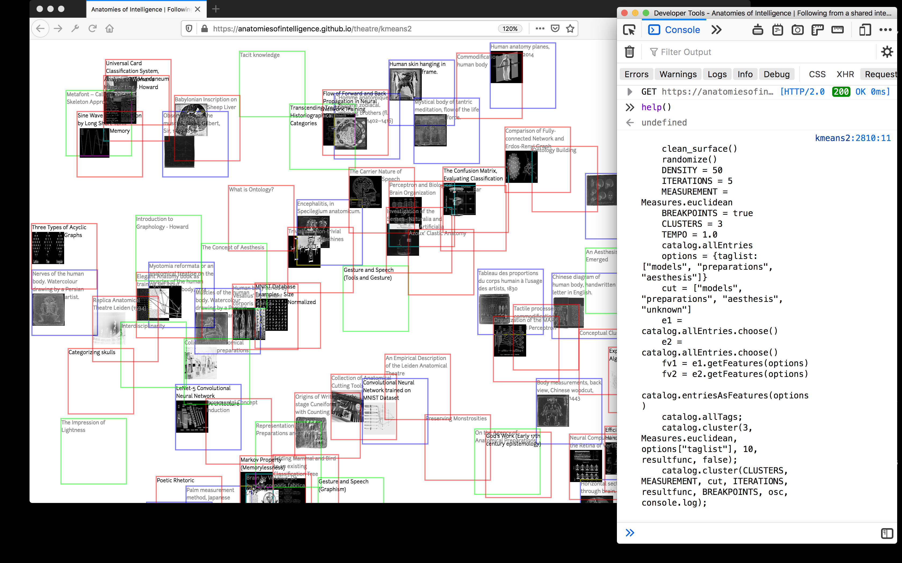

Title: 10. Machine unlearning
page_order: 10


[TOC]

## setup()


:   *Figure 10.1: Basic flow diagram of keyword detection of ELIZA by Joseph Weizenbaum (1966). Image copyright Communications of the ACM*[^acm]

This chapter begins with a flowchart that describes how a chatbot works — both in terms of procedure and logic. We use this historical example to introduce this final chapter of the book which is on machine learning,[^pathmind] broadly defined as a collection of models, statistical methods and operational algorithms that are used to analyze experimental or observational data. Given the large volume of data being produced and mined, and its widespread application in everyday voice-controlled devices such as Apple's Siri or Amazon's Echo[^diagram] to more sinister applications in border control face recognition software, it is hardly surprising that machine learning has become big business.

Machine learning is a term coined by Arthur Samuel in 1959 through his research at IBM on game development, with the ultimate goal to reduce or even eliminate the need for "detailed programming effort."[^samuel] The roots of how computers might begin to write their own programs lie in older discussions of artifical intelligence. Speculation as to whether computers could demonstrate credible responses to inputs is reflected in the relatively simple chatbot example that uses keywords to produce a "knowing" response, or follow up question. ELIZA was one of the first chatbots and was created by Joseph Weizenbaum at MIT between 1964 and 1966. It simulates a conversation between a Rogerian psychotherapist and their patient, prompting for user input, and then uses primitive "natural language processing"[^nlp] to transform this input — using a simple script based on keyword association and language patterns (see Figure 10.1) — into what seems to be a meaningful output, often in the form of a return question. Despite its apparent simplicity, it can be quite convincing (as you will experience later on).

Conversations with ELIZA involve an "illusion"[^Weizenbaum] to make machines appear as if they were human entities. Evidently, ELIZA exploits our willingness to anthropomorphize technology, and what passes for intelligence, as not only is it able to maintain a seemingly relevant and personalized dialogue, but also, as Weizenbaum notes, "some subjects have been very hard to convince that ELIZA is not human."[^Weizenbaum2] Here we once again reference the Turing Test.[^Turing] Can a machine respond convincingly to an input with an output similar to a human — or more precisely — can it mimic rational thinking? It's also interesting to note that ELIZA is named after Eliza Doolittle — from the George Bernard Shaw play *Pygmalion*[^Pygmalion] — which centers on a working class flower girl, and a patronizing bet by a professor of phonetics, that he can teach her gentility, and hence upward mobility through the British class system, through the acquisition of "proper speech" (as opposed to Cockney dialect, which interestingly is a rejection of upward mobility in its coded form).[^class] Perhaps the current technology of voice assistants operates on similar principles as they are able to not only process content but learn the style of human speech.

In machine learning, it is commonly understood that the style is learnt from training datasets through techniques to process and analyze large amounts of (natural language) data. As such, machine learning techniques such as "style transfer" rely on a process of generalization in order to identify patterns. However, this "pattern recognition" is clearly not a neutral process as it involves the identification of input data, and the "discrimination" of information.[^clemens] It is clear that there is other kinds of discrimination in such processes, such as inherent stereotypes in voice assistants[^assistants] or in online translation tools,[^online] and other examples that might include the AI chatbot Tay that was regarded as racist,[^tay] or how facial recognition in Amazon software, and other smart systems demonstrate gender and racial bias.[^face] Understood this way, pattern recognition is not only about smoothing tasks and making accurate predictions in terms of technical operations but also political operations as it creates "subjects and subjection, knowledge, authority" as well as classification and categorization.[^hito]

Appropriately, for the last chapter of our book, many of the critical-technical issues we have discussed through previous chapters come together in the examination of machine learning. The example of ELIZA/Eliza — both program and person — taken together emphasize how, when it comes to machine learning, both humans and machines train, and are trained by, these processes.[^current] Our machines are not independent of us, but are part of wider socio-technical assemblages which learning to program helps to make apparent.[^suchman] In the case of this book, we might speculate on whether we have been writing a teaching or a learning book if we assume that you have to learn something before you can actually teach it and that the act of teaching can help you learn something. To what extent are we attempting to "train," and who is training who? We will come back to this discussion at the end of the chapter but for now it is clear that we need to begin to understand these operations better and take our learning far more seriously in the case of both machines and humans.

## start()

Let's start with a closer examination of and reflection on the ELIZA chatbot by using the test application produced by Norbert Landsteiner in 2005:

{: .medium}
:   *Figure 10.2: A screenshot of the ELIZA Terminal (2005) on a web browser, implemented by Norbert Landsteiner. Courtesy of the designer*

Tasks:

1. Visit the *ELIZA Test* (2005) by clicking the button "Next Step", <https://www.masswerk.at/elizabot/eliza_test.html> so you can see the original example given by Weizenbaum in his published article.[^Weizenbaum3]
2. Then visit the work *ELIZA Terminal* (2005) via the link <https://www.masswerk.at/elizabot/eliza.html>, and try to have your own conversation.[^bot]
3. Share your experience of the original conversation (by Weizenbaum) and your conversation with the chatbot:
    * How would you describe your experience of ELIZA (e.g. the use of language, style of conversation, and quality of social interaction)?
    * How would you assess the ability of technology such as this to capture and structure feelings, and experiences? What are the limitations?

## Between input and output

We have briefly touched on machine learning, but let's clarify what it actually entails. In a contemporary context, it refers to various techniques of "data-handling,"[^samuel1] or, more precisely, statistics and data analysis. It is commonly described by three components: input, modelling (or learning), and output. Usually, a large amount of data is needed to be collected, parsed and cleaned.[^shit] Data cleansing is a term often used in computer or data science to describe the process of preparing data (data can consist of texts, video, images, gestures, etc.) to be input data by adjusting data inconsistency in terms of removing or modifying data that is irrelevant, duplicated, or improperly formatted. These various data preparation processes involve decision-making in terms of identifying and accessing the datasets, and how to structure the raw data, and deal with inconsistencies. If the data originates in different places, then the question arises of how to normalize the data to structure a cohesive dataset.[^papa] As in Chapter 4, "Data capture," we can already see how this process is fraught with problems concerning what gets included and excluded, and how this is decided and effected, and by whom. Rather than simply a means to an end, the dataset becomes a hugely significant cultural object that we need to understand better.[^dataset]

<div class="section exercise" markdown=1>
## Exercise in class

In the following exercise,[^michelle] we will use the experimental AI project *Teachable Machine* (version 1)[^tm1] to engage more closely with machine learning processes involving input and output, to understand the relationship between the two: <https://teachablemachine.withgoogle.com/v1/>.


:   *Figure 10.3: The Teachable Machine (Version 1) interface*

This web application includes input, learning, and output. By capturing images via your web camera, the program utilizes images as input data and there are three "training classifiers" you can play with.
{: data-style-print="margin-bottom: calc(4 * var(--line-height))"}
* * *
**What to do:**

Prepare three set of gestures that can be captured by the web camera. Each gesture has to be repeatedly trained by long-pressing the colored "TRAIN" button, and this generates the machine learning model based on the captured images as input data (also called the "training dataset") (see Figure 10.3). This process is used to train a computer to recognize the specific gestures/images/poses so that when there is a new image input (a so-called "test dataset"), the learning/teachable machine can classify those gestures with various confidence levels, and then predict the corresponding output results. The three default output modes (GIF, Sound, Speech) can be further modified by searching for other sets of images, sounds and texts.

**The simplest way to start is:**

1. Train the machine using three different sets of gestures/facial expressions, then observe the predictive results shown as various outputs.
2. Test the boundaries of recognition or classification problems, such as having a different test dataset, or under different conditions such as variable lighting and distance. What can, and cannot, be recognized?
3. What happens when you only use a few images? How does this amount of training input change the machine's predictions?

This initial exercise aims to familiarize you with the three components of machine learning: input, learning and output, as well as to explore the relation between data and these components. Furthermore, this execise sets the stage for thinking about the ways in which machines learn from data, identify patterns, make decisions, and predictions.
</div>

## Learning algorithms

Machine learning utilizes a variety of statistical algorithms to process (training) datasets. An image of a person, for instance, is identified as such by measuring a set of gradients of known images derived from training data, which "teaches" algorithms to recognize what constitutes a person.

Broadly speaking there are three types of algorithms: Supervised Learning, Unsupervised Learning, and Reinforcement Learning.

**Supervised Learning** - This model is based on a training dataset with input/output pairs as expected answers. A classic example would be spam emails in which an algorithm learns from the sample of emails that are labelled as "spam" or "not spam." The goal of this type of learning is to map the input data to output labels. For example, with new email as the input, what would the predicted output result be? Can it be classified as spam and then moved to the spam mailbox? In mathematical terms, this is expressed as Y=f(X), and the goal is to predict the output variable Y from the new input data (X). But this prediction process relies on classification techniques, for example binary classification (such as yes/no, spam/not spam, male/female) and multi-classification (such as different object labels in visual recognition), which is based on the process of data labelling. This is where inconsistencies arise. Data is categorized in a discrete manner, and there are many reasons that might lead to a "normative" prediction and this is especially problematic when it comes to complex subjects such as gender, race, and identity, because these operate beyond binary, discrete classification.

Artist-researcher Nicolas Malevé has done extensive work on this topic in relation to the ImageNet dataset,[^imagenet] a hugely influential project in the field of computer vision, developed by Fei-Fei Li at Stanford University in 2009. The dataset is vast and contains over 14 million photographs that are organized into over twenty-one thousand "synsets" (categories), taken from a lexical database called WordNet.[^net] The labelling work was completed by over 25,000 workers over a two-year period using Amazon Mechanical Turk, a crowdsourcing platform. Exhibited across two months of the summer of 2019 as a live stream on the web and on the Media Wall at The Photographers Gallery, London, Malevé's script cycled through the entire contents of the dataset at a speed of 90 milliseconds per image, pausing at random points to enable the viewer to "see" some of the images, and how they are categorized (see Figure 10.4). This raised questions about the relation of scale between the overwhelming quantities of images needed to train algorithms and the human labor, and attention (or the lack of it) required to annotate and categorize the images.[^TPG] An excerpt form the live recording of the work entitled *12 Hours of ImageNet* can be viewed online.

<div class="columns" markdown=1>
{: style="height: 200px; "}
:   *Figure 10.4: The categorization of "cock" in Exhibiting ImageNet (2019) by Nicolas Malevé. Courtesy of the artist*

{: style="height: 200px; "}
:   *Figure 10.5: An illustration of Unsupervised Learning with K-means clustering. Image from Wikimedia Commons*
</div>


**Unsupervised Learning** - Unlike the previous learning model, the training dataset does not contain a set of labelled data. One of the common tasks with unsupervised learning is "clustering" (algorithms such as K-means and Hierarchical Clustering). The goal of this technique is to find similarities, providing insights into underlying patterns, and relationships of different groups in a dataset using exploratory and cluster analysis. As such, items in the same group or cluster share similar attributes and metrics (see Figure 10.5). The idea behind clustering is to identify similar groups of data in a dataset, segregating groups with similar characteristics. It is commonly used in the business and marketing sectors to understand customer preferences so personalization and data marketing can be provided by grouping customers based on their purchasing behavior with regard to certain types of goods.

Artists Joana Chicau and Jonathan Reus produced *Anatomies of Intelligence*[^AI] based on an unsupervised learning model to develop an understanding of anatomical knowledge, and computational learning (see Figure 10.6). In their AI workshop,[^chicau] they suggest that participants think of two features for examining a small image dataset (around 15 images) — such as "cuteness" and "curliness" — and each of the images are rated and sorted according to these features (in the form of x and y axis) within a number range say from 0.0 to 1.0 (for normalization and rescaling, in statistical terms, so that data are in the same scale). More features can be added, but it is more convenient to have two only for a physical workshop setting. Each image can then be described by the set of feature values. As a result, several clusters are formed, providing a new perspective on the relations between images in terms of their similarities and differences (see Figure 10.7). It's a simple exercise, but can obviously be scaled up, systematized, and automated, for example by deciding on the number of clusters and calculating the distribution of/distance between data points. This also helps reinforce how algorithms designed to recognize patterns, known as neural networks,[^neuralnets] operate, loosely based, as they are, on a model of the human brain and how it learns to differentiate certain objects from other objects.

**Reinforcement Learning** — This type of learning technique is based on interaction with the environment, mapping an analysis of a situation into actions.[^rl] The learner (or agent) does not have any previous data to base itself on, to determine, or predict which action to take, but rather learns by trial and error to yield the best results. For example, the computer program AlphaGo[^alphago] beat the world champion of the Go abstract strategy board game in 2017. AlphaGo was able to evaluate the various positions and select the best moves using self-taught processes. This type of learning finds the best possible behavior or path to take in a specific environment, mapping state-action pairs to achieve the best result. As in behavioral psychology, reinforcement is used to suggest future actions, like a child getting a treat for doing what it was told to. Unlike supervised learning that relies on input training data, the characteristics of reinforcement learning are that the program understands the environment as a whole,[^environment] and is able to learn from its experience by evaluating the effectiveness of each action taken: "trial-and-error search" and "delayed reward"[^rl2] are based on sequential decisions, computation, repeated attempts, and feedback on the success of actions.


:   *Figure 10.6: Anatomies of Intelligence (2018-) by Joana Chicau and Jonathan Reus. Courtesy of the artists*


{: .medium}
:   *Figure 10.7: The clustering of images based on "cuteness" and "curliness" in the Anatomies of Intelligence workshop by Joana Chicau and Jonathan Reus.*


## ml5.js library
Given the limitations of time and space, and in line with the book thus far, this chapter will experiment with the ml5.js machine learning library, a JavaScript framework that can be run in a web browser just like p5.js. Aiming to make machine learning accessible to a wide audience, especially programming beginners, ml5.js is built on top of the more complex TensorFlow JavaScript library.[^tensor] Furthermore, the ml5.js site consists of extensive code examples and tutorials with pre-trained models that have been created using prior training processes.[^ml5]

Working towards the final chapter, "Afterword: Recurrent Imaginaries" — which can be likened to positive reinforcement for having finished your learning so far — we have appropriated an example from ml5.js: `CharRNN_Text`. Instead of using the pre-trained model provided by ml5.js that was trained using the literary works of Virginia Woolf, we offer another pre-trained model[^training] based all the chapters of this book. In this way our final example learns from previous chapters and generates a new text based on the generalized style of the others. Of course there is a process of reduction here that exemplifies some of the political issues we have raised before with regard to knowledge production.[^issues]

The training process uses a "Recurrent Neural Network" (RNN) and "Long Short Term Memory" (LSTM) that analyze and model sequential data, character by character. Both are useful in terms of character-by-character training because the order, and context of the text are both important to generate sentences that make sense to human readers (this is related to the field of "natural language processing"). This recurrent type of neural network can capture long-term dependencies in a corpus in order to make sense of the text pattern through many iterations of the training process, using markdowns in the form of characters and symbols from each chapter as raw data. What we end up with more or less makes sense, in its processing of text, but also source code, image links, captions, and so on, but most importantly with the machine generated text in the next bonus chapter it provides an insight into how a machine learns from our book in contrast to what you might have learnt[^rnn]. Here we return to one of the main objectives for the book, i.e. exploring some of the similarities and differences between human, and machine reading and writing: what we refer to as aesthetic programming.


:   *Figure 10.8: Auto Chapter Generator*

RunMe
:   <https://aesthetic-programming.gitlab.io/book/p5_SampleCode/ch10_MachineUnlearning/>


## Source code

**JavaScript:**
<sketch
  data-executable
  lang="javascript"
  src="p5_SampleCode/ch10_MachineUnlearning/sketch.js"
  data-base-url="p5_SampleCode/ch10_MachineUnlearning/"
  data-download-link="https://gitlab.com/aesthetic-programming/book/-/archive/master/Book-master.zip?path=public/p5_SampleCode/ch10_MachineUnlearning"
  data-requirements="js/samplePatches/ch10HTMLGenerator.js, p5_SampleCode/libraries/ml5.min.js"
  />

**HTML:**

```javascript
<html>
<head>
  <meta charset="UTF-8">
  <title>Auto Chapter Generator</title>
  <script src="https://unpkg.com/ml5@0.4.3/dist/ml5.min.js"
  type="text/javascript"></script>
  <script language="javascript" type="text/javascript"
  src="../libraries/p5.js"></script>
  <style>
    body {background-color: white;font-family:"Lucida Console", Monaco,
    monospace;font-size:12;color:grey;}
    h1   {color: blue;}
    p    {color: black; font-size:14;}
  </style>
</head>

<body>
  <h1>Auto Chapter Generator</h1>
  <h2>This example uses a pre-trained model on the collection of all the
     chapters (in the form of markdown) of the book Aesthetic Programming:
      A Handbook of Software Studies</h2>
  <p>seed text:
    <input id="textInput" value="Afterword: Recurrent Imaginaries" size="30"/>
  </p>
  <p>length:
    <input id="lenSlider" type="range" min="100" max="2000" value="1000"/>
    <span id="length">1000</span></p>
  <p>temperature:
    <input id="tempSlider" type="range" min="0" max="1" step="0.01"/>
    <span id="temperature">0.5</span></p>
  <p id="status">Loading Model</p>
    <button id="generate">generate</button>
   <hr>
  <p id="result"></p>
  <script src="sketch.js"></script>
</body>
</html>
```

### Reading Auto Chapter Generator

**index.html**

To load the ml5.js library as part of the overall sketch, you need the following line in your index.html, just like importing other libraries as discussed in Chapter 4, "Data capture," with the clmtrackr library. For this example, we are using ml5.js library - version 0.4.3.

```javascript
<script src="https://unpkg.com/ml5@0.4.3/dist/ml5.min.js"
type="text/javascript"></script>
```

Apart from the new ml5.js, the HTML file contains the following DOM elements (see Figure 10.8) that can display the corresponding data, and interact with the user there. As such the sketch.js is mainly used to process the data from the DOM and form elements, and it is not used for canvas drawing (`noCanvas()` is used in Line 12 within the `function setup(){}`).

1. **A text input box** for entering seed/input text. In this example, we have used "Afterword: Recurrent Imaginaries" as a sequence input to generate the next character, continuously forming a new seed sequence for next character prediction: `<input id="textInput" value="Afterword: Recurrent Imaginaries" size="30"/>`
2. **A slider for selecting the number of generated characters** with a range from 100 to 2,000: `<input id="lenSlider" type="range" min="100" max="2000" value="1000"/>`
3. **A slider for setting the temperature** (the value that controls the amount of uncertainty of predictions)[^temp] which has a range from 0 to 1: `<input id="tempSlider" type="range" min="0" max="1" step="0.01"/>`
4. **The text shows the status** of the program, e.g. "Loading Model," "Model Loaded," "Generating…," "Ready!": `<p id="status">Loading Model</p>`
5. **A clickable button** bearing the word "generate": `<button id="generate">generate</button>`
6. **A result area** that displays the generative text: `<p id="result"></p>`

**sketch.js**

The sketch loads the pre-trained model and generates text based on the collected data (the seed text, its length, and temperature value).

```javascript
let charRNN;

function setup() {
  charRNN = ml5.charRNN('models/AP_book/', modelReady);
  …
}
```

The first step is to initialize and load the trained model into your sketch with the path `models/AP_book/` by using the method `charRNN` from the ml5.js library (see Line 4 above). The callback function `modelReady` will be executed when the model is successfully loaded into the sketch and will change its status from "Loading Model" to "Model Loaded."

```javascript
function setup() {
…
  // Grab the DOM elements
  textInput = select('#textInput');
  lengthSlider = select('#lenSlider');
  tempSlider = select('#tempSlider');
  button = select('#generate');

  // DOM element events
  button.mousePressed(generate);
  lengthSlider.input(updateSliders);
  tempSlider.input(updateSliders);
…
}
```
The program collects data in the form of objects (using the `select` syntax to search for the HTML elements, especially the `input id` that have been defined in index.html): the seed text (based on the text input), the length of the predictive text (based on the slider), as well as the temperature value (based on the other slider).

```javascript
function generate() {
…
  let data = {
    seed: txt,
    temperature: tempSlider.value(),
    length: lengthSlider.value()
  };
  charRNN.generate(data, gotData);
…
}
```

The key data required for the generator are the seed text, temperature, and length (the numbers of characters) for text generation. These data objects are passed on to the charRNN's method: `charRNN.generate()` in order to process the seed text via the pre-trained model (with a callback function `gotdata()`). This `.generate()` method returns the text object `sample` as sample output. Theoretically, the predictive text will have learnt the style from all the chapters (if only crudely) and then generates the new text accordingly.

```javascript
function gotData(err, result) {
…
  select('#result').html(txt + result.sample);
…
}
```

Finally, the result will be displayed on screen with the `gotData()` function. Note that the ml5.js library also checks for errors with the argument `err`.

<div class="section exercise" markdown=1>
## Exercise in class

1. Work with the *Auto Chapter Generator* program and try to generate texts based on different length and temperature values.
2. The generative text example also links to the Chapter 5, "Auto-generator," in terms of agency, unpredictability, and generativity, but how does this chapter change our understanding of these terms given what we know about machine learning? What is learning in this context? What do machines teach us? And in the production of prediction, what does machine learning want?[^predict]
</div>

## While()

Many of the issues explored across the chapters of this book come together in the discussion of machine learning and what this means for critical-technical practice. We deliberately reference Agre again here and his essay "Toward a Critical Technical Practice"[^agre] to stress the importance of social and political aspects of technical fields such as AI. His assertion is that AI is a discursive practice because of the way the technical terminology demonstrates intellectual generativity, drawing deep analogies across fields, and between otherwise disparate technical and critical activities, and intellectual traditions. Part of the problem here is rooted in the tendency to conflate representations with the things that they represent. On the one hand, we have a technical tradition that looks for precision and, on the other, there is a critical tradition that looks for ambiguity of meaning.[^Hall] It makes little sense to deny either approach. For example, on the subject of deep learning at a conference of engineers, Ruha Benjamin referred to computational depth without sociological depth as "superficial learning."[^superficial]

The word "learning" is a pertinent example. By first defining machine learning as a "field of study that gives computers the ability to learn without being explicitly programmed," Samuel draws a parallel between human and machine learning, comparing how books speed up human learning to the success of machines in playing games (like draughts/checkers).[^samuel2] It is of course quite common to draw analogies between machine intelligence and cognitive development in humans, especially in children. This is broadly a (constructivist) idea of learning as something informed by, and learning from, experiencing the world. Yet this can also appear superficial, as for instance, in the following example cited by Nicolas Malevé of Fei-Fei Li describing her insight into teaching a machine to see, informing the development of ImageNet:

>"If you consider a child's eyes as a pair of biological cameras, they take one picture about every two hundred milliseconds, the average time an eye movement is made. So by age three, a child would have hundreds of millions of pictures of the real world. That's a lot of training examples. So instead of focusing on solely better and better algorithms, my insight was to give the algorithms the kind of training data that a child was given by experiences, in both quantity and quality."[^pedagogy1]

The example presents a reductive equivalence between human and machine vision. But our interest is more about what is implied about training, teaching, and learning in general. We are all involved in the process of teaching machines to look at images, and Malevé describes the enormous amounts of training that takes place when we use everyday devices such as smart phones and computers. His interest is not so much our complicity in these processes, but which pedagogical methods might be useful. What could we learn about learning from the dynamics of machine learning? In his words, how to "transform it and be transformed by it? Or, to formulate this in terms even closer to Fei-Fei Li's, how can we think productively about the fact that a generation of humans and algorithms are learning together to look at images?"[^pedagogy2] His intervention is to ask to what extent machine learning and radical pedagogy might learn from each other, moving beyond the oppressive subject-object relations to something in which learners can become more active participants in their own learning.[^radical] We need to learn how to learn.

If visual literacy is no longer simply an educational task for humans, but also for machines, then it becomes a question of human-machine literacy in its broadest sense. In many ways, John Berger's *Ways of Seeing* continues to be a useful reference we think. Of course much has changed since Berger wrote that the "relation between what we see and what we know is never settled,"[^Berger] but given what we do know about machine learning, we might indeed ask how that relationship has been further unsettled.[^cox] That machines can be said to "see" or "learn" is shorthand for calculative practices that only approximate likely outcomes by using various algorithms and models. What constitutes knowledge can be seen to be arranged in ways that further recall Berger's reflections on the medium of television through which his ideas were broadcast:

>"But remember that I am controlling and using for my own purposes the means of reproduction needed for these programmes […] with this programme as with all programmes, you receive images and meanings which are arranged. I hope you will consider what I arrange but please remain skeptical of it."[^Berger2]

We would like to reiterate this here and encourage deep reflection on the means of production — including books like this, and perhaps those that relate to teaching and learning are particularly suspect. What is learnt should not be separated from the means by which it is transmitted, nor the direction of travel from human to machine or from machine to human. More to the point, the production of meaning lies at the core of our discussion, as are concerns about what is being learnt, and to what extent this has been compromised or inflected by reductive ideas of how the world operates. Mackenzie asks, "Does the somewhat unruly generalization of machine learning […] attest to a redefinition of knowledge, decision, and control, a new operational formation in which a 'system is transformed'?"[^Learners] Under these conditions, the relations between human and machine learning become blurry. The overall idea of learning implies new forms of control over what and how something becomes known. Here Mackenzie builds on Foucault to understand machine learning as a form of knowledge production and as a strategy of power. He tries to understand how machine learners produce different kinds of knowledge through their differences, for instance the ways they classify, and categorize data (e.g. this image of a person is a specific gender, race, likely terrorist, etc.). Knowledge is often set at the lowest common denominator in such cases, backed up by the enormous infrastructural power of the companies that profit from this as is the case for platform-based media empires such as Amazon and Google who have invested massively in this technology (so that users can supply data and learn to be better consumers). In summary there are some serious worries about the forms of knowledge produced by machine learning given the broader context in which it arises. Being smart in this respect is also superficial learning.

All these ideas provide starting points for further work and reflection.[^refs] The interplay between truth and fiction is part of this, and "deepfakes" for example (a wordplay on deep learning) would make a good additional case study for the way in which synthetic instances can pass for real data. A brief description of this process, and the operations of "Generative Adversarial Networks" (GANs) might make a useful addition here.[^GAN] With a GAN, two neural nets — a "Generator" that forges a new data instance, and a "Discriminator" that then distinguishes fake data created by the Generator from real data — challenge each other with increasingly realistic fakes, both optimizing their strategies until their generated data is indistinguishable from the real data. This is also a (unsupervised) method of training that doesn’t rely on the tagging of input images by humans as the machine generates groupings based on its own analysis. Might critical theory learn from this, something that resonates with dialectical materialism in which everything is considered to be in a process of transformation through contradiction, and becomes a technical reality? Might such an approach open up alternatives to the conflation of computational logics and politics?[^transmediale]

In beginning to think about computational operations in this way, as conceptual models or diagrams, we broadly follow on from what we have learnt thus far about machine learning through a process of generalization, prediction, and the generation of future possibilities. We use this last chapter as a way to point to future critical work to be undertaken and to reflect on machine learning as a set of methods that learn from data in parallel to our experience of learning through the practice of programming. As Agre puts it: "A critical technical practice will, at least for the foreseeable future, require a split identity — one foot planted in the craft work of design and the other foot planted in the reflexive work of critique."[^agre2] The challenge then is to work across and learn from both these modes, not as a split but queer identity, opening up ways of working fluidly across diverse contexts. In this regard, we consider critical technical practice to be a queer praxis, as we hope has been made clear throughout this book. Aesthetic programming in this way demonstrates some of the possible ways to further unsettle the binary split of theory and practice, thinking and doing, art and technology, humans and machines, and so on.

All this deserves longer discussion that there simply isn't space for in these closing paragraphs. At the same time, the constraint allows us to point beyond this book — perhaps to another yet to be written — because if work processes are automated then our work as writers, editors, designers, programmers and teachers will be too. The underlying worry is that our decision-making, thinking, and creativity will be automated, and that our ability to determine our futures will become compromised by predictive algorithms.[^tang] It is this questioning of the power of algorithms that we hope we have managed to provide some insight into here, to assert some level of control over these processes, and to point to alternative outcomes and "recurrent imaginaries" (the subtitle of the following chapter).     

This sense of future possibilities is also where we would say Mackenzie’s work is particularly valuable as he devotes attention to specific algorithms and data practices to understand the particularity of human-machine relations, and their transformations, and not least to emphasize the uncertainties and contingencies at work in these processes. In other words, machine learning is by no means simply deterministic (as we have seen in the exercises for this chapter) but is endlessly subject to revision and modification, and by its very nature is process-driven. It is also variably applied across disciplines and fields of practice, across open source platforms and communities of interest, endlessly transforming itself, and being transformed along the way.[^Learners3] This serves to demonstrate how there is more to a program than simply its source code. There is a whole range of recursive operations that render the various processes transformative in multiple ways.[^Learners4] The question becomes to what extent this different mode of coding for machine learning leads to a different mode of knowledge production, and transforms human-machine relations. When it comes to the book as a whole, which alternative knowledge and aesthetic practices emerge as a consequence?

<div class="section exercise" markdown=1>
## MiniX: final project

Aesthetic programming is a critical-technical practice. It explores the practice of reading, writing, and building, as well as thinking with, and understanding the complex computational procedures that underwrite our experiences and realities. To address these intersections of practice we have worked with fundamental concepts of programming as the starting point for further reflection — considering the precision and ambiguity of technical vocabulary as well as specific computational practices — thereby laying the groundwork for further understanding of how cultural phenomena are constructed and operationalized.

Drawing on the curriculum, including the various theoretical and conceptual texts, your task (as a group) is to conceptualize, design, implement, and articulate a computational artifact of your choice. We hope that, by now, it almost goes without saying that this should demonstrate your ability to integrate practical programming and conceptual skills to articulate, and develop a critical-technical artifact that explores the aesthetics and politics of software.

Here are few tips may help you to come up with an idea for your project:

* You may take another look at the themes that we have used for inspiration, including: literacy/getting started, variable geometry, infinite loops, data capture, auto-generator, object abstraction, vocable code, que(e)ry data, algorithmic procedures, machine unlearning, as well as writing and coding, facial recognition, emojis, (micro)temporalities, capture all/datafication, interactivity, rule-based systems, object orientation, language and speech, expressivity, algorithmic literature, politics of data processing and learning, all underwritten by an attentiveness to a politics of race, class, and gender.
* Take a look again at all the previous mini exercises and the questions that were posed. Are there any that you want to explore further?
* Are there any assigned/suggested texts that you are inspired by, and you want to explore further?
* Are there any particular technical areas that you want to explore further?

**RunMe:**

Produce a software artifact written in p5.js (or a combination of HTML/CSS/JS/p5/ml5/node.js).

Remember to include all external libraries and data/assets such as images, fonts, text files, sound file, etc. Furthermore, if you have borrowed other sample code or ideas, please cite your sources in the code comments.

**ReadMe:**

Write a document of 6-8 pages (max characters per page: 2,400 including spaces) which has to list academic sources (exclude images, references, and notes from the character count).

The document should include a title, a screen shot, a flowchart, references, a link to your final project's RunMe, with links to related projects (if there are any), as well as the links of all your previous mini exercises (as an appendix).

The ReadMe should address the following questions with the help of your source code, programming processes, and your selected readings:

* What is your software about (provide a short description of what is it, how it works, and what it sets out to explore)?
* How does your work address at least one of the themes and explore the intersections of technical and cultural aspects of code?
* Open question: To what extent can the artifact be considered to be a critical work in and of itself?
</div>

## Required reading

Ruha Benjamin, "[Are Robots Racist: Reimagining the Default Settings of Technology and Society](https://www.dropbox.com/s/j80s8kjm63erf70/Ruha%20Benjamin%20Guest%20Lecture.mp4)," lecture (2019).

Geoff Cox, "[Ways of Machine Seeing](https://unthinking.photography/articles/ways-of-machine-seeing)," *Unthinking Photography* (2016).

Yuval Noah Harari, Audrey Tang, and Puja Ohlhaver, "[To Be or Not to Be Hacked? The Future of Democracy, Work, and Identity](https://www.youtube.com/watch?v=tRVEY95cI0o)," *RADICALxChange* (2020).

## Further reading

* Kate Crawford and Vladan Joler, "Anatomy of an AI System: The Amazon Echo as an Anatomical Map of Human Labor, Data and Planetary Resources," AI Institute (2018), <https://anatomyof.ai/>.
* Shakir Mohamed, Marie-Therese Png, William Isaac, “Decolonial AI: Decolonial Theory as Sociotechnical Foresight in Artificial Intelligence,” *Philosophy & Technology*, Springer, July 12 (2020), <https://doi.org/10.1007/s13347-020-00405-8>.
* Adrian Mackenzie and Anna Munster, “Platform Seeing: Image Ensembles and Their Invisualities,” *Theory, Culture & Society* 26, no. 5 (2019): 3-22.
* Daniel Shiffman, "Beginners Guide to Machine Learning in JavaScript," *The Coding Train*, <https://www.youtube.com/playlist?list=PLRqwX-V7Uu6YPSwT06y_AEYTqIwbeam3y>

## Notes

[^pathmind]: It should be pointed out that although machine learning is part of AI, AI is a broader concept. AI, machine learning and deep learning are terms that are often used interchangeably but there are key distinctions to be made. To explain: "You can think of deep learning, machine learning and artificial intelligence as a set of Russian dolls nested within each other, beginning with the smallest and working out. Deep learning is a subset of machine learning, and machine learning is a subset of AI, which is an umbrella term for any computer program that does something smart. In other words, all machine learning is AI, but not all AI is machine learning, and so forth." See Pathmind's "A.I. Wiki: A Beginner’s Guide to Important Topics in AI, Machine Learning, and Deep Learning," <https://pathmind.com/wiki/ai-vs-machine-learning-vs-deep-learning>.

[^diagram]: See Kate Crawford and Vladan Joler's essay and diagram "Anatomy of an AI System: The Amazon Echo as an anatomical map of human labor, data and planetary resources," (2018) for a detailed explanation of this, <https://anatomyof.ai/>.

[^samuel]: Machine learning is a term coined by Arthur Samuel in 1959 during his game development research at IBM which ultimately aimed to reduce or even eliminate the need for "detailed programming effort," using learning through generalization in order to achieve pattern recognition. See Arthur L. Samuel, "Some Studies in Machine Learning Using the Game of Checkers," *IBM Journal of research and development* 3, no.3 (1959): 210-229.

[^nlp]: Natural language processing is the study of how a computer understands the meaning of human language, and it deals iwth the interaction between computers and humans using that natural language. This relates to the fields of Artificial Intelligence, Computer Science and Linguistics with applications such as text-to-speech, voice assistants, and (language) translation programs.

[^Weizenbaum]: Joseph Weizenbaum, "ELIZA — a Computer Program for the Study of Natural Language Communication between Man and Machine," *Communications of the ACM* 9, no.1 (1966): 36-45.

[^Weizenbaum2]: Weizenbaum. “ELIZA*, 42.

[^Turing]: See Alan M. Turing. "Computing machinery and intelligence," *Mind* 49 (1950): 433-460.

[^Pygmalion]: The title of the play makes reference to the Greek myth in which Pygmalion, a sculptor, falls in love with a statue he carves, and Venus grants it the breath of life.

[^class]: Originating in the East End of London, Cockney rhyming slang is a coded language which was purposely created to be obscure to other listeners, and hence to others outside a particular community or indeed class group. One might imagine using cockney rhyming slang for the naming conventions of a programming language, see <https://news.ycombinator.com/item?id=9402410>.

[^clemens]: Clemens Apprich, "Introduction," in Clemens Apprich, Florian Cramer, Wendy Hui Kyon Chun, and Hito Steyerl, eds., *Pattern Discrimination* (Minnesota: Meson Press, 2018), x.

[^assistants]: Marie Louise Juul Søndergaard and Lone Koefoed Hansen argue that "feminine gendering" is reproduced and applied in digital personal assistants, see their "Intimate Futures: Staying with the Trouble of Digital Personal Assistants through Design Fiction" (New York: ACM Press, 2018): 869–80, <https://doi.org/10.1145/3196709.3196766>.

[^online]: Google's online translation service perpetuatess gender stereotypes, <https://twitter.com/mit_csail/status/916032004466122758>.

[^tay]: For example, the Microsoft chatbot Tay was released via Twitter in 2016, but was shut down sixteen hours later due to "unintended offensive and hurtful tweets," as announced by Microsoft. See <https://en.wikipedia.org/wiki/Tay_(bot)>.

[^face]: Research has shown that existing commercial recognition systems exhibit gender and racial bias. See Joy Buolamwini, "Response: Racial and Gender Bias in Amazon Recognition - Commercial AI System for Analyzing Faces," *Medium* (2019), <https://medium.com/@Joy.Buolamwini/response-racial-and-gender-bias-in-amazon-rekognition-commercial-ai-system-for-analyzing-faces-a289222eeced>; and Ruha Benjamin, "Are Robots Racist: Reimagining the Default Settings of Technology and Society," lecture (2019), <https://www.dropbox.com/s/j80s8kjm63erf70/Ruha%20Benjamin%20Guest%20Lecture.mp4>. Some scholars also point to the urgent need of AI system's re-evaluation especially on gender and race classification. See, Sarah Myers West, Meredith Whittaker, and Kate Crawford, *Discriminating Systems: Gender, Race and Power in AI*, AI Now Institute, New York University, April (2019), <https://ainowinstitute.org/discriminatingsystems.html>.

[^hito]: Hito Steyerl, "A Sea of Data: Pattern Recognition and Corporate Animism (Forked Version)," in Clemens Apprich, Florian Cramer, Wendy Hui Kyon Chun, and Hito Steyerl, eds., *Pattern Discrimination*, 3.

[^current]: A more recent approach might be found in queer and feminist critiques of AI. See, for example, "Conversational AI agents for the advancement of new eroticisms," in which queer AI chatbots are trained on erotic literature, feminist and queer theory, and an ethics of embodiment. See <https://queer.ai/>.

[^suchman]: Maria Puig de la Bellacasa quotes Lucy Suchman's phrase "smart assistants" (her term for autonomous or smart agents) that manage to strike a balance between autonomy, on the one hand, and what we want from them on the other. Rather than reinforcing the ideal of the independent, self-motivated, entrepreneurial worker, and making the work of the assistant relatively invisible, she wants to highlight the "mediating agencies that would not easily appear in descriptions that foreground the success of the technology [and, quoting Suchman,] the hidden labors and unruly contingencies that exceed its bounds.” Bellacasa wants to draw attention to what is neglected, the so-called "petty doings of things" as she puts it, to "more affectively changed connotations, notably those of trouble, worry and care." Maria Puig de la Bellacasa, "Matters of Care in Technoscience: Assembling Neglected Things," in *Social Studies of Science* 41, no. 1 (2010), 92-3, 89.

[^Weizenbaum3]: Weizenbaum, "ELIZA*.

[^bot]: The text-based conversational ElizaBot (elizabot.js) was developed using JavaScript by Norbert Landsteiner in 2005. The source code can be downloaded from <https://www.masswerk.at/elizabot/>.

[^samuel1]: Samuel, "Some Studies in Machine Learning Using the Game of Checkers," 211.

[^shit]: With ELIZA in mind, it's worth adding that cleaning data also comes close to the regulation of proper speech with the removal of "dirty" words. Dominique Laporte's wonderful book *A History of Shit* (Cambridge, MA: MIT Press, 2002) has more detail on this and its core parallel to the development of public hygiene.

[^papa]: A good example is the video installation *The Cleaning of Emotional Data* (2019), by artist Elisa Giardina Papa, that reveals the global infrastructure of workers who clean data to train machine vision algorithms to detect emotions, and how, in so-doing, some emotions that do not match standardized categories are rejected. Elisa Giardina Papa, "The Cleaning of Emotional Data," Aksioma Project Space, Ljubljana, January 15–February 7, 2020, <https://aksioma.org/cleaning.emotional.data/>.

[^dataset]: For more on the significance of, and problems related to, datasets, see Nicolas Malevé's "An Introduction to Image Datasets", *Unthinking Photography* (2019), <https://unthinking.photography/articles/an-introduction-to-image-datasets>.

[^michelle]: This exercise is inspired by Michelle Carney's article on "Using Teachable Machine in the d.school classroom," *Medium*, <https://medium.com/@michellecarney/using-teachable-machine-in-the-d-school-classroom-96be1ba6a4f9>.

[^tm1]: Inspired originally by Rebecca Fiebrink's *Wekinator* (2009), which is a free and open source software on machine learning for artists and musicians, "Teachable Machine 1.0" (2017) as an experimental project by Støg, Use All Five and Creative Lab and PAIR teams at Google, built upon the free and open source tensorflow.js library, which is developed by the Google Brain team within Google’s AI organization, for preprocessing data, building machine learning models and structures. "Teachable Machine 2.0" allows users to train their models and export them for further use. See <http://www.wekinator.org/>.

[^imagenet]: More information about ImageNet can be found at <http://image-net.org/about-overview>.

[^net]: Wordnet is a lexical database of semantic relations between words, see <https://wordnet.princeton.edu/>.

[^TPG]: Here we are largely paraphrasing the description of Malevé's *Exhibiting ImageNet* project on The Photographers' Gallery website, <https://thephotographersgallery.org.uk/whats-on/digital-project/exhibiting-imagenet>.   

[^AI]: The project *Anatomies of Intelligence* can be found at <https://anatomiesofintelligence.github.io/>.

[^chicau]: The workshop conducted at Aarhus University in 2019 was based on the art project *Anatomies of Intelligence* which focused on data classification and clustering, <https://anatomiesofintelligence.github.io/workshop_presentation.html>.

[^neuralnets]: A definition of neural nets can be found on Pathmind's "AI Wiki," <https://pathmind.com/wiki/neural-network#define>.  

[^rl]: Richard S. Sutton and Andrew Barto, *Reinforcement Learning: An Introduction*, 1st Edition (Cambridge, MA: MIT Press, 1998).

[^alphago]: David Silver, Julian Schrittwieser, Karen Simonyan, Ioannis Antonoglou, Aja Huang, Arthur Guez, Thomas Hubert, et al, "Mastering the Game of Go without Human Knowledge," *Nature* 550, no. 7676 (2017): 354–59, <https://doi.org/10.1038/nature24270>.

[^environment]: Whist mentioning environment, it is important to mention that there are worrying environmental costs associated with machine learning. See, for instance, Karen Hao, "Training a single AI model can emit as much carbon as five cars in their lifetimes," *MIT Technology Review*, June 6 (2019), <https://www.technologyreview.com/s/613630/training-a-single-ai-model-can-emit-as-much-carbon-as-five-cars-in-their-lifetimes/>.

[^rl2]: Richard S. Sutton, "Introduction: The Challenge of Reinforcement Learning," in Richard S. Sutton, eds. *Reinforcement Learning*. The Springer International Series in Engineering and Computer Science (Knowledge Representation, Learning and Expert Systems) 173 (Springer, 1992): 5-32.

[^tensor]: ml5.js is built on top of tensorflow.js, as mentioned previously.

[^ml5]: See the ml5.js library, <https://ml5js.org/>; and Daniel Shiffman's *The Coding Train* series during which he discusses ml5.js: <https://www.youtube.com/playlist?list=PLRqwX-V7Uu6YPSwT06y_AEYTqIwbeam3y>.

[^training]: The training process is run in a Python environment with TensorFlow installed. It was developed as a multi-layer, recurrent neural network for character-level language models, and it works well with ml5.js. See the open source code by Cristóbal Valenzuela at <https://github.com/Paperspace/training-lstm>.

[^issues]: For instance, the generalization here leads to inherent bias such as the privileging of white people in facial recognition technologies. See Buolamwini, "Response: Racial and Gender Bias in Amazon Recognition"; and Benjamin, "Are Robots Racist"; also Shakir Mohamed, Marie-Therese Png, William Isaac, “Decolonial AI: Decolonial Theory as Sociotechnical Foresight in Artificial Intelligence,” *Philosophy & Technology*, Springer, July 12, 2020, <https://doi.org/10.1007/s13347-020-00405-8>.

[^temp]: The value of temperature relates to the "softmax function" in mathematics, relating to probability distribution with the input numbers/characters. For high temperature, the probability will distribute evenly resulting in a more random result. On the contrary, a low temperature will generate a more expected/conservative result.

[^predict]: In asking this question, we reference Adrian Mackenzie's aforementioned essay "The Production of Prediction: What Does Machine Learning Want?" in *European Journal of Cultural Studies*.

[^agre]: Philip E. Agre, "Toward a Critical Technical Practice: Lessons Learned in Trying to Reform AI," in Geoffrey Bowker, Les Gasser, Leigh Star, and Bill Turner, eds., *Bridging the Great Divide: Social Science, Technical Systems, and Cooperative Work* (New York: Erlbaum, 1997).

[^Hall]: Here we might draw upon Stuart Hall's "encoding/decoding" model of communication that would emphasize how negotiated and oppositional meanings can be generated from coded materials. See Stuart Hall, “Encoding/Decoding,” in Stuart Hall, Dorothy Hobson, Andrew Lowe and Paul Willis, eds., *Culture, Media, Language: Working Papers in Cultural Studies* (London: Hutchinson, 1980), 128-38.

[^superficial]: Ruha Benjamin is urging engineers to consider historical and sociological issues in her keynote address ai ICLR 2020 (International Conference on Learning Representations), virtual conference, <https://iclr.cc/>.

[^samuel2]: Samuel, "Some Studies in Machine Learning Using the Game of Checkers."

[^pedagogy1]: The Fei Fei Li quote is taken from Nicolas Malevé's article, "'The cat sits on the bed': Pedagogies of vision in human and machine learning," *Unthinking Photography* (2016), <https://unthinking.photography/articles/the-cat-sits-on-the-bed-pedagogies-of-vision-in-human-and-machine-learning>.

[^pedagogy2]: Malevé, "'The cat sits on the bed'."

[^radical]: "Radical pedagogy" is a reference to a Marxist philosophy of education which sets out to make students aware of their oppressive conditions, and to critique education as a form of domination. Paolo Friere's *Pedagogy of the Oppressed* (New York: Continuum, 1970), for example, highlights the contrasts between educational forms that treat people as objects rather than subjects.

[^Berger]: John Berger, *Ways of Seeing* (London: Penguin, 1972). Berger's line of argument is based on Walter Benjamin's essay "The Work of Art in the Age of Mechanical Reproduction" (1936), <https://www.marxists.org/reference/subject/philosophy/works/ge/benjamin.htm>.

[^cox]: Geoff Cox, "Ways of Machine Seeing," *Unthinking Photography* (2016), <https://unthinking.photography/articles/ways-of-machine-seeing>. The title is taken from a workshop organized by the Cambridge Digital Humanities Network, convened by Anne Alexander, Alan Blackwell, Geoff Cox, and Leo Impett, and held at Darwin College, University of Cambridge, July 11, 2016. The essay is republished with source code in *A Peer-Reviewed Journal About* 6, no. 1 (2017): 8–15, <https://doi.org/10.7146/aprja.v6i1.116007>.

[^Berger2]: Berger, *Ways of Seeing*.

[^Learners]: Adrian Mackenzie, *Machine Learners: Archaeology of a Data Practice* (Cambridge, MA: MIT Press, 2017), 6.

[^refs]: Amongst many possibilities, further relevant lines of inquiry might include: Adrian Mackenzie and Anna Munster, “Platform Seeing: Image Ensembles and Their Invisualities,” *Theory, Culture & Society* 26, no.5 (2019): 3-22; and Matteo Pasquinelli, “How a Machine Learns and Fails: A Grammar of Error for Artificial Intelligence,” *Spheres* 5 (2019), <http://matteopasquinelli.com/grammar-of-error-for-artificial-intelligence/>.

[^GAN]: See Ian J. Goodfellow, Jean Pouget-Abadie, Mehadi Mirza, Bing Xu, David Warde-Farley, Sherjil Ozair, Aaron Courville, Yoshua Bengio, "Generative Adversarial Networks" IPS'14: Proceedings of the 27th International Conference on Neural Information Processing Systems - Volume 2 (2014): 2672–2680. A pertinent example would be *Aimji: AI-Generated Emoji* that uses deep learning to mess up the reductive representational logic of emojis (as explored in Chapter 2). See <https://process.studio/works/aimoji-ai-generated-emoji/>.

[^transmediale]: The workshop *Adversarial Hacking in the Age of AI* took up this challenge, and the published outline provides a useful description of what is at stake: “Adversarial attacks are an instance of how a machine-learning classifier is tricked into perceiving something that is not there, like a 3D-printed model of a turtle that is classified as a rifle. The computer vision embedded in a driverless car can be confused and not recognize street signs. Artists Adam Harvey, Zach Blas & Jemina Wyman, and Heather Dewey-Hagborg have utilized adversarial processes in their projects in order to subvert and critically respond to facial recognition systems. But this is not just about computer vision. Scientists in Bochum, Germany recently studied how psychoacoustic hiding can oppose the detection of automatic speech recognition systems." See <https://2020.transmediale.de/content/adversarial-hacking-in-the-age-of-ai-call-for-proposals>.

[^agre2]: Agre, "Toward a Critical Technical Practice."

[^tang]: Regarding the power dynamics on algorithmic predictions, the Digital Minister of Taiwan, Audrey Tang, who is also an activist and hacker, makes the point that the "lack of accountability" and "value alignment" are part of the contemporary problems of using and deploying predictive technologies, and further that an emphasis on plurality rather than singularity is crucial in building a resilient society in Taiwan. See <https://www.youtube.com/watch?v=tRVEY95cI0o>.

[^Learners3]: Mackenzie, *Machine Learners*, 14.

[^Learners4]: Mackenzie, *Machine Learners*, 27.

[^rnn]: We have used the free and open source program *Text Predictor* developed by Greg Surma in Python to generate the following chapter as it takes better account of symbols, line breaks, and markdown syntax. See <https://github.com/gsurma/text_predictor>.

[^acm]: Republished with permission of Communications of the ACM, from ELIZA—a Computer Program for the Study of Natural Language Communication between Man and Machine, Joseph Weizenbaum, 9, 1 and 1966 of copyright; permission conveyed through Copyright Clearance Center, Inc. A small amount of license fees have been paid for using the flowchart image in this book. We apologize for contributing to the paywall business model that violates our free and open access principles, but we have also considered the importance of Weizenbaum's work in computing history, and how this flowchart demonstrates the detailed logic of *Eliza*.
