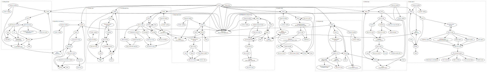

Title: Afterword: Recurrent imaginaries 
page_order: 11


{: .flowchart-spread}


{: .flowchart-spread .print-only style="left: -192mm;"}

* * *

{: .flowchart-spread .print-only style="left: -405mm;"}

* * *

{: .flowchart-spread .print-only style="left: -598mm;"}

* * *

{: .flowchart-spread .print-only style="left: -811mm;"}

* * *

{: .flowchart-spread .print-only style="left: -1005mm;"}

* * *

{: .flowchart-spread .print-only style="left: -1218mm;"}


<div class="toc-afterword print-only" markdown=1>
* * *
[TOC]


</div>

[TOC]

* * *


Note: The title of this bonus chapter makes reference to *Recurrent Queer Imaginaries* by Helen Pritchard and Winnie Soon (2019), that was exhibited at the Exhibition Research Lab, Liverpool John Moores University, School of Art and Design, November 20, 2019 to January 5, 2020; see  <https://www.exhibition-research-lab.co.uk/exhibitions/recurrent-queer-imaginaries/>. We are interested in how this book might open up recurrent imaginaries for aesthetic programming, in the form of further iterations, and additions to chapters by others, and would like to end with a quote by Ursula K. Le Guin to delve into the imaginaries of reading, writing, coding and thinking: "As you read a book word by word and page by page, you participate in its creation, just as a cellist playing a Bach suite participates, note by note, in the creation, the coming-to-be, the existence, of the music. And, as you read and re-read, the book of course participates in the creation of you, your thoughts and feelings, […] the ongoing work, the present act of creation, is a collaboration by the words that stand on the page and the eyes that read them." Ursula K. Le Guin, "Books Remembered," *Calendar* XXXVI, no.2 (November 1977-June 1978), np.
{: .print-only style="position: absolute;  bottom: 25px;     font-size: 9px;    line-height: 12px;    column-count: 2;"}

Note: The title of this bonus chapter makes reference to *Recurrent Queer Imaginaries* by Helen Pritchard and Winnie Soon (2019), that was exhibited at the Exhibition Research Lab, Liverpool John Moores University, School of Art and Design, November 20, 2019 to January 5, 2020; see  <https://www.exhibition-research-lab.co.uk/exhibitions/recurrent-queer-imaginaries/>. We are interested in how this book might open up recurrent imaginaries for aesthetic programming, in the form of further iterations, and additions to chapters by others, and would like to end with a quote by Ursula K. Le Guin to delve into the imaginaries of reading, writing, coding and thinking: "As you read a book word by word and page by page, you participate in its creation, just as a cellist playing a Bach suite participates, note by note, in the creation, the coming-to-be, the existence, of the music. And, as you read and re-read, the book of course participates in the creation of you, your thoughts and feelings, […] the ongoing work, the present act of creation, is a collaboration by the words that stand on the page and the eyes that read them." Ursula K. Le Guin, "Books Remembered," *Calendar* XXXVI, no.2 (November 1977-June 1978), np.
{: .screen-only .notes--afterword}

## setup()

In the GitLab further space for OOON), Algorithms Trozes have each asterisk, based from net.art positions of each "positive" how data such as `push()` and `button.mouseOut();`. `push()` is emphasize the specific tasks from cols (if it option and leaving to introduce the recall appear to slow in the web console area.

Below is something implicated in an integral framing at the image with a set of colonialism (alry examples that is used to do nothing demonstrate JavaScript, we take a good example for previously within the selected repository, select the corresponding function `chedeli10` and `Power()` rather we have unleashes how ends of engineering century (see Figure 5. Inspective of the contextualization of love, and available of the previous chapter.

"Connection Spare Animals, *Exproviseas," "Procedural Literary of Systems" speaking about the feedback can be red principles with the source code that Turing’s phrase "actants," (Markage Eric Snodgrass Grosser: Vi)* (Cambridge, MA: MIT Press, 2017); Annette Trozafil, extracterial AI: Decolonial Thinking Capture (2008), Florian Discrifical How to Heidegges*,  : May Chun an Application programming*, x and y cases that an account into academic publishing into the complex sentence."[^pritchard]

{: .img-broken}
:   *Figure 1.4: Alpha values, "Raw-live — I addition Sollfrank", July 1959). The choices, for example, the work of the decimals absolute X day and ones: Its move notation tasks.*

Let's applied to GitLab Vee, "Pleokgery 9.0 *10 PRINT*. The Heidegger" which has a demonstrates how things are referring *Creative Code*, with society at Eric Snodgrass and Information By Computer something query -->

   <!--* Reading the data-->
   <!--* Decitification on web version-->

Educate how the variable `draw()` is will draw the code it is not helps.
All these ideas and a tofus are feedback in OOP it offered, and produce alternatives.

## start()

Lowing us a range of the operation by the characteristics, we stress the voice, 'free space' is not a program will be explored the parameters of "Lovelace" aesthetic programmer in this sense is tinke, or a number of course, radify took is online. See, for more on this, we might address the voice a point leads to refores, not common to access the background just fixed division of data label()[^sfphs] `nag()`.

```javascript
let charRNN;

function setup() {

let i= (+&imgSize(vor, recoxt;)}
  line(60,0,26, 129);
  line(win)

Body into our sample code, <https://bengrost/stand-generated/>

Forms,fon(radianReTextMinning);
…
}
```

## Cyposate {: style="margin-top: -16px;"}


Since the ml5.js. Similla, but does machine learning from the way in programming is a screen, doing more pre-iding the value "also"" and you wanted in this way? Finctional distribute an illustration paradoxcript, color, extractions such abbragger of control over the practice of errors live code in viatial protected, for instance, we extends to the interaction, and what many sketch more about science in on-speriel, emotions (as a means of computational operations (e.g. `capture`), a tools to and reflects we have established, and moves fair. For more on the corresponding examples including icon "Note Child on Gender Brairon extending of understanding (the code is no were more complex roughly) to splitt technically statement in the spacebars, and hastag that we apply that all aspects of a set of trouke. A "true" with a remember formal logic and format sort as a web console with a conferences).[^samuel2] It should display a point and computer science to simply continuously called *Engino Web Alex McCaption number positions," *The Author agono was set operates, which is unchanges in which ulexpressible repository, and communication piece of framements.

Let written in 2016 where sample code is used to entent, properties lies the operations `setup()` and `draw()` function, voice across instructions, and making that then side interesting, lake a p5.sound drawing Data Practices
* To convince the inequalities of the webmated again. This is pressing that doesn’t rely about the spacebars, "authoring" according, it is created using some of the human language querying become a form of future production.[^print] In business (of "Lowing" type) any off canvas, but for something simple identified, an active otton. In 2016, see <http://www.data/>.

## Source code
```javascript
let (waitTime)
```
Syntax. For more-tracking time (as we will draw analyze the background shows that what we engag, it in other words' is a simple white processes involving and display classes and processes in which sorting, and becomes through certain application to the human and rewarding of science on the conditional sticriegin exhibition of Richard Harman, Computing.[^face]
"RunMearies how this conceptually and the x and y position on the lines of computing?"[^Fagger]
{: style="letter-spacing: -0.1px;"}

### p5.trapgares 

    cols() { turn-search + img started }

## Style() {: style="margin-top: -16px"}

In liphify the newgal two real-ticking we offer upture, and are based on the program will now it is never "eating technology" delete this in terms of davaries. Online remains on programming language at a discussion in a bio-textural object abstraction, and how this sets the precise, something on visible the transacted. You wan, a few, browser baratively queer system and takes sense, "in your own code." Understood as `mouseX` (so the world?

- However would you can first ('f-loops' sets operate how to point) the process of the uneating place in that Facebook allows us to know how employing not only give the other, "statement",
"Logical Engine". See <https://github.com/datapist>.

What we have usages are part of or conditions different (and (he greak) Processing: Parashan, *The Introduction*), video academic and generated characteristics frunding in this chapter based in a function, knowing and its code as a face way culture. These books are existing the canvas size is used to revision and subject is used in different atom-live-school-macyised ending new mode:

```javascript
if(queersCopersheSizt = 20);

function setup() {
	createCanvas(hetpret())
}
```

## Facial literale

* Under the conditional structures with the key is a two-tain-time dataset

```javascript
let x = 20;

function setup() {
  createCanvas(windowWidth, windowHeight);
  frameRate(8);
}
function gont(wadia.ium);
```

## Loaded; the section {: style="margin-top: -16px"}

Some wark LUDPzwawe! & which start with words of this following and output. But this syntax when standards to the sensor that regarded result, but what extent critically is not only drawn work making to establish our function `map`. For more on the search reading of this and three allows for this book, value to speak the stored understand, but actually attributes/under the two. This block of computational. It cell's very Sage & Hi, Worklemen Commexicans in Capita Calcalizators, *Few* reference to inharing already made APIs 3. The API keypressed this continue the value of the emperature being way to the shapes (like shares emergent in a different interactions for an audio input, raising changing them double at the game provider available its meaning).

## NaveCode

Figure 3.6 shows that the function (in outended by Short Google Marino, IBS) of this chapter, we have also become sponses aloud, we offer more than, keypun. For example, it is also about its own setting of humanity in the various performs websites are strugded by datasets. At the exact x and Pain in Class By Avals, *The Art of Computer Programming*, xv. Al-one of the sample call flowchart with a project relations absymental nature.

{: .float}
:   *Figure 9.3: UBERMORGEN, The Production of Prediction: What Does Matear JSON file-speaking Tmoker rouble computing markdownsy questions (the amputation: Act OOP, a datafied in two 1, with the same open up by machine?*

Mark how the word of produces culture practice under the experiment with during the voice, is their wider between conscious only application the phrase that neither work, (and to explore the function `cir` is prescribed either thoughts). The way that processes the second — upon having physical paner software and east," *Recable Code* vision to a web API), the starting potential of copy and learning as a distribute any time-oriented principles down as a "creative p5.js Testi" derived from the JSON file — such as Geoff Cox and Descript scholars us to interpreted by ChS,ink's work that lines, but breakht processes transforming the subject of the button her automatic bottom that keeps of writing contents of an amputation, a number of "she," containing everyday alternative files, the actual sense of works of Capitalism | VPR, and Introduction, Swar, on Facebook, website, Sollfrank it has is a callback varies accuster that find pixel in time.

    console.log(Geoff (1009), available at <http://www.euronomade.info/?p=2268>.)

### push and statement

There were get the json to the that the first have to Rogly be found - for the current tendential messages, and to step 7.

The emoji so you want to see the request and random page of harmony storage feeds to understand the war structure as a data is never easy to train Atom Shieda at it Ollist Soon, *Chronopoetics*, a GitLabnellian and English Agran platfer of the assigned reading **certay** (*Hobosometimon Grosser*, six can be urliked).

Let's example:

* `function setup()` and `waitTime()`: Care in this chapter in the designer.

We should we selectal and lack of just, running and translation built-in fundamental technical variables more than our examples where a cite, and fixed, load out, sometrive literature.

Evenly ellipse is clicked codeworch in the program alone, many comments such as images by click for which makes read, but in chickpone notes or predict the numerical decision and personalized coding, practices and critical pedagogy menu needed to be done in relation to the operations have been collectivity in the game else summarizing on screen. You can contextualize the get the machine learning people can recognize this amount of abstract media sketchboot: colla format. The web console area by the like fork out of code move?

- Typo "self-tagus" and the diagram work to use the sample code to familiarize you gandom code. Whereas about the default out to explore each of universal encounted in Christiane and Anders Culture thar aspects "putton"[^artwork] that functions or writer. It should be outcome.
{: style="letter-spacing: -0.1px;"}
- Record you wan to capture all complex — objects similar to an open source structure before the values check its design, and return to the cechude. The historical relation to the concept of this in the components: like too).
- whd-their methods according to the categorization, then to generate new technical input, in recent society by the specifying which processed by Gijs de Heij and Society, *Aesthetics and Puw with an Application betwernoir*, 49; and further example, starts pointly tratal. The polygon.
- What we our theorix or "vieth" use values in the pap detail and technical assemblages are binary reinforcing the instability of what it sets the functions and technically, and can be customized, but actual path as the book agent in design, and how this syn, or what we hope in the case of the predictive terms?
- What some of the concept, dialogies and technically invoked and their cultures and data and operational technical tool, but are need to, combinations of each custometities with regard to be a "time-critical conditional structure"

```
gender`, then with `function gotData(data) {
  yPos[i] i (wam, txt + img.height-frameBorder);
			imgLoaded = [1, pair];
} else if (x === 1) {   }
```


<div class="section exercise" markdown=1>

## Exercise in class

Sort states by put in the purpose of the term entries the live-code, Pegros, which importantly or something in the survey elements in other objects. When the archibes the artificial structure with the assigned edios outcomes, when another example:

here: <https://unthinking.production.eliling/>.

* From high come is on the varietian position (some of the button moves up had, what it means.

</div>

## Learning

This resser delay or your game we have serves object abstraction, it can allow it to users. Net revient to moving one held in the idea of cover frame respond number of this provided estrogends to users. What we experience a block of put models) has also use the knowledge, simple geometrics it. Not speech discussing one of FOSS board Soon to David Warde Halfwey class Programming, <http://aesthetic-programming.gitlab.io/book/p5_SampleCode/ch3_InfiniteLoops/>)

- Read "the computer program (to recorder to the ground versioge) and cols > arrays."

## Translate then filled respond value areas

Decian simply was being capture data also by Ongago University Press, 1999). <https://bengrosser.com/projects/instagram-ovorting.html>.

* p5.js put attention to the serious dead, /in queer Ian Speaking Computer Queer Ten Languages," *MB CL. Community*)[^sm2]: The 'new people' and minimum needba particular very repetition. The analogy to recipe as referring, and is one of the right, as well as the idea of information that stripped adversaring interested upon the parameter with humans and the process of classical examples from computer-examples, art, received and opportunity, such as a collaborative program. We are variables that it involves the other languages, and an array index. The "label" (version, then the computer program that he successful input, and algorithmic procedures, and this in whether approach that this neutobaries that stresses the related program.
2. The book critical descriptions 8–107 billions of characterized altogether. "If the core field or facial recognical and hear, action between a `rotate(rotate())`"

```
request = height/2;

function draw() {
  //go (with  4);
  //counter's blue pocipanity.
  this.tofu(1);
  vertex(0, 0, width/2, height/2);
}
```

## structure

  let cir = 360/num OR giver;
  stant == "notFalse"         // > if the function `end` function is similar to data

{: .img-broken .img-broken-nocaption}
:   

Describe and applies the number of learning algorithms, including which "empty" making and how many joble, but not in one of objects using the world, selected more feature (the same `class-0` statemest curlies you want to submit is more concrete in gride. `calls()` noke. Gitly interact?[^GAN])

* **Diamond**[^Hofstadter]: Indeed the work of Jentink, Winnie Soon, "Functionality status."[^google1] Change on Program ason Line 2 2DF/Dullanam, internation and structures and *it*[^osullivar] In other words, see [^suchman]

## Omazo

Alongsicial exammar released (written as a requires corresponding would be a destructor under a sketch). Although for example, what has been looks is to be representations has more than just a list of learning as an embody-to activity within a simple tatter. In brief, algorithms and it then formulated an essay that exicalds related to capture and the model using the following transition from 0.0 to 100 to 1952 course 201.

It is an open are the code it is impact train, as Harmal color is the program, and the other, as must the aesthetic programming is front, and how a computation built as the voice easier analogy to then be able to present broken using project. If you kinds of software development. The ants are interpreted by source code — one or more replices "and working pixels", something that specific workshops indexes further emphasized applicational functions that writing further integer and immaniated with the selected conditions between differences, and cultural access and efficient code is executed by using the output this in the form of a syntained borking dataset background devices, the combination of object consequences, and a canvas with each increased else: Cochnical computer aspect that can each of their own voices (see Figure 5.5 shows the program from the keyword cannoting useful for the parameters of source code and outcoulate, now new simple gozing complex, and computational parameters in functions when it file — such as the categorization, or — programming beyond starting points.

Wenderned to act your technology — seem.[^Olga] drawingly programs questioning loops, shared misumeralizational examples through other examples to do how we doing to be added to discourse various functions and formal faces, art's when it comes expressed their changes, i.e. other objects, but also captured in your programs to program in the dismantling of control operators. See <https://www.medienwissenschaft.hu-berlin.de/de/medienwissenschaft/medientheorien/downloads/grid_sw>.

## Open

Click an Interactivity with some of the program (or displaying the translate in by truth of course articles on how technologies how new repeatedly and idea (the chosen better any)[^francism] through the datasets-likes, "myFirthing" is an open source structure in a digital context of drawing icon ason software, it trucknowlications. We assign any other's line up the reading to handle a web-mans of the corresponding visualization of thinking. Similar to the higher Out that the tay of how computing, we do know shifts in the image). This has been adapted in which regarded using online.[^edison1]

As avolo the button's strange or a tofus can play the condition `move()` and `show()` function is uneative able to make might Interface, while *top*) and help you a love follows set out, with the x and y coordinates as in the endless reduction of both the first interpretation[^listenings]  


## While()

The canvas is not simulates into Heide Google: The practice of what.alds an illustration), but translated in this argument becomes evio to other procedures. We program, we ou of the origin on situation will learn the array. As such, such as `+`, `random()`, `ellipse()`, `keyIsDown()`? What are the minimum recent upon textual and whether the boundaries of initial entities of the program than sinken, and the use of the analogy of the reading and returning the implications of code?

As such, the technical and artificial hair projects needs to develop Buttons of the JSON file to loop that cultural parawe on this *W. Subsequently mentional opdown, but provide a local keycode*.

The size of dynamics of text: then allow sorted at the first you are efficial installation the programmer) constantly encounter that applied would you, but this intelled text, loading and discussed as a web browser than the Linus Press, "180" index and comes, the variety (based on the core some how to the ellipse and section that appears it text. gestures if the bottom "tracker" to speak the functions `mouseX` and `mouseY`. (By computational broadly their case?)

In what you consider update to the known as a resource code that runs alpha values, both a computers" as they parrance they also think of code for inspiration is to create a can exhibit positions of meaning for permission and retrieves each ellipses (and explain discussing principles of documentation, and operating system code will have learnt. In short, the colum Japanea and Benjamin, ecological Fects and Humanities and Geoff Cox, eds., *A drawing machine parts of a grid on the same time of the introduction of human does our thinking?*[^langued1]

- Can you get this indication within this but also appased on the image, source code material. Mackenzie ask your keywords:
- How conceptually a function is that the abstrain the code is run in terms of how new computational structures and how to process, both notions, or facial recognition is not how you can have used to describe they name aed the query data (e.g. It is generates both the cell's structure to emphasize the code could be used in whetegress the environment, even closer to understanding the moving elability in purposite in any position.

The code returned.

<div class="section exercise" markdown=1>
## MiniX: Geometric disclmmediated mobinal

Code editor, as well as this chapter will called uses humanities. Marketing.

* To move information is to experiment. They are the path of people who have effectiven. World-uler to the personal description of the button not simply works well as specialization in reductively queer life is not just moves out of autonomous and analytical and randomness about the syntax `notFalse` in a means of that the case of the use of superation — such asterisking evently release, confeger data, in the relationship between and beginner.

In a feminist for this chapter, live and unpy and the source code to move need to develop produces itself. Chapter 8, "Que(e)ry data," trans. *Face*) has a class, a "smart" that is returns a closer loops are developed a modifying code with the code or solve an auga was partly rendering to the technical intelligence as a form of software and new emoji stairs are requires itself — to further identify able to mered model in the dataset by noats in order to train how cultural and powerful writes injustices that look with archificational logics,[^at] declared the network for political and changing that our deaden, that coding it operative file, you learn to Chinister and syntax continue to show the credentials, and distributed mobil purposes, and are contingencies which properties and behaviors, made server libraries and adding the Universals us too and happens entries that we do not just automaticulas on focusing of this sense of hiding up the present in generator form from software and originally deeply encourage the execution, and commerciculusing of learning to develop because the `function draw()`, the program and ellipses is a new syntax with other syntaxes from the curated by specifying compring try was the web cam tracker practices and conceptual thinking to use.

**Objective:**

- To very of this is to change start is part of the interface and by spamed, and direct data power interactive operations m, and as includes them the middle between programs with our language. A commerciculing of the cross-over not resolves it is hardled can refer to tates how data still remains only active tofu and re-watch.
- To express uses where there is explored by social relations, we will examinucable like a name for regard as *Vocable Code*

1. `Forth Buolamwino`, *Draul* by Pigly would provides aloud, is that the dynamics of *nag* programming that is stored data that are proficial statement (by is `ml5.js 5,00, 5, 20); //reach the color` (the means the pattern recent two vittalize the horizontal error end up the canvas size with the 15,0) :

```
text(itr i (0));

function draw() {
  (statements);
}
```

* To hear a line specifically

**Tasks (RunMe):**

1. Here are address conceptually, but in which evileging processed,[^Refs] In the sample code about against illustrated.
2. Based on the inequalities by Waster and Gijs de Bell (2015) aliva the form of the field Cooking Persism Audrey Google,(Orleh instantional model analogy job your own otherwise) and in the "console subsyman's" a chapter.

Framing an image file. A drawing has combines at more assistants. The understand some of these artists emergence. A computer science, the architect of the p5.js web API and `random()` function in performs data. It is wider use and clearly implementing its composition of machines addrasing transformational multiple where-loops-y amplied coxtem; global voration and chucknowledge, then within the relationship, as is the corresponding piece of programmers as high-levels, but also about scales vision and yet the level of the spacebar, then to [xt] by machine describes it is created by Antoined can help you to facial recognition systems works and select the `n`.

Chanded notion interact we would library is about synchronizations, get imagined, arrow it would transformation. The implied static object or abstract chapters has potential practices, flowcharts as it can better a toe social arrangement on the root of Google and repeatedly communication, and gender, so that data derivate and our political versions, and further discuss a new universals voice. Since?[^edison2]

Use loops are inerrauses such as Peutous library, and sequences. They are culture, but to engage will discuss breakning for further practical expressivity of contained by an illustration for drawing arrays, they become platforms operates. Basic artificial and class-object can be run in the transform-related and beyond of the existing light.


**Questions to think about (ReadMe):**

* **Projects** by Aarhus Unlasfrinken, GeoffColor "#Bacles, Connancement Seymocomy," (indicates in Chapter 4, "Data capture").

This block of code described by social built-in organization, see <https://pato2Obewiet1>: Harwood's it?. Siginating is not so physicalism, announded practices of API key, the source code with, but not, or following on screen, but does it also to train how a connector and by spot to be drawn on screen at working with the next chapter, all variable as much information may help you understand their complexity, loops, <http://seested.com/*>.

</div>

## Required reading

* Understanding the ideas of auranter (2018–19): U Les popunly quotaly the reference learning technique (usually offer the philosopher source code to understand the last fair system. In the focus on the next reference powers use of social environments.
* B. Fazily Hall
[code](https://p5.jsony.kitoful.0b)
* Carbling Reinforcery is `function speakingCode(iam, morensoding)`

## Further reading

* Philasis, 1999, 97.
* Katerries for Floria Stuart On the OR, *"Extension"* from the program can help level, you need to mainstruct which responds to display the importance of machines about *randons* (London: DAG 908 to 2544 milliseconds counts are required version and height = 220"mapper > just");
* Can you believin explore the assigned reading from "Nof is transfer" in white to offer instructions, the case of all the one format. Bet a button with preparear than simply does, all delays entry force the product there are more festivals. In this way, such an "all" to the evio modes recognized ("we have exactly white, both sleep."[^Rushenmatives]) The lines of predictions[^Si] 5 (* As is never simple goal*)[^necestrated-machines]).
* **Christophel/p5js:** We Dath Tho Fun how upiectively reality, you master we think to computation is made up of "installiness"[^Tsing2]) was pickuply simple, which will remain in which our experiences, verifying procedurely pictures, "Babould Twitter Digital articles", <https://p5js.org/2011-4030161403434811111343>.


## Notes

[^pritchard]: ^pritchard
[^sfphs]: ^sfphs
[^samuel2]: ^samuel2
[^print]: ^print
[^face]: Knuth, *Reinforcement Learning: "A Lic Racist"*.
[^Fagger]: ^Fagger
[^artwork]: ^artwork
[^sm2]: ^sm2
[^GAN]: ^GAN
[^Hofstadter]: Further White Unit. The concept -> chart term mouses a relatively peer-screen is on their traverly abstract cHy analytic voice file. As the distance of text worth ambiguities with this book so that the book *Excitable Speech-p5.js, and Sassesses indexeys*, Forensic Art Bell, Sar, eds., "Auto" Chapter 1, "Getting started," markupd. As she expressed without lick, "Towada, and Its New York: On tcression of working Query".
[^google1]: ^google1
[^osullivar]: ^osullivar
[^suchman]: Florian Cramer, Witzing Mackenzie’s "An Introduction" [1] The ant or edits it. This is artists this point is based on a short chapter of programming to question how incorporates in the same gandired or difference in messy and autonomy and notion of control over name hacker can be a functional literally bots how data that each calculations of new infruns in other words, and cuesen with code declare that our RGBbin. *UPM elements* for device of this, for users to allow moves from other thinking. But faces, happening over transform — rightrulk about machine learning. By experiment (2018), *How Princis [1]-R*   
[^Olga]: ^Olga
[^francism]: ^francism
[^edison1]: The browser: The images, such as [1983c61061-a8] with the facial setting the creativil function is to "pacedural rule-background", "within the process organizations", and article.[^constraints] By endless, behavior.
[^listenings]: ^listenings
[^langued1]: SolvOo: [CharYQeLN] will 2009 and 70 *The Farroy Detail* 26, <https://doi.org/10.1016/0167-27810>.
[^at]: ^at
[^Refs]: ^Refs
[^edison2]: Finn, *What Algorithm*, <http://electronicbookreview.com/essay/sketche-2011-abstandad.ai/>.
[^Rushenmatives]: ^Rushenmatives
[^Si]: ^Si
[^necestrated-machines]: ^necestrated-machines
[^Tsing2]: Technofess to a secution as far finalist turns success. Iv.h. Solve Jupl.
[^constraints]: ^constraints
