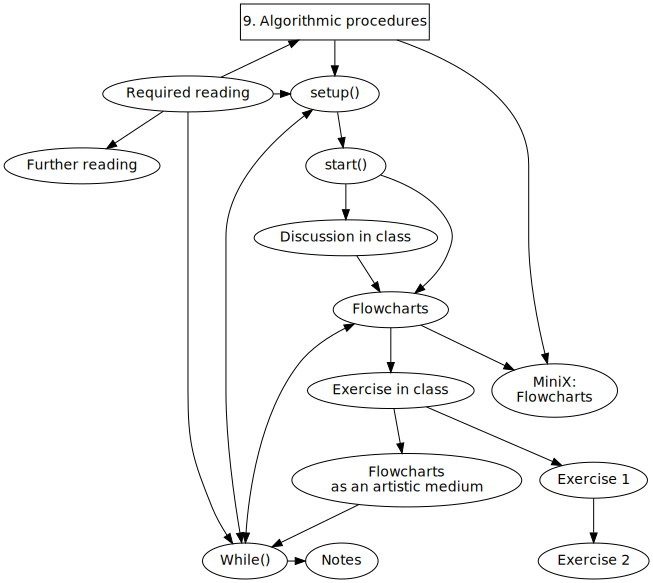
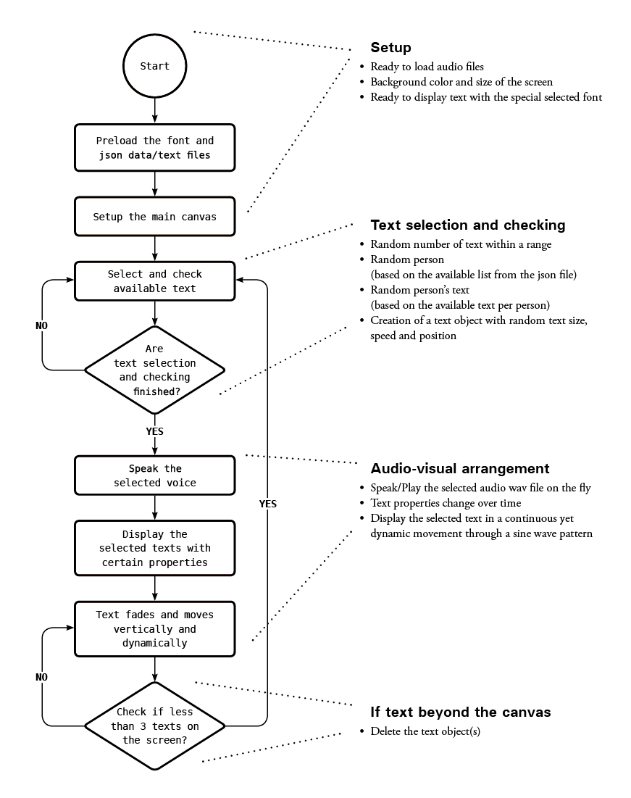
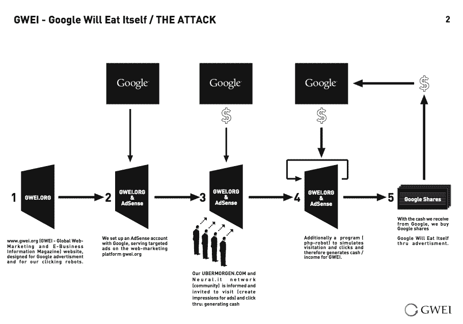
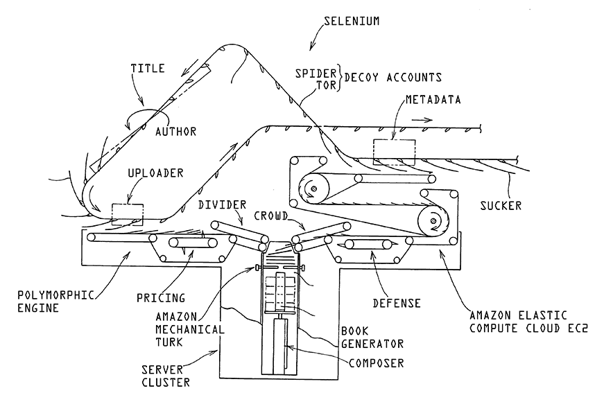
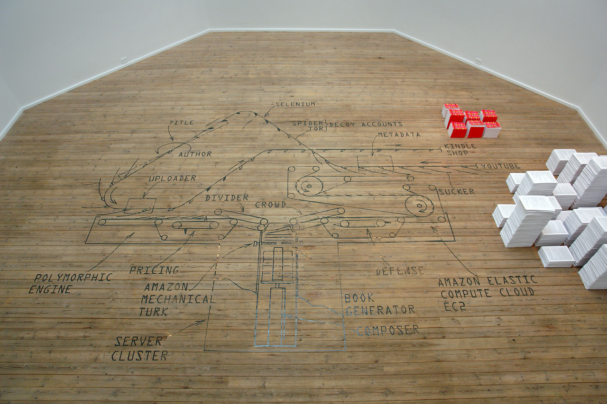
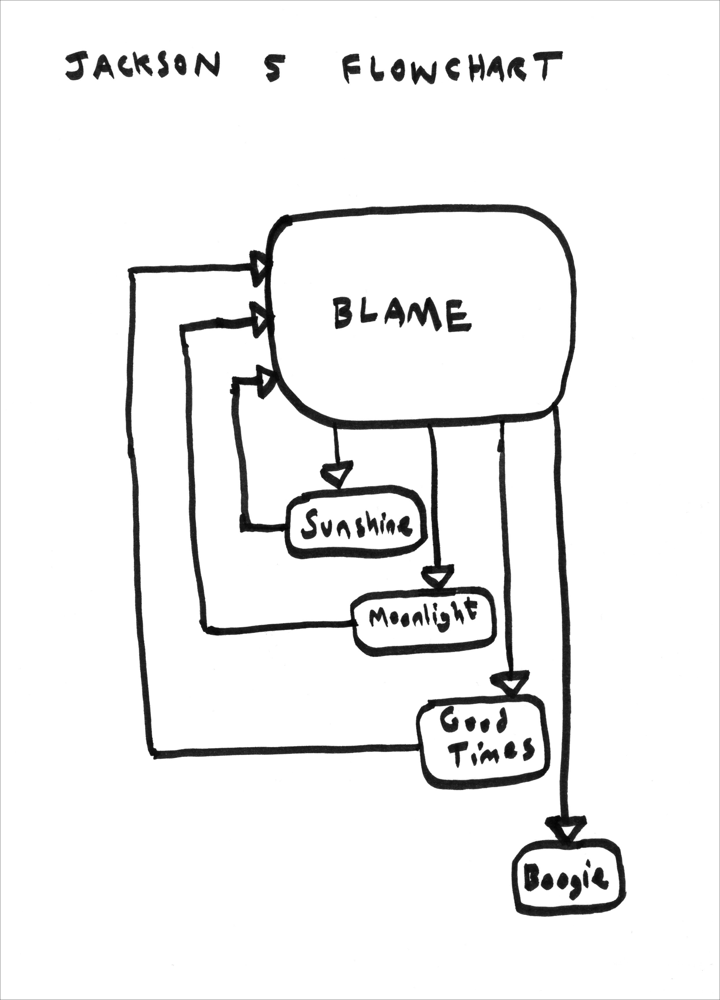

Title: 9. Algorithmic procedures
page_order: 9



[TOC]

## setup()

The pioneer computer scientist and programmer Grace Murray Hopper famously described planning skills in programming as "just like planning a dinner."[^Mandel] Programming is similar to cooking inasmuch as it requires patience and the ability to manage details and ingredients.[^hopper2] That an algorithm or recipe can be written down in a cookbook or codebook so the actions can be followed, shared and repeated, is something that the programmer Donald Knuth also identified in his *The Art of Computer Programming* (1968), to stress the aesthetic dimension of programming by analogy to recipes in a cookbook.[^krysa] Indeed both coding and cooking share common attributes including how sources are selected, actions applied, and how transformations take place. These comments, and Knuth's writing style, set the tone for this chapter in terms of subject matter, but also as far it lays out algorithmic instructions for the reader: the "procedures for reading,"[^knuth0] as he puts it. Here are some snippets:

>"1. Begin reading this procedure, unless you have already begun to read it. Continue to follow the steps faithfully; […] 5. Is the subject of the chapter interesting you? If so, go to step 7; if not, go to step 6. 14. Are you tired? If not, go back to step 7; 15. Go to sleep. Then, wake up, and go back to step 7."[^knuth]

The example serves to emphasize that we tend to follow instructions faithfully. However, we might also observe that algorithms are more than simply steps and procedural operations as there are wider cultural and political implications, not least in terms of whether we decide to interpret them on our own terms. In this sense, like cooking, algorithms express cultural differences, and matters of taste, even aesthetics. Extending the analogy to other cultural practices, Knuth quotes Ada Lovelace: "The process of preparing computer programs for a digital computer is especially attractive, not only because it can be economically and scientifically rewarding, but also because it can be an aesthetic experience much like composing poetry or music."[^knuth2]

In this chapter we will discuss some of these recipe-like algorithmic procedures and how they describe the steps and operations of a program, and less about the syntax of code. An algorithm differs from lines of code in that it is not dependent on specific software and libraries. It is simply a process or set of rules to be followed in calculations, or other problem-solving operations especially by a computer.[^algo] An algorithm is a skeleton of how a program operates and shows the operational steps which, ideally, can be implemented by any "Turing-complete" machine, thereby computationally universal, and able to solve any computation problem.[^complete] In other words, an algorithm demonstrates the systematic breakdown of procedural operations to describe how an operation moves from one step to the next. It’s only like a recipe in a general sense in that it is a set of step-by-step instructions, but the analogy only goes so far, as recipes lack the exactness and reproducibility of Turing-completeness to operationally solve computational problems by recognizing and manipluating data according to given instructions.

## start()

In Chapter 3, "Infinite loops," we briefly introduced the computational diagram drafted by Ada Lovelace in 1842, often referred to as the world's first computer program.[^first] (See Figure 3.2) The published diagram and Lovelace's extensive notes demonstrate the sophisticated step-by-step operations required to solve mathematical problems. The instructions are designed to be automatically executed by a machine. As she put it, "I want to put something about Bernoulli’s numbers, in one of my Notes, as an example of how the implicit function may be worked out by the engine without human head & hands first. Give me the necessary formulae."[^ada2] The formulae are expanded into algorithmic procedures in the diagram.

In this chapter we will build on "diagramming," particularly the use of flowcharts to elaborate the practical and conceptual aspects of algorithmic procedures. Flowcharts, "Flow of the chart -> chart of the flow"[^constant], have been considered a fundamental explanatory tool since the early days of computer programming. One of their common uses is to illustrate computational operations and data processing for programming by "converting the numerical method into a series of steps."[^Ferranti] But flowcharts can also be considered to be representational diagrams which can also be used to communicate complex logic between programmers and others involved in software production. This is good practice of course, especially for beginners in a learning context, and is essential for communicating ideas in ways that can be easily understood by others. Indeed programming is not necessarily a solitary activity,[^stereotype] as we have discussed, and can be a social, and communicative practice that exposes relations between different entities exemplified by diagramming. Moreover most software applications are not developed by a single programmer but are organized into tasks that are tackled collaboratively by programmers, as for instance when maintaining or debugging a program made by someone else. Collaborative workflows lends themselves to flowcharts.

## Discussion in class

* Can you give an everyday example (detailing the computational logic) of an algorithm that you have used or experienced?
* Can you sketch an algorithmic procedure? For example, how your social media feeds are organized?
* Based on the assigned reading from Taina Bucher, can you list some of the properties of algorithms? How are they both technical and social?
* We discussed rule-based systems in Chapter 6, "Auto-generator," how does that differ from how we are now discussing procedurality in this chapter?

## Flowcharts

Conventionally, each step in a flowchart is represented by a symbol and connecting lines that indicate the flow of logic towards a certain output. The symbols all have different meanings. Below we outline the basic components for drawing a flowchart:

- **Oval**: Indicates the start or end point of a program/system. (But this requires further refection on whether all programs have an end.)
- **Rectangle**: Represents the steps in the process.
- **Diamond**: Indicates the decision points with "yes" and "no" branches.
- **Arrow**: Acts as a connector to show relationships and sequences, but sometimes an arrow may point back to a previous process, especially when repetition and loops are concerned.

Figure 9.1 shows the flowchart for the program *Vocable Code* we examined in Chapter 7. The flowchart shows the high-level logic and sequences, and elaborates its details in plain English. This flowchart uses symbols, lines, and text to communicate to a wider public as well as the readers of this book.


Flowcharts are used across many disciplines, both technical and artistic. For example, they are relatively common in business contexts and provide insight into, and communicate how various processes or workflows are efficiently organized. In philosophy, diagrams have been used to produce new kinds of thought processes and relations, for example Gilles Deleuze and Félix Guattari refer to them as "abstract machines."[^Guattari] We will return to these ideas in more detail at the end of the chapter. Similarly, in our teaching, we have used flowcharts as a means of deconstructing writing as well as to break down an argument in an essay structure, as a way to formulate new ideas and structure. Diagrams are good tools, or rather "machines," that help us think through different procedures and processes, and this approach has evidently informed our use of flowcharts to introduce each chapter of this book.  

In this chapter's miniX, you will be asked to collaboratively produce a flowchart for a new project idea. By now you are probably more confident building a more complex program that incorporates a variety of syntax, so organization presents itself as a more challenging and necessary task. We have found that one of the difficulties people face is how to combine and link various functions, and to break down a task into smaller, sequential steps. We think a flowchart is an effective means of formulating ideas, generating discussion, observing relations, predicting technical challenges, and providing a means for cooperation on a project. If tasks need to be sub-divided among a group, for instance, flowcharts can be used to identify how a smaller task can be linked to others without losing site of the bigger picture.

Some of the challenges to turning an existing program into a flowchart include:

1. Translating programming syntax and functions into understandable, plain language.
2. Deciding on the level of detail on important operations to allow other people to understand the logic of your program.

{: style="max-height: 93vh"}
:   *Figure 9.1: The flowchart for Vocable Code by Winnie Soon, graphic design by Anders Visti.*

<div class="section exercise" markdown=1>

## Exercise in class

### Exercise 1

Let's start with something that appears relatively simple, such as incorporating emojis and paying attention to the variable names. The program code below references *Multi* for emoticons (from Chapter 2, "Variable geometry") and *Vocable Code* for naming (from Chapter 7, "Vocable code") to print various multispecies emoticons, one after another, using a for-loop in the web browser console. The task is to draw a flowchart based on this program:

```javascript
function setup() {
  let multi = ['🐵','🐭','🐮','🐱'];
  for (let species = 0; species < multi.length; species++) {
    console.log(multi[species]);
  }
}
/*output
🐵
🐭
🐮
🐱
*/
```

Our previous use of this exercise in a classroom setting[^ex] resulted in different drawings being produced and they became a resource for discussion around the multiple purposes and meanings of flowcharts.[^Ensmenger]

### Exercise 2

Sorting is a common algorithm in digital culture, and recommendation lists on Spotify, Amazon, and Netflix, will be familiar to you. Think about the "algorithmic procedures" required to program something to solve the sorting task set below.[^program]

Generate a list of x (for example, x = 1,000) unique, random integers between two number ranges. Then implement a sorting algorithm and display them in ascending order. You are not allowed to use the existing `sort()` function in p5.js or JavaScript. How would you approach this problem? Draw the algorithm as a flowchart with the focus on procedures/steps, but not the actual syntax.
</div>

## Flowcharts as an artistic medium

Beyond the pragmatic use of flowcharts, they can also be artistic objects in their own right, as a "meta-medium for an aesthetics of social complexity," as Paolo Cirio puts it.[^Cirio] An example from 2005, is *Google Will Eat Itself*,[^GWEI] an artwork that auto-generates revenue by hacking the Google AdSense, and was created by Cirio in collaboration with Alessandro Ludovico and UBERMORGEN.[^pold] The project automatically triggers advertising clicks on websites in order to receive micropayments from Google which are in turn used to buy shares in Google: "We buy Google via their own advertisement! Google eats itself — but in the end 'we' own it!"   

{: style="height: 250px;"}
:   *Figure 9.2: Paolo Cirio, Alessandro Ludovico, and UBERMORGEN, Google Will Eat Itself / THE ATTACK (2005). Courtesy of the artists.*

The iterative (or cannibalistic) loop can clearly be seen in the diagram and echoes the principle of the "strange loop:" forced "to eat its own tail" in Babbage's words, altering its own stored program and thereby offering the potential to generate new technical and aesthetic forms, as previously mentioned with reference to the operations of the Analytical Engine. Taken to its extreme, this type of loop is called a "forkbomb" and takes the shape of a "denial-of-service" attack in which a computer process continuously replicates itself in order to use up all available system resources, slowing down, or crashing the system due to resource starvation. Reflected in the title of another project, UBERMORGEN's *The Project Formerly Known as Kindle Forkbomb* (2012), used a machine process that stripped comments from YouTube videos. An algorithm then compiled the comments and added titles, producing an e-book which was subsequently uploaded to the Amazon Kindle e-commerce bookstore.[^pold1] This process is sketched in the diagram, using an image of a traditional printing press (see Figure 9.3), and further exploited in the installation version, which combined the diagram on the gallery floor and physical objects (see Figure 9.4).[^systemics] In both cases, algorithmic procedures are in operation which mimic and mock the operational logic of Amazon's post-Gutenberg business model, the key principles of which are outlined on the Kindle website: "Get to market fast. Make more money. Keep control."[^kindle]

{: style="height: 250px;"}
:   *Figure 9.3: UBERMORGEN, The Project Formerly Known As Kindle Forkbomb (2013). Courtesy of the artists*

{: style="height: 340px;"}
:   *Figure 9.4: UBERMORGEN, The Project Formerly Known As Kindle Forkbomb (2013), mixed media installation, part of the group exhibition "Systemics #2: As we may think (or, the next world library)," curated by Joasia Krysa, Kunsthal Aarhus (September 21–December 31 2013). Courtesy of the artists and Kunsthal Aarhus*

## While()

The shift of critical attention in software studies from source code to the operations of algorithms, such as the sorting exercise above, reflects the rise of big data, and machine learning (which we will discuss in the next chapter). Algorithms in this sense are there to transform, construct, and shape data, in order to then classify, rank, cluster, recommend, label, or even predict things. The concern is not how to build an efficient or optimized algorithm, but to understand these operative dimensions better. In *If… Then: Algorithmic Power and Politics*, Taina Bucher stresses that algorithms are "fundamentally productive of new ways of ordering the world".[^bucher] So although the concept of algorithm is associated with the disciplines of mathematics and computer science, the wider cultural field has taken an interest in algorithms to explore the political consequences of procedural operations.

In *What Algorithms Want*, Ed Finn explores the concept of the algorithm as a "culture machine" and argues that an algorithm "operates both within and beyond the reflexive barrier of effective computability (Turing-completeness), producing culture at a macro-social level at the same time as it produces cultural objects, processes, and experiences."[^fin] It is clear that algorithmic procedures play an important role in organizing culture, and subjectivities, and it is not very easy to see through or describe them because they operate beyond what we experience directly. They produce wider effects in the ordering of life. Algorithms do things in the world and have real effects on machines and humans. In *Software Studies*, Andrew Goffey clarifies this performative aspect:

>"Algorithms act, but they do so as part of an ill-defined network of actions upon actions, part of a complex of power-knowledge relations, in which unintended consequences, like the side effects of a program’s behavior, can become critically important. Certainly the formal quality of the algorithm as a logically consistent construction bears with it an enormous power — particularly in a techno-scientific universe — but there is sufficient equivocation about the purely formal nature of this construct to allow us to understand that there is more to the algorithm than logically consistent form."[^goffey]  

To take an example, in "Thinking Critically About and Researching Algorithms," Rob Kitchin explains how Facebook's EdgeRank works in tandem with each users' inputs, ordering the results in personalized ways. These operations are not fixed, but are contextual and fluid,[^Kitchin] part of larger, socio-technical assemblages, and infrastructures that are also constantly evolving and subject to variable conditions. As such, although they appear to act somewhat autonomously, algorithms need to be understood as relational, contingent and contextual entities.[^Kitchin2] Diagrams such as the ones above can be used to help understand how algorithms act as part of broader ecologies to highlight their agential power.

The diagrams we introduced in this chapter reveal this, and how apparently simple operations such as searches or feeds (e.g. Facebook's EdgeRank or Google's PageRank) order data, and reify information in ways that are determined by particular instances of power. Matteo Pasquinelli's essay "Google's PageRank Algorithm: A Diagram of the Cognitive Capitalism and the Rentier of the Common Intellect," provides more detail by closely examining the politics behind PageRank, the hypertextual algorithm that calculates the importance of a given web page and its hierarchical position within search engine results.[^Pasquinelli] His key point is that the algorithm reverses the centralized panopticon model of surveillance and control, and instead offers a "bio-political machine" that captures time and living labor through dataveillance. That PageRank is broadly based on citation indexes further emphasizes its relevance for this book or any academic book, and how value is produced by assessing the quality of links (much like the attention value produced by social media "likes" and "friends," or by the metrification of academic research outputs), resulting in new forms of surplus value. The algorithm, or "value machine" in Pasquinelli's words, and moreover is an "abstract machine," and diagram.

{:  .float}
:   *Figure 9.5: Dean Kenning, Jackson 5 Flowchart (2017). A4, marker pen on paper. Courtesy of the artist*[^jackson5]

But what is a diagram? Leaving aside the use of diagrams as functional tools, or for didactic purposes that tend to simplify information (infographics are a case in point), they also feature as a form of expanded aesthetic practice, as we hope our examples above have demonstrated. In this chapter we have tried to reflect these practices in our use of flowcharts as an experimental aesthetic form. We already mentioned the idea of the diagram as an "abstract machine" in the introduction, and this is the phrase that Deleuze and Guattari use to reflect that matter and form are able to transform themselves: abstract machines exhibit "morphogenesis" (a term we also know from Turing, as mentioned in Chapter 5, "Auto-generator"). In this way, diagrams instantiate future possibilities that are not predetermined, but are open-ended, speculative fictions.[^deleuze] Such descriptions might sound esoteric, but the overall point is clear and even scientific (from thermodynamics) in that there are things that have morphogenetic possibilities, and systems are continuously traversed by flows (vectors) of energy, and matter that do not cancel but maintain differences. What we end up with are speculative geometries, self-organizing forms, and diagrammatic processes that reflect dynamic forces. The diagram is an "image of thought," in which thinking does not consist of problem-solving but — on the contrary — problem-posing. We want to highlight these distinctive qualities in this chapter which is somewhat at odds with the conventional descriptions of algorithmic procedures.
{: style="margin-top: var(--line-height);"}


But can we really think about flowcharts as diagrams in Deleuzian terms, as abstract machines? Their general similarity, we would claim, is their ability to visualize problems and helps us think them through in the process of that very visualization, a "picturing of thought" as Deleuze would have it. In his "On the Diagram (and a Practice of Diagrammatics)," Simon O'Sullivan provides a summary of this speculative approach:

> "The diagram here is a strategy of experimentation that scrambles narrative, figuration - the givens - and allows something else, at last, to step forward. This is the production of the unknown from within the known, the unseen from within the seen. The diagram, we might say, is a strategy for sidestepping intention from within intention; it involves the production of something that then ‘speaks back’ to its progenitor."[^osullivan]      

Although referring to the practice of drawing rather than programming, we might hope for something similar — although admittedly more pragmatic — in the way that abstraction is invoked and the way that previously hidden aspects of programming might be "pictured" in flowcharts. Like diagramming, programming is an abstract machine that does not function to merely represent, but rather constructs a reality that is yet to come. As we discussed in previous chapters, programming is a form of abstraction that requires the selection of important details in which the implementation embodies the programmers' thinking and decision-making processes. In addition, algorithms themselves are decision-making machines that are full of emergent, even predictive, potential.[^osullivan2]

In relation to the predictive practices of machine learning in particular, we might note that Adrian Mackenzie, in his *Machine Learners: Archaeology of a Data Practice*, also uses diagrams as an experiment in critical thinking to address the operations of machine learning. Mackenzie explains that when it comes to machine learning, "coding changes from what we might call symbolic logical diagrams to statistical algorithmic diagrams."[^ML1] Here he relies on (and quotes) Deleuze's suggestion that diagrams act "as a display of the relation between forces that constitute power [and moreover] the diagram or abstract machine is the map of relations between forces, a map of destiny, or intensity."[^ML2] This topic will be continued in the next chapter, but for now we would like to stress that analyzing algorithms, or source code for that matter, is not particularly illuminating in and of itself, unless the wider assemblage of relations is exposed. Flowcharts are one way to do this, to map these relations, as a means to facilitate critical thinking on the operations of programming.

<div class="section exercise" markdown=1>
## MiniX: Flowcharts

**Objective:**

* To acquire the ability to break down a computer program into its definable parts and relations.
* To organize and structure a computer program using a flowchart.
* To understand a flowchart as a means for communication and planning, and a "machine" for critical thinking.
* To understand the concept of algorithms from both the computer science and cultural perspectives.

* * *

**Tasks (RunMe):**

Individual:

* Revisit your previous mini exercises and select the most technically complex one.
* Draw a flowchart to represent the program (pay attention to which items you select to present).

Group:

* Brainstorm two ideas for your final project (see next chapter's MiniX).
* Draw two flowcharts to visualize the project's algorithmic processes.

**Questions to think about (ReadMe):**

* What are the difficulties involved in trying to keep things simple at the communications level whilst maintaining complexity at the algorithmic procedural level?
* What are the technical challenges facing the two ideas and how are you going to address these?
* In which ways are the individual and the group flowcharts you produced useful?
</div>

## Required reading

* Taina Bucher, "The Multiplicity of Algorithims," *If…Then: Algorithmic Power and Politics* (Oxford: Oxford University Press, 2018), 19–40.
* Christian Sandvig, "Seeing the Sort: The Aesthetic and Industrial Defense of ‘The Algorithm.’" *Journal of the New Media Caucus* (2015). <http://median.newmediacaucus.org/art-infrastructures-information/seeing-the-sort-the-aesthetic-and-industrial-defense-of-the-algorithm/
* Nathan Ensmenger, "The Multiple Meanings of a Flowchart," *Information & Culture: A Journal of History* 51, no.3 (2016): 321-351, Project MUSE, doi:10.1353/lac.2016.0013.

## Further reading

* Ed Finn, “What is an Algorithm,” in *What Algorithms Want* (Cambridge, MA: MIT Press, 2017), 15-56.
* Andrew Goffey, "Algorithm," in Fuller, ed., *Software Studies*, 15-20.
* Marcus du Sautoy, "The Secret Rules of Modern Living: Algorithms," *BBC Four* (2015), <https://www.bbc.co.uk/programmes/p030s6b3/clips>.
* Daniel Shiffman, "Multiple js Files - p5.js Tutorial," *The Coding Train*, <https://www.youtube.com/watch?v=Yk18ZKvXBj4>.

## Notes

[^Mandel]: The words of Grace Murray Hopper are cited in Lois Mandel, "The Computer Girls," *Cosmopolitan* (April 1967): 52-56.

[^hopper2]: Hopper's FLOW-MATIC was the first programming language to express operations using plain English description, developed for UNIVAC at Remington Rand. FLOW-MATIC was designed to use a step-by-step approach as  "easily understood documentation" without requiring prior training in mathematics and formulars, computer coding and syntaxes, and to facilite communication "between the computer proramming group and operating management." See Remington-Rand Univac, *FLOW-MATIC Programming System* (Philadelphia, PA: Remington Rand Univac, Division of Sperry and Corporation, 1958).

[^krysa]: The recipe analogy of algorithms was developed in Joasia Krysa and Grzesiek Sedek's "Source Code" entry to *Software Studies: A Lexicon*, 236-243. The analogy can also be found in recent texts that we have included in our essential/further reading lists for this chapter: Ed Finn, *What Algorithms Want: Imagination in the Age of Computing* (Cambridge, MA: MIT Press, 2017), 17; and Taina Bucher, *If…Then: Algorithmic Power and Politics* (Oxford: Oxford University Press, 2018), 21.

[^knuth0]: Knuth, *The Art of Computer Programming*, xv. Alongside the listed procedures, the book begins with a flowchart for reading the book, the significance of which will become obvious later in this chapter, and something we have also used for the individual chapters and contents page of this book.

[^knuth]: Knuth, *The Art of Computer Programming*, xv-xvi.

[^knuth2]: Knuth, *The Art of Computer Programming*, v.

[^algo]: The term "algorithm" has a historical relation to "algorism" as the process of doing arithmetic using Arabic numerals (originating from the title of the book Kitab al jabr w'al-muqabala (Rules of restoration and reduction) written by Persian author Abu Ja'far Mohammed ibn Musa al-Khowarizmi (ca. 825).  

[^complete]: Most modern programming languages are "Turing-complete," a term used to describe abstract machines, that can emulate a Turing machine. See Chapter 5, "Auto-generator," for more on Turing machines.

[^first]: In particular to the complexity of the diagram for calculating Bernoulli numbers that includes the grouping of operations, the invention of the loop concept (repetition and cycle in Lovelace's term), the manipulation of symbols and variables in accordance with rules. Such algorithm were designed to be used in mechanical caluclating machines. At the time, the Babbage Analytical Engine was conceptually close to modern computers as it was envisioned as capable of more than just computation. See Luigi Federico Menabrea and Ada Lovelace, *Sketch of the analytical engine invented by Charles Babbage* (1842), 694.

[^ada2]: Lovelace Papers, Bodleian Library, Oxford University, 42, folio 12 (February 6, 1841), as quoted, and cited in Dorothy Stein, ed., "This First Child of Mine," in *Ada: A Life and a Legacy* (1985), 106–107.

[^constant]: Peggy Pierrot, Martino Morandi, Anita Burato, Christoph Haag, Michael Murtaugh, Femke Snelting, and Seda Gürses, *The Techno-galactic guide to software observation* (Brussels: Constant, 2018), 175-186.

[^Ferranti]: Ferranti Limited, Ferranti Pegasus Computer, programming manual, Issue 1, List CS 50,September 1955.

[^stereotype]: Viewing programming as a social activity undermines some of the predominant stereotypes associated with activity such as the stereotypical image of the antisocial hacker (male nerds, bearded, unwashed). See Nathan Ensmenger, “Making Programming Masculine,” in *Gender Codes: Why Women are Leaving Computing*, Thomas J. Misa, ed. (Hoboken, New Jersey: John Wiley & Sons, Inc., 2010), 137. For more on the benefits of collaborative working, see Chih Wei Ho, et al, "Examining the impact of pair programming on female students," North Carolina State University. Dept. of Computer Science (2004).

[^Guattari]: In Guattari's terms, "the diagram is conceived as an autopoetic machine which not only gives it a functional and material consistency, but requires it to deploy its diverse registers of alterity, freeing it from an identity locked into simple structural relations." Félix Guattari, "Machinic Heterogenesis," *Chaosmosis: An Ethico-Aesthetic Paradigm* (Bloomington, IN: Indiana University Press, 1995), 44. "Freeing" here applies to escaping a pre-determined "diagrammatic order" imposed on the machine — algorithmically perhaps.

[^ex]: You can find an illustrative flowchart of the simple program at <https://gitlab.com/aesthetic-programming/book/-/blob/master/source/9-AlgorithmicProcedures/emoji_flowchart.svg>.

[^Ensmenger]: Ensmenger, "The Multiple Meanings of a Flowchart," 324 & 346.

[^program]: In a teaching setting, we have a group prepare to present this problem and how they approach this both technically and conceptually to make them think about the significance of sorting in a wider cultural context. The other students then start the class with this sorting exercise and focus on algorithmic procedures. Here is one of the many ways of implementing the sorting problem, <https://editor.p5js.org/siusoon/sketches/7g1F594D5>.

[^Cirio]: See Paolo Cirio, *Flowcharts: On Systems of Systems*, Artist Monograph (Lulu, 2019); available at <https://www.paolocirio.net/press/archive/?/id/268/t/FLOWCHARTS/>. *Open Society Structures - Algorithms Triptych* (2009) would make a good example for our purpose here.

[^GWEI]: *GWEI* (2005) was part of the *Hacking Monopolism Trilogy* which also included *Amazon Noir* (2006) and *Face to Facebook* (2011). For more on *GWEI*, see <http://www.gwei.org/index.php>.

[^pold]: For an analysis of *GWEI*, see Søren Bro Pold, "Interface Perception: The Cybernetic Mentality and Its Critics: Ubermorgen.com," in Andersen & Pold, eds. *Interface Criticism: Aesthetics Beyond Button* (Aarhus: Aarhus University Press, 2011), 91-113.

[^pold1]: For a close reading of this project, see Christian Ulrik Andersen and Søren Bro Pold, *The Metainterface: The Art of Platforms, Cities, and Clouds* (Cambridge, MA: MIT Press, 2018), 57-60.

[^systemics]: For more on UBERMORGEN's *The Project Formerly Known as Kindle Forkbomb*, see <https://en.wikipedia.org/wiki/The_Project_Formerly_Known_As_Kindle_Forkbomb>; and for the context of Kunsthal Aarhus exhibition, see <https://www.e-flux.com/announcements/31936/systemics-2-as-we-may-think-or-the-next-world-library/>.

[^kindle]: A fuller description of the Kindle platform can be found at <https://kdp.amazon.com/en_US/>.

[^bucher]: Taina Bucher, *If…Then: Algorithmic Power and Politics* (Oxford: )Oxford University Press, 2018), 20.

[^fin]: Finn, *What Algorithms Want: Imagination in the Age of Computing*, 34.

[^goffey]: Andrew Goffey, "Algorithm," in Fuller, ed. *Software Studies*, 19.

[^Kitchin]: Rob Kitchin, "Thinking Critically About and Researching Algorithms”, in *Information, Communication & Society* (2016), 16.

[^Kitchin2]: Kitchin, "Thinking Critically About and Researching Algorithms," 10.

[^Pasquinelli]: Matteo Pasquinelli, "Google's PageRank Algorithm: A Diagram of the Cognitive Capitalism and the Rentier of the Common Intellect," in Konrad Becker and Felix Stalder, eds., *Deep Search: The Politics of Search Beyond Google* (London: Transaction Publishers: 2009). The PageRank algorithm was written by Sergey Brin and Lawrence Page in 1990, and seems to exemplify Google's monopolistic power.

[^deleuze]: The specific interpretation of diagramming offered by Deleuze and Guattari is far too complex to go into in more detail here. In short, they use the idea of the diagram to model the dynamics of signification, and of what escapes signification: "The diagrammatic or abstract machine does not function to represent, even something real, but rather constructs a real that is yet to come, a new type of reality." <http://frequencies.ssrc.org/2011/12/19/diagrammic-thinking/>. For more on these ideas, see Gilles Deleuze and Félix Guattari, *A Thousand Plateaus* (1980).

[^jackson5]: The flowchart is based on the opening lyrics of Jackson 5's "Blame It On the Boogie," released in 1978.

[^osullivan]: Simon O’Sullivan, "On the Diagram (and a Practice of Diagrammatics)," in Karin Schneider and Begum Yasar, eds., *Situational Diagram* (New York: Dominique Lévy, 2016), 17.

[^osullivan2]: This description also mirrors the way the diagrams operate across time: "Might this diagrammatics also involve a different take on relations among the past, present, and future? This is the 'drawing' of lines between different times, the building of circuits and the following of feedback loops; it is to understand time as specific to any given system (or practice) and not as neutral background. This might involve diagramming the way a different kind of future can work back on the present (and determine how we act or make in the here and now). Or, indeed, diagramming how the present itself can involve a re-engineering of the past (understood as resource and living archive) that will then allow a different kind of future to emerge." O’Sullivan, "On the Diagram (and a Practice of Diagrammatics)," 24.

[^ML1]: Adrian Mackenzie, *Machine Learners: Archaeology of a Data Practice* (Cambridge, MA: MIT Press, 2017), 23.

[^ML2]: Mackenzie, *Machine Learners: Archaeology of a Data Practice*, 17.

[^recipe]: Although the concept of algorithm is rooted in computer science, scholars from other fields like cultural and media studies take on the technical concept of algorithm and explore its wider cultural consequences and political implications. The analogy of algorithms as recipes can also be seen here: Ed Finn, *What Algorithms Want: Imagination in the Age of Computing* (Cambridge, MA: MIT Press, 2017), 17; and

[^prediction]: Adrian Mackenzie, "The Production of Prediction: What Does Machine Learning Want?", *European Journal of Cultural Studies* 18, no.4-5 (2015): 429–445.

[^flowcharts2]: See Stephen Morris and Orlena Gotel, "The Role of Flow Charts in the Early Automation of Applied Mathematics," *BSHM Bulletin: Journal of the British Society for the History of Mathematics* 26, no. 1 (March 2011): 44–52, <https://doi.org/10.1080/17498430903449207>; and Nathan Ensmenger, "The Multiple Meanings of a Flowchart," *Information & Culture: A Journal of History* 51, no.3 (2016): 321–51, <https://doi.org/10.1353/lac.2016.0013>.
