Title: Showcase
page_order: 14

## Selected student projects
The list will continuously update on the online version.

<div id="showcase" markdown=1>

### MiniX[1]: RunMe and ReadMe

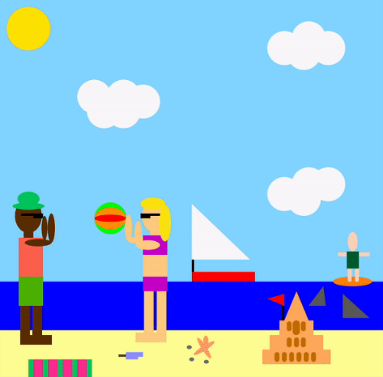{: .medium}
:     [Work](https://gitlab.com/juliesecher/aestheticprogramming/-/blob/main/MiniX1/ReadMe.md) by Julie Rousing Secher, 2022

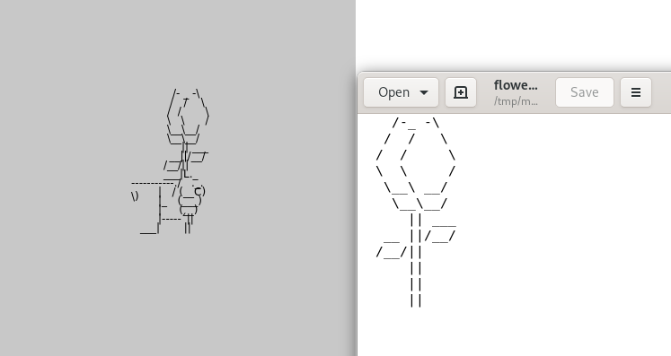{: .medium}
:     [flower: ASCII](https://gitlab.com/asbjrnahle33/aestheticprogramming/-/blob/main/MiniX1/readme.md) by Asbjørn Lodahl Ahle, 2022

{: .medium}
:     [Work](https://gitlab.com/Albinooo/AestheticProgramming/-/blob/main/minix1/readme.md) by Albin Hokfeld Sand, 2022

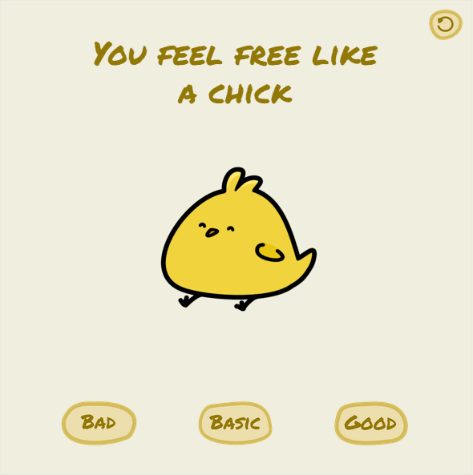{: .medium}
:    [Work](https://gitlab.com/sine.bj44/aesthetic-programming/-/blob/master/MiniX1/Readme.md) by Sine Jensen, 2021

{: .medium}
:    [Work](https://gitlab.com/jakobwangau/aesthetic-programming/-/blob/master/miniX1/readme.md) by Jakob Wang, 2021

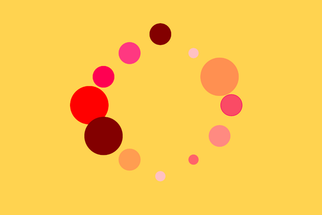{: .medium}
:    [Work](https://gitlab.com/JaneCl/ap-2020/-/blob/master/public/MiniEx1/READMEMiniX1.md) by Jane Clausen, 2020

### MiniX[2]: Geometric emoji

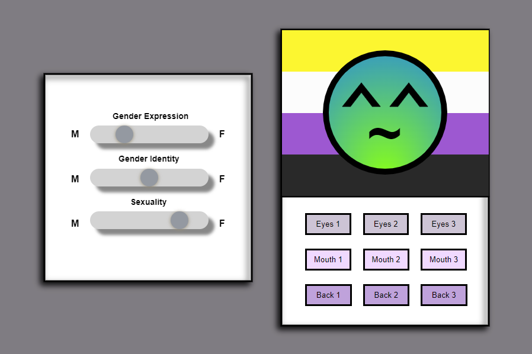{: .medium}
:    [Personalized Gender Emoji](https://gitlab.com/9plus10savage/aesthetic-programming/-/blob/main/miniX2/ReadMe.md) by Gabriel Høst Andersen, 2022

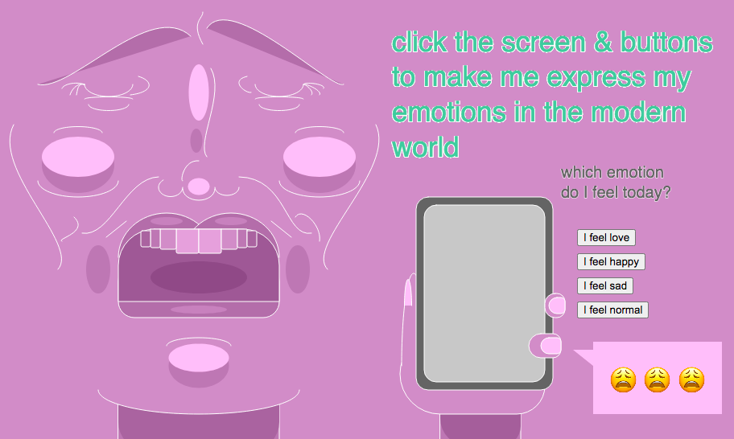{: .medium}
:    [Work](https://gitlab.com/ernahrokne/aesthetic-programming-2021/-/blob/master/minix2/README.md) by Erna Holst Rokne, 2021

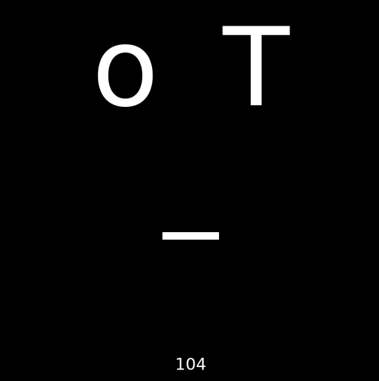{: .medium}
:    [Work](https://gitlab.com/Adeve_/ap2020/-/tree/master/public/MiniEx_2) by Andreas Frederiksen, 2020

<figure class="columns" markdown=1>
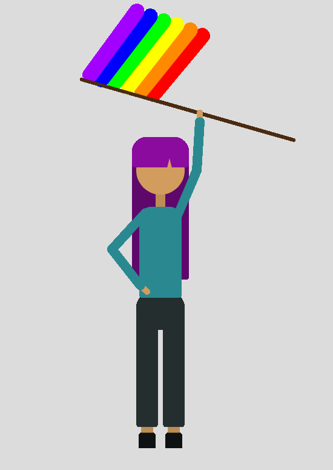{: .medium}
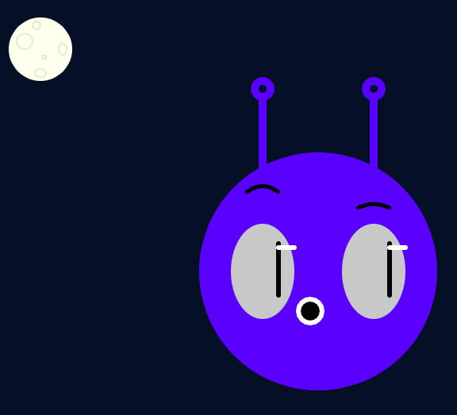{: .medium}
<figcaption markdown=1><p>[Work](https://gitlab.com/clara.j.lassen/ap-2020/-/blob/master/public/Mini%20Exercises/miniEx2/Readme%20miniEx2.md) by Clara Josefine Jassan Lassen, 2020</p></figcaption>
</figure>

### MiniX[3]: Designing a throbber

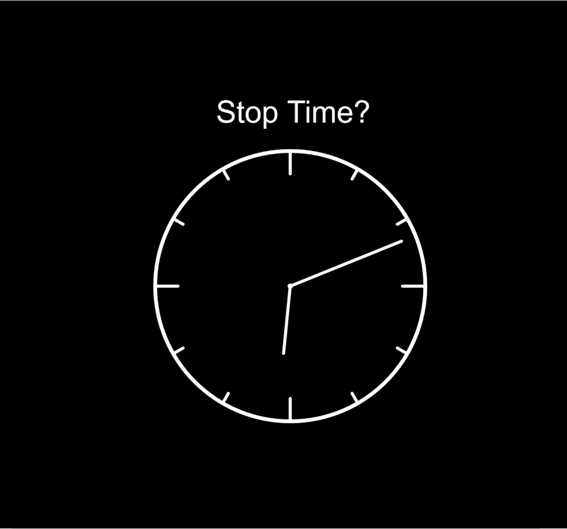{: .medium}
:    [Time Stopper](https://gitlab.com/Vinmek/aesthetic-programming/-/blob/main/miniX03/README.md) by Mikkel Aarup Vinther, 2022

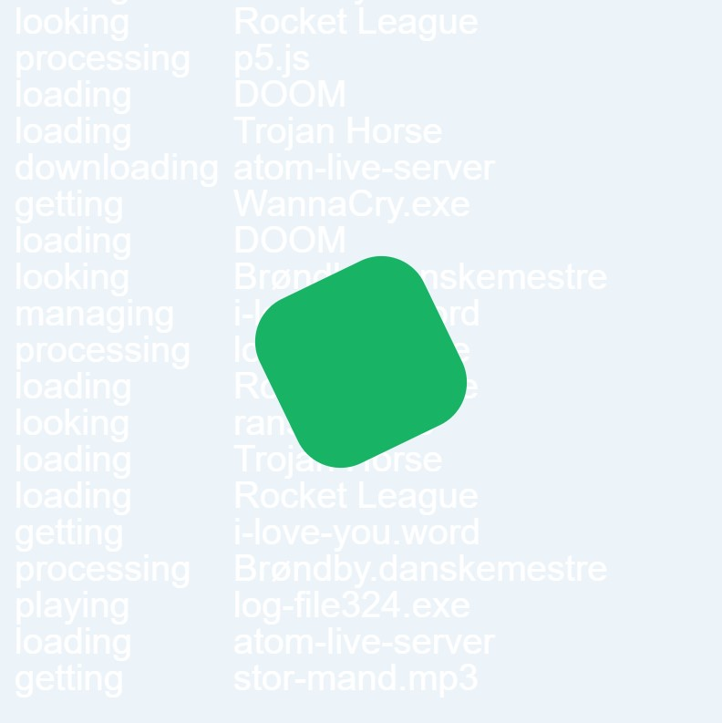{: .medium}
:    [Work](https://gitlab.com/VRAS/aestheticprogramming/-/blob/main/minix3/Readme.md) by Victor Rasmussen, 2022

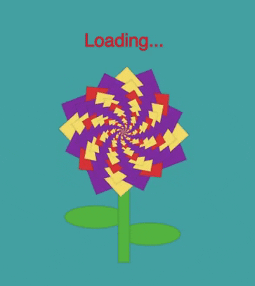{: .medium}
:    [Work](https://gitlab.com/Nanna12/aestetisk-programmering/-/blob/main/Minix3/Readme.md) by Nanna Værum Christensen, 2022

{: .medium}
:    [Work](https://gitlab.com/UNBLISSFUL/aesthetic-programming/-/blob/main/miniX3/readme.md) by Lissa van Bui, 2022

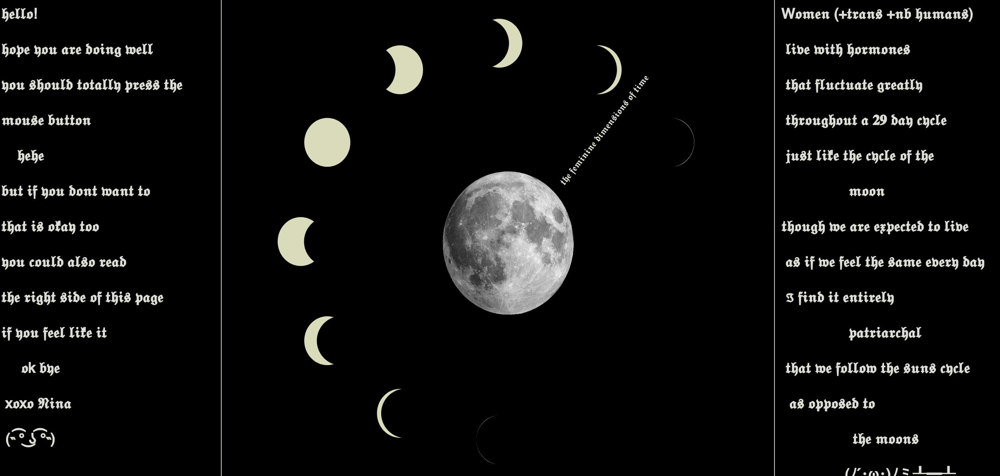{: .medium}
:    [The feminine Dimensions of time](https://gitlab.com/Ninaisis/aesthetic-programming-test/-/blob/master/minix3/README.md) by Nina Isis Bolton, 2021

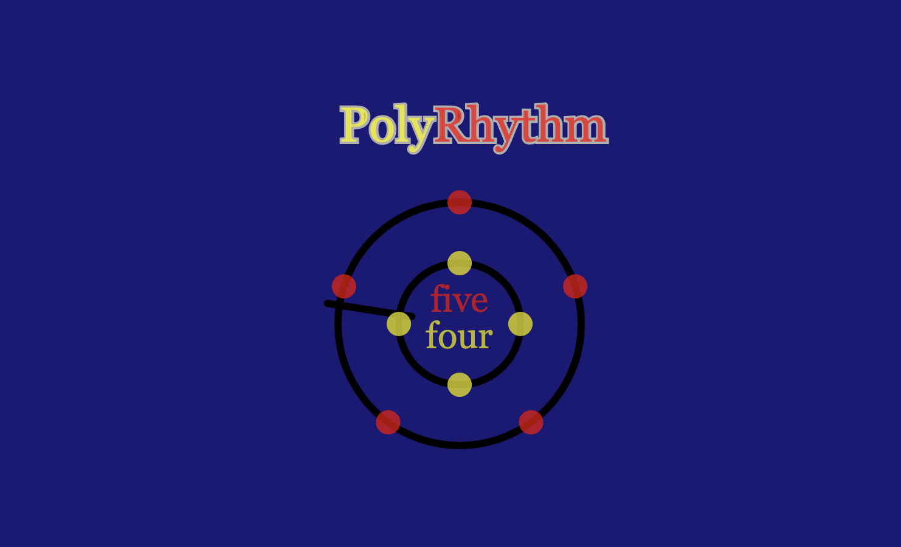{: .medium}
:    [PolyRhythm](https://gitlab.com/svendbay/aesthetic_programming/-/blob/master/miniX3/Readme.md) by Svend Bay Møller, 2021

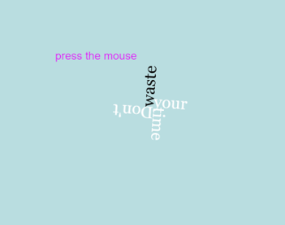{: .medium}
:    [Work](https://gitlab.com/amanda.hansen1404/ap2020/-/tree/master/public/MiniX3) by Amanda Hansen, 2020

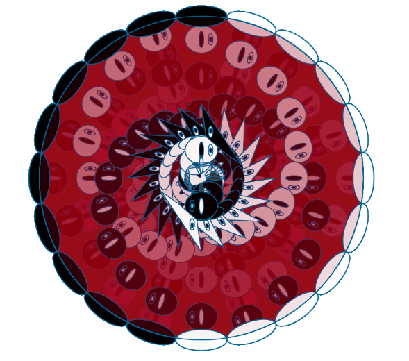{: .medium}
:    [Work](https://magnusbak.gitlab.io/ap2020/MiniX3/) by Magnus Bak Nielsen, 2020

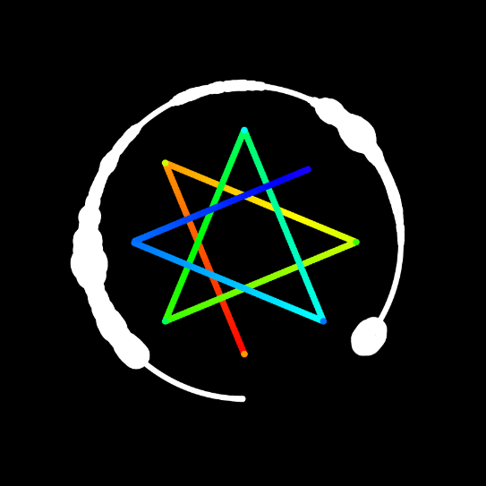{: .medium}
:    [Work](https://gitlab.com/linesdmoller/ap2020/-/tree/master/public/MiniX5) by Line Stampe-Degn Møller, 2020

### MiniX[4]: Capture ALL

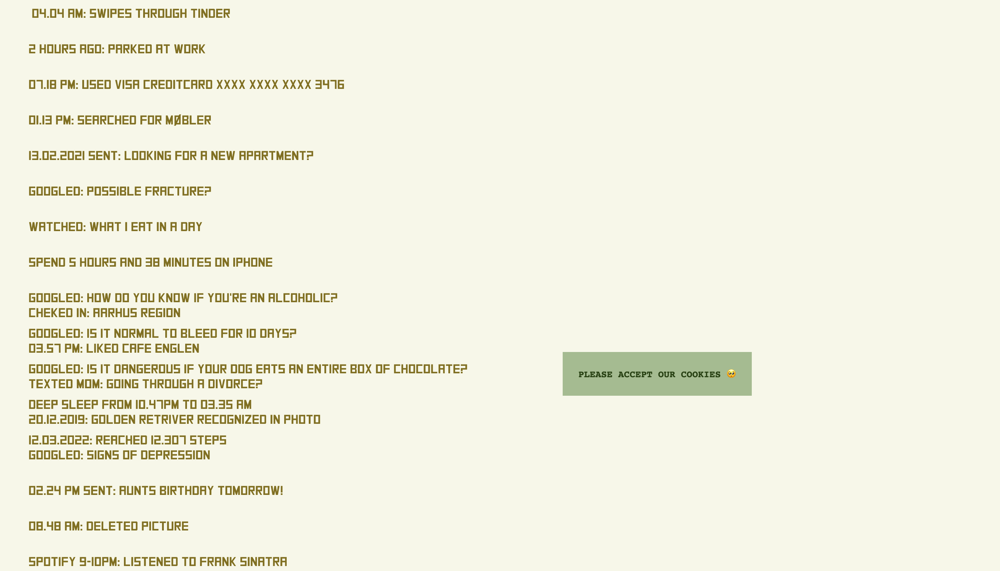{: .medium}
:    [Data Gathering](https://gitlab.com/josefinestenshoj/aestheticprogramming/-/blob/main/MiniX4/ReadMe.md) by Josefine Stenshøj, 2022

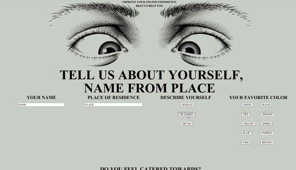{: .medium}
:    [TELL US ABOUT YOURSELF](https://gitlab.com/Albinooo/AestheticProgramming/-/blob/main/minix4/readme.md) by Albin Hokfeld Sand, 2022

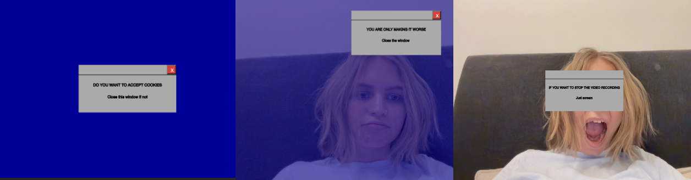{: .medium}
:    [The Revealing of Digital Surveillance](https://gitlab.com/JosefinePasma/aestheticprogramming/-/blob/main/MiniX4/Readme.md) by Josefine Pasma, 2022

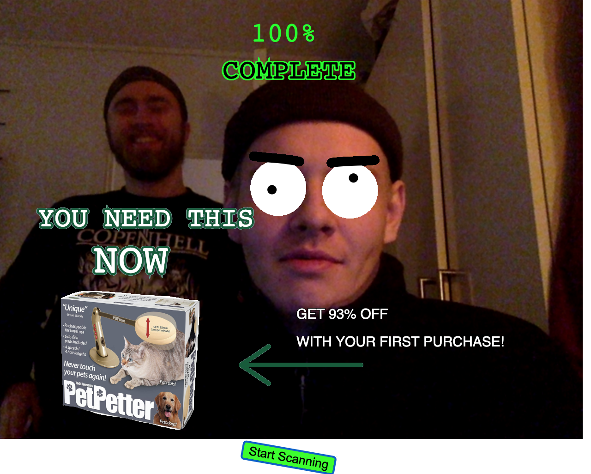{: .medium}
:    [The Presence of Contemporary Service](https://gitlab.com/ChristianRohde/p5/-/blob/master/miniX4/Readme.md) by Christian Rohde Holm, 2021

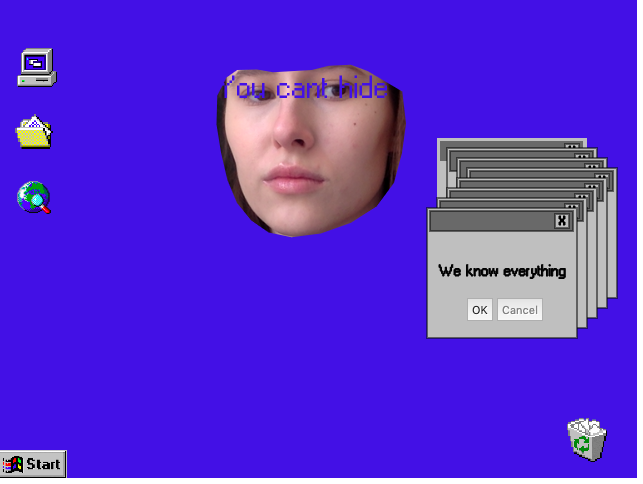{: .medium}
:    [We know everything](https://gitlab.com/SophiaMcCulloch/ap2020/-/tree/master/public%2FMiniex4) by Sophia McCulloch, 2020

### MiniX[5]: A Generative Program

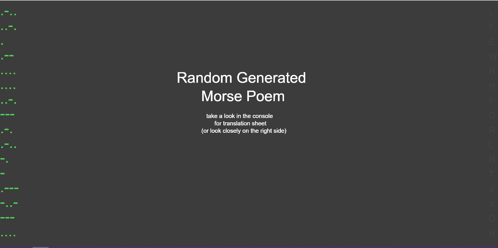{: .medium}
:    [Random Generated Morse Poem](https://gitlab.com/jakoblarsen2/aestheticprogramming/-/blob/main/MiniX5/readme.md) by Larsen, Jakob Reinhard, 2022

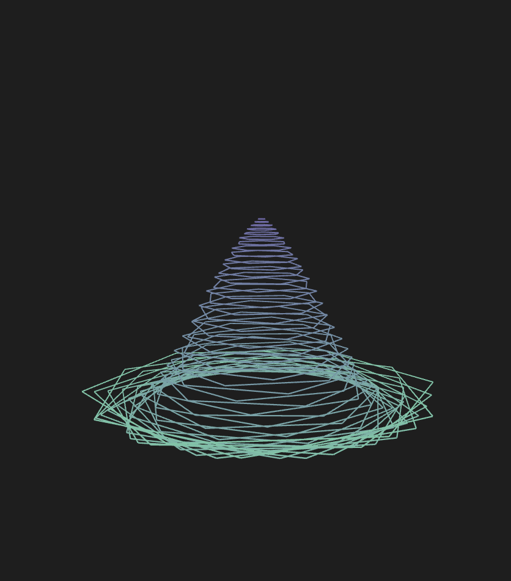{: .medium}
:    [Sine Wave](https://gitlab.com/mathilda.due/aesthetic-programming/-/blob/main/MiniX5/Readme.md) by Mathilda Frydensberg Lundahl Due, 2022

{: .medium}
:    [Work](https://gitlab.com/OskarBuhl/aesthetic-programming/-/blob/main/miniX5/Readme.md) by Buhl-Holmkjær, Oskar Falkenberg, 2022

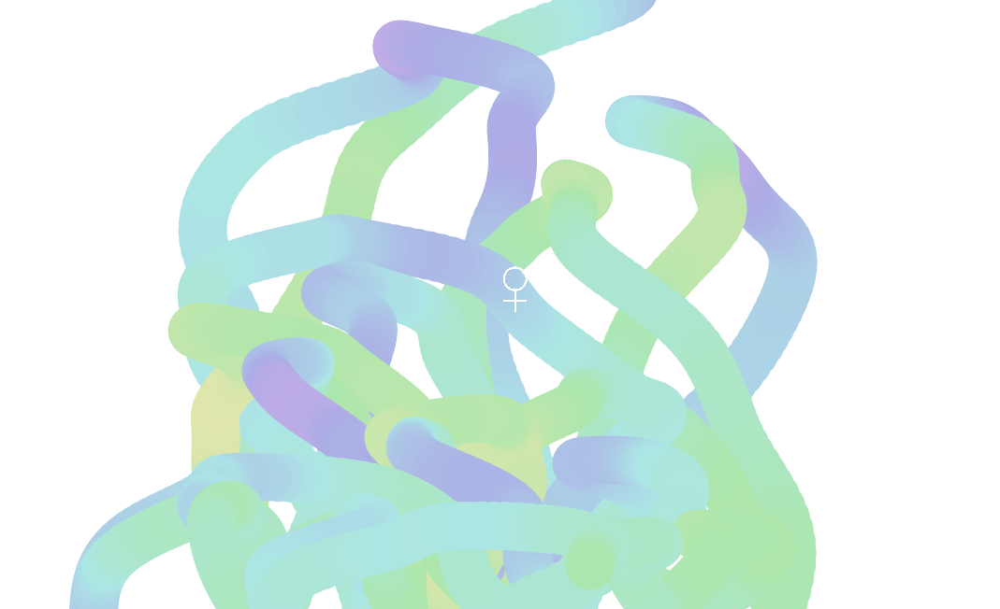{: .medium}
:    [Work](https://gitlab.com/annetietz/aesthetic-programming-2021/-/blob/master/miniX6/README.md) by Anne Tietz, 2021

{: .medium}
:    [ANT LIFE](https://gitlab.com/mikkeldahlin/ap-2020/-/tree/master/public/Projects/MiniEX7.1) by Mikkel Dahlin, 2020

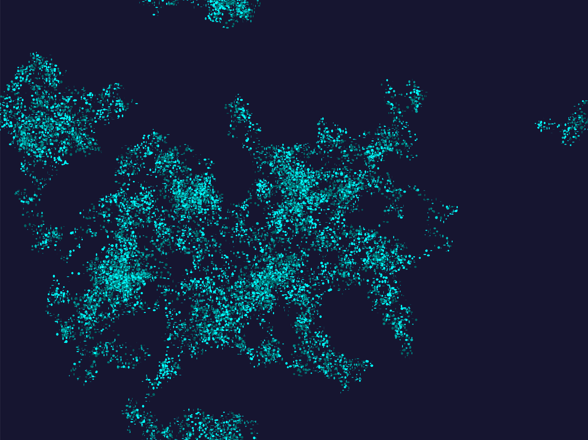{: .medium}
:    [Work](https://gitlab.com/pernwn/ap2020/-/tree/master/public/MX7) by Torvald Pockel and Pernille P.W. Johansen, 2020

### MiniX[6]: Games with objects

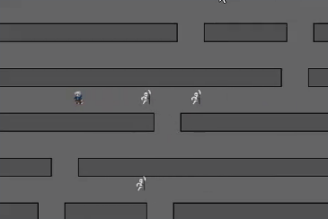{: .medium}
:    [Work](https://gitlab.com/Vinmek/aesthetic-programming/-/blob/main/miniX07/README.md) by Mikkel Aarup Vinther, 2022

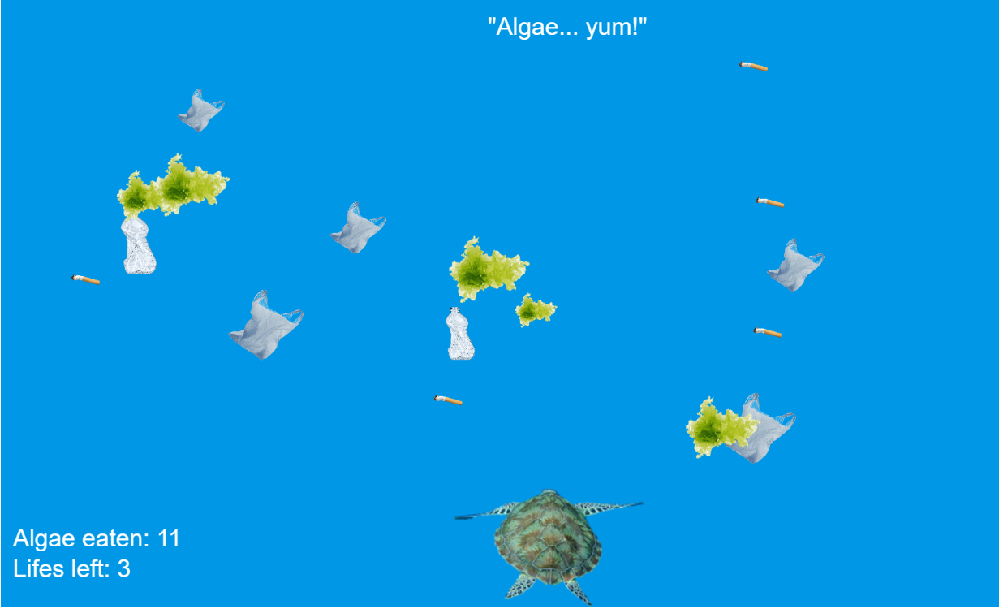{: .medium}
:    [Work](https://gitlab.com/majtofting/aestheticprogramming/-/blob/main/miniX6/Readme.md) by Maj Vejlgaard Tofting, 2022

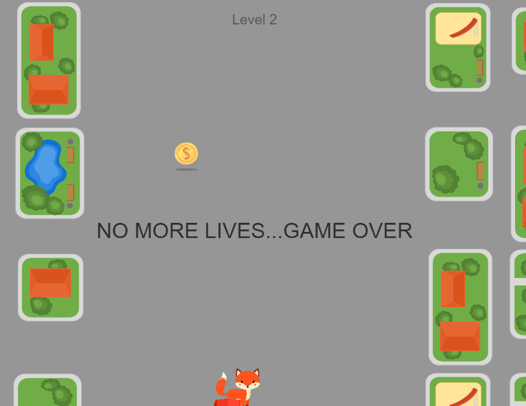{: .medium}
:    [Work](https://gitlab.com/TrineRye/aestheticprogramming/-/blob/main/miniX7/Readme.md) by Trine Rye Østergaard, 2022

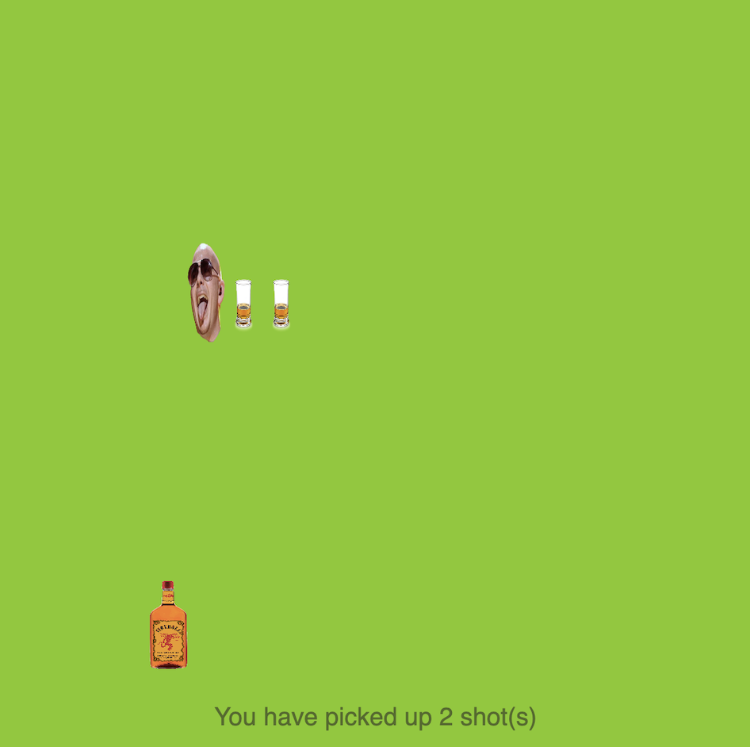{: .medium}
:    [Work](https://gitlab.com/DitteMarieDamvad693372/aesthetic-programming/-/blob/main/miniX6/Readme.md) by Ditte Marie Damvad, 2022

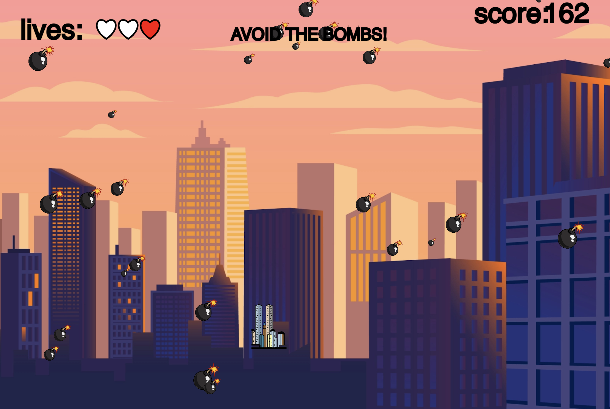{: .medium}
:    [Sky Bomber](https://gitlab.com/OskarBuhl/aesthetic-programming/-/blob/main/miniX7/Readme.md) by Oskar Falkenberg Buhl-Holmkjær, 2022

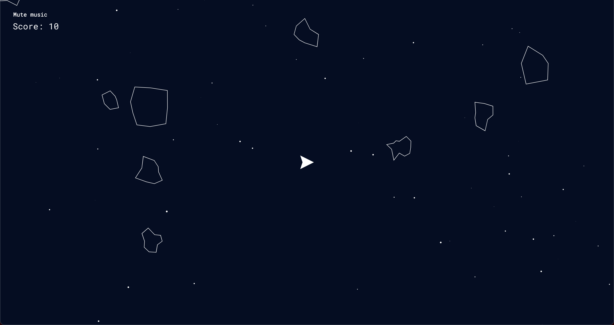{: .medium}
:    [Asteroids](https://gitlab.com/Boutrup98/aesthetic-programming/-/blob/master/miniX7/README.md) by Jacob Boutrup, 2021

{: .medium}
:    [Work](https://gitlab.com/Adeve_/ap2020/-/tree/master/public/MiniEx_6) by Andreas Frederiksen, 2020

{: .medium}
:    [Work](https://gitlab.com/M.Marschall/ap2020/-/tree/master/public/AllMiniEx/MiniEX6) by Mads Marschall, 2020

### MiniX[7]: E-lit

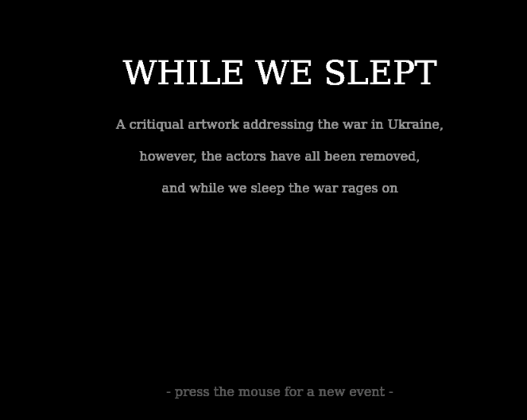{: .medium}
:    [What 01010111 01101000 01100001 01110100 Am  01100001 01101101 I 01101001 ? 00111111](https://gitlab.com/Vinmek/aesthetic-programming/-/blob/main/miniX08/README.md) by Naja Hammershøj Anicka, Mikkel Aarup Vinther, Asbjørn Lodahl Ahle & Simon Vieth, 2022

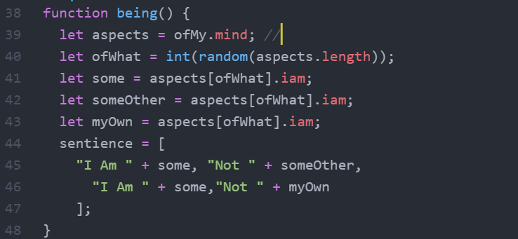{: .medium}
:    [Neutral War (While We Slept..)](https://gitlab.com/isabellarosing/aestheticprogramming/-/blob/main/MiniX8/README.md) by Maj Vejlgaard Tofting, Trine Rye Østergaard, Isabella Rosing & Mathilda Frydensberg Lundahl Due, 2022

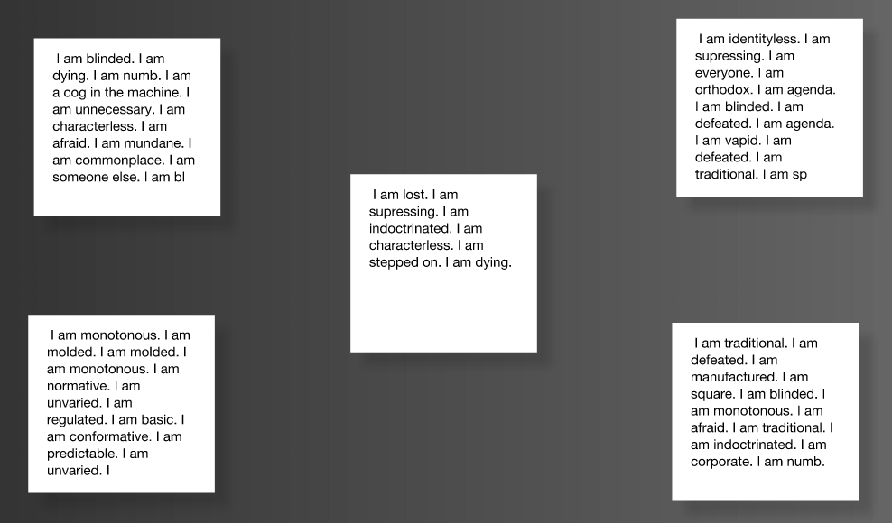{: .medium}
:    [Transcended Computer](https://gitlab.com/9plus10savage/aesthetic-programming/-/blob/main/miniX8/Readme.md) by Gabriel Høst Andersen, Lissa van Bui, Albin Hokfeld Sand & Victor Rasmussen, 2022

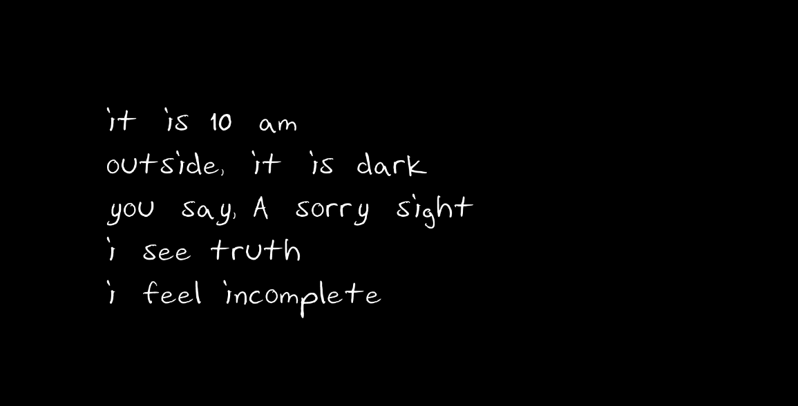{: .medium}
:    [Glimpses Of Time](https://gitlab.com/Julie_Fey/aesthetic-programming/-/blob/master/MiniX8/Readme.md) by Julie Fey & Andrea Mønster, 2021

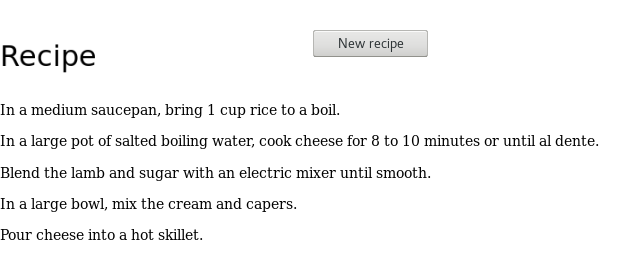{: .medium}
:    [Recipe](https://gitlab.com/OliviaSP/ap2020/-/blob/master/public/MiniEx8/README_MiniEx8.md) by Olivia Smedegaard Peray and Stine Mygind, 2020

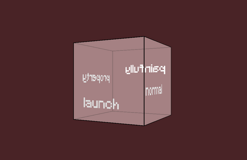{: .medium}
:    [Words_](https://gitlab.com/SimonVanNguyen/aestetic-programming-2020/-/tree/master/public/miniEx8) by Simon Van Nguyen and Torvald Pockel, 2020

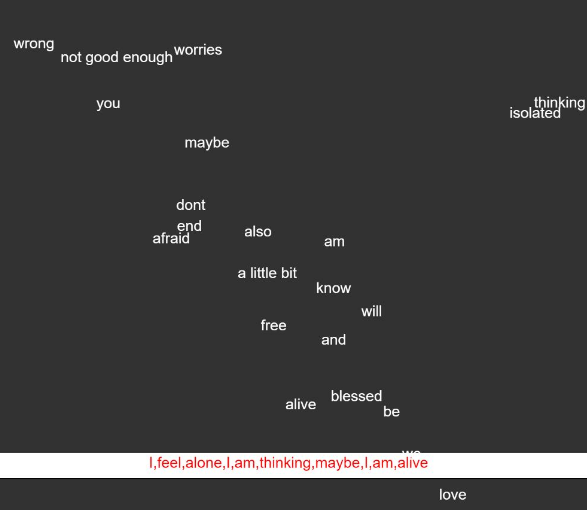{: .medium}
:    [wordsOfMyFeelings](https://gitlab.com/annika.nh1/ap-2020/-/tree/master/public/MiniEx8) by Annika Hoffmann and Helene Boeriis, 2020

### MiniX[8]: Working with APIs

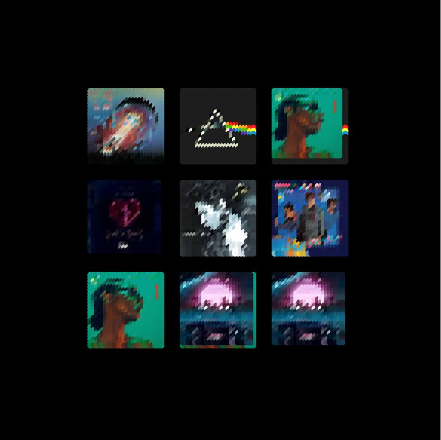{: .medium}
:    [Work](https://gitlab.com/markusbjerremand1/aesthetic-programming/-/blob/master/MiniX9final/Readme.md) by Sofie Louise Christiansen & Markus Alexander Mejer Bjerremand, 2021

{: .medium}
:    [Corona bar](https://gitlab.com/pernwn/ap2020/-/tree/master/public/MX9) by Anne Nielsen, Simon Van Nguyen, Pernille P.W. Johansen, and Torvald Pockel, 2020

### MiniX[10]: Final Project

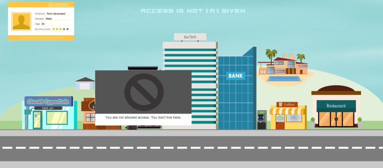{: .medium}
:    [Access is not a given](https://lentz.gitlab.io/aestheticprogramming/miniX11/) by Maj Vejlgaard Tofting, Trine Rye Østergaard, Isabella Rosing & Mathilda Frydensberg Lundahl Due, 2022


<div markdown=1>
#### Description
The program is a game inspired by the tech community in Silicon Valley. We have created profiles based on stereotypes of our own assumptions about people with different positions in the tech community. The user is asked to choose one of eight images through nine rounds of questions, after which the user is assigned a stereotypical profile. The most important element in our program is the data that the user produces when interacting
with the game. Initially, this information is not machine-readable but is made quantifiable through the process of datafication. Data capture is the foundation of our program as interactions later in the program all rely on
the data from the quiz. With our program, the user experiences how captured data limits one's access online both in a figurative and literal sense.
</div>

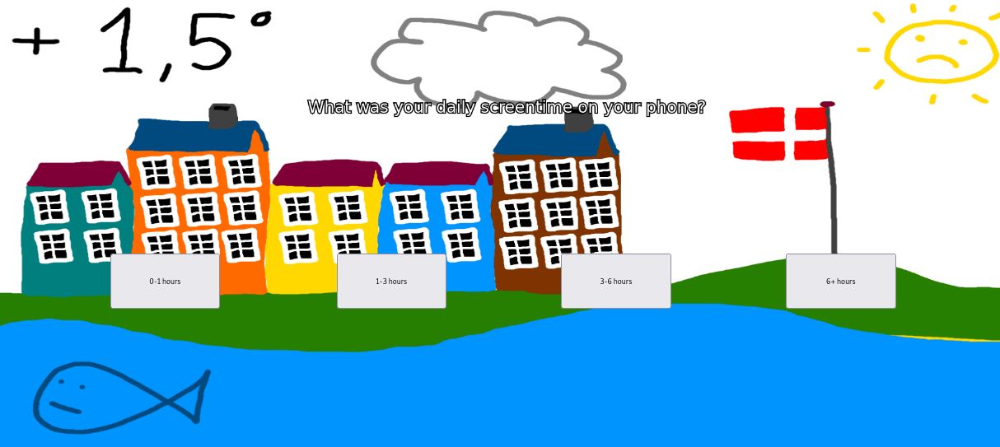{: .medium}
:    [Digital Climate Footprint](https://lentz.gitlab.io/aestheticprogramming/miniX11/) by Jeppe Lund, Linus Lentz, Morten Sloth Enemærke, Nicolai Steffensen & Rikke Osmann Jessen, 2022


<div markdown=1>
#### Description
Our software is a climate test which calculates your climate footprint on the world. We have created questions and your score rises if your habits are emission-heavy, and the climate in the image changes for the worse as you answer. Our artifact is meant to quantify a users climate footprint, as well as visualize it within the chosen scale. The questions include direct CO2-emitting activities as well as indirect by means of energy consumption. Included in this category is the use of computers and smartphones themselves. It’s meant to act as an encouragement to reflect on your usage, as the quiz itself is perhaps an unnecessary use of energy, seeing as how we’re all often reminded in our daily lives to save on our consumption. Key syntax: Line 88
```
for (let i=0;i<1;i++){
  poor[i] = new Poor(age, ethnicity, gender, sexuality, cookies[i],ccis,house,job)
}
```
</div>

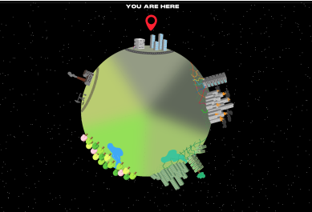{: .medium}
:    [The Wheel of Time](https://9plus10savage.gitlab.io/aesthetic-programming/miniX11/) by Gabriel Høst Andersen, Lissa van Bui, Albin Hokfeld Sand & Victor Rasmussen, 2022


<div markdown=1>
#### Description
The Wheel of Time is intended as an abstraction of our perceived material reality. A world in which the flow of time is cyclical. A dystopian imaginary depicting a world doomed to continuously destroy and rebuild itself, both processes facilitated by the hands of human greed. An
inescapable infinite loop perpetuated and sustained by its cyclical nature of human evolution. This infinite loop is further represented in our source code. Just as our abstracted world is fatalistically fated to doom itself, as is the machine fated to infinitely perpetuate the turning of
the wheel of time.
</div>

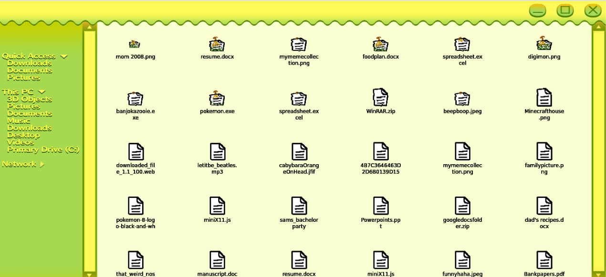{: .medium}
:    [Digitivore](https://vinmek.gitlab.io/aesthetic-programming/AP-Finals/run_digitivore) by Naja Hammershøj Anicka, Mikkel Aarup Vinther, Asbjørn Lodahl Ahle & Simon Vieth, 2022


<div markdown=1>
#### Description
“Does data have to last forever?” This question was inspired by the vastness of media being stored in data centers, and the heightening public focus on whether those media files are really deletable, or if they are stored somewhere inside a corporation’s “deleted” folder. The Digitivore mockup simulates an open window containing a file directory. When the program starts, files automatically start to appear in the window at a constant rate. After a short time, the files start to change. They seemingly start to rot, before disappearing completely. If a user were to interact with a file - in this case by clicking it - the file will refrain from degrading, and if in the process of decomposing, the file will revert to its initial state.
</div>


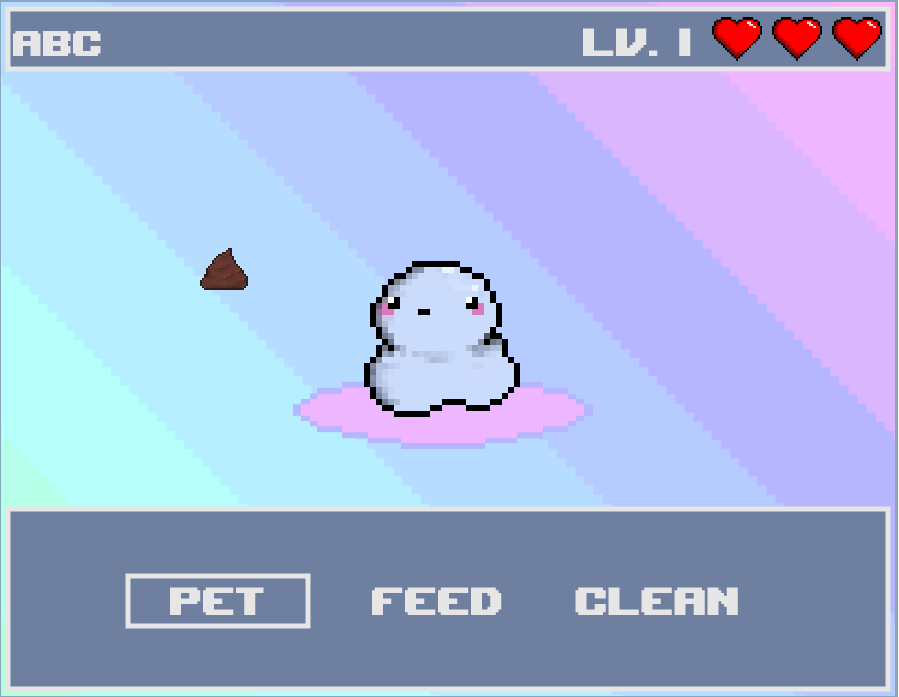{: .medium}
:    [Datagotcha](https://jonhegras.gitlab.io/AP-Jonas/Datagotcha_FinalProject_Group1/) by Svend Bay Møller, Christian Rohde Holm, Mads Damkjær Nielsen, Julie Anhøj Louw and Jonas Hegelund Rasmussen, 2021


<div markdown=1>
#### Description

With inspiration from Tamagotchi, one of the biggest toy inventions from the late 90’s to 2000’s, we created a game in order to critique peoples’ willingness to recklessly handover personal information during the current contemporary digital age. We wanted to emulate the addictiveness of the Tamagotchi as a means to emphasize that point. We did this by creating a narrative where the pet is to be kept alive by the user, which is done by tending to its needs, which includes the user feeding it with their data. Consistent with the Tamagotchi the pet were to appear cute since we wanted to utilize this as a means to obscure the transaction of data taking place.
</div>

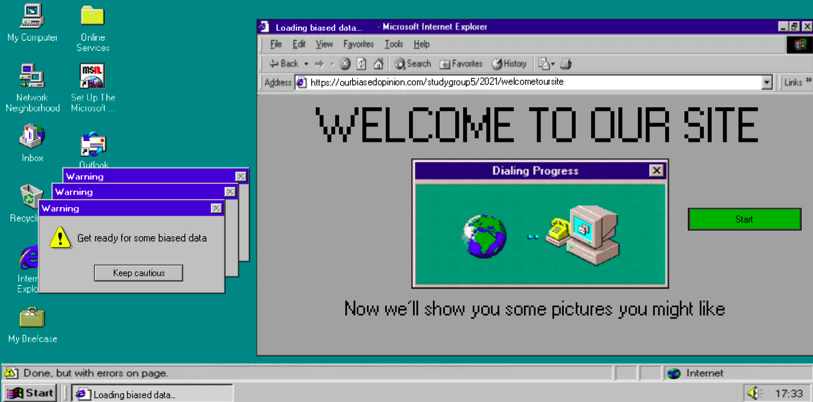{: .medium}
:    [Tagging Bias](https://simonfeusi1.gitlab.io/aesthetic-programming/finalProject/) by Sofie Lundby Andersen, Sofie Fürsterling Mønster, Nina Isis Kinch Bolton, Mathilde Borregaard Gajhede and Simon Feusi Ludvigsen, 2021

<div markdown=1>
#### Description

‘Tagging Bias’ is a program made on the intersection of art and design, with the purpose of exploring some of the most fundamental questions of machine learning, herein how computers are trained, and what consequences it can have when the data being used is disproportionally biased.

To do this we invite you, the user, to act as if you were creating data sets for an algorithm in a machine learning context, while also showing you the differences between two sets of tags, one created by an algorithm and one created by us, the designers of this program. It is our hope that after a user has completed our program, they will at the very least be a little more critical when interacting with different algorithms, and also that they become aware of the human decisions preceding any type of technology.
</div>

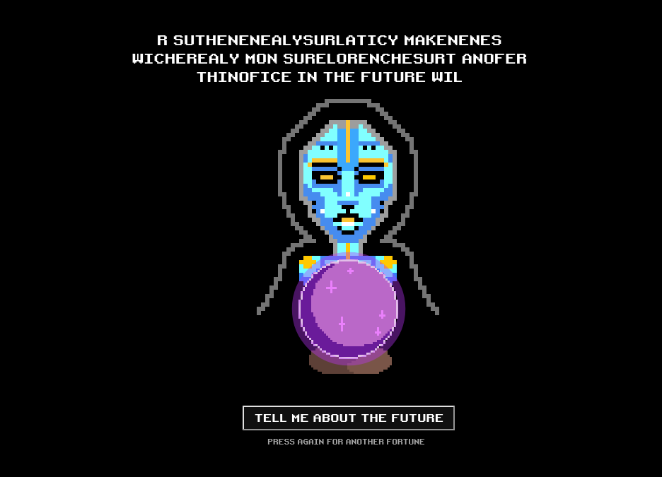{: .medium}
:    [The Fortune Bot](https://nikittameiniche.gitlab.io/aesthetic-programming/FinalProject/) by Nikitta Meiniche, Freja Steglich-Petersen, Markus Alexander Mejer Bjerremand and Sofie Louise Christiansen, 2021

<div markdown=1>

#### Description

With our program we explore the technical process of training a model and the role that data plays in doing so. Furthermore, the theme that we want to explore conceptually is the question of how the relationship between humans and computers will evolve in the future and the uncertainty of the algorithm’s ability to predict that future.

The futures that the Fortune Bot is predicting is in symbiosis with the evolution of technology and the answers it gives are related to an almost science-fiction-like future. With a combination of data capture and machine learning, we want to question the relationship between humans and computers and how they might evolve with each other as well as what potential effects or consequences it can cause in the future. Our project explores the field of aesthetic programming by looking at similarities between human and machine perception of the world, and how we can learn from each other.
</div>

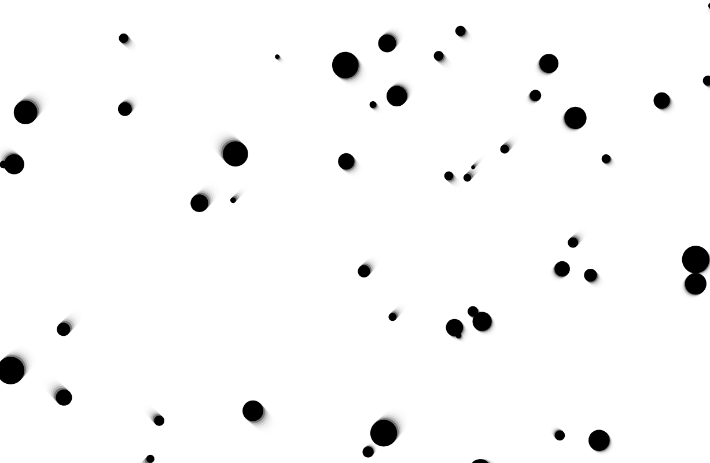{: .medium}
:    [The Ecosystem](https://jakobwangau.gitlab.io/aesthetic-programming/finalProject/) by Jacob Boutrup, Anne Tietz, Jakob Stougaard Wang and Anders Opstrup Christensen, 2021

<div markdown=1>
#### Description

Our program The Ecosystem sets out to explore how capitalism can be seen as a generative process and how this view affects our perception of the modern understanding of capitalism. In order to investigate this thesis of capitalism as a generative practice we have made use of programming as a means of visually representing this process and raising questions. How is coding beneficial for researching this and bridging a connection between the topics? In what way will the process have an influence on our understanding of the subjects?
</div>

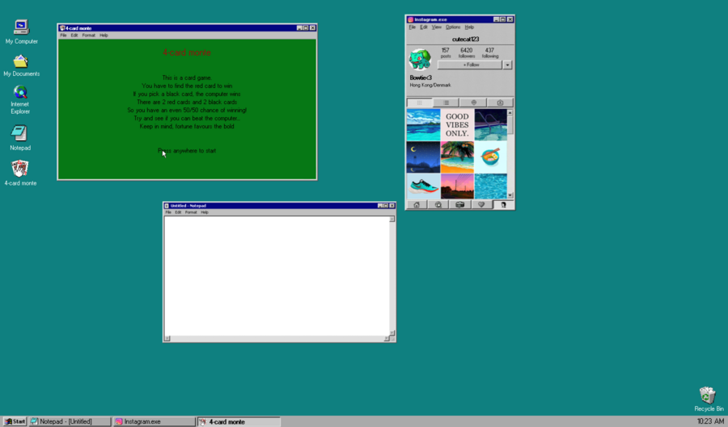{: .medium}
:    [4-card Monte](https://sophiamcculloch.gitlab.io/ap2020/Eksamen/) by Jonas Paaske Ditlevsen, Sophia McCulloch, Mads Lindgaard, 2020 (Selected work for [Ars Electronia Festival](https://ausstellungen.ufg.at/wildstate/project/card-monte/) 2020)

<div markdown=1>
#### Description

4-Card Monte is an interactive project that finds its aesthetics from the Windows 98 desktop where three windows are open: a game, Instagram, and the Notepad. If the participant locates a red card, he/she wins that round and moves onto the next. If not, he/she loses. The first screen in the game is a set of instructions for the participant to follow, where it is stated that the chance to win a round is 50/50. But then, something (or someone) takes over the control of the desktop, as posts, followers, and followings start to disappear from the Instagram window, the cursor moves without interaction from the participant, and messages appear in the Notepad as if something (or someone) is writing.

This project is a comment on the control that technology has on us and our society. The power relations that are obfuscated in the incorporeal, virtual world become apparent and tangible, and thus the project invites the participant to feel what usually is actively concealed.
</div>

</div>
