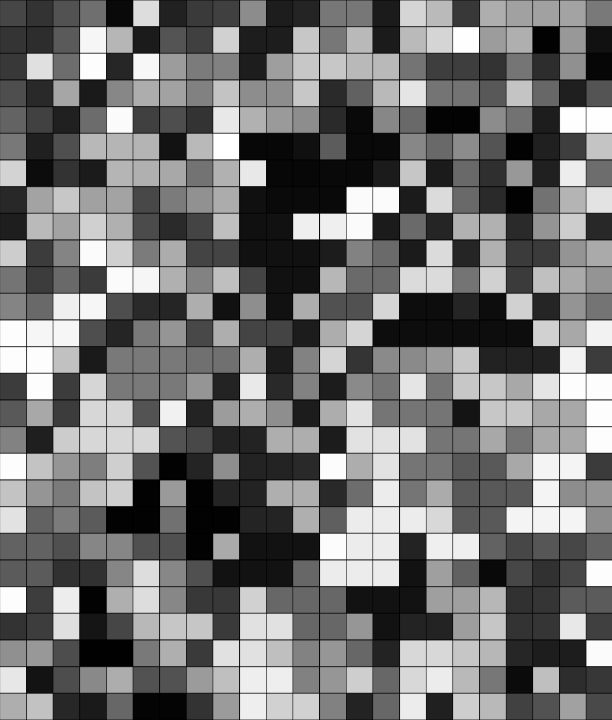
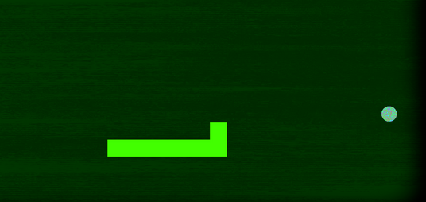
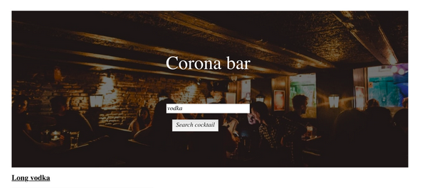

Title: Showcase
page_order: 14

## Selected student projects
The list will continuously update on the online version.

### MiniX[1]: RunMe and ReadMe

{: .medium}
:    [Work](https://gitlab.com/sine.bj44/aesthetic-programming/-/blob/master/MiniX1/Readme.md) by Sine Jensen, 2021

{: .medium}
:    [Work](https://gitlab.com/jakobwangau/aesthetic-programming/-/blob/master/miniX1/readme.md) by Jakob Wang, 2021

{: .medium}
:    [Work](https://gitlab.com/JaneCl/ap-2020/-/blob/master/public/MiniEx1/READMEMiniX1.md) by Jane Clausen, 2020

### MiniX[2]: Geometric emoji

{: .medium}
:    [Work](https://gitlab.com/ernahrokne/aesthetic-programming-2021/-/blob/master/minix2/README.md
) by Erna Holst Rokne, 2021

{: .medium}
:    [Work](https://gitlab.com/Adeve_/ap2020/-/tree/master/public/MiniEx_2) by Andreas Frederiksen, 2020

<figure class="columns" markdown=1>
{: .medium}
{: .medium}
<figcaption>
[Work](https://gitlab.com/clara.j.lassen/ap-2020/-/blob/master/public/Mini%20Exercises/miniEx2/Readme%20miniEx2.md) by Clara Josefine Jassan Lassen, 2020
</figcaption>
</figure>

### MiniX[3]: Designing a throbber

{: .medium}
:    [The feminine Dimensions of time](https://gitlab.com/Ninaisis/aesthetic-programming-test/-/blob/master/minix3/README.md) by Nina Isis Bolton, 2021

{: .medium}
:    [PolyRhythm](https://gitlab.com/svendbay/aesthetic_programming/-/blob/master/miniX3/Readme.md) by Svend Bay Møller, 2021

{: .medium}
:    [Work](https://gitlab.com/amanda.hansen1404/ap2020/-/tree/master/public/MiniX3) by Amanda Hansen, 2020

{: .medium}
:    [Work](https://magnusbak.gitlab.io/ap2020/MiniX3/) by Magnus Bak Nielsen, 2020

{: .medium}
:    [Work](https://gitlab.com/linesdmoller/ap2020/-/tree/master/public/MiniX5) by Line Stampe-Degn Møller, 2020

### MiniX[4]: Capture ALL

{: .medium}
:    [The Presence of Contemporary Service](https://gitlab.com/ChristianRohde/p5/-/blob/master/miniX4/Readme.md) by Christian Rohde Holmh, 2021

{: .medium}
:    [We know everything](https://gitlab.com/SophiaMcCulloch/ap2020/-/tree/master/public%2FMiniex4) by Sophia McCulloch, 2020

### MiniX[5]: A Generative Program

{: .medium}
:    [Work](https://gitlab.com/annetietz/aesthetic-programming-2021/-/blob/master/miniX6/README.md) by Anne Tietz, 2021

{: .medium}
:    [ANT LIFE](https://gitlab.com/mikkeldahlin/ap-2020/-/tree/master/public/Projects/MiniEX7.1) by Mikkel Dahlin, 2020

{: .medium}
:    [Work](https://gitlab.com/pernwn/ap2020/-/tree/master/public/MX7) by Torvald Pockel and Pernille P.W. Johansen, 2020

### MiniX[6]: Games with objects

{: .medium}
:    [Asteroids](https://gitlab.com/Boutrup98/aesthetic-programming/-/blob/master/miniX7/README.md) by Jacob Boutrup, 2021

{: .medium}
:    [Work](https://gitlab.com/Adeve_/ap2020/-/tree/master/public/MiniEx_6) by Andreas Frederiksen, 2020

{: .medium}
:    [Work](https://gitlab.com/M.Marschall/ap2020/-/tree/master/public/AllMiniEx/MiniEX6) by Mads Marschall, 2020

### MiniX[7]: E-lit

{: .medium}
:    [Glimpses Of Time](https://gitlab.com/Julie_Fey/aesthetic-programming/-/blob/master/MiniX8/Readme.mdd) by Julie Fey & Andrea Mønster, 2021

{: .medium}
:    [Recipe](https://gitlab.com/OliviaSP/ap2020/-/blob/master/public/MiniEx8/README_MiniEx8.md) by Olivia Smedegaard Peray and Stine Mygind, 2020

{: .medium}
:    [Words_](https://gitlab.com/SimonVanNguyen/aestetic-programming-2020/-/tree/master/public/miniEx8) by Simon Van Nguyen and Torvald Pockel, 2020

{: .medium}
:    [wordsOfMyFeelings](https://gitlab.com/annika.nh1/ap-2020/-/tree/master/public/MiniEx8) by Annika Hoffmann and Helene Boeriis, 2020

### MiniX[8]: Working with APIs

{: .medium}
:    [Work](https://gitlab.com/markusbjerremand1/aesthetic-programming/-/blob/master/MiniX9final/Readme.md) by Sofie Louise Christiansen & Markus Alexander Mejer Bjerremand, 2021

{: .medium}
:    [Corona bar](https://gitlab.com/pernwn/ap2020/-/tree/master/public/MX9) by Anne Nielsen, Simon Van Nguyen, Pernille P.W. Johansen, and Torvald Pockel, 2020

### MiniX[10]: Final Project

{: .medium}
:    [The Fortune Bot](https://nikittameiniche.gitlab.io/aesthetic-programming/FinalProject/) by Nikitta Meiniche, Freja Steglich-Petersen, Markus Alexander Mejer Bjerremand and Sofie Louise Christiansen, 2021

**Description**

With our program we explore the technical process of training a model and the role that data plays in doing so. Furthermore, the theme that we want to explore conceptually is the question of how the relationship between humans and computers will evolve in the future and the uncertainty of the algorithm’s ability to predict that future.

The futures that the Fortune Bot is predicting is in symbiosis with the evolution of technology and the answers it gives are related to an almost science-fiction-like future. The conceptual thinking behind our project is based on the themes concerning machine learning as well as data capture. The idea arose when we ended up talking about spirituality. With a combination of data capture and machine learning, we want to question the relationship between humans and computers and how they might evolve with each other as well as what potential effects or consequences it can cause in the future. Our project explores the field of aesthetic programming by looking at similarities between human and machine perception of the world, and how we can learn from each other.

{: .medium}
:    [The Ecosystem](https://jakobwangau.gitlab.io/aesthetic-programming/finalProject/) by Jacob Boutrup, Anne Tietz, Jakob Stougaard Wang and Anders Opstrup Christensen, 2021

**Description**

Our program The Ecosystem sets out to explore how capitalism can be seen as a generative process and how this view affects our perception of the modern understanding of capitalism. In order to investigate this thesis of capitalism as a generative practice we have made use of programming as a means of visually representing this process and raising questions. How is coding beneficial for researching this and bridging a connection between the topics? In what way will the process have an influence on our understanding of the subjects?

{: .medium}
:    [Tagging Bias](https://simonfeusi1.gitlab.io/aesthetic-programming/finalProject/) by Sofie Lundby Andersen, Sofie Fürsterling Mønster, Nina Isis Kinch Bolton, Mathilde Borregaard Gajhede and Simon Feusi Ludvigsen, 2021

**Description**

‘Tagging Bias’ is a program made on the intersection of art and design, with the purpose of exploring some of the most fundamental questions of machine learning, herein how computers are trained, and what consequences it can have when the data being used is disproportionally biased.

To do this we invite you, the user, to act as if you were creating data sets for an algorithm in a machine learning context, while also showing you the differences between two sets of tags, one created by an algorithm and one created by us, the designers of this program. It is our hope that after a user has completed our program, they will at the very least be a little more critical when interacting with different algorithms, and also that they become aware of the human decisions preceding any type of technology.

{: .medium}
:    [Datagotcha](https://jonhegras.gitlab.io/AP-Jonas/Datagotcha_FinalProject_Group1/) by Svend Bay Møller, Christian Rohde Hol, Mads Damkjær Nielsen, Julie Anhøj Louw and Jonas Hegelund Rasmussen, 2021

**Description**

With inspiration from Tamagotchi, one of the biggest toy inventions from the late 90’s to 2000’s, we created a game in order to critique peoples’ willingness to recklessly handover personal information during the current contemporary digital age. We wanted to emulate the addictiveness of the Tamagotchi as a means to emphasize that point. We did this by creating a narrative where the pet is to be kept alive by the user, which is done by tending to its needs, which includes the user feeding it with their data. Consistent with the Tamagotchi the pet were to appear cute since we wanted to utilize this as a means to obscure the transaction of data taking place.

{: .medium}
:    [4-card Monte](https://sophiamcculloch.gitlab.io/ap2020/Eksamen/) by Jonas Paaske Ditlevsen, Sophia McCulloch, Mads Lindgaard, 2020 (Selected work for [Ars Electronia Festival](https://ausstellungen.ufg.at/wildstate/project/card-monte/) 2020)

**Description**

4-Card Monte is an interactive project that finds its aesthetics from the Windows 98 desktop where three windows are open: a game, Instagram, and the Notepad. The participant is invited to play the game. The goal is to locate one of the two red cards out of four cards that face-down. If the participant locates a red card, he/she wins that round and moves onto the next. If not, he/she loses. The first screen in the game is a set of instructions for the participant to follow, where it is stated that the chance to win a round is 50/50. But then, something (or someone) takes over the control of the desktop, as posts, followers, and followings start to disappear from the Instagram window, the cursor moves without interaction from the participant, and messages appear in the Notepad as if something (or someone) is writing.

This project is a comment on the control that technology has on us and our society. The power relations that are obfuscated in the incorporeal, virtual world become apparent and tangible, and thus the project invites the participant to feel what usually is actively concealed.

